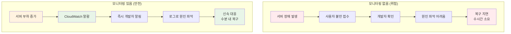
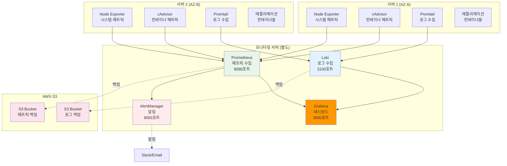
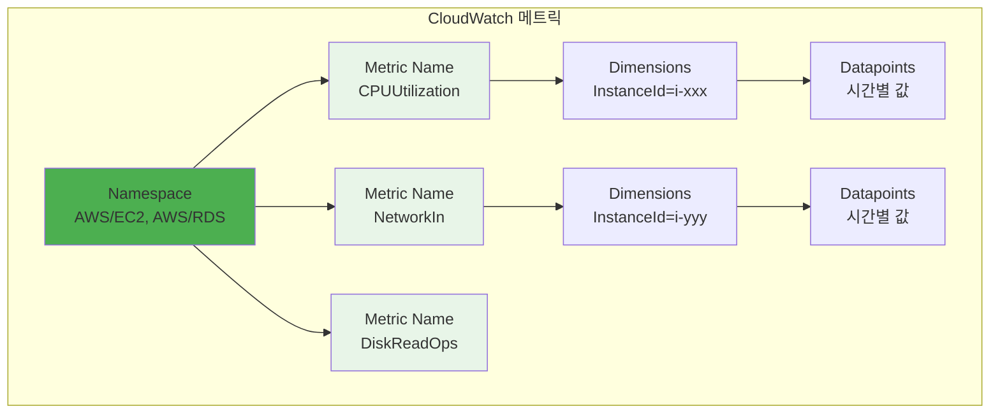
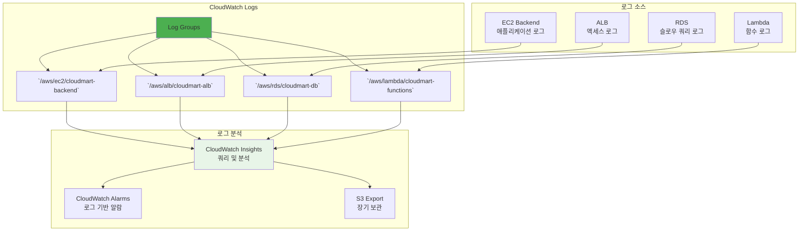
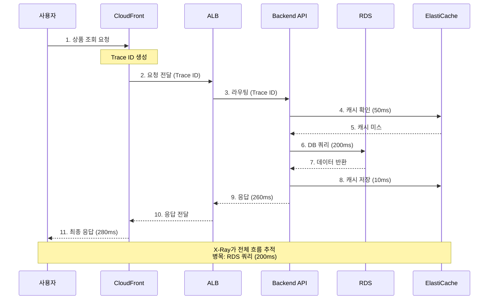

# Week 5 Day 5 Session 3: 모니터링 & 로깅 (11:00-11:50)

<div align="center">

**📊 CloudWatch** • **📝 로그 분석** • **🔍 분산 추적** • **🚨 알람 설정**

*프로덕션 환경의 완전한 관측성 구축*

</div>

---

## 🕘 세션 정보
**시간**: 11:00-11:50 (50분)
**목표**: CloudMart 운영을 위한 종합 모니터링 및 로깅 시스템 구축
**방식**: 이론 설명 + 실무 사례

## 🎯 세션 목표

### 📚 학습 목표
- **이해 목표**: CloudWatch 메트릭, 로그, 알람의 역할과 중요성 이해
- **적용 목표**: 실무 모니터링 대시보드 구성 및 알람 설정 방법 습득
- **협업 목표**: 팀과 함께 장애 대응 프로세스 수립

### 🤔 왜 필요한가? (5분)

**현실 문제 상황**:
- 💼 **실무 시나리오**: "새벽 3시에 서버가 죽었는데 아무도 몰랐어요. 어떻게 해야 하나요?"
- 🏠 **일상 비유**: 자동차 계기판 (속도, 연료, 엔진 온도) → 문제 발생 전 미리 알림
- ☁️ **AWS 아키텍처**: CloudWatch로 모든 리소스 실시간 모니터링 + 알람
- 📊 **시장 동향**: Netflix는 초당 수백만 개의 메트릭 수집 및 분석

**모니터링 없음 vs 있음 비교**:


## 📖 핵심 개념 (35분)

### 🔄 Docker Compose vs AWS 모니터링 비교

**Docker Compose 멀티 서버 + 모니터링 스택 🔍**:


**Docker Compose 모니터링 스택 구성**:
- ✅ **Prometheus**: 메트릭 수집 (CPU, 메모리, 디스크, 네트워크)
- ✅ **Grafana**: 시각화 대시보드
- ✅ **Loki**: 로그 수집 및 검색
- ✅ **AlertManager**: Slack/Email 알림
- ✅ **Node Exporter**: 시스템 메트릭
- ✅ **cAdvisor**: 컨테이너 메트릭
- ✅ **Promtail**: 로그 수집 에이전트
- ✅ **S3 백업**: 30일 보관

**💡 Docker vs AWS 모니터링 비교**:
| 항목 | Docker 모니터링 스택 | AWS CloudWatch |
|------|---------------------|----------------|
| **메트릭 수집** | Prometheus (수동 설정) | 자동 수집 |
| **로그 수집** | Loki + Promtail (수동) | 자동 수집 |
| **대시보드** | Grafana (직접 구축) | 기본 제공 |
| **알림** | AlertManager (수동 설정) | CloudWatch Alarms |
| **백업** | S3 Sync 스크립트 | 자동 보관 |
| **설정 복잡도** | 매우 높음 | 낮음 (자동) |
| **비용** | 서버 + 스토리지 | 메트릭/로그당 |
| **커스터마이징** | 완전한 제어 | 제한적 |
| **관리 부담** | 매우 높음 | 낮음 (관리형) |

**🎯 핵심 인사이트**:
> "Docker Compose로 Prometheus + Grafana + Loki 모니터링 스택을 구축할 수 있지만, 설정/관리/유지보수의 복잡도가 매우 높습니다. AWS CloudWatch는 이 모든 것을 자동으로 제공하며, 추가 설정 없이 즉시 사용 가능합니다. **관리형 서비스의 진정한 가치는 복잡도 제거입니다!**"

---

### 🔍 개념 1: CloudWatch 메트릭 & 알람 (12분)

> **정의**: AWS 리소스의 성능 지표를 수집하고 임계값 초과 시 알림을 보내는 서비스

**CloudWatch 메트릭 계층 구조**:


**CloudMart 핵심 메트릭**:
```yaml
EC2 메트릭:
  - CPUUtilization: CPU 사용률 (%)
  - NetworkIn/Out: 네트워크 트래픽 (Bytes)
  - StatusCheckFailed: 상태 체크 실패 횟수
  
RDS 메트릭:
  - CPUUtilization: CPU 사용률
  - DatabaseConnections: 활성 연결 수
  - FreeStorageSpace: 남은 저장 공간
  - ReadLatency/WriteLatency: 읽기/쓰기 지연 시간
  
ALB 메트릭:
  - RequestCount: 요청 수
  - TargetResponseTime: 응답 시간
  - HealthyHostCount: 정상 호스트 수
  - UnHealthyHostCount: 비정상 호스트 수
  
ElastiCache 메트릭:
  - CPUUtilization: CPU 사용률
  - CacheHits/CacheMisses: 캐시 히트/미스
  - NetworkBytesIn/Out: 네트워크 트래픽
```

**알람 설정 예시**:
```yaml
# 1. EC2 CPU 과부하 알람
Alarm Name: CloudMart-EC2-HighCPU
Metric: CPUUtilization
Threshold: > 80% for 2 consecutive periods (10분)
Action: SNS 알림 → 개발자 이메일/SMS

# 2. RDS 연결 수 초과 알람
Alarm Name: CloudMart-RDS-HighConnections
Metric: DatabaseConnections
Threshold: > 80 connections
Action: SNS 알림 + Auto Scaling 트리거

# 3. ALB 응답 시간 지연 알람
Alarm Name: CloudMart-ALB-SlowResponse
Metric: TargetResponseTime
Threshold: > 1 second for 3 consecutive periods
Action: SNS 알림 + Lambda 자동 복구

# 4. ElastiCache 메모리 부족 알람
Alarm Name: CloudMart-Redis-LowMemory
Metric: DatabaseMemoryUsagePercentage
Threshold: > 90%
Action: SNS 알림 + 캐시 플러시
```

### 🔍 개념 2: CloudWatch Logs 중앙화 (12분)

> **정의**: 모든 애플리케이션 및 시스템 로그를 중앙에서 수집, 저장, 분석하는 서비스

**로그 수집 아키텍처**:


**CloudMart 로그 구성**:
```yaml
Log Groups:
  /aws/ec2/cloudmart-backend:
    Retention: 7 days
    Logs:
      - Application logs (console.log)
      - Error logs (console.error)
      - Access logs (HTTP requests)
    
  /aws/alb/cloudmart-alb:
    Retention: 30 days
    Logs:
      - Request/Response logs
      - Client IP, User-Agent
      - Response time, Status code
    
  /aws/rds/cloudmart-db:
    Retention: 7 days
    Logs:
      - Slow query logs (> 1 second)
      - Error logs
      - General logs (선택적)
```

**CloudWatch Logs Insights 쿼리 예시**:
```sql
-- 1. 최근 1시간 에러 로그 검색
fields @timestamp, @message
| filter @message like /ERROR/
| sort @timestamp desc
| limit 100

-- 2. API 응답 시간 분석
fields @timestamp, request_time
| filter request_time > 1000
| stats avg(request_time), max(request_time), count() by bin(5m)

-- 3. 특정 사용자 활동 추적
fields @timestamp, user_id, action
| filter user_id = "user123"
| sort @timestamp desc

-- 4. 에러율 계산
fields @timestamp
| stats count(*) as total,
        sum(status_code >= 500) as errors
        by bin(5m)
| fields errors / total * 100 as error_rate
```

**로그 기반 알람**:
```yaml
# 에러 로그 급증 알람
Metric Filter:
  Pattern: [ERROR]
  Metric Name: ErrorCount
  Alarm:
    Threshold: > 10 errors in 5 minutes
    Action: SNS 알림

# 슬로우 쿼리 알람
Metric Filter:
  Pattern: { $.query_time > 1 }
  Metric Name: SlowQueryCount
  Alarm:
    Threshold: > 5 slow queries in 10 minutes
    Action: SNS 알림 + DBA 호출
```

### 🔍 개념 3: AWS X-Ray 분산 추적 (11분)

> **정의**: 마이크로서비스 간 요청 흐름을 추적하고 병목 지점을 찾는 서비스

**X-Ray 추적 흐름**:


**X-Ray 세그먼트 구조**:
```json
{
  "trace_id": "1-5f8a1234-abcd1234efgh5678ijkl",
  "id": "abcd1234",
  "name": "CloudMart-Backend",
  "start_time": 1602789600.0,
  "end_time": 1602789600.28,
  "subsegments": [
    {
      "name": "Redis-Cache-Check",
      "start_time": 1602789600.05,
      "end_time": 1602789600.10,
      "namespace": "remote"
    },
    {
      "name": "RDS-Query",
      "start_time": 1602789600.10,
      "end_time": 1602789600.30,
      "namespace": "remote",
      "sql": {
        "query": "SELECT * FROM products WHERE id = $1"
      }
    }
  ]
}
```

**X-Ray 활용 사례**:
- **성능 병목 발견**: 어느 구간이 느린지 시각적으로 확인
- **에러 추적**: 에러가 발생한 정확한 위치 파악
- **의존성 맵**: 서비스 간 호출 관계 시각화
- **SLA 모니터링**: 응답 시간 목표 달성 여부 확인

## 💭 함께 생각해보기 (10분)

### 🤝 페어 토론 (5분)

**토론 주제**:
1. **알람 임계값**: "CPU 80%에서 알람을 보내는 게 적절할까요? 더 낮춰야 할까요?"
2. **로그 보관 기간**: "로그를 얼마나 오래 보관해야 할까요? 비용은?"
3. **분산 추적**: "X-Ray 없이도 문제를 찾을 수 있을까요?"

**페어 활동 가이드**:
- 👥 **자유 페어링**: 운영 경험이 있는 사람끼리
- 🔄 **역할 교대**: 3분씩 설명자/질문자 역할 바꾸기
- 📝 **핵심 정리**: 모니터링 체크리스트 작성

### 🎯 전체 공유 (5분)

**인사이트 공유**:
- 페어 토론에서 나온 모니터링 전략
- 실무에서 겪은 장애 대응 경험
- 효과적인 알람 설정 방법

**💡 이해도 체크 질문**:
- ✅ "CloudWatch 메트릭과 로그의 차이는 무엇인가요?"
- ✅ "로그 기반 알람은 언제 유용한가요?"
- ✅ "X-Ray로 어떤 문제를 해결할 수 있나요?"

## 🔑 핵심 키워드

### 🆕 새로운 용어
- **Observability (관측성)**: 시스템 내부 상태를 외부에서 파악할 수 있는 능력
- **Metric (메트릭)**: 시스템 성능을 나타내는 수치 데이터
- **Trace (추적)**: 요청이 시스템을 통과하는 전체 경로

### 🔧 중요 개념
- **Log Aggregation**: 여러 소스의 로그를 중앙에서 수집
- **Metric Filter**: 로그에서 특정 패턴을 찾아 메트릭으로 변환
- **Service Map**: 서비스 간 의존성을 시각화한 맵

### 💼 실무 용어
- **SLI (Service Level Indicator)**: 서비스 수준 지표 (응답 시간, 가용성 등)
- **SLO (Service Level Objective)**: 서비스 수준 목표 (99.9% 가용성)
- **SLA (Service Level Agreement)**: 서비스 수준 계약 (고객과의 약속)

## 📝 세션 마무리

### ✅ 오늘 세션 성과
- **메트릭 이해**: CloudWatch 메트릭 및 알람 설정 방법 습득
- **로그 분석**: 중앙화된 로그 시스템 구축 및 쿼리 방법 학습
- **분산 추적**: X-Ray를 통한 성능 병목 발견 방법 이해

### 🎯 다음 세션 준비
- **Session 4 주제**: 보안 & 백업 (IAM, 백업 전략)
- **연결 내용**: 모니터링으로 발견한 문제를 보안과 백업으로 예방
- **사전 생각**: "데이터가 손실되면 어떻게 복구할까요?"

### 🔗 실습 연계
- **Lab 1**: CloudWatch 대시보드 구성 및 알람 설정
- **Challenge**: 완전한 모니터링 시스템 구축

---

<div align="center">

**📊 모니터링 완료** • **📝 로그 분석 준비** • **🔍 관측성 확보**

*다음 세션에서는 보안과 백업 전략을 수립해보겠습니다!*

</div>
