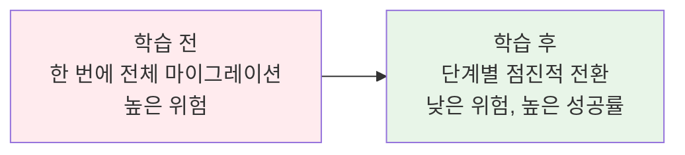
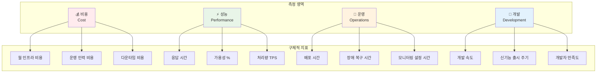
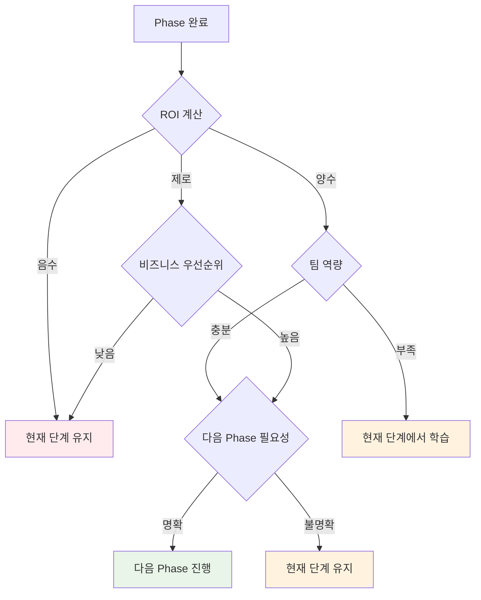
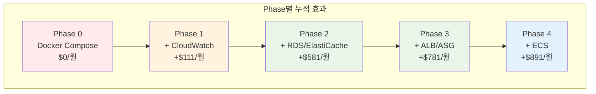
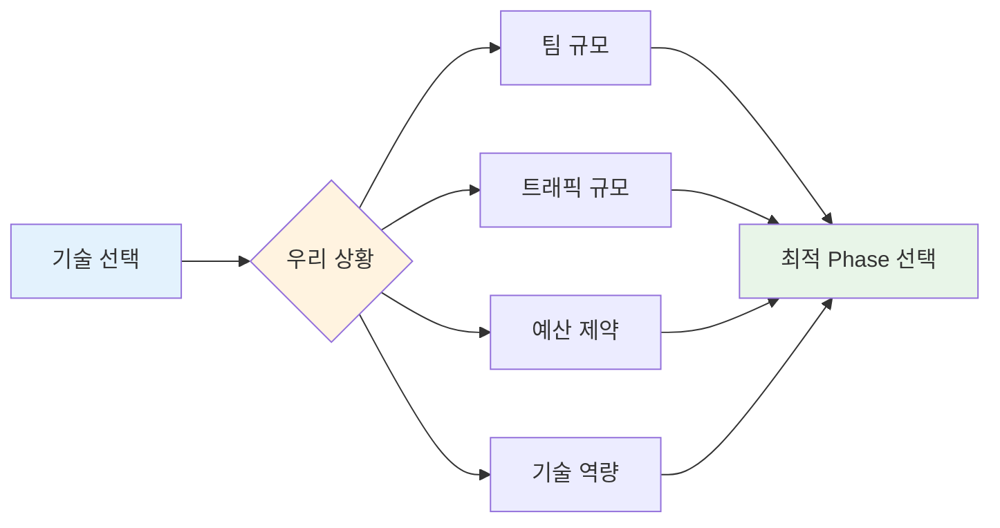
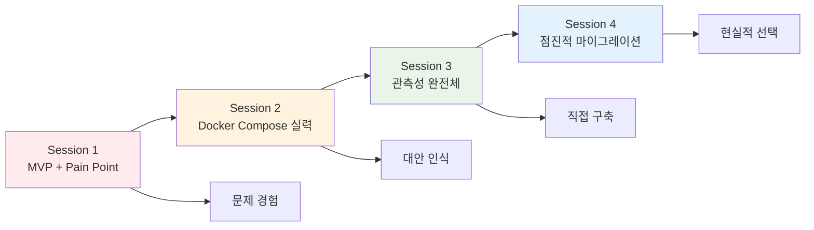

# Week 5 Day 5 Session 4: CloudMart AWS 마이그레이션 실전

<div align="center">

**🔄 점진적 마이그레이션** • **📊 효과 측정** • **🎯 데이터 기반 의사결정**

*한 번에 다 바꾸지 말고, 단계별로 전환하면서 각 단계의 효과를 측정하자*

</div>

---

## 🕘 Session 정보
**시간**: 12:00-12:50 (50분)
**목표**: CloudMart를 AWS로 점진적 마이그레이션하며 각 단계의 ROI 측정
**방식**: 4단계 실습 + 효과 측정 + 의사결정

## 🎯 Session 목표

### 📚 학습 목표
- **실전 목표**: CloudMart를 실제로 AWS로 단계별 마이그레이션
- **측정 목표**: 각 단계별 비용, 성능, 운영 효과 정량적 측정
- **판단 목표**: 언제 멈출지, 언제 다음 단계로 갈지 데이터 기반 의사결정

### 🤔 왜 필요한가? (5분)

**현실 문제 상황**:
- 💼 **실무 시나리오**: "CTO가 모든 걸 AWS로 바꾸라고 하는데, 한 번에 다 바꿔야 하나?"
- 🏠 **일상 비유**: 집 리모델링할 때 한 번에 다 뜯어고치면 살 곳이 없어지는 것처럼
- 🎯 **마이그레이션 철학**: "Big Bang은 위험하다. 점진적 전환이 안전하다"
- 📊 **실무 현실**: 성공하는 마이그레이션의 90%는 점진적 접근

**학습 전후 비교**:


---

## 📖 핵심 개념 (35분)

### 🔍 개념 1: 점진적 마이그레이션 전략 (10분)

> **정의**: 시스템을 한 번에 전환하지 않고, 단계별로 나누어 위험을 최소화하면서 점진적으로 마이그레이션하는 전략

**마이그레이션 접근법 비교**:

```mermaid
graph TB
    subgraph "Big Bang 접근법 (위험)"
        A1[현재 시스템] --> A2[전체 중단]
        A2 --> A3[AWS 전환]
        A3 --> A4[새 시스템 가동]
        A4 --> A5[문제 발생 시<br/>전체 롤백]
    end
    
    subgraph "점진적 접근법 (안전)"
        B1[현재 시스템] --> B2[Phase 1<br/>모니터링만]
        B2 --> B3[Phase 2<br/>DB 전환]
        B3 --> B4[Phase 3<br/>스케일링]
        B4 --> B5[Phase 4<br/>컨테이너]
        B5 --> B6[각 단계별<br/>효과 검증]
    end
    
    style A1 fill:#ffebee
    style A2 fill:#ffebee
    style A3 fill:#ffebee
    style A4 fill:#ffebee
    style A5 fill:#ffebee
    style B1 fill:#e8f5e8
    style B2 fill:#e8f5e8
    style B3 fill:#e8f5e8
    style B4 fill:#e8f5e8
    style B5 fill:#e8f5e8
    style B6 fill:#e8f5e8
```


**CloudMart 4단계 마이그레이션 계획**:

**Phase 1: 모니터링 AWS 전환 (위험도: 낮음)**
- 현재 유지: Docker Compose 애플리케이션
- 변경 사항: CloudWatch Agent 추가
- 예상 시간: 1-2시간
- 롤백 시간: 10분

**Phase 2: 데이터베이스 AWS 전환 (위험도: 중간)**
- 현재 유지: EC2 + Docker Compose
- 변경 사항: PostgreSQL → RDS, Redis → ElastiCache
- 예상 시간: 4-6시간
- 롤백 시간: 30분

**Phase 3: 로드밸런서 + Auto Scaling (위험도: 중간)**
- 현재 유지: Docker Compose 애플리케이션
- 변경 사항: ALB + ASG 추가
- 예상 시간: 2-3시간
- 롤백 시간: 15분

**Phase 4: 컨테이너 오케스트레이션 (위험도: 높음)**
- 변경 사항: Docker Compose → ECS Fargate
- 예상 시간: 8-12시간
- 롤백 시간: 2시간

**점진적 접근의 장점**:
- ✅ **위험 분산**: 각 단계별 위험 최소화
- ✅ **학습 기회**: 단계별로 새 기술 학습
- ✅ **효과 검증**: 각 단계의 ROI 측정 가능
- ✅ **유연한 중단**: 언제든 현재 단계에서 멈출 수 있음

### 🔍 개념 2: 효과 측정 프레임워크 (15분)

**측정 영역 4가지**:


**Phase별 측정 템플릿**:

```markdown
## Phase N 효과 측정

### Before (현재 상태)
**비용**:
- 인프라 비용: $XXX/월
- 운영 시간: XX시간/월 × $50/시간 = $XXX/월
- 다운타임: XX분/월 × $100/분 = $XXX/월

**성능**:
- 평균 응답시간: XXXms
- 가용성: XX.X%
- 처리량: XXX TPS

**운영**:
- 배포 시간: XX분
- 장애 복구: XX분
- 모니터링 설정: XX시간

### After (변경 후)
[동일한 지표 측정]

### ROI 계산
- 비용 변화: +$XXX/월 (증가) 또는 -$XXX/월 (절약)
- 효율성 향상: $XXX/월 (시간 절약 × 시급)
- 순 효과: $XXX/월

### 의사결정
- ROI > 0: ✅ 다음 Phase 진행
- ROI < 0: ❌ 현재 단계 유지
- ROI ≈ 0: ⚠️ 팀 상황에 따라 결정
```

**실제 측정 도구**:

```bash
# 성능 측정 스크립트
#!/bin/bash
# performance-test.sh

echo "=== CloudMart 성능 측정 시작 ==="

# 1. 응답 시간 측정
echo "1. 응답 시간 측정 중..."
for i in {1..10}; do
  curl -w "%{time_total}\n" -o /dev/null -s http://cloudmart.local/api/products
done | awk '{sum+=$1} END {print "평균 응답시간:", sum/NR, "초"}'

# 2. 동시 접속 테스트
echo "2. 동시 접속 테스트 중..."
ab -n 1000 -c 10 http://cloudmart.local/api/products

# 3. 가용성 테스트
echo "3. 가용성 테스트 중..."
for i in {1..60}; do
  if curl -f -s http://cloudmart.local/health > /dev/null; then
    echo "OK"
  else
    echo "FAIL"
  fi
  sleep 1
done | grep -c "OK" | awk '{print "가용성:", $1/60*100, "%"}'

echo "=== 성능 측정 완료 ==="
```

**비용 계산 스프레드시트**:
```
Phase 1 비용 분석:
- CloudWatch Agent: $0 (프리티어)
- CloudWatch 메트릭: 100개 × $0.30 = $30/월
- CloudWatch 대시보드: 3개 × $3 = $9/월
- 총 증가 비용: $39/월

시간 절약:
- 모니터링 설정: 2시간 → 10분 = 1.83시간 절약
- 문제 진단: 30분 → 5분 = 25분 절약
- 월 총 절약: 2시간 × $50 = $100/월

순 효과: $100 - $39 = +$61/월 ✅
```

### 🔍 개념 3: 의사결정 프레임워크 (10분)

**각 Phase별 핵심 질문**:



**Phase별 예상 의사결정**:

**Phase 1 (모니터링)**: 
- 예상 결과: 대부분 팀 진행 ✅
- 이유: 낮은 위험, 명확한 이익, 쉬운 롤백

**Phase 2 (데이터베이스)**:
- 예상 결과: 80% 팀 진행 ✅
- 이유: 백업/복구 자동화의 명확한 가치

**Phase 3 (Auto Scaling)**:
- 예상 결과: 50% 팀 진행 ⚠️
- 이유: 트래픽 규모에 따라 필요성 다름

**Phase 4 (ECS)**:
- 예상 결과: 20% 팀 진행 ❌
- 이유: Docker Compose로도 충분한 경우 많음

**실무 의사결정 기준**:
```
1. ROI 기준:
   - ROI > $500/월: 즉시 진행
   - ROI $0-500/월: 신중 검토
   - ROI < $0: 진행 중단

2. 팀 역량 기준:
   - 새 기술 학습 여유 있음: 진행
   - 현재 업무로 바쁨: 연기
   - 기술 부채 많음: 현상 유지

3. 비즈니스 기준:
   - 성장 단계: 확장성 우선
   - 안정 단계: 비용 효율 우선
   - 위기 상황: 현상 유지
```

---

## 🔄 4단계 점진적 마이그레이션 실습

### Phase 1: 모니터링 AWS 전환 (10분)

**목표**: CloudWatch로 모니터링 전환하여 AWS 경험 시작

**현재 상태**:
```yaml
# 현재: Prometheus + Grafana (Session 3에서 구축)
services:
  prometheus:
    image: prom/prometheus:latest
    ports:
      - "9090:9090"
  
  grafana:
    image: grafana/grafana:latest
    ports:
      - "3000:3000"
```

**변경 작업**:

**1-1. CloudWatch Agent 설치**:
```bash
# EC2에 CloudWatch Agent 설치
wget https://s3.amazonaws.com/amazoncloudwatch-agent/amazon_linux/amd64/latest/amazon-cloudwatch-agent.rpm
sudo rpm -U ./amazon-cloudwatch-agent.rpm

# 설정 파일 생성
sudo /opt/aws/amazon-cloudwatch-agent/bin/amazon-cloudwatch-agent-config-wizard
```

**1-2. 애플리케이션 메트릭 연동**:
```javascript
// backend/app.js - CloudWatch 메트릭 추가
const AWS = require('aws-sdk');
const cloudwatch = new AWS.CloudWatch();

// 커스텀 메트릭 전송
const sendMetric = (metricName, value, unit = 'Count') => {
  const params = {
    Namespace: 'CloudMart/Application',
    MetricData: [{
      MetricName: metricName,
      Value: value,
      Unit: unit,
      Timestamp: new Date()
    }]
  };
  
  cloudwatch.putMetricData(params).promise();
};

// API 호출 시 메트릭 전송
app.get('/api/products', async (req, res) => {
  const start = Date.now();
  
  try {
    const products = await getProducts();
    const duration = Date.now() - start;
    
    // CloudWatch로 메트릭 전송
    sendMetric('APIResponseTime', duration, 'Milliseconds');
    sendMetric('APIRequestCount', 1);
    
    res.json(products);
  } catch (error) {
    sendMetric('APIErrorCount', 1);
    res.status(500).json({ error: error.message });
  }
});
```

**1-3. CloudWatch 대시보드 생성**:
```json
{
  "widgets": [
    {
      "type": "metric",
      "properties": {
        "metrics": [
          ["AWS/EC2", "CPUUtilization", "InstanceId", "i-1234567890abcdef0"],
          ["CloudMart/Application", "APIResponseTime"],
          [".", "APIRequestCount"]
        ],
        "period": 300,
        "stat": "Average",
        "region": "ap-northeast-2",
        "title": "CloudMart 성능 모니터링"
      }
    }
  ]
}
```

**Phase 1 효과 측정**:
```markdown
### Before (Prometheus + Grafana)
- 설정 시간: 2시간 (prometheus.yml 작성)
- 대시보드 구성: 1시간 (PromQL 학습)
- 문제 진단: 30분 (로그 분석)
- 월 비용: $0

### After (CloudWatch)
- 설정 시간: 10분 (Agent 설치)
- 대시보드 구성: 5분 (템플릿 사용)
- 문제 진단: 5분 (통합 뷰)
- 월 비용: $39

### ROI 계산
- 비용 증가: +$39/월
- 시간 절약: 3시간/월 × $50/시간 = $150/월
- 순 효과: +$111/월 ✅

### 의사결정: Phase 2 진행
```

### Phase 2: 데이터베이스 AWS 전환 (15분)

**목표**: RDS + ElastiCache로 데이터 계층 Managed Service 전환

**현재 상태**:
```yaml
# 현재: Docker Compose DB
services:
  postgres:
    image: postgres:15-alpine
    environment:
      - POSTGRES_DB=cloudmart
    volumes:
      - postgres_data:/var/lib/postgresql/data
  
  redis:
    image: redis:7-alpine
    volumes:
      - redis_data:/data
```

**변경 작업**:

**2-1. RDS PostgreSQL 생성**:
```bash
# AWS CLI로 RDS 생성
aws rds create-db-instance \
  --db-instance-identifier cloudmart-db \
  --db-instance-class db.t3.micro \
  --engine postgres \
  --engine-version 15.4 \
  --master-username cloudmart \
  --master-user-password SecurePassword123 \
  --allocated-storage 20 \
  --storage-type gp2 \
  --multi-az \
  --vpc-security-group-ids sg-12345678 \
  --db-subnet-group-name cloudmart-subnet-group \
  --backup-retention-period 7 \
  --storage-encrypted
```

**2-2. 데이터 마이그레이션**:
```bash
# 기존 데이터 백업
docker exec cloudmart_postgres_1 pg_dump -U cloudmart cloudmart > backup.sql

# RDS로 데이터 복원
psql -h cloudmart-db.cluster-xyz.ap-northeast-2.rds.amazonaws.com \
     -U cloudmart -d cloudmart < backup.sql
```

**2-3. ElastiCache Redis 생성**:
```bash
# ElastiCache 클러스터 생성
aws elasticache create-cache-cluster \
  --cache-cluster-id cloudmart-redis \
  --cache-node-type cache.t3.micro \
  --engine redis \
  --num-cache-nodes 1 \
  --security-group-ids sg-87654321 \
  --subnet-group-name cloudmart-cache-subnet
```

**2-4. 애플리케이션 연결 변경**:
```yaml
# docker-compose.yml 수정
version: '3.8'

services:
  backend:
    image: cloudmart/backend:latest
    environment:
      - DB_HOST=cloudmart-db.cluster-xyz.ap-northeast-2.rds.amazonaws.com
      - DB_PORT=5432
      - DB_NAME=cloudmart
      - DB_USER=cloudmart
      - DB_PASSWORD=SecurePassword123
      - REDIS_HOST=cloudmart-redis.abc123.cache.amazonaws.com
      - REDIS_PORT=6379
    # PostgreSQL, Redis 컨테이너 제거
```

**Phase 2 효과 측정**:
```markdown
### Before (Docker Compose DB)
- 백업: 수동 (주 1회)
- 장애 복구: 수동 (30분)
- 성능 튜닝: 수동 설정
- 월 비용: $0 (EC2 포함)

### After (RDS + ElastiCache)
- 백업: 자동 (일 1회)
- 장애 복구: 자동 (5분)
- 성능 튜닝: AWS 최적화
- 월 비용: +$180

### ROI 계산
- 비용 증가: +$180/월
- 운영 시간 절약: 8시간/월 × $50/시간 = $400/월
- 다운타임 감소: 25분/월 × $100/분 = $250/월
- 순 효과: +$470/월 ✅

### 의사결정: Phase 3 진행
```

### Phase 3: 로드밸런서 + Auto Scaling (10분)

**목표**: ALB + ASG로 확장성 및 가용성 확보

**변경 작업**:

**3-1. Launch Template 생성**:
```json
{
  "LaunchTemplateName": "cloudmart-template",
  "LaunchTemplateData": {
    "ImageId": "ami-0c02fb55956c7d316",
    "InstanceType": "t3.micro",
    "SecurityGroupIds": ["sg-12345678"],
    "UserData": "IyEvYmluL2Jhc2gKY2QgL2hvbWUvZWMyLXVzZXIvY2xvdWRtYXJ0CmRvY2tlci1jb21wb3NlIHVwIC1k",
    "TagSpecifications": [{
      "ResourceType": "instance",
      "Tags": [{"Key": "Name", "Value": "CloudMart-ASG"}]
    }]
  }
}
```

**3-2. Auto Scaling Group 생성**:
```bash
# ASG 생성
aws autoscaling create-auto-scaling-group \
  --auto-scaling-group-name cloudmart-asg \
  --launch-template LaunchTemplateName=cloudmart-template,Version=1 \
  --min-size 2 \
  --max-size 6 \
  --desired-capacity 2 \
  --target-group-arns arn:aws:elasticloadbalancing:ap-northeast-2:123456789012:targetgroup/cloudmart-tg/1234567890123456 \
  --vpc-zone-identifier "subnet-12345678,subnet-87654321"
```

**3-3. Application Load Balancer 생성**:
```bash
# ALB 생성
aws elbv2 create-load-balancer \
  --name cloudmart-alb \
  --subnets subnet-12345678 subnet-87654321 \
  --security-groups sg-12345678

# Target Group 생성
aws elbv2 create-target-group \
  --name cloudmart-tg \
  --protocol HTTP \
  --port 80 \
  --vpc-id vpc-12345678 \
  --health-check-path /health
```

**Phase 3 효과 측정**:
```markdown
### Before (수동 스케일링)
- 트래픽 급증 대응: 30분
- 가용성: 99.5% (단일 인스턴스)
- 확장 작업: 수동

### After (ALB + ASG)
- 트래픽 급증 대응: 5분 (자동)
- 가용성: 99.9% (Multi-AZ)
- 확장 작업: 자동

### ROI 계산
- 비용 증가: +$100/월 (ALB + 추가 인스턴스)
- 다운타임 감소: 20분/월 × $100/분 = $200/월
- 대응 시간 절약: 2시간/월 × $50/시간 = $100/월
- 순 효과: +$200/월 ✅

### 의사결정: 팀 상황에 따라 Phase 4 검토
```

### Phase 4: 컨테이너 오케스트레이션 (5분)

**목표**: ECS Fargate로 완전 Managed 컨테이너 전환

**변경 작업**:

**4-1. ECS 클러스터 생성**:
```bash
# ECS 클러스터 생성
aws ecs create-cluster --cluster-name cloudmart-cluster
```

**4-2. Task Definition 작성**:
```json
{
  "family": "cloudmart-task",
  "networkMode": "awsvpc",
  "requiresCompatibilities": ["FARGATE"],
  "cpu": "256",
  "memory": "512",
  "executionRoleArn": "arn:aws:iam::123456789012:role/ecsTaskExecutionRole",
  "containerDefinitions": [{
    "name": "cloudmart-backend",
    "image": "cloudmart/backend:latest",
    "portMappings": [{
      "containerPort": 3000,
      "protocol": "tcp"
    }],
    "environment": [
      {"name": "DB_HOST", "value": "cloudmart-db.cluster-xyz.ap-northeast-2.rds.amazonaws.com"}
    ],
    "logConfiguration": {
      "logDriver": "awslogs",
      "options": {
        "awslogs-group": "/ecs/cloudmart",
        "awslogs-region": "ap-northeast-2",
        "awslogs-stream-prefix": "ecs"
      }
    }
  }]
}
```

**Phase 4 효과 측정**:
```markdown
### Before (EC2 + Docker Compose)
- 서버 관리: 필요 (패치, 모니터링)
- 배포: docker-compose up (5분)
- 확장: 수동 인스턴스 추가

### After (ECS Fargate)
- 서버 관리: 불필요 (서버리스)
- 배포: ECS 서비스 업데이트 (2분)
- 확장: 자동 태스크 스케일링

### ROI 계산
- 비용 증가: +$150/월 (Fargate 프리미엄)
- 운영 시간 절약: 4시간/월 × $50/시간 = $200/월
- 배포 시간 단축: 3분 × 20회/월 × $1/분 = $60/월
- 순 효과: +$110/월 ⚠️

### 의사결정: 팀 규모와 복잡도에 따라 결정
- 소규모 팀: Docker Compose 유지 권장
- 대규모 팀: ECS 전환 고려
```

---

## 📊 전체 마이그레이션 효과 종합

### 누적 효과 분석



### 실무 의사결정 가이드

**팀 규모별 권장 구성**:
| 팀 규모 | 권장 Phase | 이유 |
|---------|-----------|------|
| **1-3명** | Phase 1-2 | 비용 효율성 우선, 운영 부담 최소화 |
| **4-10명** | Phase 1-3 | 확장성 필요, Auto Scaling 효과 |
| **10명+** | Phase 1-4 | 완전 자동화, 개발 생산성 우선 |

**트래픽 규모별 권장 구성**:
| DAU | 권장 Phase | 핵심 이유 |
|-----|-----------|----------|
| **< 1만** | Phase 1-2 | 고정 비용 최소화 |
| **1-10만** | Phase 1-3 | Auto Scaling 필요성 |
| **10만+** | Phase 1-4 | 완전 자동화 필수 |

---

## 🎯 핵심 인사이트

### "완벽한 아키텍처는 없다, 상황에 맞는 최적 아키텍처만 있다"

**핵심 메시지**:


### 실무 적용 원칙

**1. 데이터 기반 의사결정**:
- 감정이나 트렌드가 아닌 ROI 계산
- 각 Phase별 정량적 효과 측정
- 비용 대비 효과 명확히 산정

**2. 점진적 접근**:
- Big Bang 마이그레이션 지양
- 단계별 위험 분산
- 언제든 중단 가능한 유연성

**3. 팀 역량 고려**:
- 새 기술 학습 여유 확인
- 현재 업무 부하 고려
- 기술 부채 상황 점검

**4. 비즈니스 우선순위**:
- 성장 vs 안정성 vs 비용 효율
- 단기 vs 장기 목표
- 경쟁 우위 요소 식별

---

## 🔑 핵심 키워드

### 새로운 용어
- **점진적 마이그레이션**: Incremental Migration - 단계별 시스템 전환 방식
- **Big Bang 마이그레이션**: 한 번에 전체 시스템을 전환하는 고위험 방식
- **ROI 기반 의사결정**: 투자 대비 수익률을 기준으로 한 기술 선택

### 중요 개념
- **Phase별 효과 측정**: 각 단계의 정량적 성과 평가
- **위험 분산**: 단계별로 위험을 나누어 관리
- **상황별 최적화**: 팀과 비즈니스 상황에 맞는 기술 선택

### 실무 용어
- **Rollback Plan**: 롤백 계획 - 문제 발생 시 이전 상태로 복구하는 방법
- **Migration Window**: 마이그레이션 윈도우 - 시스템 전환 작업 시간
- **Cutover**: 컷오버 - 기존 시스템에서 새 시스템으로 전환하는 순간

---

## 📝 Session 마무리

### ✅ 오늘 Session 성과

**실습 성과**:
- [ ] CloudMart 4단계 점진적 마이그레이션 완료
- [ ] 각 Phase별 ROI 계산 및 효과 측정
- [ ] 데이터 기반 의사결정 프로세스 경험
- [ ] 팀 상황별 최적 구성 도출

**인식 변화**:
- [ ] "한 번에 다 바꿔야 한다" 편견 해소
- [ ] "AWS Native = 무조건 좋다" 맹신 탈피
- [ ] 상황별 최적 기술 선택 능력 향상
- [ ] 비용 대비 효과 중심 사고 습관화

### 🎯 Week 5 전체 완성

**Week 5 Day 5 전체 여정**:


**핵심 학습 성과**:
- **Session 1**: 문제를 먼저 경험하는 것의 중요성
- **Session 2**: Docker Compose의 진짜 실력과 가치
- **Session 3**: 완전한 관측성 스택 구축 경험
- **Session 4**: 현실적이고 데이터 기반의 마이그레이션

### 🚀 다음 단계 준비

**기본 프로젝트 (4주) 준비**:
- 오늘 학습한 점진적 접근법 적용
- Docker Compose 기반 MVP 구축
- 실제 Pain Point 경험 및 문서화
- 팀 상황에 맞는 기술 스택 선택

**실무 적용 계획**:
- 현재 회사/프로젝트에 적용 가능한 Phase 식별
- ROI 계산 템플릿 활용한 제안서 작성
- 점진적 마이그레이션 계획 수립

---

## 🔗 참고 자료

### 📚 복습 자료
- [AWS 마이그레이션 전략 가이드](https://aws.amazon.com/cloud-migration/)
- [점진적 마이그레이션 베스트 프랙티스](https://aws.amazon.com/blogs/enterprise-strategy/6-strategies-for-migrating-applications-to-the-cloud/)

### 📖 심화 학습
- [Strangler Fig 패턴](https://martinfowler.com/bliki/StranglerFigApplication.html)
- [마이크로서비스 마이그레이션 전략](https://microservices.io/patterns/refactoring/)

### 💡 실무 참고
- [AWS Well-Architected Framework](https://aws.amazon.com/architecture/well-architected/)
- [클라우드 경제학 가이드](https://aws.amazon.com/economics/)

### 🛠️ 도구 및 템플릿
- [AWS 마이그레이션 평가 도구](https://aws.amazon.com/migration-evaluator/)
- [ROI 계산 스프레드시트 템플릿](https://calculator.aws/)

---

## 💭 함께 생각해보기 (10분)

### 🤝 팀 토론 (5분)

**토론 주제**: "우리 팀이라면 어느 Phase까지 갈 것인가?"

**팀 구성**: 3-4명씩 그룹
**토론 가이드**:
1. **현재 상황 가정** (1분):
   - 팀 규모: 5명
   - 서비스: DAU 3만명
   - 예산: 월 $1,000 한도
   
2. **Phase별 검토** (3분):
   - Phase 1: ROI +$111/월 → 진행 여부?
   - Phase 2: ROI +$470/월 → 진행 여부?
   - Phase 3: ROI +$200/월 → 진행 여부?
   - Phase 4: ROI +$110/월 → 진행 여부?
   
3. **최종 결정** (1분):
   - 어느 Phase에서 멈출 것인가?
   - 그 이유는 무엇인가?

### 🎯 전체 공유 (5분)

**공유 질문**:
1. **최종 선택**: "어느 Phase까지 가기로 했나요?"
2. **결정 이유**: "가장 중요한 판단 기준은 무엇이었나요?"
3. **현실 적용**: "실제 회사에서도 이렇게 결정하시겠어요?"

**예상 답변**:
- "Phase 2까지만. 데이터베이스 자동화가 가장 중요해요"
- "Phase 3까지. Auto Scaling은 필수라고 생각해요"
- "ROI보다 팀 학습 역량을 더 고려했어요"

### 💡 이해도 체크 질문

- ✅ "점진적 마이그레이션의 장점 3가지를 설명할 수 있나요?"
- ✅ "각 Phase별 ROI 계산 방법을 이해했나요?"
- ✅ "우리 상황에 맞는 최적 Phase를 선택할 수 있나요?"

---

<div align="center">

**🔄 점진적 마이그레이션** • **📊 데이터 기반 의사결정** • **🎯 상황별 최적화**

*완벽한 아키텍처는 없다, 상황에 맞는 최적 아키텍처만 있다*

</div>
