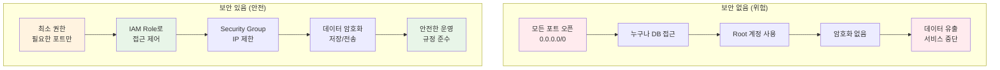
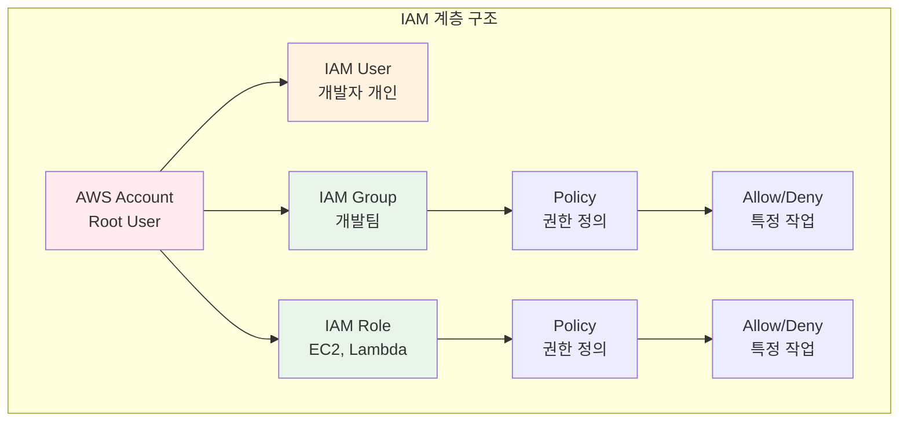
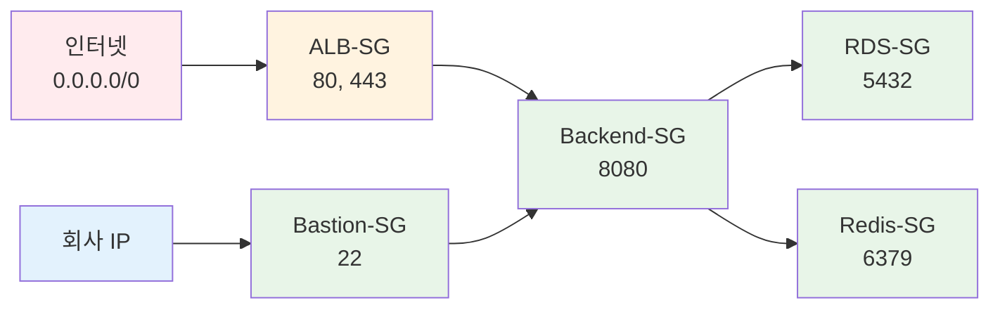
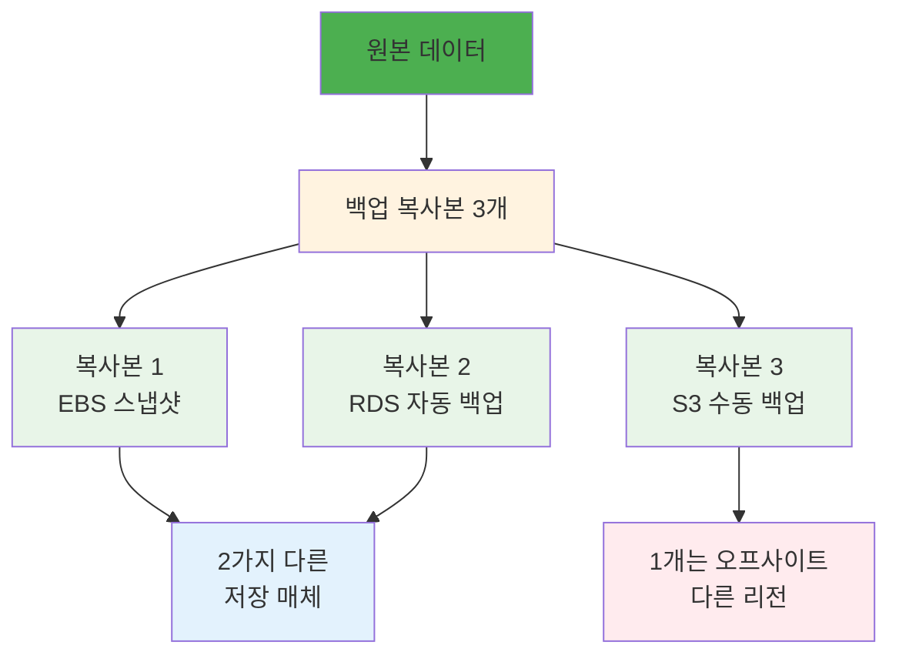

# Week 5 Day 5 Session 4: 보안 & 백업 (12:00-12:50)

<div align="center">

**🔐 IAM 정책** • **🛡️ 보안 강화** • **💾 백업 전략** • **🔄 재해 복구**

*프로덕션 환경의 보안과 비즈니스 연속성 확보*

</div>

---

## 🕘 세션 정보
**시간**: 12:00-12:50 (50분)
**목표**: CloudMart의 보안 강화 및 재해 복구 계획 수립
**방식**: 이론 설명 + 베스트 프랙티스

## 🎯 세션 목표

### 📚 학습 목표
- **이해 목표**: IAM 정책과 보안 그룹의 차이 및 역할 이해
- **적용 목표**: 최소 권한 원칙에 따른 보안 설정 방법 습득
- **협업 목표**: 팀과 함께 재해 복구 시나리오 수립

### 🤔 왜 필요한가? (5분)

**현실 문제 상황**:
- 💼 **실무 시나리오**: "해커가 DB에 접근해서 고객 정보를 탈취했어요. 어떻게 막을 수 있나요?"
- 🏠 **일상 비유**: 집에 현관문 잠금 + CCTV + 금고 → 다층 보안
- ☁️ **AWS 아키텍처**: IAM (누가 접근?) + Security Group (어디서 접근?) + 암호화 (데이터 보호)
- 📊 **시장 동향**: 2024년 데이터 유출 평균 피해액 $4.45M (IBM 보고서)

**보안 없음 vs 있음 비교**:


## 📖 핵심 개념 (35분)

### 🔍 개념 1: IAM 정책 & 역할 설계 (12분)

> **정의**: AWS 리소스에 대한 접근 권한을 세밀하게 제어하는 서비스

**IAM 구성 요소**:


**CloudMart IAM 설계**:
```yaml
# 1. EC2 Instance Role (Backend 서버용)
Role Name: CloudMart-Backend-Role
Policies:
  - RDS 접근 (읽기/쓰기)
  - ElastiCache 접근
  - S3 읽기 (설정 파일)
  - CloudWatch Logs 쓰기
  - Secrets Manager 읽기 (DB 비밀번호)

Policy Example:
{
  "Version": "2012-10-17",
  "Statement": [
    {
      "Effect": "Allow",
      "Action": [
        "rds:DescribeDBInstances",
        "rds:Connect"
      ],
      "Resource": "arn:aws:rds:ap-northeast-2:*:db:cloudmart-db"
    },
    {
      "Effect": "Allow",
      "Action": [
        "elasticache:DescribeCacheClusters"
      ],
      "Resource": "*"
    },
    {
      "Effect": "Allow",
      "Action": [
        "s3:GetObject"
      ],
      "Resource": "arn:aws:s3:::cloudmart-config/*"
    }
  ]
}

# 2. Developer Group (개발자용)
Group Name: CloudMart-Developers
Policies:
  - EC2 읽기 전용
  - RDS 읽기 전용
  - CloudWatch 읽기
  - S3 읽기/쓰기 (특정 버킷만)

# 3. Admin Group (관리자용)
Group Name: CloudMart-Admins
Policies:
  - 모든 리소스 관리 권한
  - 단, IAM 정책 변경은 제한
```

**최소 권한 원칙 (Least Privilege)**:
```yaml
# ❌ 나쁜 예: 너무 많은 권한
{
  "Effect": "Allow",
  "Action": "*",
  "Resource": "*"
}

# ✅ 좋은 예: 필요한 권한만
{
  "Effect": "Allow",
  "Action": [
    "rds:DescribeDBInstances",
    "rds:Connect"
  ],
  "Resource": "arn:aws:rds:ap-northeast-2:123456789012:db:cloudmart-db",
  "Condition": {
    "IpAddress": {
      "aws:SourceIp": "10.0.0.0/16"
    }
  }
}
```

### 🔍 개념 2: 보안 그룹 최적화 (12분)

> **정의**: EC2 인스턴스 수준의 가상 방화벽으로 인바운드/아웃바운드 트래픽 제어

**CloudMart 보안 그룹 설계**:
```yaml
# 1. ALB Security Group
Name: CloudMart-ALB-SG
Inbound Rules:
  - Type: HTTP (80)
    Source: 0.0.0.0/0 (전 세계)
  - Type: HTTPS (443)
    Source: 0.0.0.0/0 (전 세계)
Outbound Rules:
  - Type: All Traffic
    Destination: CloudMart-Backend-SG

# 2. Backend Security Group
Name: CloudMart-Backend-SG
Inbound Rules:
  - Type: HTTP (8080)
    Source: CloudMart-ALB-SG (ALB만 접근)
  - Type: SSH (22)
    Source: Bastion-SG (Bastion만 접근)
Outbound Rules:
  - Type: PostgreSQL (5432)
    Destination: CloudMart-RDS-SG
  - Type: Redis (6379)
    Destination: CloudMart-Redis-SG
  - Type: HTTPS (443)
    Destination: 0.0.0.0/0 (외부 API 호출)

# 3. RDS Security Group
Name: CloudMart-RDS-SG
Inbound Rules:
  - Type: PostgreSQL (5432)
    Source: CloudMart-Backend-SG (Backend만 접근)
Outbound Rules:
  - None (필요 없음)

# 4. ElastiCache Security Group
Name: CloudMart-Redis-SG
Inbound Rules:
  - Type: Redis (6379)
    Source: CloudMart-Backend-SG (Backend만 접근)
Outbound Rules:
  - None (필요 없음)

# 5. Bastion Security Group
Name: CloudMart-Bastion-SG
Inbound Rules:
  - Type: SSH (22)
    Source: [회사 IP]/32 (특정 IP만)
Outbound Rules:
  - Type: SSH (22)
    Destination: CloudMart-Backend-SG
```

**보안 그룹 체인**:


**보안 강화 체크리스트**:
- [ ] RDS는 Private Subnet에만 배치
- [ ] DB 포트(5432)는 Backend SG에서만 접근
- [ ] SSH(22)는 Bastion을 통해서만 접근
- [ ] 모든 통신은 암호화 (TLS/SSL)
- [ ] 불필요한 포트는 모두 차단

### 🔍 개념 3: 백업 전략 & 재해 복구 (11분)

> **정의**: 데이터 손실 방지 및 장애 발생 시 신속한 복구를 위한 계획

**3-2-1 백업 규칙**:


**CloudMart 백업 전략**:
```yaml
# 1. RDS 자동 백업
Automated Backup:
  Retention Period: 7 days
  Backup Window: 03:00-04:00 (새벽)
  Point-in-Time Recovery: Enabled (5분 단위)
  
Manual Snapshot:
  Frequency: 주 1회 (일요일)
  Retention: 30 days
  Cross-Region Copy: ap-northeast-1 (도쿄)

# 2. EBS 스냅샷
Snapshot Schedule:
  Frequency: 일 1회 (새벽 2시)
  Retention: 7 days
  Lifecycle Policy: 7일 후 자동 삭제

# 3. S3 버전 관리
Versioning: Enabled
Lifecycle Policy:
  - Current Version: 30 days
  - Previous Versions: 90 days
  - Glacier: 1 year
  - Delete: 2 years

# 4. 애플리케이션 코드
Git Repository:
  - GitHub (Primary)
  - GitLab (Mirror)
  - S3 (Backup)
```

**재해 복구 시나리오**:
```yaml
# 시나리오 1: RDS 장애
Problem: RDS Primary 장애
Solution:
  1. Multi-AZ 자동 Failover (1-2분)
  2. Standby가 Primary로 승격
  3. 애플리케이션 자동 재연결
Recovery Time: 2분
Data Loss: 0 (동기 복제)

# 시나리오 2: 전체 AZ 장애
Problem: ap-northeast-2a 전체 장애
Solution:
  1. ALB가 ap-northeast-2b로 트래픽 전환
  2. ASG가 ap-northeast-2b에 새 인스턴스 생성
  3. RDS Standby가 Primary로 승격
Recovery Time: 5-10분
Data Loss: 0

# 시나리오 3: 데이터 손상
Problem: 잘못된 쿼리로 데이터 삭제
Solution:
  1. RDS Point-in-Time Recovery
  2. 삭제 직전 시점으로 복원
  3. 새 RDS 인스턴스 생성
  4. 애플리케이션 연결 변경
Recovery Time: 30분
Data Loss: 최대 5분

# 시나리오 4: 리전 전체 장애
Problem: ap-northeast-2 전체 장애 (극히 드묾)
Solution:
  1. Route 53 Failover to ap-northeast-1
  2. Cross-Region RDS Replica 승격
  3. S3 Cross-Region Replication 활용
Recovery Time: 1-2시간
Data Loss: 최대 15분 (비동기 복제)
```

**RPO & RTO 목표**:
```yaml
CloudMart 목표:
  RPO (Recovery Point Objective):
    - Critical Data (주문, 결제): 0분 (동기 복제)
    - User Data (프로필): 5분 (Point-in-Time)
    - Logs: 15분 (비동기 복제)
  
  RTO (Recovery Time Objective):
    - AZ 장애: 5분
    - 데이터 손상: 30분
    - 리전 장애: 2시간
```

## 💭 함께 생각해보기 (10분)

### 🤝 페어 토론 (5분)

**토론 주제**:
1. **보안 vs 편의성**: "모든 포트를 막으면 안전하지만 불편해요. 어떻게 균형을 맞출까요?"
2. **백업 비용**: "백업을 많이 하면 안전하지만 비용이 늘어나요. 적정선은?"
3. **재해 복구 테스트**: "재해 복구 계획을 어떻게 테스트할 수 있을까요?"

**페어 활동 가이드**:
- 👥 **자유 페어링**: 보안 관심사가 비슷한 사람끼리
- 🔄 **역할 교대**: 3분씩 설명자/질문자 역할 바꾸기
- 📝 **핵심 정리**: 보안 체크리스트 작성

### 🎯 전체 공유 (5분)

**인사이트 공유**:
- 페어 토론에서 나온 보안 전략
- 실무에서 겪은 보안 사고 경험
- 효과적인 백업 및 복구 방법

**💡 이해도 체크 질문**:
- ✅ "IAM Role과 Security Group의 차이는 무엇인가요?"
- ✅ "3-2-1 백업 규칙은 무엇인가요?"
- ✅ "RPO와 RTO의 차이는 무엇인가요?"

## 🔑 핵심 키워드

### 🆕 새로운 용어
- **IAM (Identity and Access Management)**: AWS 리소스 접근 권한 관리
- **Least Privilege**: 최소 권한 원칙 - 필요한 권한만 부여
- **Defense in Depth**: 다층 방어 - 여러 보안 계층 구축

### 🔧 중요 개념
- **RPO (Recovery Point Objective)**: 데이터 손실 허용 시간
- **RTO (Recovery Time Objective)**: 복구 목표 시간
- **Point-in-Time Recovery**: 특정 시점으로 데이터 복원

### 💼 실무 용어
- **Bastion Host**: 외부에서 Private 리소스 접근을 위한 점프 서버
- **Secrets Manager**: 비밀번호, API 키 등 민감 정보 안전 저장
- **Cross-Region Replication**: 다른 리전으로 데이터 복제

## 📝 세션 마무리

### ✅ 오늘 세션 성과
- **보안 설계**: IAM 정책 및 보안 그룹 최적 구성 방법 습득
- **백업 전략**: 3-2-1 백업 규칙 및 자동화 방법 이해
- **재해 복구**: 다양한 장애 시나리오별 대응 계획 수립

### 🎯 점심 후 실습 준비
- **Lab 1**: CloudMart 전체 인프라 구축 (14:00-14:50)
- **Challenge**: 프로덕션급 완성도로 배포 (15:00-15:50)
- **준비사항**: 오전 4개 세션 내용 복습

### 🔗 실습 연계
- **Lab 1**: 오늘 배운 보안 설정을 실제로 적용
- **Challenge**: 백업 및 모니터링까지 완전한 시스템 구축

---

<div align="center">

**🔐 보안 강화 완료** • **💾 백업 전략 수립** • **🔄 재해 복구 준비**

*점심 후 실습에서 CloudMart를 완전히 배포해보겠습니다!*

</div>
