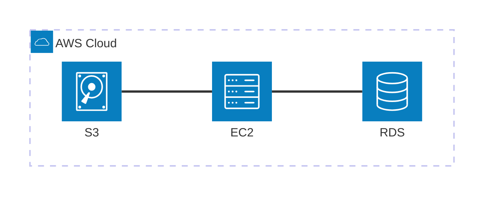
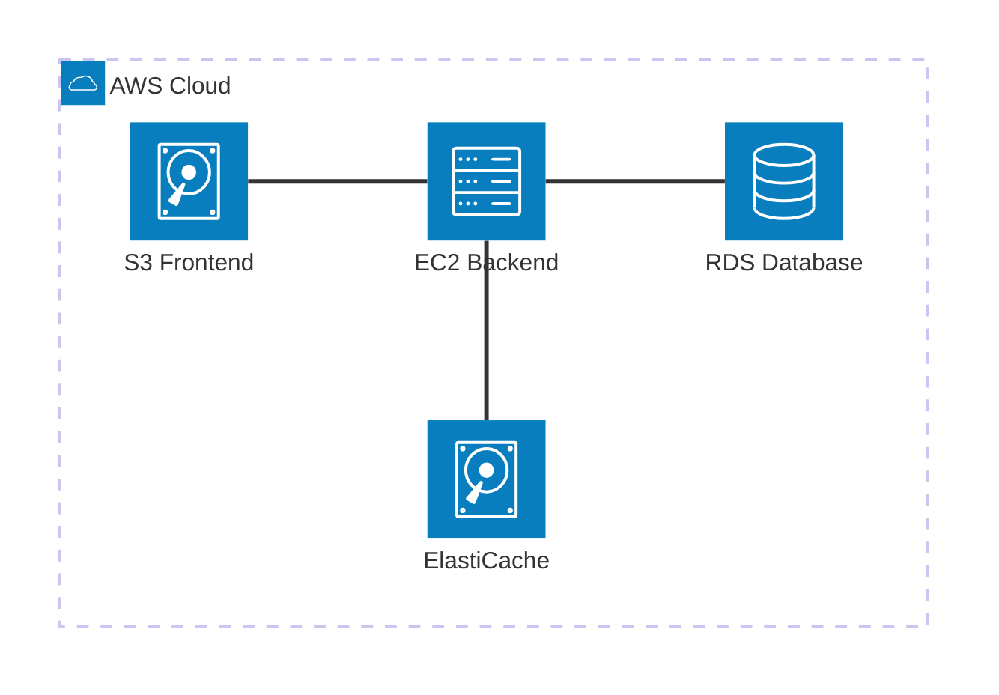
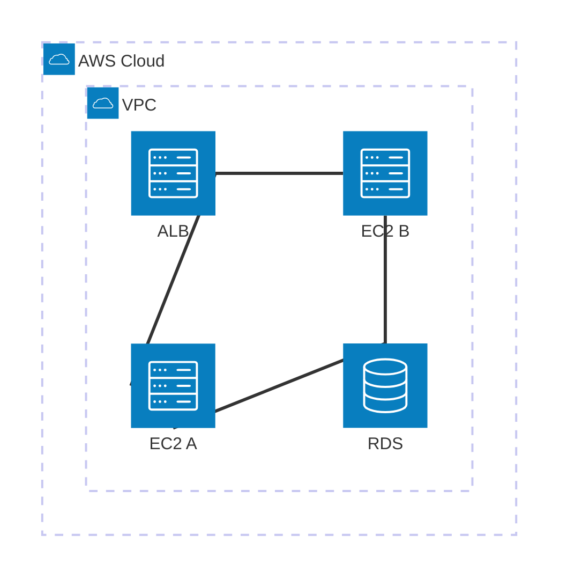

# Architecture-Beta 테스트

## 기본 테스트

```mermaid
architecture-beta
    group cloud(cloud)[AWS Cloud]
    
    service s3(disk)[S3] in cloud
    service ec2(server)[EC2] in cloud
    service rds(database)[RDS] in cloud
    
    s3:R -- L:ec2
    ec2:R -- L:rds
```

## AWS 아이콘 테스트

```mermaid
architecture-beta
    group aws(cloud)[AWS Cloud]
    
    service frontend(disk)[S3 Frontend] in aws
    service backend(server)[EC2 Backend] in aws
    service db(database)[RDS Database] in aws
    service cache(disk)[ElastiCache] in aws
    
    frontend:R -- L:backend
    backend:R -- L:db
    backend:B -- T:cache
```

## 복잡한 구조 테스트

```mermaid
architecture-beta
    group cloud(cloud)[AWS Cloud]
    
    group vpc(cloud)[VPC] in cloud
    
    service alb(server)[ALB] in vpc
    service ec2_1(server)[EC2 A] in vpc
    service ec2_2(server)[EC2 B] in vpc
    service rds(database)[RDS] in vpc
    
    alb:R -- L:ec2_1
    alb:R -- L:ec2_2
    ec2_1:B -- T:rds
    ec2_2:B -- T:rds
```
