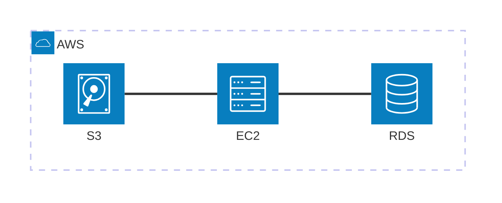
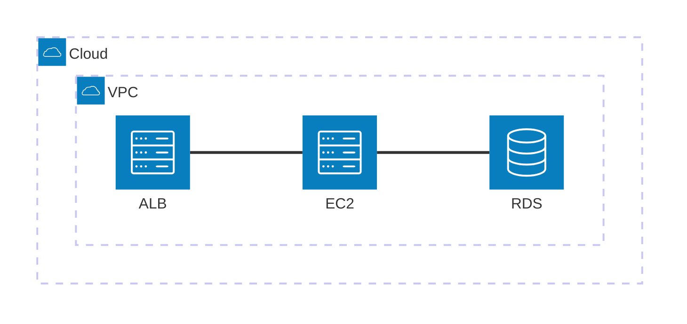
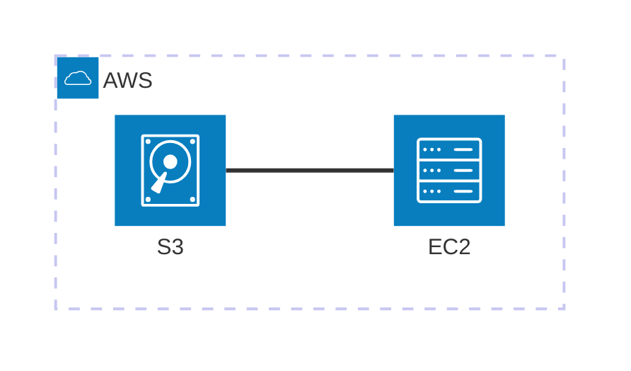

# Architecture-Beta 테스트

## 테스트 1: 기본 아이콘

```mermaid
architecture-beta
    group aws(cloud)[AWS]
    
    service s3(disk)[S3] in aws
    service ec2(server)[EC2] in aws
    service rds(database)[RDS] in aws
    
    s3:R -- L:ec2
    ec2:R -- L:rds
```

## 테스트 2: VPC 그룹

```mermaid
architecture-beta
    group cloud(cloud)[Cloud]
    group vpc(cloud)[VPC] in cloud
    
    service alb(server)[ALB] in vpc
    service ec2(server)[EC2] in vpc
    service rds(database)[RDS] in vpc
    
    alb:R -- L:ec2
    ec2:R -- L:rds
```

## 테스트 3: AWS Logos (하이픈 제거)

```mermaid
architecture-beta
    group aws(cloud)[AWS]
    
    service s3(disk)[S3] in aws
    service ec2(server)[EC2] in aws
    
    s3:R -- L:ec2
```
