# Architecture-Beta AWS Logos 테스트

## AWS 실제 로고 아이콘 테스트

```mermaid
architecture-beta
    group cloud(logos:aws)[AWS Cloud]
    
    service s3(logos:aws-s3)[S3 Frontend] in cloud
    service cf(logos:aws-cloudfront)[CloudFront] in cloud
    service alb(logos:aws-elastic-load-balancing)[ALB] in cloud
    service ec2(logos:aws-ec2)[EC2 Backend] in cloud
    service rds(logos:aws-rds)[RDS Database] in cloud
    service redis(logos:aws-elasticache)[ElastiCache] in cloud
    
    cf:R -- L:s3
    cf:B -- T:alb
    alb:R -- L:ec2
    ec2:R -- L:rds
    ec2:B -- T:redis
```

## CloudMart 아키텍처 (AWS Logos)

## 가능한 AWS 서비스 로고들

- `logos:aws` - AWS 로고
- `logos:aws-s3` - S3
- `logos:aws-ec2` - EC2
- `logos:aws-rds` - RDS
- `logos:aws-lambda` - Lambda
- `logos:aws-cloudfront` - CloudFront
- `logos:aws-route-53` - Route 53
- `logos:aws-elastic-load-balancing` - ELB/ALB
- `logos:aws-elasticache` - ElastiCache
- `logos:aws-cloudwatch` - CloudWatch
- `logos:aws-sns` - SNS
- `logos:aws-vpc` - VPC
