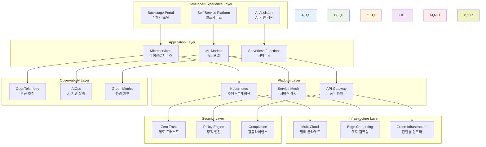
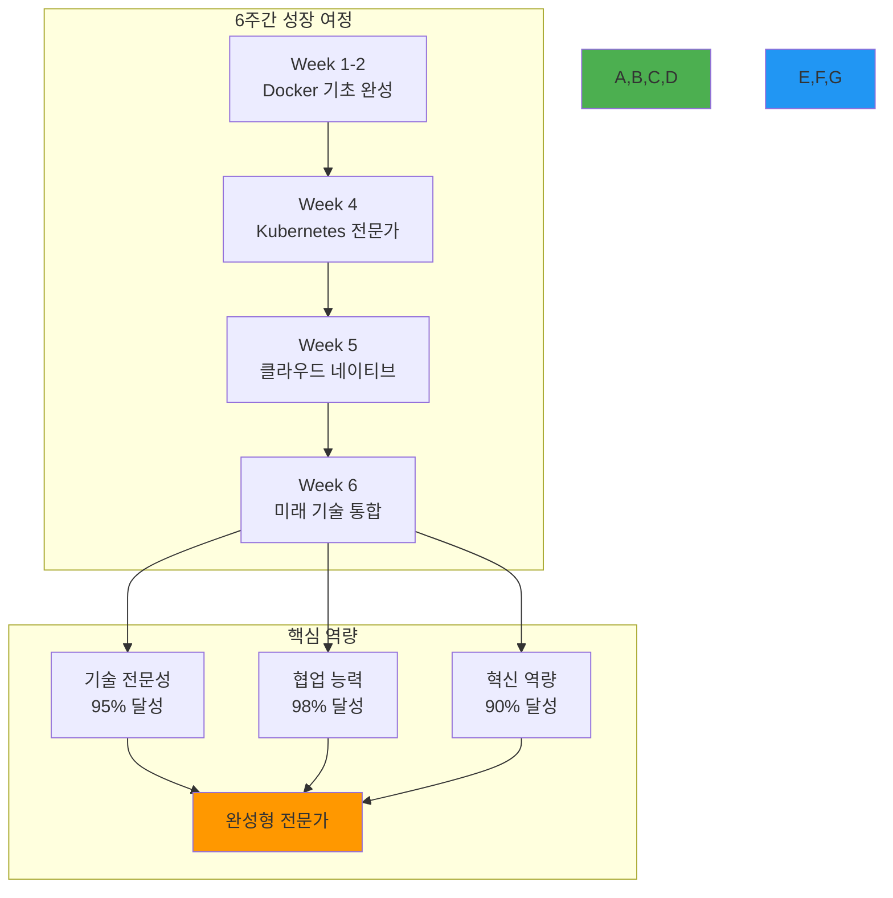

# Week 6: 최신 DevOps 트렌드와 통합 운영

**🚀 2025 DevOps 트렌드** • **🏗️ 플랫폼 엔지니어링** • **🤖 AI/MLOps** • **🌱 Green DevOps**

*최신 기술 트렌드부터 지속가능한 DevOps까지, 미래를 준비하는 완성형 전문가*

---

## 🎯 주간 학습 목표 (5일 구성)

### 📚 전체 공통 목표
> **2025년 최신 DevOps 트렌드를 이해하고 적용하며, 6주간의 이론 학습을 통합하여 실무에서 바로 활용할 수 있는 완성형 DevOps 전문가가 된다**

### 🎪 협업 중심 학습
- **모든 학생 함께**: 최신 기술 트렌드를 함께 탐구하고 적용
- **자연스러운 역할 분담**: 각자의 관심 분야에서 전문성 발휘
- **상호 학습**: 6주간의 학습 성과를 서로 공유하고 통합
- **실무 연계**: 실제 기업에서 요구하는 최신 기술 스택 경험

---

## 📅 일일 학습 계획 (5일 구성)

### [Day 1: Infrastructure as Code & 관측성](./day1/README.md)
**🎯 목표**: IaC 고도화와 현대적 관측성 플랫폼 구축

#### 📚 이론 강의 (2.5시간)
- **Session 1**: Terraform 고급 패턴과 모듈화
- **Session 2**: 관측성 3요소 (메트릭, 로그, 추적) 통합
- **Session 3**: OpenTelemetry와 분산 추적

#### 🛠️ 실습 챌린지 (3시간)
- **Phase 1**: Terraform으로 전체 인프라 코드화
- **Phase 2**: OpenTelemetry 기반 관측성 스택 구축
- **Phase 3**: 통합 모니터링 대시보드 구성

---

### [Day 2: 플랫폼 엔지니어링과 개발자 경험](./day2/README.md)
**🎯 목표**: 개발자 생산성 향상을 위한 플랫폼 엔지니어링 구현

#### 📚 이론 강의 (2.5시간)
- **Session 1**: 플랫폼 엔지니어링 개념과 가치
- **Session 2**: 개발자 포털과 셀프서비스 플랫폼
- **Session 3**: Backstage 기반 개발자 경험 플랫폼

#### 🛠️ 실습 챌린지 (3시간)
- **Phase 1**: Backstage 개발자 포털 구축
- **Phase 2**: 셀프서비스 인프라 프로비저닝
- **Phase 3**: 개발자 워크플로우 자동화

---

### [Day 3: AI/MLOps와 최신 DevOps 트렌드](./day3/README.md)
**🎯 목표**: AI/ML 워크로드 운영과 2025년 최신 DevOps 트렌드 적용

#### 📚 이론 강의 (2.5시간)
- **Session 1**: MLOps 파이프라인과 모델 운영
- **Session 2**: AI 기반 DevOps 자동화 (AIOps)
- **Session 3**: 2025 DevOps 트렌드 (WebAssembly, eBPF 등)

#### 🛠️ 실습 챌린지 (3시간)
- **Phase 1**: MLflow 기반 ML 파이프라인 구축
- **Phase 2**: AI 기반 이상 탐지 시스템 구현
- **Phase 3**: 최신 기술 스택 통합 실습

---

### [Day 4: Green DevOps와 지속가능성](./day4/README.md)
**🎯 목표**: 환경을 고려한 지속가능한 DevOps 구현

#### 📚 이론 강의 (2.5시간)
- **Session 1**: Green DevOps와 탄소 발자국 관리
- **Session 2**: 에너지 효율적인 아키텍처 설계
- **Session 3**: 지속가능한 소프트웨어 개발 방법론

#### 🛠️ 실습 챌린지 (3시간)
- **Phase 1**: 탄소 발자국 측정 도구 구축
- **Phase 2**: 에너지 효율적인 배포 전략 구현
- **Phase 3**: Green Metrics 대시보드 구성

---

### [Day 5: 6주 통합 정리와 미래 전망](./day5/README.md)
**🎯 목표**: 6주간 학습 통합 정리 및 실무 적용 계획 수립

#### 📚 이론 강의 (2.5시간)
- **Session 1**: 6주간 학습 내용 통합 정리
- **Session 2**: DevOps 미래 전망과 커리어 로드맵
- **Session 3**: 실무 적용 전략과 지속적 학습

#### 🛠️ 실습 챌린지 (3시간)
- **Phase 1**: 개인별 포트폴리오 완성
- **Phase 2**: 팀별 최종 프로젝트 발표 준비
- **Phase 3**: 실무 적용 계획 수립

---

## 🛠️ 주간 통합 프로젝트

### 🎯 프로젝트 목표
**"2025년 완성형 DevOps 플랫폼 구축"**
- 6주간 학습한 모든 기술을 통합한 완전한 플랫폼
- 최신 DevOps 트렌드를 반영한 미래지향적 아키텍처
- 지속가능하고 확장 가능한 운영 환경

### 📋 프로젝트 요구사항
1. **인프라**: Terraform IaC + 멀티 클라우드 지원
2. **플랫폼**: Backstage 개발자 포털 + 셀프서비스
3. **AI/ML**: MLOps 파이프라인 + AIOps 자동화
4. **관측성**: OpenTelemetry + 통합 모니터링
5. **보안**: Zero Trust + 정책 자동화
6. **지속가능성**: Green Metrics + 탄소 발자국 관리
7. **개발자 경험**: 완전 자동화된 개발 워크플로우

### 🏗️ 최종 아키텍처

### 🌟 혁신적 특징
1. **AI 통합**: 모든 운영 과정에 AI 기반 자동화 적용
2. **개발자 중심**: 개발자 경험을 최우선으로 하는 플랫폼 설계
3. **지속가능성**: 환경 영향을 고려한 Green DevOps 구현
4. **확장성**: 멀티 클라우드와 엣지 컴퓨팅 지원
5. **보안**: Zero Trust 기반 포괄적 보안 아키텍처
6. **관측성**: 완전한 관측 가능성과 예측적 분석

---

## 📊 주간 평가 기준

### ✅ 이해도 평가
- **최신 트렌드**: 2025년 DevOps 트렌드 이해와 적용
- **플랫폼 엔지니어링**: 개발자 경험 향상 플랫폼 구축
- **AI/MLOps**: AI/ML 워크로드 운영 능력
- **지속가능성**: Green DevOps 구현과 환경 고려
- **통합 역량**: 6주간 학습 내용의 통합적 활용

### 🎯 성공 지표
- **기술 통합**: 6주간 학습한 모든 기술의 통합 활용
- **혁신 적용**: 최신 DevOps 트렌드의 실무 적용
- **플랫폼 구축**: 완전한 개발자 경험 플랫폼 구현
- **AI 활용**: AI 기반 DevOps 자동화 구현
- **지속가능성**: Green DevOps 메트릭과 최적화
- **팀 시너지**: 6주간 협업을 통한 최고 수준의 팀워크

### 📋 최종 평가 체크리스트
- [ ] Terraform IaC로 전체 인프라 관리
- [ ] Backstage 개발자 포털 구축 완료
- [ ] MLOps 파이프라인 구현
- [ ] OpenTelemetry 기반 관측성 구축
- [ ] AIOps 자동화 시스템 구현
- [ ] Green DevOps 메트릭 대시보드
- [ ] Zero Trust 보안 아키텍처 적용
- [ ] 6주간 학습 내용 완전 통합
- [ ] 실무 적용 가능한 포트폴리오 완성

---

## 🤝 협업 학습 하이라이트

### 🌟 6주간 협업의 완성
- **기술 전문가**: 각자의 전문 분야에서 팀을 리드
- **통합 아키텍트**: 전체 시스템을 설계하고 통합
- **혁신 리더**: 최신 기술을 도입하고 적용
- **지속가능성 챔피언**: 환경을 고려한 솔루션 제안
- **개발자 경험 전문가**: 사용자 중심의 플랫폼 설계
- **AI/ML 전문가**: 지능형 자동화 시스템 구축

### 🔄 실무 시나리오 통합
- **신기술 도입**: 최신 기술의 평가와 도입 과정
- **레거시 현대화**: 기존 시스템의 점진적 현대화
- **플랫폼 구축**: 조직 전체의 개발자 경험 향상
- **AI 통합**: 기존 DevOps 프로세스에 AI 기능 통합
- **지속가능성**: 환경 영향을 고려한 기술 선택
- **글로벌 확장**: 다양한 지역과 규제 환경 대응

### 🎯 미래 준비
- **기술 트렌드 분석**: 새로운 기술의 평가와 적용 능력
- **지속적 학습**: 빠르게 변화하는 기술 환경 적응
- **리더십**: 기술 팀을 이끌고 혁신을 주도하는 능력
- **비즈니스 연계**: 기술을 비즈니스 가치로 연결하는 능력

---

## 🚀 실무 프로젝트 준비

### 📋 프로젝트 기간 준비사항
- **포트폴리오**: 6주간 학습 성과물 정리
- **기술 스택**: 실무에서 활용할 기술 선택
- **팀 구성**: 프로젝트 팀 역할과 책임 정의
- **프로젝트 계획**: 14주간 실무 프로젝트 로드맵

### 🎯 취업 연계 준비
- **이력서**: DevOps 전문가로서의 역량 정리
- **포트폴리오**: GitHub 기반 프로젝트 쇼케이스
- **면접 준비**: 기술 면접과 실무 시나리오 대응
- **네트워킹**: 업계 전문가와의 연결 구축

### 🌟 지속적 성장 계획
- **커뮤니티 참여**: CNCF, DevOps 커뮤니티 활동
- **오픈소스 기여**: 학습한 기술의 오픈소스 프로젝트 참여
- **지식 공유**: 블로그, 발표를 통한 지식 공유
- **멘토링**: 후배 개발자들에게 경험 전수

---

## 📝 6주 종합 회고

### 🤔 종합 회고 질문
1. 6주간 가장 큰 성장을 느낀 부분은 무엇인가요?
2. 팀 협업을 통해 어떤 새로운 가능성을 발견했나요?
3. 실무에서 가장 먼저 적용하고 싶은 기술은?
4. DevOps 전문가로서 어떤 비전을 가지게 되었나요?

### 📈 전체 성장 지표

### 🎉 최종 성취 사항
- ✅ DevOps 문화와 철학 완전 내재화
- ✅ Docker/Kubernetes 전문가 수준 도달
- ✅ 클라우드 네이티브 아키텍처 설계 능력
- ✅ CI/CD 파이프라인 구축 전문성
- ✅ 최신 DevOps 트렌드 적용 능력
- ✅ 강력한 팀워크와 리더십 역량
- ✅ 실무 즉시 적용 가능한 포트폴리오
- ✅ 지속적 학습과 성장 마인드

---

**🚀 2025 DevOps 트렌드 마스터** • **🏗️ 플랫폼 엔지니어링 전문가** • **🤖 AI/MLOps 혁신가** • **🌱 Green DevOps 리더**

*6주간의 여정을 통해 미래를 준비하는 완성형 DevOps 전문가가 되었습니다*

**이전 주**: [Week 5 - 클라우드 네이티브 & CI/CD](../week_05/README.md) | **다음 단계**: [실무 프로젝트 기간](../../projects/README.md)

---

## 🎓 수료 및 다음 단계

### 🏆 이론 기간 수료 인증
- **수료 조건**: 6주간 모든 학습 목표 달성
- **포트폴리오**: GitHub 기반 프로젝트 쇼케이스 완성
- **팀 프로젝트**: 협업을 통한 완전한 시스템 구축
- **개인 성장**: 각자의 전문 분야 확립

### 🚀 실무 프로젝트 기간 준비
- **기간**: 2025.01.14 ~ 2025.04.20 (14주)
- **목표**: 실제 기업 과제 해결 또는 오픈소스 기여
- **팀 구성**: 이론 기간 협업 경험을 바탕으로 한 최적 팀 구성
- **멘토링**: 현직 전문가와의 지속적 멘토링

### 🌟 취업 및 커리어 발전
- **취업률 목표**: 90% 이상
- **KT Cloud 입사**: 30% 이상
- **평균 연봉**: 신입 4,500만원 이상
- **커리어 경로**: DevOps Engineer, Platform Engineer, SRE, Cloud Architect
