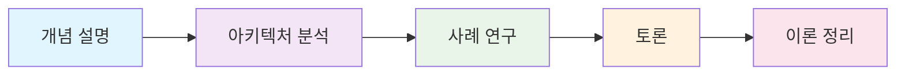
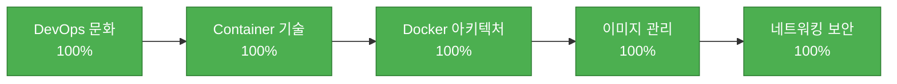
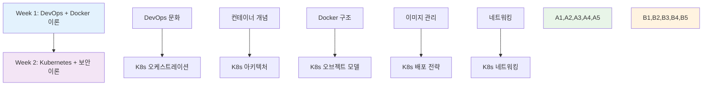

# 📚 Week 1: DevOps 기초 + Docker 이론

**🎯 이론 중심 학습** • **80% 이론 + 20% 개념 예시** • **✅ 완성**

*DevOps 문화와 컨테이너 기술의 이론적 토대 구축*

---

## 🎯 학습 목표

> **KT Cloud 모델 기반 체계적 이론 학습**

| 영역 | 학습 목표 | 성취도 |
|------|-----------|--------|
| 🏢 **DevOps 문화** | 문화와 철학 완전 이해, 조직 변화 방향 파악 | ✅ 100% |
| 📦 **컨테이너 기술** | 이론적 배경과 가상화 기술 발전사 학습 | ✅ 100% |
| 🐳 **Docker 아키텍처** | 핵심 구성 요소 심화 분석 | ✅ 100% |
| 🖼️ **이미지 관리** | 관리 전략과 레지스트리 생태계 이해 | ✅ 100% |
| 🌐 **네트워킹 보안** | 이론적 토대 구축 | ✅ 100% |

## 🌟 학습 방식

**📊 내용 구성**
- 🎓 **이론 80%**: 개념 설명 + 아키텍처 분석
- 💡 **개념 예시 20%**: 간단한 구조 확인용 실습
- 📈 **시각화**: Mermaid, SVG 다이어그램 적극 활용
- 🔗 **실무 연계**: 이론을 실무 프로젝트 설계로 연결 준비

---

## 📅 주간 일정

### 📅 **5일간의 체계적 이론 학습 여정**

#### 🌟 **Day 1** • [DevOps 개념 및 문화](./day_01/README.md) 
> *DevOps 철학과 문화적 변화의 이론적 토대*

<strong>📋 8개 세션 상세 내용</strong>

| 세션 | 주제 | 핵심 키워드 |
|------|------|------------|
| **01** | DevOps란 무엇인가? | 정의, 철학, CALMS 모델 |
| **02** | DevOps 문화와 조직 변화 | 협업, 신뢰, 공유 책임 |
| **03** | 전통적 개발 vs DevOps 개발 | 사일로, 통합, 자동화 |
| **04** | DevOps 도구 생태계 개요 | 툴체인, 통합, 표준화 |
| **05** | 애자일과 DevOps의 관계 | 애자일, 지속적 개선 |
| **06** | CI/CD 파이프라인 개념 | 자동화, 배포, 피드백 |
| **07** | DevOps 성공 사례 분석 | Netflix, Amazon, 성과 |
| **08** | 이론 정리 및 토론 | 종합, 토론, 정리 |

#### 📦 **Day 2** • [컨테이너 기술 이론](./day_02/README.md)
> *가상화 기술 발전사와 컨테이너 아키텍처 심화*

<strong>📋 8개 세션 상세 내용</strong>

| 세션 | 주제 | 핵심 키워드 |
|------|------|------------|
| **01** | 가상화 기술의 역사와 발전 | 물리서버, VM, 컨테이너 |
| **02** | 하이퍼바이저 vs 컨테이너 아키텍처 비교 | Type1/2, 경량화 |
| **03** | Docker 등장 배경과 철학 | 표준화, 이식성 |
| **04** | Linux 네임스페이스와 cgroups 개념 | 격리, 리소스 제어 |
| **05** | 컨테이너 런타임 생태계 분석 | containerd, CRI-O |
| **06** | OCI 표준과 컨테이너 표준화 | 표준, 호환성 |
| **07** | 컨테이너 보안 모델 이론 | 격리, 권한, 스캔 |
| **08** | 컨테이너 기술 토론 및 정리 | 종합, 토론, 정리 |

#### 🐳 **Day 3** • [Docker 개념 및 명령어 체계](./day_03/README.md)
> *Docker CLI 아키텍처와 명령어 구조 이해*

<strong>📋 8개 세션 상세 내용</strong>

| 세션 | 주제 | 핵심 키워드 |
|------|------|------------|
| **01** | Docker CLI 아키텍처 이해 | Client-Server, API |
| **02** | 이미지 관리 명령어 구조 | build, pull, push |
| **03** | 컨테이너 실행 명령어 이론 | run, exec, attach |
| **04** | 컨테이너 상태 관리 이론 | start, stop, restart |
| **05** | 네트워킹 명령어 구조 | network, port |
| **06** | 스토리지 명령어 이론 | volume, mount |
| **07** | 디버깅 명령어 방법론 | logs, inspect, stats |
| **08** | 명령어 체계 종합 및 토론 | 종합, 토론, 정리 |

#### 🖼️ **Day 4** • [Docker 이미지 관리 이론](./day_04/README.md)
> *이미지 레이어 구조와 최적화 전략*

<strong>📋 8개 세션 상세 내용</strong>

| 세션 | 주제 | 핵심 키워드 |
|------|------|------------|
| **01** | 이미지 레이어 아키텍처 분석 | 레이어, 캐시, 재사용 |
| **02** | Dockerfile 설계 원칙 | 베스트 프랙티스 |
| **03** | 이미지 최적화 방법론 | 크기 최적화, 보안 |
| **04** | 멀티 스테이지 빌드 패턴 | 빌드 최적화 |
| **05** | 이미지 태깅 및 버전 관리 전략 | 태깅, 버전 관리 |
| **06** | 레지스트리 생태계 이론 | Docker Hub, ECR |
| **07** | 이미지 보안 모델 이론 | 취약점 스캔 |
| **08** | 이미지 관리 전략 종합 및 토론 | 종합, 토론, 정리 |

#### 🌐 **Day 5** • [Docker 네트워킹 및 전체 아키텍처](./day_05/README.md)
> *네트워킹 모델과 Docker 전체 아키텍처 통합*

<strong>📋 8개 세션 상세 내용</strong>

| 세션 | 주제 | 핵심 키워드 |
|------|------|------------|
| **01** | Docker 네트워킹 모델 이론 | bridge, host, overlay |
| **02** | CNI와 네트워크 드라이버 구조 | CNI, 드라이버 |
| **03** | 스토리지 드라이버 아키텍처 | 스토리지 드라이버 |
| **04** | 볼륨과 바인드 마운트 개념 | 데이터 영속성 |
| **05** | Docker 보안 아키텍처 | 보안 모델, 권한 |
| **06** | 컨테이너 오케스트레이션 개념 | Kubernetes 준비 |
| **07** | Week 1 전체 개념 종합 | 전체 통합 |
| **08** | 이론 총정리 및 Week 2 준비 | 마무리, 다음 준비 |

---

## 📊 학습 성과 및 성취도

### 🏆 **Week 1 완성 성과**

| 영역 | 완성도 | 세부 내용 |
|------|---------|----------|
| 📚 **세션 완성** | ✅ **40/40** | 8세션 × 5일 완전 완성 |
| 🎓 **이론 구성** | ✅ **80%** | 개념 설명 + 아키텍처 분석 |
| 💡 **개념 예시** | ✅ **20%** | 간단한 구조 확인용 실습 |
| 📈 **사례 연구** | ✅ **통합** | Netflix, Amazon 등 성공 사례 |
| 🎯 **KT Cloud 모델** | ✅ **100%** | 체계적 이론 학습 완전 준수 |

### 📈 **이론 이해도 지표**

### 🚀 **실무 연계 준비도**

| 역량 | 준비도 | 비고 |
|------|---------|------|
| 🏢 **아키텍처 설계** | 🟢 90% | 이론적 토대 구축 완료 |
| 🧠 **기술 의사결정** | 🟡 85% | 개념 이해 및 비교 분석 능력 |
| 📈 **사례 분석** | 🟢 90% | 성공 사례 심화 분석 |
| 💼 **취업 준비** | 🟡 80% | 기초 역량 및 면접 대비 |

---

## 🎯 Week 2 준비 상황

### 🔗 **이론적 토대 → Kubernetes 연결**

### 📋 **Week 2 준비 체크리스트**

- [ ] 📚 Week 1 DevOps + Docker 이론 복습
- [ ] 🚀 Kubernetes 기본 개념 예습
- [ ] 🔒 클라우드 보안 기초 개념 예습
- [ ] 🏢 아키텍처 설계 과제 준비
- [ ] 📈 사례 연구 자료 준비

---

## 💡 핵심 개념 총정리

### 🏆 **Week 1에서 배운 5가지 핵심 개념**

| 개념 | 핵심 내용 | Week 2 연결점 |
|------|-----------|-------------|
| 🏢 **DevOps 문화** | 협업, 자동화, 지속적 개선 | → K8s 오케스트레이션 |
| 📦 **컨테이너 기술** | 가상화 진화, 애플리케이션 중심 | → K8s 아키텍처 |
| 🐳 **Docker 아키텍처** | 표준화, 생태계 구축 | → K8s 오브젝트 모델 |
| 🖼️ **이미지 관리** | 빌드 전략, 배포 패턴 | → K8s 배포 전략 |
| 🌐 **네트워킹 보안** | 분산 시스템 설계 원칙 | → K8s 네트워킹 |

---

### 🎉 **Week 1 완성 축하!**

**KT Cloud 모델에 따라 Week 2에서 Kubernetes + 클라우드 보안 이론을 학습합니다!** 🚀

**다음 단계**: [Week 2 - Kubernetes + 클라우드 보안 이론](../week_02/README.md)

