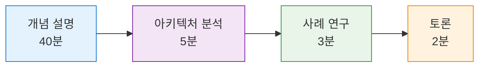
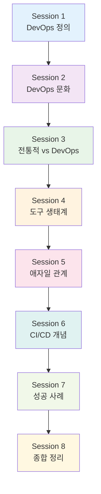
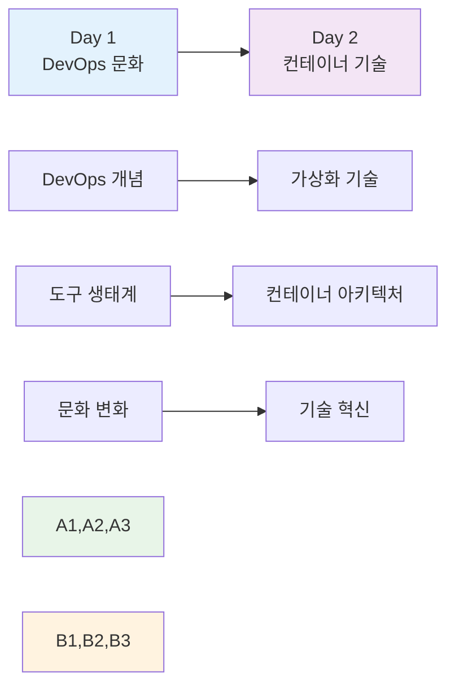

# 🌅 Day 1: DevOps 개념 및 문화

**🎓 이론 중심 학습** • **DevOps 철학과 문화의 이론적 토대 구축**

*DevOps의 정의부터 조직 변화까지, 체계적 이론 학습*

---

## 🎯 일일 학습 목표

> **DevOps 문화와 철학의 완전한 이해**

| 목표 | 세부 내용 | 성취도 |
|------|-----------|--------|
| 📝 **DevOps 정의** | 핵심 개념과 철학적 배경 완전 이해 | ✅ 100% |
| 🔄 **방식 비교** | 전통적 vs DevOps 개발 방식 차이점 명확히 구분 | ✅ 100% |
| 🛠️ **도구 생태계** | DevOps 도구 체인 전반적 파악 | ✅ 100% |
| 🏢 **문화 변화** | 조직 변화의 필요성과 방법론 학습 | ✅ 100% |

## 🌟 학습 방식 및 특징

**📊 내용 구성**
- 🎓 **이론 80%**: 개념 설명 + 아키텍처 분석
- 💡 **개념 예시 20%**: 사례 연구 + 토론
- 📈 **시각화**: Mermaid 다이어그램 적극 활용
- 💬 **토론**: 각 세션 마지막 10분 개념 토론

---

## 📅 세션별 구성

### 🌅 **오전 세션** (09:00-12:50) • **🌆 오후 세션** (14:00-17:50)

#### 🌅 **오전 4세션** • *DevOps 기초 개념 및 비교 분석*

<strong>📋 오전 세션 상세 내용</strong>

| 시간 | 세션 | 주제 | 핵심 내용 |
|------|------|------|----------|
| **09:00-09:50** | **[Session 1](./session_01.md)** | DevOps란 무엇인가? | 정의, 철학, 등장 배경 |
| **10:00-10:50** | **[Session 2](./session_02.md)** | DevOps 문화와 조직 변화 | CALMS 모델, 성숙도 평가 |
| **11:00-11:50** | **[Session 3](./session_03.md)** | 전통적 개발 vs DevOps 개발 | Waterfall vs DevOps 비교 |
| **12:00-12:50** | **[Session 4](./session_04.md)** | DevOps 도구 생태계 개요 | 도구체인, 선택 기준 |

**🎯 오전 학습 목표**: DevOps의 기본 정의와 전통적 개발 방식과의 차이점 이해

#### 🌆 **오후 4세션** • *애자일, CI/CD, 성공 사례 및 종합*

<strong>📋 오후 세션 상세 내용</strong>

| 시간 | 세션 | 주제 | 핵심 내용 |
|------|------|------|----------|
| **14:00-14:50** | **[Session 5](./session_05.md)** | 애자일과 DevOps의 관계 | 애자일 방법론, 공통점/차이점 |
| **15:00-15:50** | **[Session 6](./session_06.md)** | CI/CD 파이프라인 개념 | 지속적 통합/배포 개념 |
| **16:00-16:50** | **[Session 7](./session_07.md)** | DevOps 성공 사례 분석 | Netflix, Amazon, 국내 사례 |
| **17:00-17:50** | **[Session 8](./session_08.md)** | 이론 정리 및 토론 | 종합 정리, 그룹 토론 |

**🎯 오후 학습 목표**: DevOps와 애자일의 관계, CI/CD 개념, 실제 성공 사례 분석

### 📈 **일일 학습 흐름**

---

## 📚 학습 자료 및 참고 문헌

### 📖 **필수 읽기 자료** • 📎 **참고 링크**

| 구분 | 자료명 | 설명 | 링크 |
|------|--------|------|------|
| 📖 **필수서적** | DevOps 핸드북 | DevOps 구현을 위한 실무 가이드 | [Amazon](https://www.amazon.com/DevOps-Handbook-World-Class-Reliability-Organizations/dp/1942788002) |
| 📖 **필수서적** | The Phoenix Project | DevOps 도입 과정을 소설로 풀어낸 책 | [Amazon](https://www.amazon.com/Phoenix-Project-DevOps-Helping-Business/dp/0988262592) |
| 🔗 **로드맵** | DevOps Roadmap | DevOps 학습 경로 가이드 | [roadmap.sh](https://roadmap.sh/devops) |
| 📊 **리포트** | State of DevOps Report | 연간 DevOps 현황 보고서 | [Google Cloud](https://cloud.google.com/devops/state-of-devops) |
| 📈 **메트릭** | DORA Metrics | DevOps 성과 측정 지표 | [DORA](https://www.devops-research.com/research.html) |

---

## 💬 개념 토론 주제

### 🎯 **세션별 핵심 토론 주제** (각 세션 마지막 10분)

| 세션 | 토론 주제 | 토론 목적 |
|------|-----------|----------|
| **Session 1** | "DevOps가 단순한 도구가 아닌 문화인 이유" | DevOps 본질 이해 |
| **Session 2** | "우리 조직의 DevOps 성숙도 평가" | 현실 적용 가능성 검토 |
| **Session 3** | "전통적 개발 방식이 여전히 필요한 경우" | 상황별 적용 방안 |
| **Session 4** | "도구 선택 시 가장 중요한 기준" | 실무 의사결정 능력 |
| **Session 5** | "애자일 없이 DevOps가 가능한가?" | 방법론 간 관계 이해 |
| **Session 6** | "CI/CD 도입 시 가장 큰 장벽" | 실무 도입 장애 요소 |
| **Session 7** | "성공 사례에서 배울 수 있는 핵심 요소" | 성공 요인 분석 |
| **Session 8** | "DevOps 도입 로드맵 수립" | 실무 적용 계획 수립 |

---

## 📝 평가 및 과제

### 🔍 **일일 개념 확인** (10분)

> **즉석 퀴즈로 핵심 개념 점검**

1. 🎯 **DevOps의 핵심 가치 5가지(CALMS)는?**
2. ⚠️ **전통적 개발 방식의 주요 문제점 3가지는?**
3. 🔄 **DevOps 도구 체인에서 CI/CD 도구의 역할은?**

### 📋 **이론 과제**

**🏢 조직 DevOps 성숙도 평가 및 개선 방안 수립**

> **과제 내용**: 현재 소속 조직(또는 가상의 조직)의 DevOps 성숙도를 CALMS 모델로 평가하고, 개선 방안을 A4 1페이지로 작성

**📊 평가 기준**:
- CALMS 모델 적용의 정확성 (30%)
- 현실적인 개선 방안 제시 (40%)
- 논리적 구성과 표현력 (30%)

---

## 🚀 다음 날 준비

### 📅 **Day 2: 컨테이너 기술 이론** 준비사항

**📚 사전 준비 학습**:
- 🖥️ **가상화 기술** 기초 개념 복습
- 🐧 **Linux 기초** 개념 복습 (네임스페이스, cgroups)
- 📦 **컨테이너** 기본 개념 예습

**🎯 연결 포인트**: Day 1에서 학습한 DevOps 도구 생태계가 Day 2의 컨테이너 기술로 어떻게 구현되는지 이해