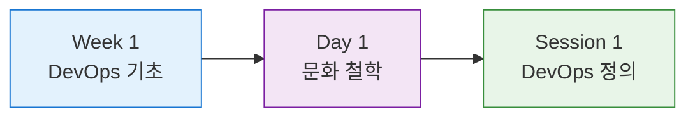
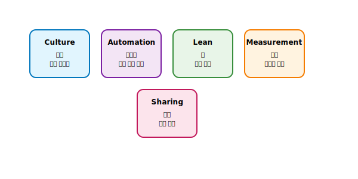
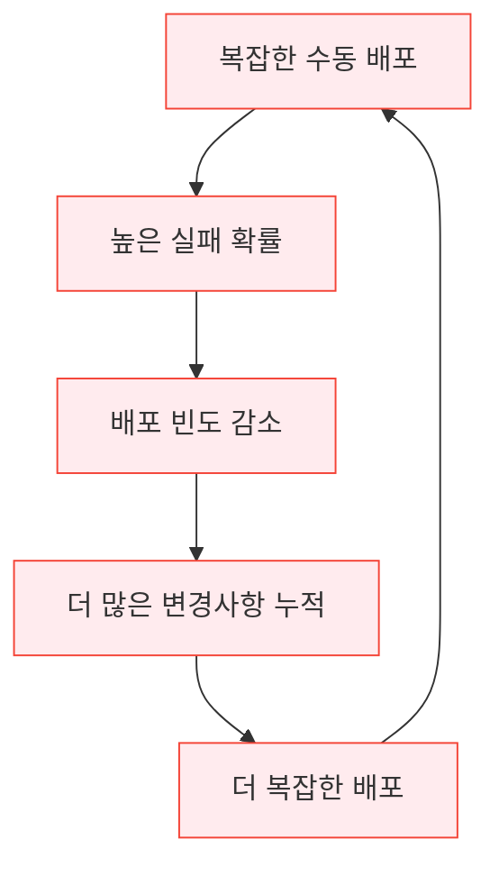

# 🚀 Session 1: DevOps란 무엇인가?

**🎓 DevOps 기초 이론의 시작점** • **📚 전체 과정의 토대**

*DevOps의 정의부터 철학까지, 체계적 이론 학습*

---

## 📍 교과과정 위치

> 🎯 과정에서의 역할: DevOps Engineer 7주 완성 과정의 **첫 번째 세션**으로, 모든 기술적 내용의 기초가 되는 핵심 이론 학습

---

## 🎯 학습 목표

> **50분 세션에서 달성할 5가지 핵심 목표**

| 순서 | 학습 목표 | 예상 소요 시간 | 성취 지표 |
|------|-----------|-------------|----------|
| **1** | DevOps 정의와 핵심 개념 완전 이해 | 18분 | CALMS 모델 설명 가능 |
| **2** | 등장 배경과 비즈니스 필요성 심층 파악 | 20분 | 비즈니스 영향 분석 가능 |
| **3** | 전통적 개발 방식의 구조적 문제점 분석 | 15분 | 사일로 현상 설명 가능 |
| **4** | DevOps 문화 철학과 조직 변화 방향 이해 | 12분 | 성공 사례 분석 가능 |
| **5** | 현대 소프트웨어 개발 패러다임 변화 인식 | 토론 시간 | 미래 전망 제시 가능 |

## 1. DevOps의 정의와 철학적 배경 (18분)

### DevOps = Development + Operations
**DevOps**는 단순한 용어의 결합이 아닌, **소프트웨어 개발과 IT 운영 간의 근본적인 패러다임 변화**를 의미합니다.

#### 정의의 다층적 이해

**🔤 1층: 용어적 정의**
- Development (개발) + Operations (운영)
- 소프트웨어 개발과 IT 운영의 통합
- 협업 문화와 방법론의 결합

**🎯 2층: 철학적 정의**
- 조직 간 사일로 제거
- 공유 책임과 협업 문화
- 지속적 개선과 학습 조직
- 고객 가치 중심의 사고방식

**⚙️ 3층: 실무적 정의**
- 자동화된 소프트웨어 배포 파이프라인
- 인프라스트럭처의 코드화 (IaC)
- 모니터링과 피드백 기반 운영
- 빠른 실패와 신속한 복구 체계

**💼 4층: 비즈니스적 정의**
- 시장 출시 시간 (Time-to-Market) 단축
- 고객 요구사항에 대한 빠른 대응
- 비즈니스 민첩성 (Business Agility) 향상
- 디지털 트랜스포메이션의 핵심 동력

> 핵심 강조: DevOps는 **도구나 기술이 아닌 문화와 철학**입니다. 기술은 이 문화를 구현하는 수단일 뿐입니다.

### DevOps의 철학적 기반

#### 1. 시스템 사고 (Systems Thinking)
전체 시스템의 관점에서 최적화를 추구하는 사고방식:
- 부분 최적화의 한계: 개별 팀의 최적화가 전체 시스템에 미치는 부정적 영향
- 전체 최적화: 전체 가치 스트림의 흐름을 개선
- 피드백 루프: 시스템 내 모든 구성 요소 간의 상호작용 이해
- 제약 이론: 시스템의 병목점을 찾아 전체 성능 향상

#### 2. 증폭 피드백 루프 (Amplify Feedback Loops)
빠르고 지속적인 피드백을 통한 학습과 개선:
- 좌측 이동 (Shift Left): 문제를 개발 초기 단계에서 발견
- 실시간 모니터링: 운영 환경에서의 즉각적인 피드백
- A/B 테스팅: 데이터 기반 의사결정
- 포스트모템 문화: 실패로부터의 학습과 개선

#### 3. 지속적 실험과 학습 문화
실패를 두려워하지 않는 혁신적 조직 문화:
- 실패 허용: 빠른 실패와 빠른 학습 (Fail Fast, Learn Fast)
- 가설 검증: 과학적 방법론을 통한 개선
- 지식 공유: 조직 전체의 학습 능력 향상
- 심리적 안전: 실수를 인정하고 개선할 수 있는 환경

### DevOps의 핵심 가치 체계

#### CALMS 모델 심화 분석
DevOps 성숙도를 측정하는 5가지 핵심 영역:

**1. Culture (문화)**
- 신뢰 기반 협업: 팀 간 투명한 소통과 상호 신뢰
- 공유 책임: 개발부터 운영까지 전체 생명주기에 대한 공동 책임
- 지속적 학습: 실패를 학습 기회로 전환하는 문화
- 고객 중심: 내부 효율성보다 고객 가치 우선

**2. Automation (자동화)**
- 반복 작업 제거: 인적 오류 감소와 일관성 확보
- 배포 자동화: 수동 배포로 인한 위험 제거
- 테스트 자동화: 품질 보증과 빠른 피드백
- 인프라 자동화: Infrastructure as Code (IaC)

**3. Lean (린 사고)**
- 가치 스트림 매핑: 고객 가치 전달 과정의 시각화
- 낭비 제거: 불필요한 프로세스와 대기 시간 제거
- 흐름 최적화: 작업의 연속적 흐름 보장
- 풀 시스템: 수요 기반 작업 진행

**4. Measurement (측정)**
- 메트릭 기반 의사결정: 데이터에 기반한 객관적 판단
- 4가지 핵심 메트릭: 배포 빈도, 리드 타임, 복구 시간, 변경 실패율
- 비즈니스 메트릭: 기술 메트릭과 비즈니스 성과의 연결
- 지속적 개선: 측정 결과를 통한 점진적 개선

**5. Sharing (공유)**
- 지식 공유: 팀 간 경험과 노하우 공유
- 도구 공유: 공통 도구와 플랫폼 사용
- 책임 공유: 성공과 실패에 대한 공동 책임
- 투명성: 모든 정보의 공개와 접근성 보장

## 2. 전통적 개발 방식의 구조적 문제점 심화 분석 (20분)

### 사일로 현상 (Silo Effect)의 근본 원인
**사일로(Silo)**는 곡물 저장고를 의미하며, 조직 내 부서 간 단절과 고립을 나타내는 메타포입니다.

#### 사일로 현상의 다층적 분석
**전통적 조직의 4가지 사일로 현상**

**🏢 조직적 사일로**
- 부서별 독립적 목표 설정
- 서로 다른 성과 지표 (KPI)
- 부서 간 경쟁 구조
- 정보 공유 부족
- 의사결정 권한의 분산

**💻 기술적 사일로**
- 서로 다른 기술 스택
- 호환되지 않는 도구 체계
- 표준화되지 않은 프로세스
- 문서화 부족
- 지식 공유 체계 미비

**👥 문화적 사일로**
- "우리 vs 그들" 사고방식
- 책임 회피 문화
- 변화에 대한 저항
- 학습보다 비난 중심 문화
- 개인 성과 중심 평가

**🔄 프로세스적 사일로**
- 순차적 워터폴 방식
- 긴 승인 프로세스
- 수동적 핸드오프
- 일방향 커뮤니케이션
- 피드백 루프 부재

### 전통적 개발 방식의 구체적 문제점

#### 1. 개발팀 vs 운영팀의 목표 충돌
근본적으로 상반된 목표와 인센티브 구조:

| 측면 | 개발팀 (Development) | 운영팀 (Operations) |
|------|---------------------|--------------------|
| **주요 목표** | 새로운 기능 개발 | 시스템 안정성 유지 |
| **성과 지표** | 기능 완성도, 개발 속도 | 가동 시간, 성능, 보안 |
| **변화에 대한 태도** | 빠른 변화 추구 | 변화 최소화 선호 |
| **위험 인식** | 기능 미완성 위험 | 시스템 장애 위험 |
| **시간 관점** | 단기 릴리스 중심 | 장기 안정성 중심 |
| **책임 범위** | 코드 작성까지 | 배포 후 운영 전체 |

#### 2. 통합 지옥 (Integration Hell)
서로 다른 환경에서 개발된 코드들의 통합 문제:

통합 지옥의 구체적 양상:
- 환경 차이: 개발, 테스트, 스테이징, 운영 환경의 불일치
- 의존성 충돌: 서로 다른 라이브러리 버전 요구사항
- 설정 불일치: 환경별 다른 설정 파일과 환경 변수
- 데이터 불일치: 테스트 데이터와 운영 데이터의 차이
- 타이밍 이슈: 동시성 문제와 경쟁 조건

#### 3. "내 컴퓨터에서는 잘 됐는데..." 현상 심화 분석
환경 불일치로 인한 문제의 구조적 원인:

**"내 컴퓨터에서는 잘 됐는데..." 현상의 4가지 계층**

**💻 하드웨어 계층**
- CPU 아키텍처 차이 (x86 vs ARM)
- 메모리 용량과 성능 차이
- 디스크 I/O 성능 차이
- 네트워크 대역폭과 지연시간 차이

**🖥️ 운영체제 계층**
- OS 종류 차이 (Windows vs Linux vs macOS)
- OS 버전과 패치 수준 차이
- 커널 설정과 보안 정책 차이
- 파일 시스템과 권한 체계 차이

**⚙️ 런타임 계층**
- 언어 런타임 버전 차이 (Java, Python, Node.js)
- 가상머신 설정 차이 (JVM 힙 크기, GC 설정)
- 컴파일러와 인터프리터 차이
- 런타임 라이브러리 버전 차이

**📦 애플리케이션 계층**
- 의존성 라이브러리 버전 차이
- 설정 파일과 환경 변수 차이
- 외부 서비스 연결 설정 차이
- 데이터베이스 스키마와 데이터 차이

#### 4. 배포 공포증 (Deployment Fear)
배포에 대한 두려움이 조직에 미치는 영향:

배포 공포증의 악순환:

배포 공포증의 구체적 증상:
- 금요일 배포 금지: 주말 장애 대응 부담
- 배포 윈도우: 특정 시간대에만 배포 허용
- 배포 동결: 중요한 이벤트 전 배포 중단
- 롤백 계획: 복잡하고 시간 소모적인 롤백 절차
- 배포 후 감시: 24시간 모니터링 체계

### 전통적 방식의 비즈니스 영향

#### 정량적 영향 분석
전통적 개발 방식이 비즈니스에 미치는 구체적 손실:

| 영역 | 전통적 방식 | 비즈니스 영향 |
|------|-------------|---------------|
| **배포 빈도** | 월 1회 또는 분기 1회 | 시장 기회 상실 |
| **리드 타임** | 6개월 ~ 2년 | 경쟁력 저하 |
| **변경 실패율** | 30-50% | 고객 신뢰도 하락 |
| **복구 시간** | 수 시간 ~ 수 일 | 매출 손실 |
| **개발 생산성** | 낮음 | 인력 비용 증가 |
| **품질** | 불안정 | 고객 이탈 |

#### 기회비용 분석
전통적 방식으로 인해 놓치는 비즈니스 기회:
- 시장 출시 지연: 경쟁사 대비 늦은 제품 출시
- 고객 피드백 반영 지연: 고객 요구사항 대응 속도 저하
- 혁신 기회 상실: 실험과 학습 기회 제한
- 인재 유출: 비효율적 프로세스로 인한 개발자 이탈

## 3. DevOps의 필요성과 비즈니스 동력 (15분)

### 디지털 시대의 비즈니스 환경 변화

#### 1. 디지털 트랜스포메이션의 가속화
모든 기업이 소프트웨어 기업이 되어가는 현실:

**산업별 디지털 트랜스포메이션 현황**

**🏦 금융업**
- 모바일 뱅킹과 핀테크 서비스
- 블록체인과 암호화폐
- AI 기반 투자 자문
- 실시간 결제 시스템

**🏢 제조업**
- 스마트 팩토리와 IoT
- 예측 유지보수
- 공급망 최적화
- 맞춤형 생산 시스템

**🛍️ 소매업**
- 옴니채널 커머스
- 개인화 추천 시스템
- 실시간 재고 관리
- AR/VR 쇼핑 경험

**🏥 의료업**
- 원격 진료 시스템
- AI 진단 보조 시스템
- 전자 의료 기록
- 웨어러블 헬스케어

#### 2. 고객 기대치의 급격한 상승
현대 고객들의 새로운 기대 수준:

즉시성 (Immediacy):
- 실시간 응답과 즉시 처리
- 24/7 서비스 가용성
- 지연 시간 최소화

개인화 (Personalization):
- 개별 고객 맞춤 서비스
- 상황 인식 기반 추천
- 학습하는 사용자 인터페이스

완벽성 (Perfection):
- 99.9% 이상의 가용성
- 제로 다운타임 기대
- 완벽한 보안과 프라이버시

혁신성 (Innovation):
- 지속적인 새로운 기능
- 최신 기술 적용
- 차별화된 사용자 경험

#### 3. 경쟁 환경의 변화
전통적 경쟁 구조의 파괴:

진입 장벽의 낮아짐:
- 클라우드 컴퓨팅으로 인한 초기 비용 절감
- 오픈소스 기술의 확산
- API 경제와 플랫폼 생태계

스타트업의 위협:
- 빠른 의사결정과 실행력
- 최신 기술 스택 활용
- 고객 중심의 애자일한 접근

글로벌 경쟁:
- 지리적 경계의 소멸
- 24시간 글로벌 서비스
- 다양한 문화와 요구사항

### DevOps가 제공하는 구체적 해답

#### 1. 속도 (Speed) - 시장 대응력 향상
전통적 방식 대비 획기적인 속도 개선:

| 영역 | 전통적 방식 | DevOps 방식 | 개선 효과 |
|------|-------------|-------------|----------|
| **아이디어 → 배포** | 6개월 ~ 2년 | 1주 ~ 1개월 | 10-50배 단축 |
| **버그 수정** | 1주 ~ 1개월 | 1시간 ~ 1일 | 20-100배 단축 |
| **새 기능 출시** | 분기별 | 일일/주간 | 50-200배 증가 |
| **환경 구성** | 수 일 ~ 수 주 | 수 분 ~ 수 시간 | 100-1000배 단축 |

#### 2. 안정성 (Stability) - 품질과 신뢰성 향상
자동화를 통한 일관성과 품질 보장:

자동화된 품질 보증:
- 코드 품질 자동 검사
- 자동화된 테스트 스위트
- 보안 취약점 자동 스캔
- 성능 테스트 자동화

예측 가능한 배포:
- 동일한 배포 프로세스
- 환경 간 일관성 보장
- 자동화된 롤백 메커니즘
- 카나리 배포와 블루-그린 배포

#### 3. 확장성 (Scalability) - 성장에 대한 대응력
비즈니스 성장에 따른 기술적 확장:

수평적 확장:
- 마이크로서비스 아키텍처
- 컨테이너 기반 배포
- 자동 스케일링
- 로드 밸런싱

수직적 확장:
- 클라우드 네이티브 설계
- 서버리스 아키텍처
- 관리형 서비스 활용
- 인프라 자동화

### DevOps의 비즈니스 가치

#### ROI (Return on Investment) 분석
DevOps 도입의 정량적 효과:

비용 절감 효과:
- 인프라 비용 30-50% 절감
- 운영 인력 20-40% 효율성 향상
- 장애 대응 비용 60-80% 감소
- 개발 생산성 20-30% 향상

매출 증대 효과:
- 시장 출시 시간 50-90% 단축
- 고객 만족도 20-40% 향상
- 새로운 비즈니스 기회 창출
- 경쟁 우위 확보

#### 조직 문화의 변화
DevOps가 가져오는 조직적 혜택:

직원 만족도 향상:
- 반복 작업 자동화로 인한 창의적 업무 집중
- 빠른 피드백을 통한 성취감 증대
- 학습과 성장 기회 확대
- 협업을 통한 팀워크 강화

혁신 문화 조성:
- 실험과 학습을 장려하는 환경
- 실패를 두려워하지 않는 문화
- 지속적 개선 마인드셋
- 고객 중심 사고방식

## 4. DevOps 성공 사례 심화 분석 (12분)

### 글로벌 리더들의 DevOps 전환 사례

#### Netflix: 스트리밍 서비스의 DevOps 혁명
Netflix의 DevOps 아키텍처와 성과:

**Netflix DevOps 성과 지표**

**🚀 배포 성능**
- 일일 배포 횟수: **4,000회 이상**
- 자동화된 배포 비율: **95%**
- 배포 실패율: **0.1% 미만**
- 롤백 시간: **평균 2분 이내**

**🏠 아키텍처 특징**
- 마이크로서비스: **700개 이상**의 독립 서비스
- 컨테이너 인스턴스: **100만개 이상** 동시 실행
- 다중 리전 배포: **3개 대륙, 15개 리전**
- 자동 장애 대응: **Chaos Engineering** 적용

**📊 비즈니스 성과**
- 글로벌 사용자: **2억 명 이상**
- 일일 스트리밍 시간: **10억 시간 이상**
- 서비스 가용성: **99.99%**
- 시장 점유율: **전 세계 1위**

Netflix의 핵심 DevOps 전략:
- Freedom & Responsibility: 개발자에게 완전한 자율성 부여
- You Build It, You Run It: 개발팀이 운영까지 책임
- Chaos Engineering: 의도적 장애 주입으로 시스템 강화
- Data-Driven Decisions: 모든 의사결정을 데이터로 검증

#### Amazon: 전자상거래의 DevOps 혁신
Amazon의 DevOps 전환과 성과:

**Amazon DevOps 성과 지표**

**🚀 배포 성능**
- 배포 빈도: **11.7초마다 1회**
- 연간 배포 횟수: **2,700만회 이상**
- 자동화 비율: **99%**
- 평균 복구 시간: **1분 이내**

**🏢 조직 구조**
- Two-Pizza Teams: **8-12명**의 소규모 자율팀
- 전체 서비스 수: **1,000개 이상**
- 마이크로서비스 아키텍처: **100% 적용**
- 전사 DevOps 엔지니어: **10,000명 이상**

**📊 비즈니스 성과**
- 연간 매출: **5,000억 달러 이상**
- 클라우드 시장 점유율: **32% (AWS)**
- 전 세계 직원 수: **150만명 이상**
- 시가총액: **1조 달러 이상**

Amazon의 핵심 DevOps 원칙:
- Customer Obsession: 고객 중심의 모든 의사결정
- Ownership: 장기적 사고와 책임감
- Invent and Simplify: 지속적 혁신과 단순화
- Learn and Be Curious: 학습과 호기심 기반 성장

#### Google: 검색엔진의 DevOps 진화
Google의 SRE(Site Reliability Engineering) 모델:

**Google SRE 모델의 핵심 원칙**

**🎯 SLI/SLO/SLA 체계**
- **SLI** (Service Level Indicators): 서비스 성능 지표
- **SLO** (Service Level Objectives): 서비스 목표 수준
- **SLA** (Service Level Agreements): 고객과의 약정

**📊 Error Budget 개념**
- 허용 가능한 오류 범위 정의
- 신기능 출시 vs 안정성 균형
- 데이터 기반 의사결정
- 지속적 개선 동기 부여

**⚙️ Toil 제거**
- 반복적 수동 작업 식별
- 자동화 우선순위 결정
- 엔지니어링 시간 확보
- 시스템 신뢰성 향상

### 국내 기업의 DevOps 성공 사례

#### 네이버: 한국의 DevOps 선도기업
네이버의 DevOps 전환 성과:
- 일일 배포 횟수: 1,000회 이상
- 마이크로서비스 수: 300개 이상
- 컨테이너 기반 인프라: 100% 전환
- 자동화된 CI/CD 파이프라인: 95% 이상

#### 쿠팡: 이커머스의 DevOps 혁신
쿠팡의 DevOps 도입 성과:
- 배포 시간 단축: 4시간 → 10분
- 서비스 가용성: 99.9% 이상
- 개발 생산성: 40% 향상
- 장애 대응 시간: 80% 단축

### DevOps 성공 요인 분석

#### 공통 성공 요인
성공한 DevOps 전환의 공통 패턴:

1. 리더십과 문화 변화:
- 경영진의 강력한 지지와 투자
- 실패를 허용하는 학습 문화
- 지속적 개선에 대한 조직적 커미트먼트

2. 기술적 우수성:
- 자동화 우선 사고방식
- 마이크로서비스 아키텍처 전환
- 클라우드 네이티브 기술 적극 도입

3. 데이터 중심 의사결정:
- 모든 의사결정을 메트릭으로 검증
- 실시간 모니터링과 알림 체계
- A/B 테스트와 실험 기반 개선

4. 점진적 전환 전략:
- 작은 팀부터 시작하여 점진적 확산
- 성공 사례를 통한 조직 내 확산
- 지속적 교육과 역량 개발

## 5. 이론 정리 및 토론 (10분)

### 핵심 개념 요약
오늘 학습한 DevOps의 핵심 내용:

#### DevOps의 본질
1. 문화와 철학: 도구가 아닌 사고방식의 변화
2. 시스템 사고: 전체 최적화를 위한 통합적 접근
3. 지속적 개선: 측정과 피드백을 통한 진화
4. 고객 가치: 기술적 우수성을 비즈니스 성과로 연결

#### 전통적 방식의 한계
1. 사일로 현상: 조직 간 단절과 경쟁 구조
2. 통합 지옥: 환경 불일치로 인한 문제
3. 배포 공포증: 복잡한 수동 프로세스의 악순환
4. 비즈니스 영향: 속도, 품질, 비용 측면의 경쟁력 저하

#### DevOps의 비즈니스 가치
1. 속도: 시장 대응력과 경쟁 우위 확보
2. 안정성: 자동화를 통한 품질과 신뢰성 향상
3. 확장성: 비즈니스 성장에 따른 기술적 대응력
4. 혁신: 실험과 학습을 통한 지속적 개선

### 그룹 토론: DevOps 도입 전략 수립
토론 주제와 가이드라인:

#### 토론 1: 현재 조직 진단 (5분)
다음 질문들을 바탕으로 현재 조직의 DevOps 성숙도를 평가해보세요:

1. 문화 측면:
   - 개발팀과 운영팀 간 협업 수준은?
   - 실패에 대한 조직의 태도는?
   - 지속적 학습과 개선 문화가 있는가?

2. 기술 측면:
   - 현재 배포 빈도와 자동화 수준은?
   - 모니터링과 로깅 체계가 구축되어 있는가?
   - 인프라스트럭처의 코드화 수준은?

3. 프로세스 측면:
   - 개발부터 배포까지의 리드 타임은?
   - 변경 사항에 대한 승인 프로세스는?
   - 장애 발생 시 대응 체계는?

#### 토론 2: DevOps 도입 장애물 및 해결방안 (5분)
예상되는 장애물과 대응 전략을 논의해보세요:

1. 조직적 장애물:
   - 기존 조직 문화와의 충돌
   - 변화에 대한 저항
   - 역량 부족과 교육 필요성

2. 기술적 장애물:
   - 레거시 시스템과의 통합
   - 보안과 컴플라이언스 요구사항
   - 기술 부채와 인프라 현대화

3. 비즈니스 장애물:
   - ROI 입증과 비용 정당화
   - 단기 성과에 대한 압박
   - 고객 영향과 서비스 중단 위험

---

## 🔄 다음 세션 예고

**Session 2: DevOps 문화와 조직 변화**에서는 DevOps 도입을 위한 구체적인 조직 변화 전략과 문화 혁신 방법론을 심층 학습합니다.

---

## 📚 참고 자료

### 📖 필수 도서
- [The DevOps Handbook - Gene Kim](https://itrevolution.com/the-devops-handbook/)
- [Google SRE Book](https://sre.google/sre-book/table-of-contents/)

### 🌐 온라인 리소스
- [DevOps Institute - What is DevOps?](https://devopsinstitute.com/what-is-devops/)
- [State of DevOps Report 2023](https://cloud.google.com/devops/state-of-devops/)
- [Atlassian DevOps Guide](https://www.atlassian.com/devops)
- [DORA Metrics](https://www.devops-research.com/research.html)
- [CALMS Framework](https://www.atlassian.com/devops/frameworks/calms-framework)

### 🏢 기업 기술 블로그
- [Netflix Technology Blog](https://netflixtechblog.com/)
- [Amazon Builders' Library](https://aws.amazon.com/builders-library/)
- [DevOps Culture Transformation](https://cloud.google.com/architecture/devops/devops-culture-transforming)

---

*본 세션은 DevOps의 이론적 토대를 구축하는 핵심 학습 과정입니다.*