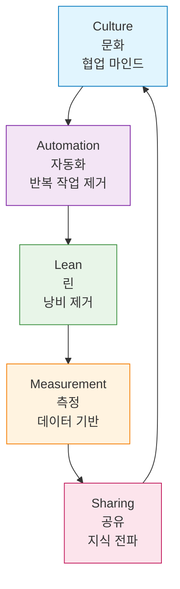

# Session 2: DevOps 문화와 조직 변화의 심층 분석

## 📍 교과과정에서의 위치
이 세션은 **Week 1 > Day 1 > Session 2**로, Session 1에서 학습한 DevOps의 기본 개념을 바탕으로 DevOps 도입의 핵심인 조직 문화 변화를 심층 분석합니다. 기술적 구현보다 더 중요한 문화적 전환의 이론적 기반과 실무 적용 방법론을 완전히 이해합니다.

## 학습 목표 (5분)
- DevOps 문화 변화의 철학적 배경과 심리학적 원리 완전 이해
- 조직 변화 관리의 이론적 프레임워크와 실무 적용 방법론 학습
- 사일로 문화 해체의 구조적 접근법과 단계별 전략 수립
- 협업 문화 구축의 과학적 방법론과 측정 체계 습득
- 문화 변화의 저항 요인 분석과 극복 전략 개발

## 1. DevOps 문화 변화의 철학적 기반과 심리학적 원리 (22분)

### 문화 변화의 근본적 필요성
**DevOps에서 문화가 기술보다 중요한 이유에 대한 심층 분석:**

#### 문화 우선주의의 과학적 근거
**MIT Sloan의 연구 결과에 따르면**, DevOps 성공에 영향을 미치는 요인들의 중요도는 다음과 같습니다:

```
DevOps 성공 요인 분석 (MIT Sloan 연구 기반):

📊 문화적 요인 (60%)
   🔹 심리적 안전감 (Psychological Safety): 25%
      • 실패에 대한 학습 지향적 접근
      • 오픈 커뮤니케이션 문화
      • 비난 없는 사후 분석 (Blameless Postmortem)
      • 실험과 혁신을 장려하는 환경
   
   🔹 학습 지향 문화 (Learning Culture): 15%
      • 지속적 개선 마인드셋
      • 지식 공유와 멘토링
      • 실패를 통한 학습 기회 창출
      • 개인 성장과 역량 개발 지원
   
   🔹 협업 의식 (Collaboration Mindset): 10%
      • 사일로 문화 해체
      • 크로스 펑셔널 팀워크
      • 공동 목표와 KPI 설정
      • 의사결정 과정의 투명성
   
   🔹 변화 수용성 (Change Readiness): 5%
      • 애자일 마인드셋 채택
      • 불확실성에 대한 적응력
      • 새로운 기술과 방법론 수용
      • 지속적 변화에 대한 긍정적 태도
   
   🔹 신뢰 기반 관계 (Trust-based Relationships): 5%
      • 팀 간 상호 신뢰 구축
      • 투명한 의사소통
      • 약속과 책임의 이행
      • 갈등 해결 메커니즘

⚙️ 프로세스 요인 (25%)
   🔹 워크플로우 최적화: 10%
      • 가치 스트림 매핑과 최적화
      • 병목 지점 식별 및 해결
      • 자동화 가능한 프로세스 식별
      • 표준화된 작업 절차 수립
   
   🔹 의사결정 프로세스: 8%
      • 데이터 기반 의사결정 체계
      • 권한 위임과 자율성 보장
      • 빠른 의사결정을 위한 구조
      • 피드백 루프 기반 조정
   
   🔹 피드백 루프: 4%
      • 고객 피드백 수집 체계
      • 내부 팀 간 피드백 메커니즘
      • 실시간 모니터링과 알림
      • 지속적 개선 사이클
   
   🔹 품질 관리 프로세스: 3%
      • 자동화된 테스트 전략
      • 코드 리뷰 프로세스
      • 품질 게이트 설정
      • 결함 예방 중심 접근

💻 기술적 요인 (15%)
   🔹 자동화 도구: 8%
      • CI/CD 파이프라인 구축
      • 인프라 자동화 (IaC)
      • 테스트 자동화
      • 모니터링 자동화
   
   🔹 모니터링 시스템: 4%
      • 애플리케이션 성능 모니터링
      • 인프라 모니터링
      • 로그 관리 시스템
      • 알림 및 대시보드
   
   🔹 인프라 기술: 3%
      • 클라우드 플랫폼 활용
      • 컨테이너 기술
      • 마이크로서비스 아키텍처
      • API 기반 통합
```

#### 문화 변화의 심리학적 배경
**조직 심리학 관점에서 본 DevOps 문화 변화의 필요성:**

**1. 인지 부조화 이론 (Cognitive Dissonance Theory)**
- **기존 신념**: "개발과 운영은 별개의 영역이다"
- **새로운 현실**: "빠른 배포와 안정적 운영이 동시에 필요하다"
- **해결 방안**: 협업을 통한 공동 책임 문화 구축

**2. 사회 정체성 이론 (Social Identity Theory)**
- **기존 정체성**: 개발자 vs 운영자의 대립 구조
- **새로운 정체성**: DevOps 엔지니어로서의 통합된 역할
- **변화 과정**: 공동 목표 설정과 성공 경험 공유

**3. 학습 조직 이론 (Learning Organization Theory)**
- **개인 학습**: 새로운 기술과 방법론 습득
- **팀 학습**: 협업을 통한 집단 지성 발휘
- **조직 학습**: 실패와 성공 경험의 체계적 축적

### CALMS 모델 심화 분석



#### 1. Culture (문화) - 심리적 안전감의 구축
**Google Project Aristotle 연구 결과를 바탕으로 한 심리적 안전감의 중요성:**

```
심리적 안전감 (Psychological Safety):

Amy Edmondson의 정의:
   🔹 "팀 내에서 대인관계 위험을 감수하는 것이 안전하다고 믿는 공유된 신념"
   🔹 실수나 실패에 대한 두려움 없이 의견 표현
   🔹 질문, 우려, 아이디어 공유의 자유
   🔹 무시나 처벌에 대한 두려움 없음
   🔹 개인 이미지나 지위 위협 없이 자신 표현

DevOps에서의 중요성:
   🔹 실패를 학습 기회로 전환하는 기반
   🔹 혁신과 창의성의 전제 조건
   🔹 빠른 피드백과 개선의 촉진 요인
   🔹 팀 성과 향상의 핵심 동력
   🔹 변화 수용성 증대의 기반
   🔹 지속적 개선 문화의 토대
```

#### 2. Automation (자동화) - 인간 오류 제거와 일관성 확보
**자동화는 단순한 효율성 향상을 넘어 문화 변화의 촉매제 역할:**

```
자동화의 다차원적 가치:

기술적 가치:
   🔹 빌드 자동화 (Build Automation):
      • 소스 코드에서 실행 가능한 소프트웨어로의 일관된 변환
      • 컴파일, 테스트, 패키징 전 과정 자동화
      • 의존성 관리 자동화
      • 코드 품질 검사 자동화
      • 보안 취약점 스캔 자동화
      • 아티팩트 생성 및 배포 준비
   🔹 테스트 자동화 (Test Automation):
      • 단위 테스트 자동 실행
      • 통합 테스트 자동화
      • 성능 테스트 자동화
      • 보안 테스트 자동화
      • 사용자 인터페이스 테스트 자동화
      • 회귀 테스트 자동화
   🔹 배포 자동화 (Deployment Automation):
      • 인간 실수 제거로 인한 안정성 향상
      • 일관된 배포 프로세스 보장
      • 빠른 배포와 롤백 가능
      • 환경 간 일관성 보장
      • 배포 이력 추적 및 감사
      • 자동 모니터링 및 알림
   🔹 인프라 자동화 (Infrastructure Automation):
   🔹 Infrastructure as Code (IaC)
   🔹 자동 프로비저닝 및 설정
   🔹 자동 스케일링 및 로드 밸런싱
   🔹 자동 백업 및 복구
   🔹 자동 보안 정책 적용
   🔹 자동 비용 최적화

문화적 가치:
   🔹 신뢰 구축: 일관된 결과로 인한 예측 가능성
   🔹 협업 촉진: 공통 도구와 프로세스 사용
   🔹 학습 기회: 자동화로 인한 여유 시간 확보
   🔹 심리적 안전: 실수 위험 감소로 인한 도전 의지 증대
   🔹 성취감: 반복 작업 제거로 인한 창의적 업무 집중
```

#### 3. Lean (린) - 가치 스트림 최적화
**Toyota Production System에서 유래된 린 사고의 DevOps 적용:**

```
린 사고의 DevOps 적용:

가치 스트림 매핑 (Value Stream Mapping):
   🔹 고객 요구사항부터 가치 전달까지의 전체 흐름 시각화
   🔹 각 단계별 리드 타임과 대기 시간 측정
   🔹 부가가치 활동과 비부가가치 활동 구분
   🔹 병목 지점 식별 및 개선 우선순위 결정
   🔹 플로우 효율성 측정 및 개선
   🔹 지속적 가치 스트림 최적화

8가지 낭비 요소 (8 Wastes) 제거:
   🔹 과쟉생산 (Overproduction): 필요 이상의 기능 개발
   🔹 대기 (Waiting): 승인, 검토, 배포 대기 시간
   🔹 운송 (Transportation): 팀 간 핸드오프 및 정보 전달
   🔹 과도한 처리 (Over-processing): 불필요한 문서화나 절차
   🔹 재고 (Inventory): 완료되었지만 배포되지 않은 기능
   🔹 움직임 (Motion): 비효율적인 의사소통이나 정보 탐색
   🔹 결함 (Defects): 버그, 오류, 재작업
   🔹 미활용 인재 (Unused Talent): 직원의 창의성과 역량 미활용

린 원칙의 DevOps 적용:
   🔹 풀 시스템 (Pull System): 수요 기반 작업 진행
   🔹 지속적 플로우 (Continuous Flow): 작업의 연속적 흐름
   🔹 완벽성 추구 (Perfection): 지속적 개선 마인드셋
   🔹 고객 가치 중심: 내부 효율성보다 고객 만족도 우선
   🔹 시각적 관리: 칸반, 대시보드를 통한 투명한 상태 공유
```

#### 4. Measurement (측정) - 데이터 기반 의사결정 문화
**"You can't improve what you don't measure" - Peter Drucker**

```
DevOps 측정 체계:

4가지 핵심 메트릭 (DORA Metrics):
   🔹 배포 빈도 (Deployment Frequency):
      • 정의: 운영 환경에 코드를 배포하는 빈도
      • 측정 방법: 일일, 주간, 월간 배포 횟수
      • 벤치마크: 엘리트 조직 일일 여러 번, 일반 조직 월 1회 이하
      • 비즈니스 영향: 빠른 시장 대응력, 고객 요구 반영 속도
      • 개선 방향: CI/CD 파이프라인 자동화, 배포 프로세스 단순화
   🔹 리드 타임 (Lead Time for Changes):
      • 정의: 코드 커밋부터 운영 환경 배포까지의 소요 시간
      • 측정 방법: 커밋 시점부터 배포 완료까지의 시간
      • 벤치마크: 엘리트 조직 1시간 이내, 일반 조직 1주-6개월
      • 비즈니스 영향: 시장 기회 포착 능력, 경쟁 우위 확보
      • 개선 방향: 배치 크기 최소화, 자동화 수준 향상
   🔹 변경 실패율 (Change Failure Rate):
      • 정의: 배포 후 서비스 장애나 롤백을 요구하는 변경의 비율
      • 측정 방법: (실패한 배포 수 / 전체 배포 수) × 100
      • 벤치마크: 엘리트 조직 0-15%, 일반 조직 46-60%
      • 비즈니스 영향: 서비스 안정성, 고객 신뢰도
      • 개선 방향: 테스트 자동화, 카나리 배포, 모니터링 강화
   🔹 복구 시간 (Mean Time to Recovery):
   🔹 정의: 서비스 장애 발생부터 정상 서비스 복구까지의 시간
   🔹 측정 방법: 장애 감지부터 완전 복구까지의 평균 시간
   🔹 벤치마크: 엘리트 조직 1시간 이내, 일반 조직 1주-1개월
   🔹 비즈니스 영향: 서비스 가용성, 매출 손실 최소화
   🔹 개선 방향: 자동 모니터링, 자가 치유, 장애 대응 자동화
```

#### 5. Sharing (공유) - 지식 공유와 학습 조직
**Peter Senge의 학습 조직 이론을 DevOps에 적용:**

```
DevOps 지식 공유 체계:

지식 공유 (Knowledge Sharing):
   🔹 명시적 지식 (Explicit Knowledge):
      • 기술 문서화: API 문서, 아키텍처 가이드, 운영 매뉴얼
      • 프로세스 문서화: 배포 가이드, 장애 대응 절차, 보안 정책
      • 베스트 프랙티스: 코딩 표준, 리뷰 가이드라인, 테스트 전략
      • 런북 및 플레이북: 실습 가이드, 트러블슈팅 가이드
      • 지식 베이스: FAQ, 위키, 지식 데이터베이스
   🔹 암묵적 지식 (Tacit Knowledge):
      • 멘토링 프로그램: 신입 직원 온보딩, 역량 개발
      • 페어 프로그래밍: 지식 전수와 협업 기술 향상
      • 크로스 트레이닝: 다른 팀의 역할과 책임 이해
      • 사내 컨퍼런스: 경험 공유와 네트워킹
      • 커뮤니티 오브 프랙티스: 사내 기술 커뮤니티 운영
   🔹 도구 및 플랫폼 공유:
   🔹 공통 개발 환경: IDE, 빌드 도구, 테스트 프레임워크
   🔹 공통 운영 플랫폼: 모니터링, 로깅, 알림 시스템
   🔹 공통 보안 도구: 취약점 스캔, 접근 제어, 암호화
   🔹 공통 협업 도구: 채팅, 영상회의, 프로젝트 관리
   🔹 공통 데이터 플랫폼: 메트릭, 대시보드, 리포팅
```

## 2. 조직 변화 관리 (15분)

### Conway's Law
> "조직의 구조는 그 조직이 설계하는 시스템의 구조를 결정한다"

이는 **조직 구조와 시스템 아키텍처가 반드시 일치**해야 함을 의미합니다.

### 전통적 조직 구조의 문제
```
[개발팀] → [QA팀] → [운영팀] → [보안팀]
   ↓         ↓        ↓         ↓
 기능 개발   품질 검증  배포 관리  보안 검토
```

### DevOps 조직 구조
```
[Cross-functional Team]
- 개발자
- 운영 엔지니어  
- QA 엔지니어
- 보안 전문가
```

### 변화 관리 전략
성공적인 DevOps 도입을 위한 **필수 전략**:
1. **점진적 도입**: Big Bang이 아닌 단계적 접근
2. **챔피언 육성**: DevOps 전도사 양성
3. **성공 사례 공유**: 작은 성공을 확산
4. **교육과 훈련**: 지속적인 역량 개발

## 3. DevOps 도입 장애물과 해결책 (8분)

### 주요 장애물
1. **문화적 저항**: "우리는 항상 이렇게 해왔어"
2. **기술적 부채**: 레거시 시스템
3. **스킬 부족**: 새로운 도구와 방법론
4. **조직 정치**: 부서 간 이해관계

### 해결책
1. **경영진 지원**: Top-down 의지
2. **교육 투자**: 지속적인 학습 문화
3. **도구 표준화**: 공통 플랫폼 구축
4. **인센티브 정렬**: 협업을 장려하는 평가 체계

## 실습: DevOps 성숙도 평가 (7분)

### 체크리스트
- [ ] 개발과 운영팀이 공통 목표를 가지고 있는가?
- [ ] 배포 프로세스가 자동화되어 있는가?
- [ ] 실패 시 비난보다 학습에 집중하는가?
- [ ] 메트릭을 기반으로 의사결정하는가?
- [ ] 지식 공유가 활발한가?

### 토론
- 현재 조직의 DevOps 성숙도는?
- 가장 큰 장애물은 무엇인가?

## 다음 세션 예고
전통적 개발 방식과 DevOps 개발 방식을 구체적으로 비교해보겠습니다.

## 📚 참고 자료
- [CALMS Framework - DevOps Institute](https://devopsinstitute.com/calms/)
- [The Phoenix Project](https://itrevolution.com/the-phoenix-project/)
- [Conway's Law](https://www.melconway.com/Home/Conways_Law.html)
- [DevOps Culture - Atlassian](https://www.atlassian.com/devops/what-is-devops/devops-culture)