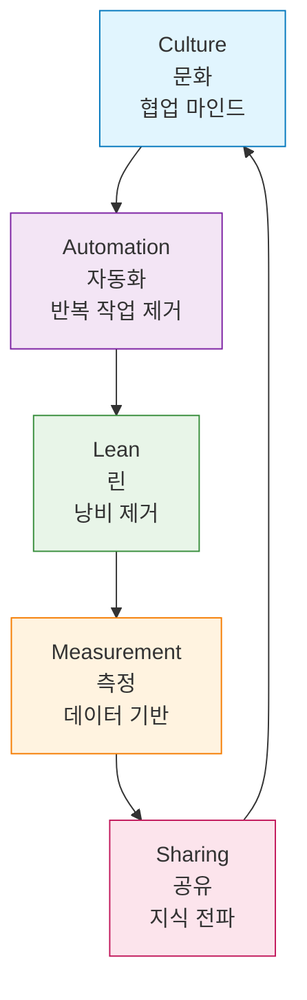

# Session 2: DevOps 문화와 조직 변화

## 📍 교과과정에서의 위치
이 세션은 **Week 1 > Day 1 > Session 2**로, DevOps의 기술적 측면보다 문화적 측면에 중점을 둡니다. DevOps 도입의 성공을 좌우하는 가장 중요한 요소인 조직 문화와 변화 관리를 학습합니다.

## 학습 목표 (5분)
- DevOps 문화의 핵심 요소 이해
- 조직 변화 관리 방법 학습
- DevOps 도입 시 고려사항 파악

## 1. DevOps 문화의 핵심 요소 (20분)

### CALMS 모델



### 1. Culture (문화)
- **신뢰와 투명성**: 실패를 학습 기회로 인식
- **책임 공유**: "우리의 문제"라는 마인드
- **지속적 개선**: 작은 변화의 누적

### 2. Automation (자동화)
- **빌드 자동화**: 코드 → 실행 가능한 소프트웨어
- **테스트 자동화**: 품질 보장
- **배포 자동화**: 인간의 실수 최소화

### 3. Lean (린)
- **가치 중심**: 고객에게 가치를 제공하는 활동에 집중
- **낭비 제거**: 불필요한 프로세스 제거
- **빠른 피드백**: 짧은 주기의 반복

### 4. Measurement (측정)
- **메트릭 기반 의사결정**: 감이 아닌 데이터
- **성과 지표**: MTTR, MTBF, 배포 빈도 등
- **지속적 모니터링**: 실시간 시스템 상태 파악

### 5. Sharing (공유)
- **지식 공유**: 문서화, 위키, 교육
- **도구 공유**: 공통 플랫폼 사용
- **경험 공유**: 포스트모템, 회고

## 2. 조직 변화 관리 (15분)

### Conway's Law
> "조직의 구조는 그 조직이 설계하는 시스템의 구조를 결정한다"

### 전통적 조직 구조의 문제
```
[개발팀] → [QA팀] → [운영팀] → [보안팀]
   ↓         ↓        ↓         ↓
 기능 개발   품질 검증  배포 관리  보안 검토
```

### DevOps 조직 구조
```
[Cross-functional Team]
- 개발자
- 운영 엔지니어  
- QA 엔지니어
- 보안 전문가
```

### 변화 관리 전략
1. **점진적 도입**: Big Bang이 아닌 단계적 접근
2. **챔피언 육성**: DevOps 전도사 양성
3. **성공 사례 공유**: 작은 성공을 확산
4. **교육과 훈련**: 지속적인 역량 개발

## 3. DevOps 도입 장애물과 해결책 (8분)

### 주요 장애물
1. **문화적 저항**: "우리는 항상 이렇게 해왔어"
2. **기술적 부채**: 레거시 시스템
3. **스킬 부족**: 새로운 도구와 방법론
4. **조직 정치**: 부서 간 이해관계

### 해결책
1. **경영진 지원**: Top-down 의지
2. **교육 투자**: 지속적인 학습 문화
3. **도구 표준화**: 공통 플랫폼 구축
4. **인센티브 정렬**: 협업을 장려하는 평가 체계

## 실습: DevOps 성숙도 평가 (7분)

### 체크리스트
- [ ] 개발과 운영팀이 공통 목표를 가지고 있는가?
- [ ] 배포 프로세스가 자동화되어 있는가?
- [ ] 실패 시 비난보다 학습에 집중하는가?
- [ ] 메트릭을 기반으로 의사결정하는가?
- [ ] 지식 공유가 활발한가?

### 토론
- 현재 조직의 DevOps 성숙도는?
- 가장 큰 장애물은 무엇인가?

## 다음 세션 예고
전통적 개발 방식과 DevOps 개발 방식을 구체적으로 비교해보겠습니다.

## 📚 참고 자료
- [CALMS Framework - DevOps Institute](https://devopsinstitute.com/calms/)
- [The Phoenix Project](https://itrevolution.com/the-phoenix-project/)
- [Conway's Law](https://www.melconway.com/Home/Conways_Law.html)
- [DevOps Culture - Atlassian](https://www.atlassian.com/devops/what-is-devops/devops-culture)