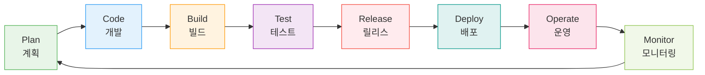

# Session 3: 전통적 개발 vs DevOps 개발

## 📍 교과과정에서의 위치
이 세션은 **Week 1 > Day 1 > Session 3**으로, 전통적 개발 방식과 DevOps 개발 방식의 차이점을 구체적으로 비교 분석합니다. 이를 통해 DevOps 도입의 필요성과 장점을 명확히 이해할 수 있습니다.

## 학습 목표 (5분)
- 전통적 개발 방식의 특징과 한계 이해
- DevOps 개발 방식의 장점 파악
- 두 방식의 구체적 차이점 비교

## 1. 전통적 개발 방식 (Waterfall) (15분)

### 특징

### 주요 특징
1. **순차적 진행**: 이전 단계 완료 후 다음 단계 진행
2. **문서 중심**: 상세한 문서 작성 필수
3. **변경 어려움**: 요구사항 변경 시 큰 비용
4. **늦은 통합**: 개발 완료 후 통합 테스트

### 문제점
- **긴 개발 주기**: 시장 변화에 대응 어려움
- **높은 위험**: 마지막에 모든 것이 통합되면서 문제 발생
- **고객 피드백 지연**: 완성품을 보기까지 오랜 시간
- **팀 간 단절**: 각 단계별로 다른 팀이 담당

## 2. DevOps 개발 방식 (20분)

### DevOps 개발 방식

### 핵심 원칙
1. **지속적 통합(CI)**: 코드 변경 시 자동 빌드/테스트
2. **지속적 배포(CD)**: 자동화된 배포 파이프라인
3. **빠른 피드백**: 짧은 주기의 반복
4. **협업 문화**: 개발과 운영의 통합

### 주요 실천 방법
- **작은 배치 크기**: 작은 단위의 변경사항
- **자동화**: 빌드, 테스트, 배포 자동화
- **모니터링**: 실시간 시스템 상태 파악
- **빠른 복구**: 문제 발생 시 신속한 롤백

## 3. 구체적 비교 (8분)

### 배포 주기 비교
| 구분 | 전통적 방식 | DevOps 방식 |
|------|-------------|-------------|
| 배포 주기 | 3-6개월 | 일/주 단위 |
| 배포 크기 | 대규모 | 소규모 |
| 위험도 | 높음 | 낮음 |
| 롤백 시간 | 수일-수주 | 분-시간 |

### 팀 구조 비교
**전통적 방식**
- 개발팀 → QA팀 → 운영팀 (순차적)
- 각 팀별 다른 목표와 KPI
- 책임 전가 문화

**DevOps 방식**
- 크로스 펑셔널 팀 (통합)
- 공통 목표와 KPI
- 공동 책임 문화

## 실습: 시나리오 분석 (7분)

### 시나리오
"고객이 새로운 기능을 요청했습니다. 경쟁사가 유사한 기능을 출시할 예정이라 빠른 대응이 필요합니다."

### 그룹 토론
1. **전통적 방식**으로 대응한다면?
2. **DevOps 방식**으로 대응한다면?
3. 각각의 장단점은?

### 발표 및 토론 (5분)

## 다음 세션 예고
DevOps를 지원하는 다양한 도구들의 생태계를 살펴보겠습니다.

## 📚 참고 자료
- [Waterfall vs Agile vs DevOps - Atlassian](https://www.atlassian.com/agile/project-management/project-management-intro)
- [DevOps vs Traditional Development - AWS](https://aws.amazon.com/devops/what-is-devops/)
- [Continuous Integration vs Continuous Delivery - Martin Fowler](https://martinfowler.com/articles/continuousIntegration.html)
- [DevOps Metrics and KPIs](https://cloud.google.com/architecture/devops/devops-measurement-monitoring-and-observability)