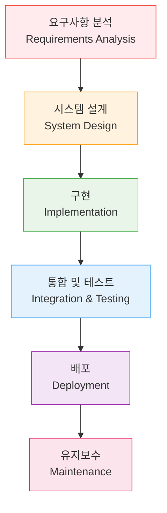
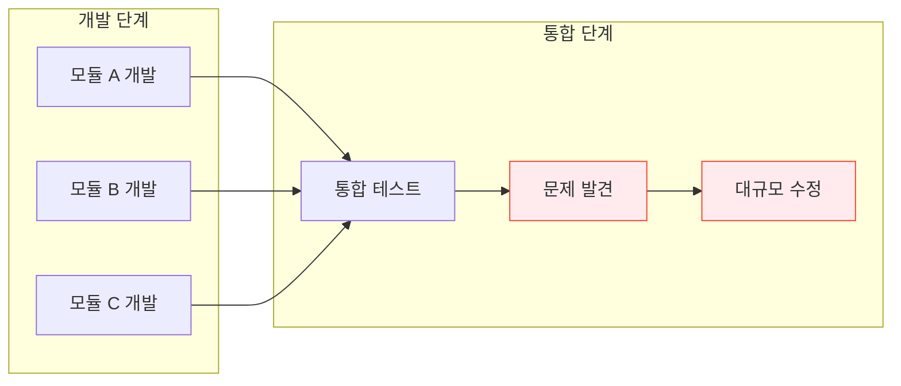
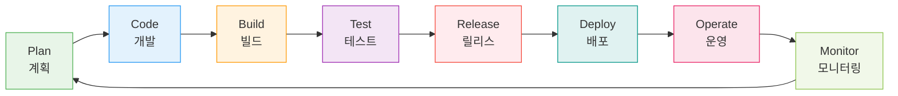

# Session 3: 전통적 개발 vs DevOps 개발

## 📍 교과과정에서의 위치
이 세션은 **Week 1 > Day 1 > Session 3**으로, 전통적 개발 방식과 DevOps 개발 방식의 차이점을 구체적으로 비교 분석합니다. 이를 통해 DevOps 도입의 필요성과 장점을 명확히 이해할 수 있습니다.

## 학습 목표 (5분)
- 전통적 개발 방식의 특징과 한계 이해
- DevOps 개발 방식의 장점 파악
- 두 방식의 구체적 차이점 비교

## 1. 전통적 개발 방식의 구조적 분석 (18분)

### 전통적 개발 방식의 철학적 배경
**전통적 개발 방식**은 **제조업의 생산 라인 모델을 소프트웨어 개발에 적용**한 접근법입니다.


#### 워터폴 모델의 이론적 기초
**Dr. Winston Royce(1970)**가 제시한 워터폴 모델의 핵심 원칙:



#### 전통적 방식의 핵심 특징
**1. 순차적 진행 (Sequential Process)**
- **단계별 완료**: 이전 단계가 100% 완료되어야 다음 단계 진행
- **게이트 검증**: 각 단계 말미에 품질 게이트 통과 필수
- **되돌아가기 어려움**: 이전 단계로의 회귀 시 높은 비용 발생
- **예측 가능성**: 각 단계별 일정과 산출물이 명확히 정의

**2. 문서 중심 접근법 (Documentation-Driven)**
- **상세 명세서**: 요구사항 명세서, 설계 문서, 테스트 계획서
- **승인 프로세스**: 각 문서에 대한 다단계 검토 및 승인
- **추적 가능성**: 요구사항부터 구현까지의 완전한 추적성
- **지식 보존**: 문서를 통한 프로젝트 지식의 체계적 보존

**3. 역할 분리와 전문화 (Role Separation)**
- **기능별 조직**: 분석가, 설계자, 개발자, 테스터, 운영자
- **명확한 책임**: 각 역할별 명확한 책임과 권한 정의
- **전문성 극대화**: 각 분야별 깊은 전문 지식 축적
- **품질 보장**: 독립적인 검증을 통한 품질 확보

#### 전통적 방식이 적합한 상황
**규제가 엄격하고 안정성이 최우선인 환경:**

**1. 규제 산업 (Regulated Industries)**
- **금융 서비스**: 바젤 협약, SOX 법 준수
- **의료 시스템**: FDA 승인, HIPAA 준수
- **항공우주**: DO-178C 표준 준수
- **원자력**: 안전 등급 소프트웨어 개발

**2. 대규모 시스템 통합**
- **ERP 시스템**: SAP, Oracle 등 패키지 도입
- **레거시 시스템 교체**: 기존 시스템과의 복잡한 연동
- **정부 프로젝트**: 공공 조달 절차와 감사 요구사항

**3. 고정된 요구사항**
- **임베디드 시스템**: 하드웨어 제약사항이 명확한 경우
- **표준 준수**: 국제 표준이나 업계 표준 구현
- **계약 기반 개발**: 고정 가격, 고정 범위 프로젝트

### 전통적 방식의 구조적 문제점
**현대 비즈니스 환경에서 나타나는 한계:**

#### 1. 시장 대응성 부족 (Market Responsiveness)
**긴 개발 주기로 인한 기회 비용:**
- **평균 개발 기간**: 18-36개월
- **시장 변화 속도**: 3-6개월 주기
- **경쟁 우위 상실**: 경쟁사의 빠른 시장 진입
- **고객 요구 변화**: 개발 완료 시점의 요구사항 변화

#### 2. 통합 지옥 (Integration Hell)
**늦은 통합으로 인한 위험 집중:**



**통합 지옥의 특징:**
- **문제 발견 지연**: 개발 후반부에 대부분의 문제 발견
- **수정 비용 증가**: 늦은 발견으로 인한 기하급수적 비용 증가
- **일정 지연**: 예상치 못한 통합 문제로 인한 프로젝트 지연
- **품질 저하**: 일정 압박으로 인한 임시방편적 해결

#### 3. 피드백 루프의 지연 (Delayed Feedback Loop)
**고객 피드백 수집의 구조적 한계:**

```
피드백 루프 비교:

전통적 방식:
요구사항 → [18개월] → 완성품 → 고객 피드백 → [6개월] → 수정 버전

DevOps 방식:
요구사항 → [2주] → MVP → 고객 피드백 → [1주] → 개선 버전
```

#### 4. 사일로 문화 (Silo Culture)
**부서 간 단절로 인한 비효율성:**

**부서별 목표 불일치:**
- **개발팀**: 기능 완성도와 일정 준수
- **QA팀**: 결함 발견과 품질 보장
- **운영팀**: 시스템 안정성과 가용성
- **보안팀**: 보안 정책 준수와 위험 최소화

**의사소통 문제:**
- **정보 비대칭**: 각 팀이 보유한 정보의 차이
- **책임 전가**: 문제 발생 시 다른 팀으로 책임 전가
- **중복 작업**: 팀 간 협조 부족으로 인한 중복 업무
- **지식 사일로**: 팀별로 고립된 전문 지식

#### 5. 변화 관리의 경직성 (Change Management Rigidity)
**변경 요청 처리의 복잡성:**

**변경 제어 위원회 (Change Control Board) 프로세스:**
1. **변경 요청서 작성** (1-2주)
2. **영향도 분석** (2-4주)
3. **위원회 검토** (1-2주)
4. **승인 및 계획 수립** (1-2주)
5. **변경 구현** (4-8주)
6. **테스트 및 배포** (2-4주)

**총 소요 시간: 11-22주**

### 전통적 방식의 성공 요인
**적절한 환경에서의 전통적 방식 성공 사례:**

#### 1. 명확한 요구사항 정의
- **안정적인 비즈니스 환경**: 요구사항 변화가 적은 도메인
- **표준화된 프로세스**: 업계 표준이나 규제 요구사항
- **경험 축적**: 유사한 프로젝트의 반복 수행

#### 2. 충분한 시간과 자원
- **여유로운 일정**: 각 단계별 충분한 시간 확보
- **숙련된 인력**: 각 분야별 전문가 확보
- **안정적인 예산**: 프로젝트 전 기간에 걸친 예산 보장

#### 3. 강력한 프로젝트 관리
- **경험 있는 PM**: 대규모 프로젝트 관리 경험
- **체계적인 위험 관리**: 사전 위험 식별 및 대응 계획
- **품질 보증 체계**: 독립적인 품질 보증 조직

## 2. DevOps 개발 방식의 혁신적 접근법 (20분)

### DevOps 개발 방식



### 핵심 원칙
**속도와 안정성을 동시에** 달성하는 방법:
1. **지속적 통합(CI)**: 코드 변경 시 자동 빌드/테스트
2. **지속적 배포(CD)**: 자동화된 배포 파이프라인
3. **빠른 피드백**: 짧은 주기의 반복
4. **협업 문화**: 개발과 운영의 통합

### 주요 실천 방법
- **작은 배치 크기**: 작은 단위의 변경사항
- **자동화**: 빌드, 테스트, 배포 자동화
- **모니터링**: 실시간 시스템 상태 파악
- **빠른 복구**: 문제 발생 시 신속한 롤백

## 3. 구체적 비교 (8분)

### 배포 주기 비교
**속도와 위험도의 반비례 관계**를 보여주는 비교:

| 구분 | 전통적 방식 | DevOps 방식 |
|------|-------------|-------------|
| 배포 주기 | 3-6개월 | 일/주 단위 |
| 배포 크기 | 대규모 | 소규모 |
| 위험도 | 높음 | 낮음 |
| 롤백 시간 | 수일-수주 | 분-시간 |

### 팀 구조 비교
**전통적 방식**
- 개발팀 → QA팀 → 운영팀 (순차적)
- 각 팀별 다른 목표와 KPI
- 책임 전가 문화

**DevOps 방식**
- 크로스 펑셔널 팀 (통합)
- 공통 목표와 KPI
- 공동 책임 문화

## 실습: 시나리오 분석 (7분)

### 시나리오
"고객이 새로운 기능을 요청했습니다. 경쟁사가 유사한 기능을 출시할 예정이라 빠른 대응이 필요합니다."

### 그룹 토론
1. **전통적 방식**으로 대응한다면?
2. **DevOps 방식**으로 대응한다면?
3. 각각의 장단점은?

### 발표 및 토론 (5분)

## 다음 세션 예고
DevOps를 지원하는 다양한 도구들의 생태계를 살펴보겠습니다.

## 📚 참고 자료
- [Waterfall vs Agile vs DevOps - Atlassian](https://www.atlassian.com/agile/project-management/project-management-intro)
- [DevOps vs Traditional Development - AWS](https://aws.amazon.com/devops/what-is-devops/)
- [Continuous Integration vs Continuous Delivery - Martin Fowler](https://martinfowler.com/articles/continuousIntegration.html)
- [DevOps Metrics and KPIs](https://cloud.google.com/architecture/devops/devops-measurement-monitoring-and-observability)