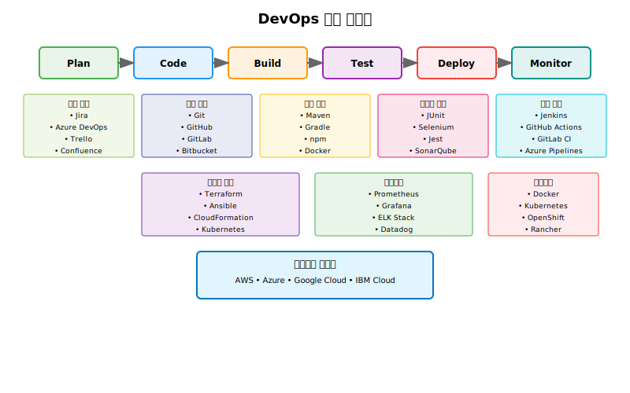

# Session 4: DevOps 도구 생태계 개요

## 📍 교과과정에서의 위치
이 세션은 **Week 1 > Day 1 > Session 4**로, DevOps를 지원하는 다양한 도구들의 전체적인 생태계를 학습합니다. 이후 주차에서 학습할 Docker, Kubernetes, CI/CD 등의 도구들이 전체 DevOps 파이프라인에서 어떤 역할을 하는지 이해합니다.

## 학습 목표 (5분)
- DevOps 도구 체인의 전체적인 구조 이해
- 각 단계별 주요 도구들 파악
- 도구 선택 시 고려사항 학습

## 1. DevOps 도구 체인 개요 (15분)

### DevOps 파이프라인과 도구 매핑



### 도구 카테고리별 설명
1. **계획(Plan)**: 프로젝트 관리, 이슈 트래킹
2. **코드(Code)**: 버전 관리, 코드 리뷰
3. **빌드(Build)**: 컴파일, 패키징
4. **테스트(Test)**: 자동화된 테스트 실행
5. **배포(Deploy)**: CI/CD 파이프라인
6. **모니터링(Monitor)**: 성능 및 로그 모니터링

## 2. 주요 도구별 상세 설명 (20분)

### 버전 관리 도구
**Git**
- 분산 버전 관리 시스템
- 브랜치 기반 개발 지원
- 대부분의 DevOps 도구와 통합

**GitHub vs GitLab vs Bitbucket**
| 기능 | GitHub | GitLab | Bitbucket |
|------|--------|--------|-----------|
| 호스팅 | 클라우드 중심 | 온프레미스/클라우드 | Atlassian 생태계 |
| CI/CD | Actions | 내장 CI/CD | Pipelines |
| 가격 | 무료/유료 | 무료/유료 | 무료/유료 |

### CI/CD 도구
**Jenkins**
- 오픈소스 자동화 서버
- 플러그인 생태계 풍부
- 온프레미스 설치 가능

**GitHub Actions**
- GitHub 통합 CI/CD
- YAML 기반 워크플로우
- 마켓플레이스 액션 활용

**GitLab CI**
- GitLab 내장 CI/CD
- Docker 기반 러너
- Auto DevOps 기능

### 컨테이너 도구
**Docker**
- 컨테이너 플랫폼의 표준
- 이미지 기반 배포
- 개발 환경 표준화

**Kubernetes**
- 컨테이너 오케스트레이션
- 자동 스케일링
- 서비스 디스커버리

### 모니터링 도구
**Prometheus + Grafana**
- 메트릭 수집 및 시각화
- 알림 기능
- 오픈소스

**ELK Stack (Elasticsearch, Logstash, Kibana)**
- 로그 수집 및 분석
- 실시간 검색
- 대시보드 제공

## 3. 도구 선택 기준 (8분)

### 고려사항
1. **조직 규모**
   - 스타트업: 간단하고 빠른 도구
   - 대기업: 엔터프라이즈급 기능

2. **기술 스택**
   - 언어별 특화 도구
   - 기존 인프라와의 호환성

3. **예산**
   - 오픈소스 vs 상용 도구
   - 라이선스 비용 고려

4. **학습 곡선**
   - 팀의 기술 수준
   - 교육 비용

5. **통합성**
   - 다른 도구와의 연동
   - API 지원 여부

### 도구 조합 예시
**스타트업 스택**
```
GitHub + GitHub Actions + Docker + AWS
```

**중견기업 스택**
```
GitLab + GitLab CI + Kubernetes + Prometheus
```

**대기업 스택**
```
Enterprise Git + Jenkins + OpenShift + Splunk
```

## 실습: 도구 매핑 (7분)

### 시나리오
"웹 애플리케이션을 개발하는 10명 규모의 팀입니다. 빠른 배포와 안정성을 모두 확보하고 싶습니다."

### 그룹 활동
1. 각 단계별 도구 선택
2. 선택 이유 설명
3. 예상되는 장단점

### 발표 및 피드백 (5분)

## 다음 세션 예고
애자일 방법론과 DevOps의 관계, 그리고 어떻게 함께 적용할 수 있는지 알아보겠습니다.

## 📚 참고 자료
- [DevOps Tools Landscape - CNCF](https://landscape.cncf.io/)
- [Periodic Table of DevOps Tools](https://digital.ai/periodic-table-of-devops-tools)
- [Jenkins vs GitHub Actions vs GitLab CI](https://www.atlassian.com/continuous-delivery/continuous-integration/ci-cd-tools)
- [Docker vs Kubernetes - Red Hat](https://www.redhat.com/en/topics/containers/kubernetes-vs-docker)
- [Monitoring Tools Comparison](https://prometheus.io/docs/introduction/comparison/)