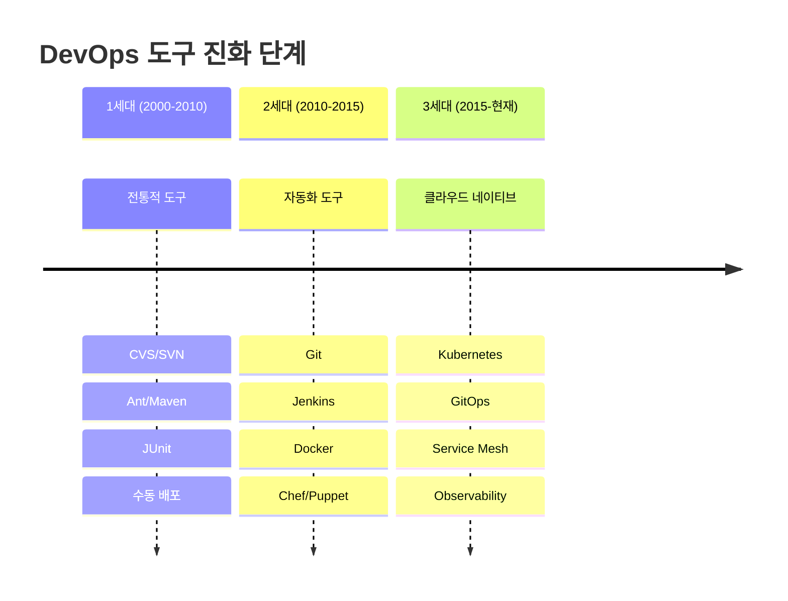

# Session 4: DevOps 도구 생태계 개요

## 📍 교과과정에서의 위치
이 세션은 **Week 1 > Day 1 > Session 4**로, DevOps를 지원하는 다양한 도구들의 전체적인 생태계를 학습합니다. 이후 주차에서 학습할 Docker, Kubernetes, CI/CD 등의 도구들이 전체 DevOps 파이프라인에서 어떤 역할을 하는지 이해합니다.

## 학습 목표 (5분)
- DevOps 도구 체인의 전체적인 구조 이해
- 각 단계별 주요 도구들 파악
- 도구 선택 시 고려사항 학습

## 1. DevOps 도구 생태계의 진화와 체계적 분류 (18분)

### DevOps 도구 생태계의 역사적 발전
**DevOps 도구의 진화 과정**은 소프트웨어 개발 방법론의 변화와 밀접한 관련이 있습니다.

#### 도구 진화의 3단계



#### 도구 선택의 패러다임 변화
**기존 접근법**: "최고의 도구를 찾아서 사용하자"
**현대적 접근법**: "우리 조직과 문화에 맞는 도구를 선택하자"

### DevOps 라이프사이클과 도구 매핑


### 도구 카테고리별 심화 분석
**전체 DevOps 라이프사이클**을 지원하는 8가지 핵심 영역:

#### 1. 계획(Plan) - 비즈니스 요구사항의 체계적 관리
**전략적 계획부터 일일 작업까지의 전체 관리:**
- **전략 계획**: OKR, 로드맵, 포트폴리오 관리
- **요구사항 관리**: 사용자 스토리, 에픽, 기능 명세
- **프로젝트 관리**: 스프린트 계획, 리소스 할당, 일정 관리
- **이슈 트래킹**: 버그 리포트, 기능 요청, 개선 사항

#### 2. 코드(Code) - 소스 코드의 체계적 관리
**협업적 코드 개발과 품질 보장:**
- **버전 관리**: 분산 버전 관리, 브랜치 전략, 머지 전략
- **코드 리뷰**: 피어 리뷰, 풀 리퀘스트, 코드 품질 게이트
- **코드 표준화**: 코딩 컨벤션, 린터, 포매터
- **지식 공유**: 문서화, 위키, 지식 베이스

#### 3. 빌드(Build) - 소스 코드의 실행 가능한 아티팩트 변환
**일관되고 재현 가능한 빌드 프로세스:**
- **컴파일**: 소스 코드를 실행 가능한 바이너리로 변환
- **의존성 관리**: 라이브러리, 프레임워크, 서드파티 컴포넌트
- **패키징**: 실행 가능한 형태로 번들링 (JAR, WAR, Docker Image)
- **아티팩트 관리**: 버전 관리, 메타데이터, 저장소 관리

#### 4. 테스트(Test) - 품질 보장을 위한 다층 검증
**자동화된 테스트를 통한 지속적 품질 보장:**
- **단위 테스트**: 개별 컴포넌트의 기능 검증
- **통합 테스트**: 컴포넌트 간 상호작용 검증
- **시스템 테스트**: 전체 시스템의 엔드투엔드 검증
- **성능 테스트**: 부하, 스트레스, 볼륨 테스트
- **보안 테스트**: 취약점 스캔, 침투 테스트

#### 5. 배포(Deploy) - 안전하고 신뢰할 수 있는 서비스 전달
**자동화된 배포를 통한 위험 최소화:**
- **CI/CD 파이프라인**: 지속적 통합과 지속적 배포
- **배포 전략**: 블루-그린, 카나리, 롤링 배포
- **환경 관리**: 개발, 스테이징, 프로덕션 환경 일관성
- **릴리스 관리**: 버전 관리, 롤백 전략, 기능 플래그

#### 6. 운영(Operate) - 안정적이고 확장 가능한 서비스 운영
**프로덕션 환경에서의 안정적 서비스 제공:**
- **인프라 관리**: 서버, 네트워크, 스토리지 관리
- **컴테이너 오케스트레이션**: Kubernetes, Docker Swarm
- **서비스 메시**: 마이크로서비스 간 통신 관리
- **설정 관리**: 환경별 설정, 비밀 관리

#### 7. 모니터링(Monitor) - 실시간 시스템 가시성 확보
**데이터 기반의 시스템 상태 파악과 문제 예방:**
- **메트릭 수집**: 성능, 가용성, 비즈니스 지표
- **로그 관리**: 중앙화된 로그 수집, 분석, 저장
- **추적(Tracing)**: 분산 시스템에서의 요청 추적
- **알림**: 임계값 기반 알림, 에스케일레이션

#### 8. 피드백(Feedback) - 지속적 개선을 위한 데이터 수집
**사용자와 시스템으로부터의 피드백 수집과 분석:**
- **사용자 피드백**: 사용자 경험, 만족도, 기능 요청
- **비즈니스 메트릭**: 전환율, 매출, 사용자 참여도
- **기술 메트릭**: 성능, 오류율, 가용성
- **프로세스 개선**: 회고, 개선 사항, 액션 아이템

## 2. DevOps 도구의 전략적 분류와 상세 분석 (22분)

### 버전 관리 도구
**Git**
**모든 DevOps 도구의 기초**가 되는 핵심 도구:
- 분산 버전 관리 시스템
- 브랜치 기반 개발 지원
- 대부분의 DevOps 도구와 통합

**GitHub vs GitLab vs Bitbucket**
| 기능 | GitHub | GitLab | Bitbucket |
|------|--------|--------|-----------|
| 호스팅 | 클라우드 중심 | 온프레미스/클라우드 | Atlassian 생태계 |
| CI/CD | Actions | 내장 CI/CD | Pipelines |
| 가격 | 무료/유료 | 무료/유료 | 무료/유료 |

### CI/CD 도구
**Jenkins**
- 오픈소스 자동화 서버
- 플러그인 생태계 풍부
- 온프레미스 설치 가능

**GitHub Actions**
- GitHub 통합 CI/CD
- YAML 기반 워크플로우
- 마켓플레이스 액션 활용

**GitLab CI**
- GitLab 내장 CI/CD
- Docker 기반 러너
- Auto DevOps 기능

### 컨테이너 도구
**Docker**
- 컨테이너 플랫폼의 표준
- 이미지 기반 배포
- 개발 환경 표준화

**Kubernetes**
- 컨테이너 오케스트레이션
- 자동 스케일링
- 서비스 디스커버리

### 모니터링 도구
**Prometheus + Grafana**
- 메트릭 수집 및 시각화
- 알림 기능
- 오픈소스

**ELK Stack (Elasticsearch, Logstash, Kibana)**
- 로그 수집 및 분석
- 실시간 검색
- 대시보드 제공

## 3. 도구 선택 기준 (8분)

### 고려사항
**조직에 맞는 도구 선택이 성공의 핵심**:
1. **조직 규모**
   - 스타트업: 간단하고 빠른 도구
   - 대기업: 엔터프라이즈급 기능

2. **기술 스택**
   - 언어별 특화 도구
   - 기존 인프라와의 호환성

3. **예산**
   - 오픈소스 vs 상용 도구
   - 라이선스 비용 고려

4. **학습 곡선**
   - 팀의 기술 수준
   - 교육 비용

5. **통합성**
   - 다른 도구와의 연동
   - API 지원 여부

### 도구 조합 예시
**스타트업 스택**
```
GitHub + GitHub Actions + Docker + AWS
```

**중견기업 스택**
```
GitLab + GitLab CI + Kubernetes + Prometheus
```

**대기업 스택**
```
Enterprise Git + Jenkins + OpenShift + Splunk
```

## 실습: 도구 매핑 (7분)

### 시나리오
"웹 애플리케이션을 개발하는 10명 규모의 팀입니다. 빠른 배포와 안정성을 모두 확보하고 싶습니다."

### 그룹 활동
1. 각 단계별 도구 선택
2. 선택 이유 설명
3. 예상되는 장단점

### 발표 및 피드백 (5분)

## 다음 세션 예고
애자일 방법론과 DevOps의 관계, 그리고 어떻게 함께 적용할 수 있는지 알아보겠습니다.

## 📚 참고 자료
- [DevOps Tools Landscape - CNCF](https://landscape.cncf.io/)
- [Periodic Table of DevOps Tools](https://digital.ai/periodic-table-of-devops-tools)
- [Jenkins vs GitHub Actions vs GitLab CI](https://www.atlassian.com/continuous-delivery/continuous-integration/ci-cd-tools)
- [Docker vs Kubernetes - Red Hat](https://www.redhat.com/en/topics/containers/kubernetes-vs-docker)
- [Monitoring Tools Comparison](https://prometheus.io/docs/introduction/comparison/)