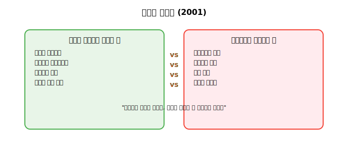
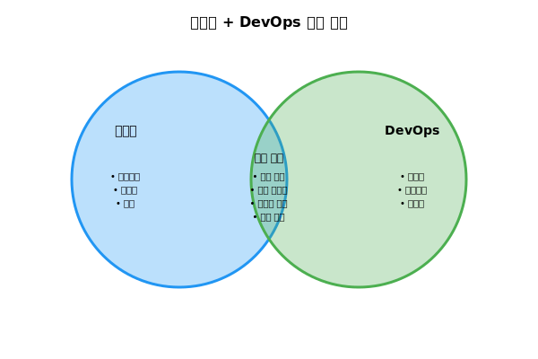

# Session 5: 애자일과 DevOps의 관계

## 📍 교과과정에서의 위치
이 세션은 **Week 1 > Day 1 > Session 5**로, DevOps와 밀접한 관련이 있는 애자일 방법론과의 관계를 학습합니다. 두 방법론이 어떻게 상호 보완하며 함께 적용될 수 있는지 이해하여, 실제 조직에서 DevOps 도입 시 애자일과의 통합 전략을 수립할 수 있습니다.

## 학습 목표 (5분)
- 애자일 방법론의 핵심 원칙 이해
- DevOps와 애자일의 공통점과 차이점 파악
- 두 방법론을 함께 적용하는 방법 학습

## 1. 애자일 방법론의 철학적 기초와 진화 과정 (18분)

### 애자일 방법론의 역사적 배경
**애자일 방법론**은 **전통적인 소프트웨어 개발 방식의 한계를 극복하기 위해 등장**한 혁신적 접근법입니다.

#### 애자일 등장의 사회적 배경
**1990년대 소프트웨어 위기 (Software Crisis)**
- **프로젝트 실패율**: 70% 이상의 대규모 IT 프로젝트 실패
- **비용 초과**: 평균 189% 예산 초과
- **일정 지연**: 평균 222% 일정 지연
- **요구사항 불일치**: 완성 시점에 요구사항의 60% 이상 변경

**비즈니스 환경의 변화**
- **인터넷 혁명**: 빠른 시장 변화와 고객 요구 다양화
- **글로벌 경쟁**: 시장 진입 장벽 낮아짐과 경쟁 심화
- **기술 발전**: 개발 도구와 플랫폼의 빠른 진화
- **고객 기대 상승**: 더 빠르고 더 나은 소프트웨어에 대한 요구

### 애자일 선언문의 철학적 기초
**2001년 2월, 17명의 소프트웨어 개발 전문가들이 유타 주 Snowbird에서 만나 작성**



#### 애자일 선언문의 4가지 핵심 가치

**1. 개인과 상호작용 > 프로세스와 도구**
- **인간 중심적 접근**: 사람이 가장 중요한 자산
- **의사소통 강화**: 면대면 대화를 통한 협업
- **팀워크 강조**: 개인의 역량보다 팀의 시너지
- **자율성 보장**: 팀 자체의 의사결정 권한

**2. 작동하는 소프트웨어 > 포괄적인 문서**
- **실질적 가치 중심**: 문서보다 실제 동작하는 소프트웨어
- **빠른 피드백**: 실제 사용 가능한 소프트웨어로 피드백 수집
- **점진적 개선**: 작은 단위의 지속적 개선
- **사용자 가치 중심**: 사용자가 실제로 사용할 수 있는 기능

**3. 고객과의 협력 > 계약 협상**
- **파트너십 관계**: 고객을 파트너로 인식
- **지속적 소통**: 개발 과정 전반에 걸친 고객 참여
- **요구사항 진화**: 고객의 학습과 이해 증진에 따른 요구사항 발전
- **공동 책임**: 성공과 실패에 대한 공동 책임

**4. 변화에 대한 대응 > 계획을 따르기**
- **적응적 계획**: 변화에 따른 계획 수정
- **불확실성 수용**: 미래를 예측하기보다 변화에 대응
- **실험적 접근**: 시행착오를 통한 학습
- **지속적 개선**: 피드백을 바탕으로 한 지속적 개선

### 애자일 12원칙의 심화 분석
**애자일 선언문의 4가지 가치를 구체적으로 실현하기 위한 12가지 원칙:**

#### 고객 가치 중심 원칙 (1-4번)
**1. 고객 만족을 위한 지속적 가치 전달**
- **조기 배포**: 가능한 한 빠른 시점에 가치 전달
- **지속적 배포**: 일회성이 아닌 지속적인 가치 제공
- **고객 만족도**: 최우선 목표로서의 고객 만족

**2. 변화하는 요구사항을 경쟁 우위로 활용**
- **변화 수용**: 변화를 문제가 아닌 기회로 인식
- **시장 대응력**: 빠른 시장 변화에 대한 신속한 대응
- **경쟁 우위**: 변화 대응 능력을 경쟁 우위로 전환

**3. 짧은 주기의 지속적 배포**
- **빠른 피드백**: 2주에서 2개월 사이의 짧은 주기
- **위험 최소화**: 작은 단위의 배포로 위험 분산
- **학습 기회**: 짧은 주기를 통한 빠른 학습과 개선

**4. 비즈니스와 개발의 일상적 협력**
- **상시 소통**: 매일 또는 정기적인 소통
- **공동 목표**: 비즈니스와 개발의 목표 일치
- **상호 이해**: 각자의 역할과 제약사항 이해

### 주요 애자일 프레임워크의 심화 분석

#### 1. Scrum - 반복적 점진적 개발
**Scrum의 철학**: "복잡한 문제를 작은 단위로 나누어 점진적으로 해결"

**Scrum의 3가지 역할:**
- **Product Owner**: 비즈니스 가치와 우선순위 결정
- **Scrum Master**: 프로세스 촉진과 장애물 제거
- **Development Team**: 제품 개발과 전달

**Scrum의 5가지 이벤트:**
- **Sprint Planning**: 스프린트 목표와 백로그 선정
- **Daily Scrum**: 일일 진행상황 공유와 장애물 식별
- **Sprint Review**: 완성된 기능의 데모와 피드백 수집
- **Sprint Retrospective**: 프로세스 개선을 위한 회고
- **Product Backlog Refinement**: 백로그 아이템의 상세화와 우선순위 조정

#### 2. Kanban - 플로우 기반 지속적 개선
**Kanban의 철학**: "작업의 플로우를 시각화하고 병목을 제거하여 효율성 극대화"

**Kanban의 4가지 기본 원칙:**
- **현재 상태에서 시작**: 기존 프로세스를 기반으로 점진적 개선
- **점진적 변화 추구**: 급진적 변화보다 점진적 개선
- **기존 역할과 책임 존중**: 기존 조직 구조 유지
- **모든 레벨에서의 리더십 장려**: 계층별 리더십 발휘

**Kanban의 6가지 실천 방법:**
- **작업 시각화**: 칸반 보드를 통한 작업 현황 파악
- **WIP 제한**: 진행 중인 작업 수 제한으로 효율성 향상
- **플로우 관리**: 작업의 원활한 플로우 보장
- **명시적 정책**: 작업 규칙과 정책의 명확한 정의
- **피드백 루프**: 데이터 기반의 지속적 개선
- **협력적 개선**: 팀 전체의 참여를 통한 개선

#### 3. XP (Extreme Programming) - 기술적 우수성 추구
**XP의 철학**: "기술적 실천을 극단적으로 추구하여 소프트웨어 품질 극대화"

**XP의 5가지 핵심 가치:**
- **의사소통 (Communication)**: 지속적이고 효과적인 의사소통
- **단순성 (Simplicity)**: 가장 단순한 해결책 추구
- **피드백 (Feedback)**: 빠르고 지속적인 피드백
- **용기 (Courage)**: 변화와 도전에 대한 용기
- **존중 (Respect)**: 팀원 간 상호 존중

**XP의 12가지 실천 방법:**
- **계획 게임**: 사용자 스토리 기반 계획
- **짧은 릴리스**: 1-4주 주기의 짧은 릴리스
- **메타포**: 시스템의 전체적 구조에 대한 공유된 이해
- **단순한 디자인**: 가장 단순한 디자인 추구
- **테스트 주도 개발**: 테스트를 먼저 작성하는 개발
- **리팩토링**: 지속적인 코드 개선
- **페어 프로그래밍**: 두 명이 함께 코딩
- **집단 코드 소유**: 모든 코드를 모든 개발자가 수정 가능
- **코딩 표준**: 일관된 코딩 스타일
- **지속적 통합**: 빈번한 코드 통합
- **40시간 근무**: 지속 가능한 개발 속도
- **현장 고객**: 고객의 지속적 참여

## 2. DevOps와 애자일의 상호 보완적 관계 분석 (20분)

### 공통점



### 차이점
| 구분 | 애자일 | DevOps |
|------|--------|--------|
| **범위** | 개발 프로세스 | 개발 + 운영 전체 |
| **팀** | 개발팀 중심 | 크로스 펑셔널 팀 |
| **목표** | 빠른 개발 | 빠른 배포 + 안정적 운영 |
| **측정** | 속도, 품질 | MTTR, MTBF, 배포 빈도 |

### 상호 보완 관계
**두 방법론은 서로 다른 문제를 해결**:
- **애자일**: "무엇을" 빠르게 만들 것인가
- **DevOps**: "어떻게" 빠르게 배포하고 운영할 것인가

## 3. 통합 적용 방법 (8분)

### DevOps + Scrum 통합 모델
```
Sprint Planning → Development → CI/CD → Production → Monitoring
     ↑                                                    ↓
     ←←←←←←←←← Sprint Review ←←←←←←←←←←←←←←←←←←←←←←←←←←
```

### 실천 방법
**애자일과 DevOps를 효과적으로 결합**하는 방법:
1. **스프린트 내 배포**: 매 스프린트마다 프로덕션 배포
2. **자동화된 파이프라인**: 개발 완료 즉시 배포 가능
3. **통합 회고**: 개발 + 운영 이슈 함께 검토
4. **공유 메트릭**: 비즈니스 + 기술 지표 통합 관리

### 조직 구조 변화
**Before**: 개발팀 → QA팀 → 운영팀
**After**: Feature Team (개발자 + QA + DevOps 엔지니어)

## 실습: 통합 프로세스 설계 (7분)

### 시나리오
"전자상거래 웹사이트를 운영하는 팀에서 애자일과 DevOps를 함께 도입하려고 합니다."

### 그룹 활동 (5분)
1. 2주 스프린트 계획 수립
2. CI/CD 파이프라인 통합 지점 설계
3. 회고 프로세스에 운영 메트릭 포함 방안

### 발표 및 토론 (2분)

## 다음 세션 예고
CI/CD 파이프라인의 구체적인 개념과 구성 요소를 자세히 알아보겠습니다.

## 📚 참고 자료
- [Agile Manifesto](https://agilemanifesto.org/)
- [Scrum Guide](https://scrumguides.org/)
- [DevOps and Agile - Atlassian](https://www.atlassian.com/agile/devops)
- [Kanban vs Scrum](https://www.atlassian.com/agile/kanban/kanban-vs-scrum)
- [Extreme Programming (XP)](http://www.extremeprogramming.org/)