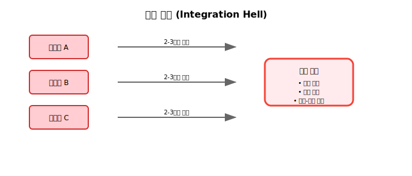
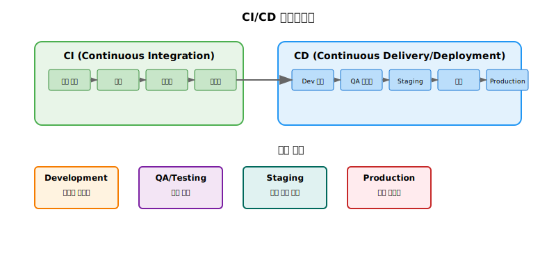

# Session 6: CI/CD 파이프라인 개념

## 📍 교과과정에서의 위치
이 세션은 **Week 1 > Day 1 > Session 6**으로, DevOps의 핵심 실천 방법인 CI/CD 파이프라인의 개념을 학습합니다. 이후 Week 2-5에서 학습할 Docker, Kubernetes, 실제 CI/CD 구축의 이론적 기초가 되는 중요한 내용입니다.

## 학습 목표 (5분)
- 지속적 통합(CI)과 지속적 배포(CD)의 개념 이해
- CI/CD 파이프라인의 구성 요소 파악
- CI/CD 도입의 이점과 과제 학습

## 1. 지속적 통합(CI)의 이론적 기초와 진화 과정 (18분)

### CI의 정의와 철학적 배경
**지속적 통합(Continuous Integration)**은 **Martin Fowler**가 정의한 소프트웨어 개발 실천 방법으로:
> "개발자들이 작업한 코드를 정기적으로(최소 하루에 한 번) 메인 브랜치에 통합하고, 각 통합마다 자동화된 빌드와 테스트를 실행하여 통합 오류를 빠르게 감지하는 개발 실천 방법"

#### CI의 핵심 철학
**"Fail Fast, Learn Fast"** - 빠른 실패를 통한 빠른 학습
- **조기 문제 발견**: 문제를 늦게 발견할수록 수정 비용이 기하급수적으로 증가
- **지속적 피드백**: 개발자에게 즉각적인 피드백 제공
- **위험 분산**: 작은 단위의 변경으로 위험을 분산
- **품질 내재화**: 품질을 개발 프로세스에 내재화

### CI 등장의 역사적 배경
**1990년대 후반 소프트웨어 개발의 위기**

#### 전통적 통합 방식의 구조적 문제
**"Big Bang Integration"**의 한계:



**통합 지옥(Integration Hell)의 특징:**
```
📅 개발 기간: 6개월
   🔹 개별 개발: 5개월 (83%)
   🔹 통합 작업: 3주 (12%)
   🔹 통합 문제 해결: 1주 (5%)

⚠️ 문제점:
   • 통합 시점에 대부분의 문제 발견
   • 문제 원인 파악의 어려움 (5개월간의 변경사항)
   • 수정 비용의 기하급수적 증가
   • 일정 지연과 품질 저하
   • 개발자 간 책임 전가 문화
```

#### 통합 문제의 경제적 영향
**IBM의 연구 결과 (2000년)**:
- **요구사항 단계 오류 수정 비용**: $1
- **설계 단계 오류 수정 비용**: $5
- **구현 단계 오류 수정 비용**: $10
- **테스트 단계 오류 수정 비용**: $20
- **운영 단계 오류 수정 비용**: $200

### CI의 10가지 핵심 실천 방법 (Martin Fowler)

#### 1. 단일 소스 저장소 유지 (Maintain a Single Source Repository)
**모든 소스 코드를 하나의 중앙 저장소에서 관리**
- **버전 관리 시스템**: Git, SVN 등을 통한 중앙 집중식 관리
- **완전성**: 빌드에 필요한 모든 것이 저장소에 포함
- **접근성**: 모든 팀원이 동일한 코드베이스에 접근
- **추적성**: 모든 변경사항의 완전한 이력 관리

#### 2. 빌드 자동화 (Automate the Build)
**체크인 시 자동으로 빌드가 실행되는 시스템 구축**
- **트리거 기반**: 코드 커밋 시 자동 빌드 시작
- **일관성**: 모든 환경에서 동일한 빌드 프로세스
- **재현성**: 언제든지 동일한 결과를 얻을 수 있는 빌드
- **의존성 관리**: 외부 라이브러리와 도구의 자동 관리

#### 3. 빌드를 자가 테스트 가능하게 만들기 (Make Your Build Self-Testing)
**빌드 프로세스에 자동화된 테스트 포함**
- **단위 테스트**: 개별 컴포넌트의 기능 검증
- **통합 테스트**: 컴포넌트 간 상호작용 검증
- **회귀 테스트**: 기존 기능의 정상 동작 확인
- **테스트 커버리지**: 코드의 충분한 테스트 범위 확보

#### 4. 매일 메인라인에 커밋 (Everyone Commits To the Mainline Every Day)
**최소 하루에 한 번은 메인 브랜치에 코드 통합**
- **작은 단위 변경**: 큰 변경을 작은 단위로 분할
- **빈번한 통합**: 통합 간격을 최소화하여 충돌 방지
- **지속적 동기화**: 다른 개발자의 변경사항과 지속적 동기화
- **책임감**: 메인라인의 안정성에 대한 공동 책임

#### 5. 모든 커밋마다 메인라인 빌드 (Every Commit Should Build the Mainline on an Integration Machine)
**개인 환경이 아닌 통합 서버에서 빌드 실행**
- **환경 독립성**: 개발자 개인 환경의 차이점 배제
- **객관적 검증**: 중립적인 환경에서의 빌드 검증
- **일관된 환경**: 프로덕션과 유사한 환경에서 빌드
- **자동화**: 인간의 개입 없이 자동으로 빌드 실행

#### 6. 빌드를 빠르게 유지 (Keep the Build Fast)
**10분 이내에 빌드 완료를 목표**
- **빠른 피드백**: 개발자가 기다리지 않고 결과 확인
- **생산성 향상**: 빌드 대기 시간 최소화
- **병렬 처리**: 테스트와 빌드의 병렬 실행
- **최적화**: 불필요한 작업 제거와 캐싱 활용

#### 7. 프로덕션 환경 복제에서 테스트 (Test in a Clone of the Production Environment)
**프로덕션과 동일한 환경에서 테스트 실행**
- **환경 일치**: 운영 환경과 동일한 설정과 구성
- **예측 가능성**: 운영 환경에서의 동작 예측 가능
- **위험 감소**: 환경 차이로 인한 배포 실패 방지
- **신뢰성**: 테스트 결과의 신뢰성 확보

#### 8. 최신 실행 파일을 쉽게 얻을 수 있게 만들기 (Make it Easy for Anyone to Get the Latest Executable)
**언제든지 최신 빌드 결과물에 접근 가능**
- **접근성**: 팀원 누구나 최신 빌드에 접근
- **가시성**: 빌드 상태와 결과의 투명한 공유
- **배포 준비**: 언제든지 배포 가능한 상태 유지
- **협업 촉진**: 최신 버전 기반의 협업 환경

#### 9. 모든 사람이 현재 상황을 볼 수 있게 하기 (Everyone Can See What's Happening)
**빌드 상태와 결과의 투명한 공유**
- **대시보드**: 빌드 상태를 한눈에 볼 수 있는 시각화
- **알림 시스템**: 빌드 실패 시 즉각적인 알림
- **이력 관리**: 빌드 이력과 트렌드 분석
- **책임 공유**: 팀 전체의 빌드 상태에 대한 관심

#### 10. 배포 자동화 (Automate Deployment)
**배포 프로세스의 완전한 자동화**
- **일관성**: 모든 환경에서 동일한 배포 프로세스
- **신뢰성**: 인간 실수 제거를 통한 배포 신뢰성 향상
- **속도**: 빠른 배포를 통한 시장 대응력 향상
- **롤백**: 문제 발생 시 빠른 롤백 지원

### CI 파이프라인의 상세 단계
**현대적 CI 파이프라인의 8단계 프로세스:**


**각 단계별 상세 설명:**
1. **코드 커밋**: 개발자의 변경사항을 중앙 저장소에 푸시
2. **소스 코드 체크아웃**: CI 서버가 최신 코드를 가져옴
3. **의존성 설치**: 필요한 라이브러리와 도구 설치
4. **컴파일/빌드**: 소스 코드를 실행 가능한 형태로 변환
5. **단위 테스트**: 개별 컴포넌트의 기능 검증
6. **정적 코드 분석**: 코드 품질과 보안 취약점 검사
7. **통합 테스트**: 컴포넌트 간 상호작용 검증
8. **아티팩트 생성**: 배포 가능한 패키지 생성

### CI의 성숙도 모델
**CI 구현의 5단계 성숙도:**

```
📈 CI 성숙도 모델:

🔴 Level 0: 수동 통합
   • 개발자가 수동으로 코드 통합
   • 통합 시점에 문제 발견
   • 높은 통합 비용과 위험

🟠 Level 1: 기본 자동화
   • 자동 빌드 시스템 도입
   • 기본적인 테스트 자동화
   • 일일 빌드 실행

🟡 Level 2: 지속적 통합
   • 모든 커밋마다 빌드 실행
   • 포괄적인 테스트 스위트
   • 빠른 피드백 루프

🔵 Level 3: 고급 CI
   • 병렬 빌드와 테스트
   • 다양한 환경에서 테스트
   • 고급 분석과 리포팅

🟣 Level 4: 지능형 CI
   • 머신러닝 기반 테스트 선택
   • 예측적 품질 분석
   • 자동화된 최적화
```

## 2. 지속적 배포(CD)의 이론적 체계와 배포 전략 (20분)

### CD의 두 가지 의미
**자동화 수준에 따른 구분**이 중요:
1. **Continuous Delivery (지속적 전달)**
   - 언제든 배포 가능한 상태 유지
   - 수동 승인 후 배포

2. **Continuous Deployment (지속적 배포)**
   - 모든 변경사항 자동 배포
   - 인간 개입 없이 프로덕션까지

### CD 파이프라인 구조



### 배포 전략
1. **블루-그린 배포**: 두 개의 동일한 환경 운영
2. **카나리 배포**: 일부 사용자에게만 먼저 배포
3. **롤링 배포**: 점진적으로 인스턴스 교체

## 3. CI/CD의 이점과 과제 (12분)

### 이점
**비즈니스 가치를 직접적으로 제공**하는 5가지 핵심 이점:
1. **빠른 피드백**: 문제를 조기에 발견
2. **위험 감소**: 작은 단위의 변경으로 위험 최소화
3. **배포 속도**: 수동 프로세스 제거로 빠른 배포
4. **품질 향상**: 자동화된 테스트로 일관된 품질
5. **개발자 생산성**: 반복 작업 자동화

### 도입 과제
1. **초기 투자**: 파이프라인 구축 비용
2. **문화 변화**: 기존 프로세스 변경 저항
3. **기술 부채**: 레거시 시스템 통합 어려움
4. **테스트 자동화**: 충분한 테스트 커버리지 필요

### 성공 요인
- **경영진 지원**: Top-down 의지
- **점진적 도입**: 작은 프로젝트부터 시작
- **교육 투자**: 팀 역량 강화
- **도구 표준화**: 일관된 도구 체인

## 실습: CI/CD 파이프라인 설계 (8분)

### 시나리오
"Node.js 웹 애플리케이션을 AWS에 배포하는 CI/CD 파이프라인을 설계해보세요."

### 요구사항
- GitHub 저장소 사용
- 자동화된 테스트 포함
- 3단계 환경 (dev, staging, prod)
- 승인 프로세스 포함

### 그룹 활동 (6분)
1. 파이프라인 단계 정의
2. 사용할 도구 선택
3. 승인 및 롤백 전략 수립

### 발표 (2분)

## 다음 세션 예고
실제 기업들의 DevOps 성공 사례를 분석하고, 실패 사례에서 얻을 수 있는 교훈을 살펴보겠습니다.

## 📚 참고 자료
- [Continuous Integration - Martin Fowler](https://martinfowler.com/articles/continuousIntegration.html)
- [Continuous Delivery vs Deployment](https://www.atlassian.com/continuous-delivery/principles/continuous-integration-vs-delivery-vs-deployment)
- [CI/CD Best Practices - GitLab](https://docs.gitlab.com/ee/ci/pipelines/)
- [Blue-Green Deployment](https://martinfowler.com/bliki/BlueGreenDeployment.html)
- [Canary Releases](https://martinfowler.com/bliki/CanaryRelease.html)