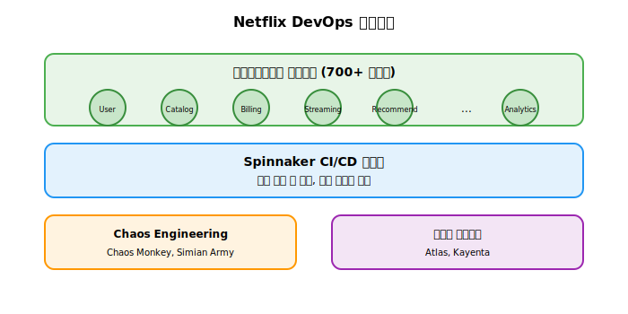

# Session 7: DevOps 성공 사례 분석

## 📍 교과과정에서의 위치
이 세션은 **Week 1 > Day 1 > Session 7**로, 실제 기업들의 DevOps 도입 사례를 분석하여 이론적 지식을 실무에 어떻게 적용할 수 있는지 학습합니다. 성공 사례와 실패 사례를 통해 DevOps 도입 시 주의할 점과 성공 요인을 이해합니다.

## 학습 목표 (5분)
- 글로벌 기업의 DevOps 성공 사례 분석
- 국내 기업의 DevOps 도입 사례 학습
- 실패 사례를 통한 교훈 도출

## 1. 글로벌 기업 성공 사례의 심층 분석 (28분)

### Netflix: 클라우드 네이티브 DevOps의 선구자

#### 전환의 배경과 동기
**2008년 8월 11일 - Netflix 역사상 최악의 장애**
- 장애 원인: 데이터센터 하드웨어 장애로 인한 DVD 배송 시스템 완전 마비
- 영향 범위: 3일간 전체 서비스 중단, 수백만 고객 영향
- 비즈니스 손실: 약 1억 달러 추정 손실
- 전략적 결정: "Never Again" - 단일 장애점 제거를 위한 클라우드 전환 결정

#### DevOps 전략

#### 주요 성과
- 배포 빈도: 하루 수천 번
- 복구 시간: 평균 몇 분 이내
- 가용성: 99.99% 이상
- 글로벌 확장: 190개국 서비스

#### 핵심 원칙
Netflix의 독특한 DevOps 철학:
1. You Build It, You Run It: 개발팀이 운영까지 책임
2. Freedom & Responsibility: 자율성과 책임감
3. Chaos Engineering: 장애를 통한 시스템 강화

### Amazon: 대규모 DevOps의 표준

#### 배경 및 전환
- 2001년: 모놀리식 아키텍처의 한계
- Two-Pizza Team: 피자 두 판으로 충분한 작은 팀

#### 성과 지표
- 배포 주기: 11.7초마다 배포
- 서비스 수: 수만 개의 마이크로서비스
- 장애 복구: 평균 2.5분

#### 혁신 사항
대규모 조직에서의 DevOps 성공 비결:
1. API 우선: 모든 통신은 API를 통해
2. 서비스 소유권: 팀별 완전한 책임
3. 자동화 우선: 수동 작업 최소화

### Google: SRE(Site Reliability Engineering) 모델

#### SRE 개념
- 정의: 소프트웨어 엔지니어링으로 운영 문제 해결
- 목표: 시스템 신뢰성과 확장성

#### 핵심 원칙
1. Error Budget: 허용 가능한 오류율 설정
2. Toil 최소화: 반복적 수동 작업 제거
3. Blameless Postmortem: 비난 없는 사후 분석

## 2. 국내 기업 사례 (10분)

### 카카오: 대규모 트래픽 처리

#### 도입 배경
- 급격한 사용자 증가
- 서비스 다양화

#### 주요 전략
- 컨테이너 기반: Docker + Kubernetes
- GitOps: ArgoCD 활용
- 멀티 클라우드: AWS + 자체 IDC

#### 성과
- 배포 시간: 1시간 → 10분
- 장애 복구: 30분 → 5분

### 네이버: 글로벌 서비스 DevOps

#### 특징
- NAVER Cloud Platform: 자체 클라우드 플랫폼
- Pinpoint: APM 도구 오픈소스화
- Whale: 브라우저 개발 DevOps

### 우아한형제들: 스타트업 → 대기업 전환

#### 성장 과정
1. 초기: 단순한 배포 스크립트
2. 성장기: Jenkins 기반 CI/CD
3. 현재: Kubernetes + GitOps

## 3. 실패 사례와 교훈 (8분)

### 일반적인 실패 원인

#### 1. 문화적 저항
사례: 대기업 A사
- 문제: 개발팀과 운영팀의 갈등
- 원인: 기존 프로세스 고수, 책임 회피
- 교훈: 문화 변화가 기술보다 중요

#### 2. 과도한 자동화
사례: 스타트업 B사
- 문제: 복잡한 파이프라인으로 오히려 생산성 저하
- 원인: 점진적 도입 없이 한 번에 모든 것 자동화
- 교훈: 단계적 접근의 중요성

#### 3. 모니터링 부족
사례: 중견기업 C사
- 문제: 빠른 배포 후 장애 발생 시 원인 파악 어려움
- 원인: 배포 자동화만 하고 모니터링 소홀
- 교훈: 배포와 모니터링은 세트

### 성공을 위한 핵심 요소
모든 성공 사례에서 공통적으로 나타나는 요소:
1. 경영진 지원: 충분한 리소스와 시간 투자
2. 점진적 도입: 작은 성공부터 시작
3. 교육 투자: 지속적인 역량 개발
4. 문화 변화: 기술보다 사람이 우선

## 실습: 사례 분석 (7분)

### 시나리오 분석
"중견 제조업체에서 ERP 시스템에 DevOps를 도입하려고 합니다."

#### 주어진 조건
- 직원 500명, IT팀 20명
- 레거시 시스템 다수
- 보수적 조직 문화
- 제한된 예산

### 그룹 토론 (5분)
1. 예상되는 장애물은?
2. 성공을 위한 전략은?
3. 단계별 로드맵 수립

### 발표 및 피드백 (2분)

## 다음 세션 예고
내일부터 본격적인 실습을 위해 Docker Desktop 설치와 기본 환경을 구성해보겠습니다.

## 📚 참고 자료
- [Netflix Tech Blog](https://netflixtechblog.com/)
- [Amazon DevOps Case Studies](https://aws.amazon.com/devops/case-studies/)
- [Google SRE Book](https://sre.google/sre-book/table-of-contents/)
- [State of DevOps Report](https://cloud.google.com/devops/state-of-devops/)
- [DevOps Case Studies - DevOps Institute](https://devopsinstitute.com/case-studies/)