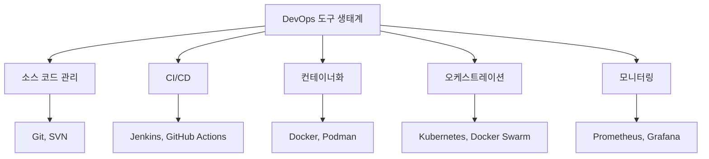
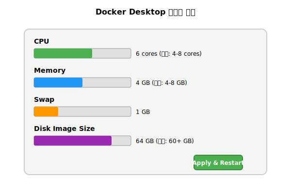

# Session 8: 이론 정리 및 토론

## 📍 교과과정에서의 위치
이 세션은 **Week 1 > Day 1**의 마지막 세션으로, DevOps 개념과 문화에 대한 하루 학습 내용을 종합 정리하고 토론을 통해 이해를 심화합니다. 이론 중심의 Week 1 특성에 맞게 개념 정리와 토론에 집중합니다.

## 2. 전통적 개발 vs DevOps 비교 분석 (15분)

### 개발 방식 비교표

| 구분 | 전통적 개발 | DevOps 개발 |
|------|-------------|-------------|
| **조직 구조** | 사일로 조직 | 크로스 펑셔널 팀 |
| **배포 주기** | 월/분기 단위 | 일/주 단위 |
| **품질 관리** | 단계별 검증 | 지속적 테스팅 |
| **장애 대응** | 사후 대응 | 예방적 모니터링 |
| **책임 소재** | 역할별 분리 | 공동 책임 |

### 변화 관리 관점
- **문화적 변화**: 개인 성과 → 팀 성과
- **프로세스 변화**: 순차적 → 병렬적
- **도구 변화**: 수동 → 자동화

## 3. DevOps 도구 생태계 이해 (10분)

### 도구 카테고리별 분류


## 4. 그룹 토론: DevOps 도입 전략 (10분)

### 토론 주제
**"우리 조직에 DevOps를 도입한다면 어떤 순서로 진행할 것인가?"**

### 토론 가이드라인
1. **현재 상황 분석** (2분)
   - 조직 구조와 문화
   - 기존 개발 프로세스
   - 기술 스택과 인프라

2. **우선순위 설정** (3분)
   - 가장 시급한 문제점
   - 빠른 성과를 낼 수 있는 영역
   - 저항이 적을 것으로 예상되는 부분

3. **단계별 로드맵** (3분)
   - 1단계: 문화 변화 (3-6개월)
   - 2단계: 도구 도입 (6-12개월)
   - 3단계: 프로세스 최적화 (12-18개월)

4. **성공 지표 정의** (2분)
   - 배포 빈도 증가
   - 장애 복구 시간 단축
   - 개발자 만족도 향상

### 토론 결과 공유
각 그룹별 3분씩 발표 및 피드백

## 5. 다음 학습 준비 (5분)

### Day 2 학습 내용 미리보기
- **컨테이너 기술 이론**: 가상화 기술의 발전사
- **아키텍처 비교**: 하이퍼바이저 vs 컨테이너
- **Linux 기반 기술**: 네임스페이스와 cgroups 개념

### 사전 학습 권장사항
- 가상화 기술에 대한 기본 이해
- Linux 운영체제 기초 개념
- 클라우드 컴퓨팅 기본 개념

## 📚 참고 자료
- [DevOps 핸드북](https://www.amazon.com/DevOps-Handbook-World-Class-Reliability-Organizations/dp/1942788002)
- [State of DevOps Report 2023](https://cloud.google.com/devops/state-of-devops)
- [DORA Metrics 가이드](https://www.devops-research.com/research.html)

## 💡 핵심 키워드
- **DevOps 문화**: 협업, 자동화, 측정, 공유
- **CALMS 모델**: Culture, Automation, Lean, Measurement, Sharing
- **지속적 개선**: 빠른 피드백 루프를 통한 점진적 발전
- **크로스 펑셔널 팀**: 다양한 역할이 협업하는 팀 구조

# 2. 설치 후 Applications 폴더로 이동
# 3. Docker Desktop 실행
```

#### 설치 확인
```bash
# Docker 버전 확인
docker --version
docker-compose --version

# Hello World 컨테이너 실행
docker run hello-world
```

### Docker Desktop 설정

#### 리소스 할당



## 2. 필수 계정 생성 (10분)

### GitHub 계정 생성 및 설정

#### 계정 생성
1. https://github.com 접속
2. 계정 생성 (무료 계정으로 충분)
3. 이메일 인증 완료

#### Git 설정
```bash
# 사용자 정보 설정
git config --global user.name "Your Name"
git config --global user.email "your.email@example.com"

# 기본 브랜치명 설정
git config --global init.defaultBranch main

# 설정 확인
git config --list
```

### Docker Hub 계정 생성

#### 계정 생성
1. https://hub.docker.com 접속
2. 계정 생성 (무료 계정)
3. 이메일 인증 완료

#### Docker Hub 로그인
```bash
# Docker Hub 로그인
docker login

# 로그인 확인
docker info
```

## 3. 개발 환경 구성 (10분)

### VS Code 설치 및 확장 프로그램

#### 필수 확장 프로그램
```json
{
  "recommendations": [
    "ms-vscode-remote.remote-containers",
    "ms-azuretools.vscode-docker",
    "ms-vscode.vscode-json",
    "redhat.vscode-yaml",
    "ms-vscode-remote.remote-wsl"
  ]
}
```

### 실습용 디렉토리 구성
```bash
# 실습용 디렉토리 생성
mkdir ~/devops-practice
cd ~/devops-practice

# 주차별 디렉토리 생성
mkdir week1 week2 week3 week4 week5 week6 week7

# Week 1 세부 디렉토리
cd week1
mkdir docker-basics docker-images docker-compose docker-networking
```

### 첫 번째 Docker 컨테이너 실행 (실습)
**실제 Docker를 체험**해보는 첫 번째 실습:
```bash
# Nginx 웹 서버 실행
docker run -d -p 8080:80 --name my-nginx nginx

# 컨테이너 상태 확인
docker ps

# 웹 브라우저에서 http://localhost:8080 접속 확인

# 컨테이너 로그 확인
docker logs my-nginx

# 컨테이너 정리
docker stop my-nginx
docker rm my-nginx
```

## 4. 1일차 학습 내용 정리 (10분)

### 핵심 개념 복습

#### DevOps 정의
**7주 과정의 기초가 되는 핵심 개념**:
- Development + Operations
- 협업 문화와 자동화 방법론
- CALMS 모델 (Culture, Automation, Lean, Measurement, Sharing)

#### 전통적 개발 vs DevOps
| 구분 | 전통적 방식 | DevOps 방식 |
|------|-------------|-------------|
| 배포 주기 | 몇 달-몇 년 | 일-주 단위 |
| 팀 구조 | 사일로 | 크로스 펑셔널 |
| 위험도 | 높음 | 낮음 |
| 피드백 | 늦음 | 빠름 |

#### CI/CD 파이프라인
```
코드 커밋 → 빌드 → 테스트 → 배포 → 모니터링
```

### 주요 도구 체인
- **코드 관리**: Git, GitHub
- **CI/CD**: Jenkins, GitHub Actions
- **컨테이너**: Docker, Kubernetes
- **모니터링**: Prometheus, Grafana

## 5. 질의응답 및 토론 (10분)

### 자주 묻는 질문

#### Q1: DevOps 엔지니어가 되려면 어떤 기술을 먼저 배워야 하나요?
**A**: 다음 순서를 권장합니다:
1. Linux 기초 및 Shell 스크립팅
2. Git 버전 관리
3. Docker 컨테이너 기술
4. CI/CD 도구 (Jenkins 또는 GitHub Actions)
5. 클라우드 플랫폼 (AWS, Azure, GCP 중 하나)
6. Kubernetes 오케스트레이션
7. Infrastructure as Code (Terraform)

#### Q2: 작은 회사에서도 DevOps를 도입할 수 있나요?
**A**: 네, 가능합니다. 오히려 작은 회사가 더 빠르게 도입할 수 있습니다:
- 간단한 CI/CD 파이프라인부터 시작
- 클라우드 서비스 활용으로 초기 비용 절약
- GitHub Actions 같은 무료 도구 활용

#### Q3: DevOps와 SRE의 차이점은?
**A**: 
- **DevOps**: 개발과 운영의 협업 문화
- **SRE**: Google에서 시작된 운영 방법론, 소프트웨어 엔지니어링으로 운영 문제 해결

### 오픈 토론
- 현재 조직의 DevOps 도입 가능성
- 예상되는 장애물과 해결 방안
- 개인 학습 계획 수립

## 내일 준비사항

### 사전 학습
- Docker 공식 문서 Getting Started 섹션 읽기
- 컨테이너와 가상머신의 차이점 복습

### 실습 준비
- Docker Desktop 정상 동작 확인
- VS Code Docker 확장 프로그램 설치 확인

### 과제
현재 소속 조직의 개발/배포 프로세스를 분석하고, DevOps 도입 시 예상되는 변화를 정리해오세요 (A4 1페이지).

---

## 1일차 완료! 🎉
내일부터는 Docker를 중심으로 한 컨테이너 기술을 본격적으로 학습합니다. 오늘 배운 DevOps 개념을 바탕으로 실제 기술을 익혀보겠습니다.

## 📚 참고 자료
- [Docker Desktop 공식 다운로드](https://www.docker.com/products/docker-desktop/)
- [Git 공식 다운로드](https://git-scm.com/downloads)
- [VS Code 공식 다운로드](https://code.visualstudio.com/)
- [GitHub 가입](https://github.com/)
- [Docker Hub 가입](https://hub.docker.com/)