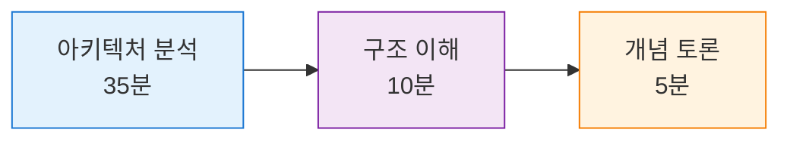

# 📦 Day 2: 컨테이너 기술 이론

**🏢 아키텍처 중심 학습** • **가상화 기술 발전사와 컨테이너 아키텍처 심화**

*물리 서버부터 컨테이너까지, 가상화 기술의 진화 과정 이해*

---

## 📅 일정 개요

| 항목 | 내용 | 비고 |
|------|------|------|
| 📅 **날짜** | Week 1, Day 2 | 컨테이너 기술 이론 집중 학습 |
| 🎯 **주제** | 컨테이너 기술 아키텍처와 이론적 기초 | 가상화 기술 발전사 중심 |
| 🕰️ **총 세션** | 8개 세션 (각 50분) | 400분 집중 이론 학습 |
| 🎓 **학습 방식** | 이론 80% + 개념 예시 20% | 아키텍처 분석 중심 |

## 🎯 학습 목표

> **컨테이너 기술의 이론적 토대 완성**

| 순서 | 학습 목표 | 성취 지표 | 중요도 |
|------|-----------|----------|--------|
| **1** | 컨테이너 기술의 **발전사**와 **핵심 개념** 완전 이해 | 가상화 진화 과정 설명 가능 | 🔴 핵심 |
| **2** | 가상화 기술 **아키텍처 비교 분석** | VM vs Container 차이점 분석 | 🔴 핵심 |
| **3** | Docker **내부 구조**와 **작동 원리** 심화 학습 | Docker 아키텍처 도식화 가능 | 🟡 중요 |
| **4** | 컨테이너 **생태계 전반**의 이론적 토대 구축 | 생태계 전체 그림 이해 | 🟡 중요 |

## 🌟 학습 방식 및 특징

**📊 내용 구성**
- 🏢 **아키텍처 분석 70%**: 시스템 구조와 설계 원리 심화 분석
- 🔍 **구조 이해 20%**: 컨포넌트 간 상호작용 메커니즘 이해
- 💬 **개념 토론 10%**: 이론적 배경과 실무 적용 방안 토론
- 📈 **시각화**: SVG 다이어그램과 Mermaid 적극 활용
- ⚠️ **실습 제한**: 복잡한 실행 코드 지양, 구조 설명용 코드만

## 📚 세션 구성

### [Session 1: 가상화 기술의 역사와 발전](./session_01.md)
- 컨테이너 기술의 **역사적 배경**과 **진화 과정**
- 전통적 배포 방식의 **근본적 한계**와 **문제 분석**
- 컨테이너 기술이 **해결하는 근본 문제**들

### [Session 2: 하이퍼바이저 vs 컨테이너 아키텍처 비교](./session_02.md)
- 가상화 기술의 **진화 단계**와 **기술적 배경**
- **하이퍼바이저 아키텍처** 심화 분석
- **컨테이너 아키텍처**의 **이론적 우수성**

### [Session 3: Docker 등장 배경과 철학](./session_03.md)
- Docker의 **등장 배경**과 **기술적 혁신**
- Docker **내부 아키텍처** 상세 분석
- **컴포넌트 간 상호작용** 메커니즘

### [Session 4: Linux 네임스페이스와 cgroups 개념](./session_04.md)
- **이미지 및 컨테이너 개념**의 이론적 기초
- **레이어 시스템**과 **Union File System** 원리
- **레지스트리 생태계** 및 **배포 전략**

### [Session 5: 컨테이너 런타임 생태계 분석](./session_05.md)
- 컨테이너 **상태 모델**과 **전이 메커니즘**
- **프로세스 격리**와 **네임스페이스** 이론
- **리소스 관리**와 **보안 경계** 개념

### [Session 6: OCI 표준과 컨테이너 표준화](./session_06.md)
- **대규모 시스템**에서의 컨테이너 **관리 문제**
- **오케스트레이션 이론**과 **설계 원칙**
- **Kubernetes 아키텍처** 개념적 이해

### [Session 7: 컨테이너 보안 모델 이론](./session_07.md)
- 컨테이너 **보안 모델**과 **위협 분석**
- **보안 계층**과 **방어 전략** 이론
- **보안 정책**과 **컴플라이언스** 기초

### [Session 8: 컨테이너 기술 토론 및 정리](./session_08.md)
- 컨테이너 기술 **핵심 개념 정리**
- **산업 동향**과 **미래 전망** 분석
- **그룹 토론**: 컨테이너 기술의 영향과 전망

## 개념 토론 주제

### Session별 토론 주제
1. **Session 1**: "컨테이너 기술이 소프트웨어 산업에 미친 영향"
2. **Session 2**: "가상머신 vs 컨테이너, 언제 어떤 것을 선택할까?"
3. **Session 3**: "Docker가 성공한 핵심 요인은 무엇인가?"
4. **Session 4**: "Linux 기반 기술이 컨테이너에 미친 영향"
5. **Session 5**: "컨테이너 런타임의 미래 발전 방향"
6. **Session 6**: "표준화가 기술 생태계에 미치는 영향"
7. **Session 7**: "컨테이너 보안의 가장 큰 도전과제"
8. **Session 8**: "컨테이너 기술의 다음 10년 전망"

## 📚 학습 자료
- SVG 아키텍처 다이어그램
- Mermaid 플로우차트
- 산업 사례 연구 자료
- 기술 비교 분석 표

## 🎯 학습 성과
이 날의 학습을 통해 다음을 달성할 수 있습니다:
- 컨테이너 기술의 **이론적 토대** 완성
- 가상화 기술 **아키텍처 비교 분석** 능력
- Docker **내부 작동 원리** 심화 이해
- 컨테이너 **생태계 전반**에 대한 개념적 토대
- Week 2 실습을 위한 **이론적 기초** 완성

## 다음 날 준비
내일은 **Docker 개념 및 명령어 체계**에 대해 학습합니다. 컨테이너 기술 이론을 바탕으로 Docker의 구체적인 구조를 이해할 예정입니다.

---
*다음: [Day 3 - Docker 개념 및 명령어 체계](../day_03/README.md)*