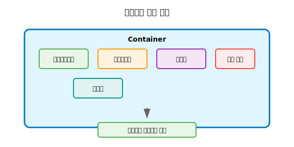
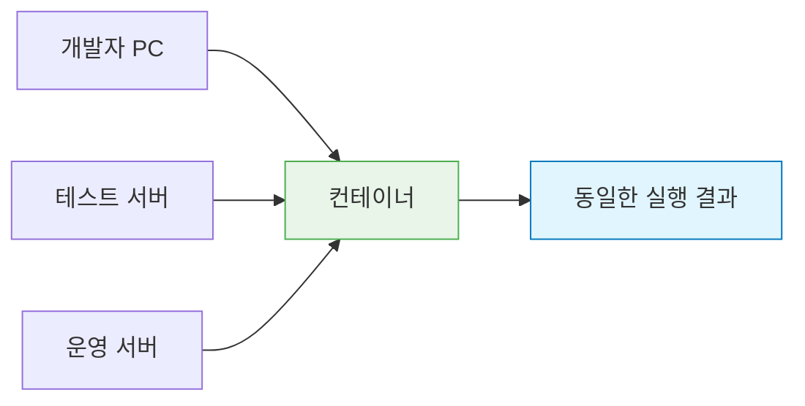
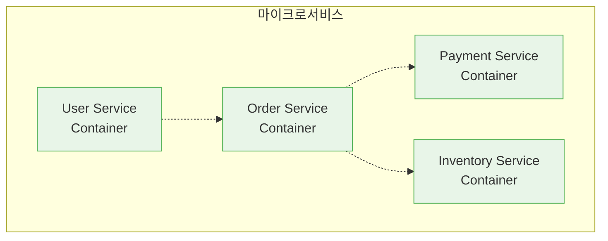

# Session 1: 컨테이너 기술이란?

## 📍 교과과정에서의 위치
이 세션은 **Week 1 > Day 2 > Session 1**로, DevOps의 핵심 기술 중 하나인 컨테이너 기술의 기본 개념을 학습합니다. 어제 배운 DevOps 이론을 바탕으로 실제 기술 구현의 첫 단계인 컨테이너화에 대해 이해합니다.

## 학습 목표 (5분)
- 컨테이너 기술의 정의와 핵심 개념 이해
- 전통적 배포 방식의 한계점 파악
- 컨테이너가 해결하는 문제들 학습

## 1. 컨테이너 기술의 정의 (15분)

### 컨테이너란?
**컨테이너(Container)**는 **애플리케이션과 그 실행에 필요한 모든 종속성을 하나의 격리된 패키지로 묶는 가벼운 가상화 기술**입니다.

#### 상세 정의
컨테이너는 다음 요소들을 포함합니다:
- **애플리케이션 코드**: 실제 실행될 프로그램
- **런타임 환경**: 언어별 런타임 (JVM, Node.js, Python 등)
- **시스템 라이브러리**: 애플리케이션이 의존하는 라이브러리
- **설정 파일**: 환경 변수, 설정 파일 등
- **시스템 도구**: 필요한 명령어와 유틸리티

#### 기술적 구현
컨테이너는 Linux 커널의 다음 기능들을 활용합니다:
- **Namespaces**: 프로세스, 네트워크, 파일 시스템 격리
- **Control Groups (cgroups)**: CPU, 메모리, I/O 리소스 제한
- **Union File Systems**: 레이어 기반 파일 시스템
- **Copy-on-Write**: 효율적인 저장공간 사용

### 핵심 특징

#### 1. 격리성(Isolation)
**각 컨테이너는 독립적인 실행 환경을 가집니다.**
- **프로세스 격리**: 다른 컨테이너의 프로세스를 볼 수 없음
- **네트워크 격리**: 독립적인 IP 주소와 포트 공간
- **파일 시스템 격리**: 독립적인 루트 파일 시스템
- **사용자 격리**: 독립적인 사용자 ID 공간

#### 2. 이식성(Portability)
**"어디서나 동일하게 실행되는" 특성입니다.**
- **플랫폼 독립성**: Linux, Windows, macOS에서 동일한 동작
- **클라우드 독립성**: AWS, Azure, GCP 등 어떤 클라우드에서도 실행
- **환경 일관성**: 개발, 테스트, 운영 환경에서 동일한 동작

#### 3. 경량성(Lightweight)
**가상머신 대비 현저히 적은 리소스를 사용합니다.**
- **빠른 시작**: 수 초 내에 시작 (가상머신은 수 분)
- **적은 메모리**: MB 단위 오버헤드 (가상머신은 GB 단위)
- **효율적 저장**: 레이어 공유로 디스크 공간 절약
- **높은 밀도**: 동일한 하드웨어에서 더 많은 애플리케이션 실행

#### 4. 확장성(Scalability)
**수요에 따라 빠르게 확장하거나 축소할 수 있습니다.**
- **수평 확장**: 동일한 컨테이너를 여러 개 실행
- **수직 확장**: 컨테이너에 더 많은 리소스 할당
- **자동 확장**: 로드에 따라 자동으로 인스턴스 수 조절
- **빠른 복제**: 이미지 기반으로 즉시 새 인스턴스 생성

> **중요**: 컨테이너는 **"Build once, Run anywhere"** 철학을 구현합니다.

## 2. 전통적 배포 방식의 문제점 (15분)

### 물리 서버 시대의 문제
**하나의 서버에 여러 애플리케이션을 함께 실행**할 때 발생하는 문제들:

#### 주요 문제점
1. **의존성 충돌**: 서로 다른 버전의 라이브러리 요구
2. **리소스 경합**: CPU, 메모리 사용량 예측 어려움
3. **환경 불일치**: 개발/테스트/운영 환경 차이
4. **배포 복잡성**: 새 애플리케이션 추가 시 기존 앱에 영향

### "내 컴퓨터에서는 잘 됐는데..." 현상
**환경 차이로 인한 문제의 대표적 사례**:

#### 문제 발생 원인
**환경 불일치(Environment Drift)**는 다음과 같은 요인들로 발생합니다:
- **운영체제 차이**: 버전, 패치 수준, 커널 설정
- **라이브러리 버전**: 동일한 라이브러리의 다른 버전
- **시스템 설정**: 환경 변수, 파일 경로, 권한 설정
- **숨겨진 종속성**: 명시적으로 선언되지 않은 시스템 종속성

#### 전통적 해결 방식의 한계
- **수동 설정**: 각 환경마다 수동으로 동일한 설정 작업
- **문서화 의존**: 설치 가이드에 의존하여 인적 오류 발생
- **비용 증가**: 각 환경별 별도 설정 및 유지보수 비용
- **시간 소모**: 환경 구성에 많은 시간 투자

| 환경 | 운영체제 | Java 버전 | 라이브러리 | 결과 |
|------|----------|-----------|------------|------|
| 개발자 PC | Windows 11 | Java 17 | 최신 버전 | ✅ 정상 |
| 테스트 서버 | Ubuntu 20.04 | Java 11 | 구 버전 | ❌ 오류 |
| 운영 서버 | CentOS 7 | Java 8 | 다른 버전 | ❌ 실패 |

## 3. 컨테이너가 해결하는 문제들 (12분)

### 환경 표준화
**모든 환경에서 동일한 실행 조건 보장**:

### 애플리케이션 격리
각 컨테이너는 **독립적인 실행 공간**을 가집니다:
- 파일 시스템 격리
- 네트워크 격리  
- 프로세스 격리
- 리소스 격리

### 빠른 배포와 확장
**기존 방식 대비 획기적인 속도 개선**:
- 가상머신 부팅: 수 분
- 컨테이너 시작: 수 초
- 이미지 배포: 레이어 기반으로 효율적

### 마이크로서비스 아키텍처 지원
**마이크로서비스 아키텍처**는 **대규모 애플리케이션을 작고 독립적인 서비스들로 분해하는 설계 패턴**입니다.

#### 컨테이너와의 시너지
**컨테이너는 마이크로서비스 아키텍처의 이상적인 배포 단위입니다:**
- **서비스 격리**: 각 마이크로서비스를 독립적인 컨테이너로 패키징
- **독립적 배포**: 각 서비스를 다른 서비스에 영향 없이 배포
- **개별 확장**: 트래픽에 따라 특정 서비스만 선택적 확장
- **기술 다양성**: 서비스별로 최적의 기술 스택 선택 가능

#### 전통적 모놀리스 vs 마이크로서비스

**모놀리스 애플리케이션**:
- 하나의 큰 애플리케이션
- 모든 기능이 결합되어 있음
- 전체 애플리케이션 재배포 필요

**마이크로서비스 애플리케이션**:
- 여러 개의 작은 서비스들
- 각 서비스가 독립적으로 동작
- 개별 서비스만 선택적 업데이트

## 4. 컨테이너 기술의 역사 (8분)

### 발전 과정
1. **2000년대 초**: FreeBSD Jails, Solaris Zones
2. **2008년**: Linux Containers (LXC) 등장
3. **2013년**: Docker 출시로 대중화
4. **2014년**: Kubernetes 등장
5. **현재**: 클라우드 네이티브의 표준

### Docker의 혁신
**컨테이너 기술을 누구나 쉽게 사용할 수 있게 만든 혁신**:
- 간단한 명령어 인터페이스
- 이미지 레지스트리 생태계
- 개발자 친화적 도구들
- 풍부한 문서와 커뮤니티

## 실습: 컨테이너 개념 이해 (5분)

### 시나리오 분석
"웹 애플리케이션을 개발팀 5명이 각자 다른 환경에서 개발하고 있습니다."

#### 전통적 방식의 문제점
- 각자 다른 OS, 언어 버전 사용
- 로컬 환경 설정의 차이
- 새로운 팀원 온보딩 시간

#### 컨테이너 방식의 해결책
- 동일한 컨테이너 이미지 사용
- 환경 설정 자동화
- 즉시 개발 환경 구성 가능

## 다음 세션 예고
가상머신과 컨테이너의 구체적인 차이점과 각각의 장단점을 비교 분석해보겠습니다.

## 📚 참고 자료
- [What is a Container? - Docker](https://www.docker.com/resources/what-container/)
- [Container Technology Overview - Red Hat](https://www.redhat.com/en/topics/containers)
- [History of Containers - Container Journal](https://containerjournal.com/topics/container-ecosystems/a-brief-history-of-containers-from-1970s-chroot-to-docker-2016/)
- [Linux Containers (LXC) Introduction](https://linuxcontainers.org/lxc/introduction/)