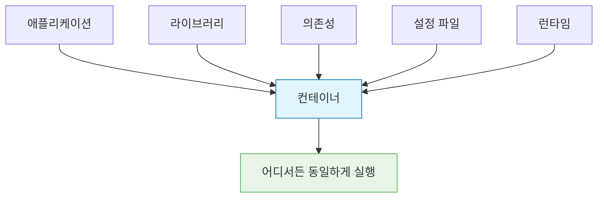
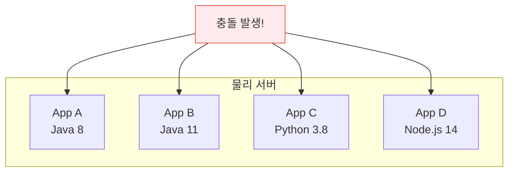
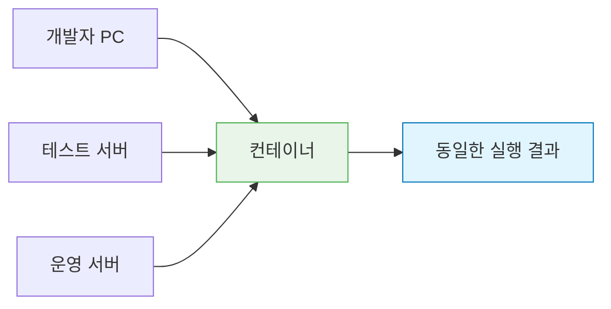
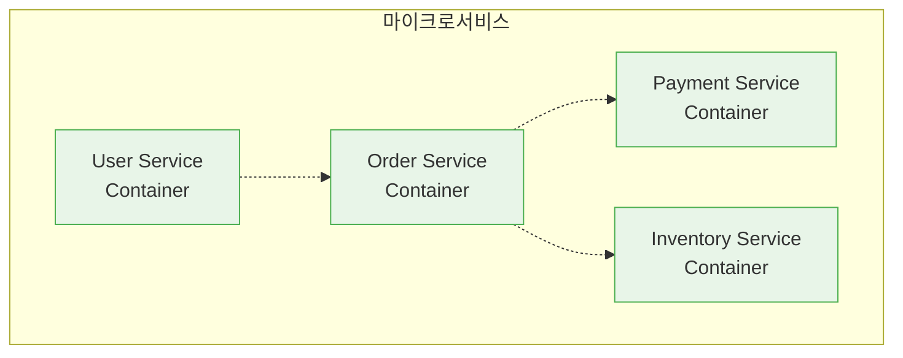

# Session 1: 컨테이너 기술이란?

## 📍 교과과정에서의 위치
이 세션은 **Week 1 > Day 2 > Session 1**로, DevOps의 핵심 기술 중 하나인 컨테이너 기술의 기본 개념을 학습합니다. 어제 배운 DevOps 이론을 바탕으로 실제 기술 구현의 첫 단계인 컨테이너화에 대해 이해합니다.

## 학습 목표 (5분)
- 컨테이너 기술의 정의와 핵심 개념 이해
- 전통적 배포 방식의 한계점 파악
- 컨테이너가 해결하는 문제들 학습

## 1. 컨테이너 기술의 정의 (15분)

### 컨테이너란?
**애플리케이션과 그 실행에 필요한 모든 것을 하나의 패키지로 묶는 기술**입니다.

### 핵심 특징
1. **격리성(Isolation)**: 각 컨테이너는 독립적인 실행 환경
2. **이식성(Portability)**: 어떤 환경에서든 동일하게 실행
3. **경량성(Lightweight)**: 가상머신보다 적은 리소스 사용
4. **확장성(Scalability)**: 빠른 시작과 복제 가능

> **중요**: 컨테이너는 **"Build once, Run anywhere"** 철학을 구현합니다.

## 2. 전통적 배포 방식의 문제점 (15분)

### 물리 서버 시대의 문제
**하나의 서버에 여러 애플리케이션을 함께 실행**할 때 발생하는 문제들:

#### 주요 문제점
1. **의존성 충돌**: 서로 다른 버전의 라이브러리 요구
2. **리소스 경합**: CPU, 메모리 사용량 예측 어려움
3. **환경 불일치**: 개발/테스트/운영 환경 차이
4. **배포 복잡성**: 새 애플리케이션 추가 시 기존 앱에 영향

### "내 컴퓨터에서는 잘 됐는데..." 현상
**환경 차이로 인한 문제의 대표적 사례**:

| 환경 | 운영체제 | Java 버전 | 라이브러리 | 결과 |
|------|----------|-----------|------------|------|
| 개발자 PC | Windows 11 | Java 17 | 최신 버전 | ✅ 정상 |
| 테스트 서버 | Ubuntu 20.04 | Java 11 | 구 버전 | ❌ 오류 |
| 운영 서버 | CentOS 7 | Java 8 | 다른 버전 | ❌ 실패 |

## 3. 컨테이너가 해결하는 문제들 (12분)

### 환경 표준화
**모든 환경에서 동일한 실행 조건 보장**:

### 애플리케이션 격리
각 컨테이너는 **독립적인 실행 공간**을 가집니다:
- 파일 시스템 격리
- 네트워크 격리  
- 프로세스 격리
- 리소스 격리

### 빠른 배포와 확장
**기존 방식 대비 획기적인 속도 개선**:
- 가상머신 부팅: 수 분
- 컨테이너 시작: 수 초
- 이미지 배포: 레이어 기반으로 효율적

### 마이크로서비스 아키텍처 지원
**각 서비스를 독립적으로 개발, 배포, 확장** 가능:

## 4. 컨테이너 기술의 역사 (8분)

### 발전 과정
1. **2000년대 초**: FreeBSD Jails, Solaris Zones
2. **2008년**: Linux Containers (LXC) 등장
3. **2013년**: Docker 출시로 대중화
4. **2014년**: Kubernetes 등장
5. **현재**: 클라우드 네이티브의 표준

### Docker의 혁신
**컨테이너 기술을 누구나 쉽게 사용할 수 있게 만든 혁신**:
- 간단한 명령어 인터페이스
- 이미지 레지스트리 생태계
- 개발자 친화적 도구들
- 풍부한 문서와 커뮤니티

## 실습: 컨테이너 개념 이해 (5분)

### 시나리오 분석
"웹 애플리케이션을 개발팀 5명이 각자 다른 환경에서 개발하고 있습니다."

#### 전통적 방식의 문제점
- 각자 다른 OS, 언어 버전 사용
- 로컬 환경 설정의 차이
- 새로운 팀원 온보딩 시간

#### 컨테이너 방식의 해결책
- 동일한 컨테이너 이미지 사용
- 환경 설정 자동화
- 즉시 개발 환경 구성 가능

## 다음 세션 예고
가상머신과 컨테이너의 구체적인 차이점과 각각의 장단점을 비교 분석해보겠습니다.

## 📚 참고 자료
- [What is a Container? - Docker](https://www.docker.com/resources/what-container/)
- [Container Technology Overview - Red Hat](https://www.redhat.com/en/topics/containers)
- [History of Containers - Container Journal](https://containerjournal.com/topics/container-ecosystems/a-brief-history-of-containers-from-1970s-chroot-to-docker-2016/)
- [Linux Containers (LXC) Introduction](https://linuxcontainers.org/lxc/introduction/)