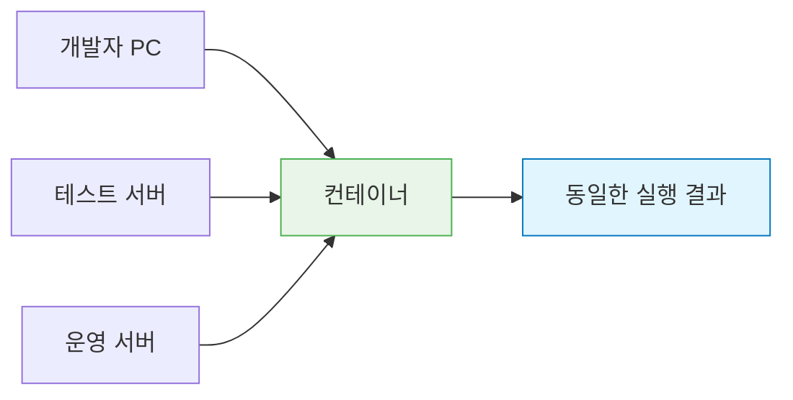
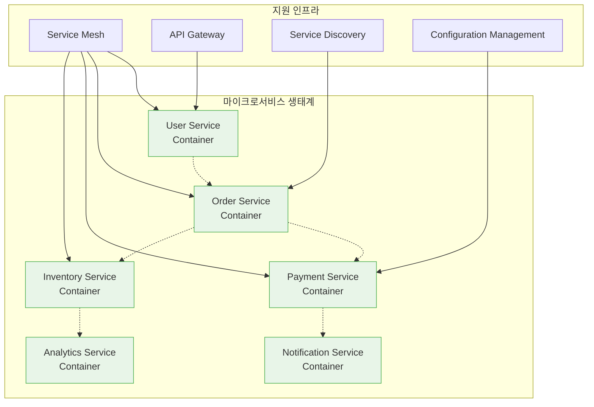

# Session 1: 컨테이너 기술이란?

## 📍 교과과정에서의 위치
이 세션은 **Week 1 > Day 2 > Session 1**로, DevOps의 핵심 기술 중 하나인 컨테이너 기술의 기본 개념을 학습합니다. 어제 배운 DevOps 이론을 바탕으로 실제 기술 구현의 첫 단계인 컨테이너화에 대해 이해합니다.

## 학습 목표 (5분)
- 컨테이너 기술의 정의와 핵심 개념 완전 이해
- 전통적 배포 방식의 구조적 한계점 심층 분석
- 컨테이너가 해결하는 문제들과 비즈니스 가치 학습
- 컨테이너 기술의 역사적 발전 과정과 미래 전망 이해
- 가상화 기술과 컨테이너 기술의 근본적 차이점 파악

## 1. 컨테이너 기술의 정의와 철학적 배경 (20분)

### 컨테이너의 다층적 정의
**컨테이너(Container)**는 단순한 기술이 아닌, **소프트웨어 배포와 실행의 패러다임을 근본적으로 변화시킨 혁신적 접근법**입니다.

#### 1단계: 기술적 정의
**컨테이너는 애플리케이션과 그 실행에 필요한 모든 종속성을 하나의 격리된 패키지로 묶는 가벼운 가상화 기술**입니다.

#### 2단계: 철학적 정의
**컨테이너는 "Build once, Run anywhere" 철학을 구현하는 소프트웨어 패키징 및 배포 방법론**입니다.

#### 3단계: 비즈니스적 정의
**컨테이너는 개발과 운영 간의 격차를 해소하고, 소프트웨어 배포의 속도와 안정성을 동시에 확보하는 DevOps 실현 도구**입니다.

### 컨테이너의 구성 요소 심화 분석

```
📦 컨테이너 구성 요소의 계층 구조:

📱 애플리케이션 계층
   🔹 애플리케이션 코드
      • 소스 코드 (컴파일된 바이너리)
      • 정적 자원 (HTML, CSS, JS, 이미지)
      • 설정 파일 (application.properties, config.json)
      • 스크립트 파일 (시작/종료 스크립트)
      • 문서 및 메타데이터
   
   🔹 애플리케이션 종속성
      • 직접 종속성 (직접 import/require하는 라이브러리)
      • 간접 종속성 (종속성의 종속성)
      • 개발 도구 종속성 (빌드 도구, 테스트 프레임워크)
      • 런타임 종속성 (실행 시 필요한 라이브러리)
      • 선택적 종속성 (특정 기능에만 필요한 라이브러리)
   
   🔹 비즈니스 로직
      • 핵심 비즈니스 규칙
      • 데이터 처리 로직
      • 외부 서비스 연동 로직
      • 보안 및 인증 로직
      • 모니터링 및 로깅 로직

런타임 계층:
   🔹 언어별 런타임 환경:
      • Java Virtual Machine (JVM):
         • 힙 메모리 관리
         • 가비지 컬렉션
         • 클래스 로더
         • JIT 컴파일러
         • 스레드 관리
      • Node.js 런타임:
         • V8 JavaScript 엔진
         • 이벤트 루프
         • 모듈 시스템
         • 비동기 I/O
         • NPM 패키지 관리
      • Python 인터프리터:
         • CPython 인터프리터
         • 메모리 관리
         • 모듈 import 시스템
         • GIL (Global Interpreter Lock)
         • pip 패키지 관리
      • .NET Core 런타임:
      • Common Language Runtime (CLR)
      • 가비지 컬렉션
      • JIT 컴파일
      • 어셈블리 로딩
      • NuGet 패키지 관리
   🔹 시스템 라이브러리:
      • C 표준 라이브러리 (libc)
      • 수학 라이브러리 (libm)
      • 스레딩 라이브러리 (libpthread)
      • 네트워킹 라이브러리 (libssl, libcrypto)
      • 압축 라이브러리 (zlib, gzip)
      • 이미지 처리 라이브러리 (libjpeg, libpng)
      • 데이터베이스 클라이언트 라이브러리
   🔹 시스템 도구:
   🔹 셸 환경 (bash, sh)
   🔹 파일 시스템 도구 (ls, cp, mv, rm)
   🔹 네트워크 도구 (curl, wget, netstat)
   🔹 프로세스 관리 도구 (ps, top, kill)
   🔹 텍스트 처리 도구 (grep, sed, awk)
   🔹 압축 도구 (tar, gzip, unzip)
   🔹 디버깅 도구 (strace, lsof, tcpdump)

운영체제 계층:
   🔹 베이스 운영체제:
      • 최소한의 OS 이미지 (Alpine, Ubuntu Minimal)
      • 커널 인터페이스 (시스템 콜)
      • 파일 시스템 구조
      • 사용자 및 그룹 관리
      • 네트워크 스택
      • 보안 모듈 (SELinux, AppArmor)
   🔹 환경 설정:
      • 환경 변수 (PATH, HOME, LANG)
      • 로케일 설정 (언어, 시간대)
      • 네트워크 설정 (DNS, 프록시)
      • 보안 설정 (사용자 권한, 파일 권한)
      • 로깅 설정 (syslog, journald)
      • 모니터링 설정 (메트릭 수집)
   🔹 시작 및 종료 스크립트:
   🔹 초기화 스크립트 (init scripts)
   🔹 헬스체크 스크립트
   🔹 백업 및 복구 스크립트
   🔹 로그 로테이션 스크립트
   🔹 정리 작업 스크립트
   🔹 종료 처리 스크립트
```

### 컨테이너의 기술적 구현 심화

#### Linux 커널 기능 활용 상세 분석
**컨테이너는 Linux 커널의 고급 기능들을 조합하여 구현됩니다:**

**1. Namespaces (네임스페이스) - 격리 메커니즘**
```
Linux Namespaces 상세 분석:

PID Namespace (프로세스 격리):
   🔹 컨테이너 내부에서 PID 1부터 시작
   🔹 호스트 프로세스와 완전 분리
   🔹 컨테이너 간 프로세스 상호 접근 불가
   🔹 프로세스 트리 독립성 보장
   🔹 시그널 전파 제어

Network Namespace (네트워크 격리):
   🔹 독립적인 네트워크 인터페이스
   🔹 별도의 IP 주소 공간
   🔹 독립적인 라우팅 테이블
   🔹 방화벽 규칙 분리
   🔹 포트 번호 공간 분리
   🔹 네트워크 통계 분리

Mount Namespace (파일시스템 격리):
   🔹 독립적인 파일시스템 뷰
   🔹 마운트 포인트 분리
   🔹 루트 파일시스템 변경 (chroot 확장)
   🔹 볼륨 마운트 독립성
   🔹 파일시스템 권한 분리
   🔹 디스크 사용량 격리

UTS Namespace (호스트명 격리):
   🔹 독립적인 호스트명
   🔹 도메인명 분리
   🔹 시스템 식별자 독립성
   🔹 네트워크 식별 분리
   🔹 클러스터 내 고유성 보장

IPC Namespace (프로세스 간 통신 격리):
   🔹 System V IPC 객체 분리
   🔹 POSIX 메시지 큐 분리
   🔹 공유 메모리 세그먼트 분리
   🔹 세마포어 분리
   🔹 프로세스 간 통신 보안

User Namespace (사용자 격리):
   🔹 사용자 ID 매핑
   🔹 그룹 ID 매핑
   🔹 권한 격리
   🔹 루트 권한 제한
   🔹 보안 컨텍스트 분리
   🔹 권한 상승 방지

Cgroup Namespace (리소스 제어 격리):
   🔹 리소스 제한 뷰 분리
   🔹 컨트롤 그룹 계층 독립성
   🔹 리소스 사용량 모니터링 분리
   🔹 성능 격리
   🔹 리소스 경합 방지
```

**2. Control Groups (cgroups) - 리소스 제어**
```
cgroups 리소스 제어 메커니즘:

CPU 제어:
   🔹 CPU 사용률 제한 (cpu.cfs_quota_us)
   🔹 CPU 가중치 설정 (cpu.shares)
   🔹 CPU 코어 할당 (cpuset.cpus)
   🔹 CPU 사용 통계 (cpu.stat)
   🔹 실시간 스케줄링 제어
   🔹 CPU 스로틀링 관리

메모리 제어:
   🔹 메모리 사용량 제한 (memory.limit_in_bytes)
   🔹 스왑 사용량 제한 (memory.memsw.limit_in_bytes)
   🔹 메모리 사용 통계 (memory.stat)
   🔹 OOM (Out of Memory) 킬러 제어
   🔹 메모리 회수 정책
   🔹 메모리 압박 알림

블록 I/O 제어:
   🔹 읽기/쓰기 대역폭 제한 (blkio.throttle)
   🔹 IOPS 제한 (blkio.throttle.read_iops_device)
   🔹 I/O 가중치 설정 (blkio.weight)
   🔹 I/O 통계 수집 (blkio.io_service_bytes)
   🔹 디스크 사용량 모니터링
   🔹 I/O 우선순위 제어

네트워크 제어:
   🔹 네트워크 대역폭 제한
   🔹 패킷 우선순위 제어
   🔹 네트워크 클래스 분류
   🔹 트래픽 쉐이핑
   🔹 네트워크 사용량 통계
   🔹 QoS (Quality of Service) 제어

디바이스 접근 제어:
   🔹 디바이스 화이트리스트/블랙리스트
   🔹 디바이스 권한 제어
   🔹 하드웨어 리소스 격리
   🔹 보안 디바이스 접근
   🔹 가상 디바이스 관리
```

**3. Union File Systems - 레이어 기반 저장**
```
Union File System 구조:

레이어 아키텍처:
   🔹 베이스 레이어 (Base Layer):
      • 운영체제 기본 파일들
      • 시스템 라이브러리
      • 기본 도구 및 유틸리티
      • 읽기 전용 (Read-Only)
      • 모든 컨테이너가 공유
   🔹 중간 레이어들 (Intermediate Layers):
      • 런타임 설치 레이어
      • 애플리케이션 종속성 레이어
      • 설정 파일 레이어
      • 각각 읽기 전용
      • 캐시 및 재사용 가능
   🔹 애플리케이션 레이어 (Application Layer):
      • 애플리케이션 코드
      • 비즈니스 로직
      • 정적 자원
      • 읽기 전용
      • 버전별 관리
   🔹 컨테이너 레이어 (Container Layer):
   🔹 실행 시 생성되는 파일
   🔹 로그 파일
   🔹 임시 파일
   🔹 읽기/쓰기 가능
   🔹 컨테이너 종료 시 삭제

Copy-on-Write 메커니즘:
   🔹 읽기 작업:
      • 상위 레이어부터 파일 검색
      • 첫 번째 발견된 파일 반환
      • 레이어 간 파일 마스킹
      • 효율적인 파일 접근
   🔹 쓰기 작업:
      • 파일이 하위 레이어에 존재하는 경우
      • 파일을 컨테이너 레이어로 복사
      • 복사된 파일 수정
      • 원본 파일은 보존
      • 레이어 독립성 유지
   🔹 삭제 작업:
   🔹 실제 파일 삭제 불가
   🔹 삭제 마커 파일 생성
   🔹 상위 레이어에서 파일 숨김
   🔹 원본 파일 보존
   🔹 레이어 무결성 유지
```


### 컨테이너의 핵심 특징 심화 분석

#### 1. 격리성(Isolation) - 보안과 안정성의 기반
**각 컨테이너는 완전히 독립적인 실행 환경을 제공합니다.**

프로세스 격리 (Process Isolation):
```
프로세스 격리 메커니즘:

PID 네임스페이스 격리:
   🔹 컨테이너 내부 프로세스는 PID 1부터 시작
   🔹 호스트 프로세스 목록에 접근 불가
   🔹 다른 컨테이너 프로세스 접근 불가
   🔹 프로세스 트리 독립성 보장
   🔹 시그널 전파 제어
   🔹 프로세스 모니터링 격리

보안 이점:
   🔹 프로세스 간 간섭 방지
   🔹 악성 프로세스 격리
   🔹 시스템 프로세스 보호
   🔹 리소스 경합 방지
   🔹 장애 전파 차단
```

네트워크 격리 (Network Isolation):
```
네트워크 격리 구조:

가상 네트워크 인터페이스:
   🔹 각 컨테이너별 독립적인 네트워크 스택
   🔹 고유한 IP 주소 할당
   🔹 독립적인 포트 번호 공간
   🔹 별도의 라우팅 테이블
   🔹 독립적인 방화벽 규칙
   🔹 네트워크 통계 분리

네트워크 보안:
   🔹 컨테이너 간 네트워크 트래픽 제어
   🔹 외부 네트워크 접근 제한
   🔹 포트 바인딩 충돌 방지
   🔹 네트워크 정책 기반 접근 제어
   🔹 트래픽 암호화 지원
   🔹 네트워크 모니터링 및 로깅
```

파일 시스템 격리 (Filesystem Isolation):
```
파일 시스템 격리 메커니즘:

마운트 네임스페이스:
   🔹 독립적인 루트 파일 시스템
   🔹 컨테이너별 마운트 포인트
   🔹 호스트 파일 시스템 접근 제한
   🔹 볼륨 마운트 독립성
   🔹 파일 권한 격리
   🔹 디스크 사용량 제한

보안 및 격리 효과:
   🔹 중요 시스템 파일 보호
   🔹 컨테이너 간 파일 접근 차단
   🔹 데이터 유출 방지
   🔹 파일 시스템 손상 격리
   🔹 백업 및 복구 독립성
   🔹 감사 및 모니터링 분리
```

#### 2. 이식성(Portability) - "Build once, Run anywhere"
**진정한 플랫폼 독립성을 실현합니다.**

플랫폼 독립성 (Platform Independence):
```
플랫폼 독립성 구현:

운영체제 추상화:
   🔹 Linux 컨테이너:
      • Ubuntu, CentOS, Alpine 등 모든 Linux 배포판
      • 커널 버전 독립성
      • 시스템 라이브러리 포함
      • 하드웨어 아키텍처 지원 (x86, ARM)
      • 클라우드 네이티브 최적화
   🔹 Windows 컨테이너:
      • Windows Server Core 기반
      • .NET Framework 애플리케이션 지원
      • Windows 서비스 컨테이너화
      • Active Directory 통합
      • 하이브리드 클라우드 지원
   🔹 멀티 아키텍처 지원:
   🔹 x86_64 (Intel/AMD)
   🔹 ARM64 (Apple Silicon, AWS Graviton)
   🔹 s390x (IBM Z)
   🔹 ppc64le (IBM Power)
   🔹 자동 아키텍처 감지 및 선택

클라우드 독립성:
   🔹 퍼블릭 클라우드:
      • AWS (ECS, EKS, Fargate)
      • Microsoft Azure (ACI, AKS)
      • Google Cloud (GKE, Cloud Run)
      • IBM Cloud (IKS)
      • Oracle Cloud (OKE)
   🔹 프라이빗 클라우드:
      • VMware vSphere
      • OpenStack
      • Red Hat OpenShift
      • Rancher
      • 온프레미스 Kubernetes
   🔹 하이브리드/멀티 클라우드:
   🔹 클라우드 간 워크로드 이동
   🔹 재해 복구 및 백업
   🔹 비용 최적화 전략
   🔹 벤더 종속성 회피
   🔹 글로벌 배포 전략
```

#### 3. 경량성(Lightweight) - 효율성의 극대화
**가상머신 대비 혁신적인 리소스 효율성을 제공합니다.**

리소스 사용량 비교 분석:
```
가상머신 vs 컨테이너 리소스 비교:

시작 시간:
   🔹 가상머신:
      • 부팅 시간: 30초 ~ 5분
      • OS 초기화 시간 포함
      • 하드웨어 에뮬레이션 오버헤드
      • 전체 OS 스택 로딩
      • 서비스 시작 대기 시간
   🔹 컨테이너:
   🔹 시작 시간: 1초 ~ 10초
   🔹 프로세스 시작 시간만 소요
   🔹 커널 공유로 초기화 최소화
   🔹 레이어 캐싱 활용
   🔹 즉시 서비스 제공 가능

메모리 사용량:
   🔹 가상머신:
      • 기본 메모리: 512MB ~ 2GB
      • 게스트 OS 메모리 오버헤드
      • 하이퍼바이저 메모리 사용
      • 중복 시스템 프로세스
      • 메모리 단편화 문제
   🔹 컨테이너:
   🔹 기본 메모리: 10MB ~ 100MB
   🔹 애플리케이션 메모리만 사용
   🔹 커널 메모리 공유
   🔹 시스템 라이브러리 공유
   🔹 효율적인 메모리 관리

디스크 사용량:
   🔹 가상머신:
      • 이미지 크기: 1GB ~ 10GB
      • 전체 OS 이미지 포함
      • 중복 시스템 파일
      • 가상 디스크 오버헤드
      • 스냅샷 저장 공간
   🔹 컨테이너:
   🔹 이미지 크기: 10MB ~ 500MB
   🔹 애플리케이션과 종속성만 포함
   🔹 레이어 공유로 중복 제거
   🔹 압축된 이미지 저장
   🔹 효율적인 저장 공간 활용

CPU 오버헤드:
   🔹 가상머신:
      • 하이퍼바이저 오버헤드: 5-15%
      • 하드웨어 가상화 비용
      • 게스트 OS 스케줄링
      • 컨텍스트 스위칭 비용
      • I/O 가상화 오버헤드
   🔹 컨테이너:
   🔹 컨테이너 오버헤드: 1-3%
   🔹 네이티브 성능에 근접
   🔹 직접 시스템 콜 사용
   🔹 최소한의 추상화 계층
   🔹 효율적인 리소스 활용
```

#### 4. 확장성(Scalability) - 동적 리소스 관리
**비즈니스 요구사항에 따른 탄력적 확장을 지원합니다.**

확장성 메커니즘 상세 분석:
```
컨테이너 확장성 구현:

수평 확장 (Horizontal Scaling):
   🔹 인스턴스 복제:
      • 동일한 컨테이너 이미지 기반
      • 로드 밸런서를 통한 트래픽 분산
      • 상태 비저장(Stateless) 설계
      • 세션 클러스터링
      • 데이터베이스 연결 풀링
   🔹 자동 확장 (Auto Scaling):
      • CPU 사용률 기반 확장
      • 메모리 사용률 기반 확장
      • 네트워크 트래픽 기반 확장
      • 커스텀 메트릭 기반 확장
      • 예측적 확장 (Predictive Scaling)
      • 스케줄 기반 확장
   🔹 지리적 분산:
      • 다중 리전 배포
      • CDN 통합
      • 지연 시간 최적화
      • 재해 복구 전략
      • 글로벌 로드 밸런싱
   🔹 마이크로서비스 확장:
   🔹 서비스별 독립적 확장
   🔹 병목 지점 식별 및 해결
   🔹 서비스 메시 활용
   🔹 회로 차단기 패턴
   🔹 백프레셔 처리

수직 확장 (Vertical Scaling):
   🔹 리소스 할당 조정:
      • CPU 코어 수 증가
      • 메모리 용량 확장
      • 네트워크 대역폭 증가
      • 스토리지 성능 향상
      • GPU 리소스 할당
   🔹 동적 리소스 조정:
      • 실시간 리소스 모니터링
      • 자동 리소스 할당 조정
      • 리소스 사용 패턴 분석
      • 성능 임계값 기반 조정
      • 비용 효율성 고려
   🔹 리소스 최적화:
   🔹 JVM 힙 크기 최적화
   🔹 데이터베이스 연결 풀 조정
   🔹 캐시 크기 최적화
   🔹 스레드 풀 크기 조정
   🔹 I/O 버퍼 크기 최적화
```

> 핵심 철학: 컨테이너는 **"Build once, Run anywhere"** 철학을 구현하여, 개발과 운영 간의 환경 차이로 인한 모든 문제를 근본적으로 해결합니다. 이는 단순한 기술적 편의성을 넘어서, 소프트웨어 개발과 배포의 패러다임을 완전히 변화시킨 혁신입니다.

## 2. 전통적 배포 방식의 구조적 문제점 심화 분석 (18분)

### 물리 서버 시대의 근본적 한계
**전통적 배포 방식의 구조적 문제점을 다층적으로 분석합니다.**


#### 의존성 지옥(Dependency Hell) 상세 분석
```
의존성 충돌의 복잡한 구조:

직접 의존성 충돌:
   🔹 애플리케이션 A: Python 3.8 + Django 3.2
   🔹 애플리케이션 B: Python 3.9 + Django 4.0
   🔹 시스템 전역 Python 버전 충돌
   🔹 패키지 관리자 충돌 (pip, conda)
   🔹 가상환경 관리 복잡성

간접 의존성 충돌:
   🔹 라이브러리 A → OpenSSL 1.1.1
   🔹 라이브러리 B → OpenSSL 3.0
   🔹 시스템 레벨 라이브러리 충돌
   🔹 동적 링킹 문제
   🔹 버전 호환성 매트릭스 관리

시스템 레벨 충돌:
   🔹 서로 다른 glibc 버전 요구
   🔹 커널 모듈 버전 의존성
   🔹 시스템 서비스 포트 충돌
   🔹 파일 시스템 권한 충돌
   🔹 환경 변수 네임스페이스 충돌

런타임 충돌:
   🔹 JVM 힙 메모리 경합
   🔹 데이터베이스 연결 풀 공유
   🔹 로그 파일 경합
   🔹 임시 파일 디렉토리 충돌
   🔹 네트워크 포트 바인딩 충돌
```

#### 리소스 경합과 성능 예측 불가능성
물리 서버에서 여러 애플리케이션 실행 시 발생하는 리소스 문제:

```
리소스 경합 문제의 다차원적 분석:

CPU 리소스 경합:
   🔹 프로세스 스케줄링 충돌
   🔹 CPU 집약적 작업 간 경합
   🔹 컨텍스트 스위칭 오버헤드 증가
   🔹 CPU 캐시 미스율 증가
   🔹 NUMA 노드 간 메모리 접근 지연
   🔹 실시간 처리 요구사항 충돌

메모리 리소스 경합:
   🔹 물리 메모리 부족으로 인한 스와핑
   🔹 메모리 누수가 다른 애플리케이션에 영향
   🔹 가비지 컬렉션이 전체 시스템에 영향
   🔹 메모리 단편화 문제
   🔹 버퍼/캐시 메모리 경합
   🔹 OOM(Out of Memory) 킬러 무작위 동작

I/O 리소스 경합:
   🔹 디스크 I/O 대역폭 경합
   🔹 네트워크 대역폭 경합
   🔹 파일 시스템 락 경합
   🔹 데이터베이스 연결 경합
   🔹 로그 파일 쓰기 경합
   🔹 백업 작업이 서비스에 영향

네트워크 리소스 경합:
   🔹 포트 번호 충돌
   🔹 네트워크 대역폭 경합
   🔹 동시 연결 수 제한
   🔹 방화벽 규칙 복잡성
   🔹 로드 밸런싱 복잡성
   🔹 SSL/TLS 인증서 관리 복잡성
```

### "내 컴퓨터에서는 잘 됐는데..." 현상의 과학적 분석
환경 불일치 문제의 근본 원인과 파급 효과:

#### 환경 드리프트(Environment Drift)의 복합적 요인
```
환경 불일치 발생 메커니즘:

시간적 드리프트:
   🔹 개발 환경과 운영 환경의 시간차
   🔹 라이브러리 업데이트 시점 차이
   🔹 보안 패치 적용 시점 차이
   🔹 시스템 설정 변경 이력 차이
   🔹 데이터베이스 스키마 진화 차이
   🔹 설정 파일 수정 이력 불일치

공간적 드리프트:
   🔹 지리적 위치에 따른 환경 차이
   🔹 클라우드 리전별 서비스 차이
   🔹 네트워크 토폴로지 차이
   🔹 하드웨어 사양 차이
   🔹 가용성 영역별 특성 차이
   🔹 규제 요구사항 차이

조직적 드리프트:
   🔹 팀별 환경 설정 표준 차이
   🔹 권한 관리 정책 차이
   🔹 변경 관리 프로세스 차이
   🔹 모니터링 도구 차이
   🔹 백업 정책 차이
   🔹 보안 정책 적용 차이

기술적 드리프트:
   🔹 컴파일러 버전 차이
   🔹 링커 설정 차이
   🔹 최적화 플래그 차이
   🔹 디버그 심볼 포함 여부
   🔹 정적/동적 링킹 차이
   🔹 아키텍처별 바이너리 차이
```

#### 환경 불일치의 비즈니스 영향 분석
정량적 영향 측정과 비용 분석:

| 영향 영역 | 전통적 방식 | 비즈니스 비용 | 기회비용 |
|----------|-------------|---------------|----------|
| **배포 실패율** | 30-50% | 개발자 시간 손실 | 출시 지연 |
| **디버깅 시간** | 40% 증가 | 인건비 증가 | 기능 개발 지연 |
| **환경 구성** | 2-5일 소요 | 인프라 비용 | 시장 기회 상실 |
| **장애 복구** | 2-8시간 | 매출 손실 | 고객 신뢰도 하락 |
| **테스트 신뢰성** | 60-70% | 품질 비용 증가 | 고객 만족도 저하 |

#### 전통적 해결 방식의 한계와 실패 요인
```
전통적 해결 방식의 구조적 한계:

문서화 기반 접근법의 한계:
   🔹 인적 오류 발생률: 15-25%
   🔹 문서 업데이트 지연
   🔹 암묵적 지식 의존성
   🔹 복잡성 증가에 따른 문서 관리 한계
   🔹 다국어/다문화 팀 환경에서의 소통 문제
   🔹 문서와 실제 환경 간 불일치

수동 프로세스의 확장성 한계:
   🔹 환경 수 증가에 따른 지수적 복잡성 증가
   🔹 인적 자원 확장의 한계
   🔹 일관성 유지의 어려움
   🔹 변경 사항 전파 지연
   🔹 롤백 프로세스의 복잡성
   🔹 감사 및 컴플라이언스 추적 어려움

도구 기반 접근법의 한계:
   🔹 도구 간 호환성 문제
   🔹 벤더 종속성 위험
   🔹 학습 곡선과 전문성 요구
   🔹 라이선스 비용 증가
   🔹 도구 자체의 환경 의존성
   🔹 레거시 시스템과의 통합 문제
```

## 3. 컨테이너가 해결하는 문제들과 비즈니스 가치 (15분)

### 환경 표준화의 혁신적 접근
컨테이너를 통한 완전한 환경 일관성 구현:



#### 환경 표준화의 구체적 메커니즘
```
컨테이너 기반 환경 표준화:

이미지 기반 표준화:
   🔹 불변 인프라스트럭처(Immutable Infrastructure)
   🔹 버전 관리된 환경 스냅샷
   🔹 환경 구성의 코드화(Infrastructure as Code)
   🔹 자동화된 환경 복제
   🔹 환경 간 차이점 제거
   🔹 결정론적 빌드 프로세스

런타임 표준화:
   🔹 동일한 커널 인터페이스 사용
   🔹 표준화된 네트워크 스택
   🔹 일관된 파일 시스템 구조
   🔹 통일된 로깅 메커니즘
   🔹 표준화된 모니터링 인터페이스
   🔹 일관된 보안 정책 적용

배포 표준화:
   🔹 선언적 배포 명세서
   🔹 롤링 업데이트 표준화
   🔹 헬스체크 표준화
   🔹 설정 관리 표준화
   🔹 시크릿 관리 표준화
   🔹 로그 수집 표준화
```

### 완전한 애플리케이션 격리
각 컨테이너의 독립적 실행 공간 보장:

```
다차원적 격리 메커니즘:

프로세스 격리 (Process Isolation):
   🔹 PID 네임스페이스를 통한 프로세스 트리 격리
   🔹 프로세스 간 통신(IPC) 격리
   🔹 시그널 전파 제어
   🔹 프로세스 모니터링 격리
   🔹 시스템 콜 필터링
   🔹 프로세스 우선순위 격리

네트워크 격리 (Network Isolation):
   🔹 가상 네트워크 인터페이스 할당
   🔹 IP 주소 공간 분리
   🔹 포트 바인딩 충돌 방지
   🔹 네트워크 정책 기반 접근 제어
   🔹 트래픽 암호화 및 인증
   🔹 네트워크 성능 격리

파일시스템 격리 (Filesystem Isolation):
   🔹 루트 파일시스템 격리
   🔹 마운트 포인트 독립성
   🔹 파일 권한 격리
   🔹 디스크 사용량 제한
   🔹 I/O 성능 격리
   🔹 백업 및 스냅샷 독립성

리소스 격리 (Resource Isolation):
   🔹 CPU 사용량 제한 및 보장
   🔹 메모리 사용량 제한
   🔹 디스크 I/O 제한
   🔹 네트워크 대역폭 제한
   🔹 파일 디스크립터 제한
   🔹 프로세스 수 제한
```

### 배포 및 확장의 혁신적 개선
전통적 방식 대비 획기적인 성능 향상:

#### 배포 속도 혁신
```
배포 성능 비교 분석:

시작 시간 비교:
   🔹 물리 서버: 5-15분 (부팅 + 애플리케이션 시작)
   🔹 가상머신: 1-5분 (VM 부팅 + 애플리케이션 시작)
   🔹 컨테이너: 1-30초 (컨테이너 시작)
   🔹 서버리스: 100ms-5초 (콜드 스타트)

배포 복잡성 비교:
   🔹 전통적 방식:
      • 환경 준비: 수 시간 ~ 수 일
      • 의존성 설치: 30분 ~ 2시간
      • 설정 구성: 1-4시간
      • 테스트 및 검증: 2-8시간
      • 총 소요 시간: 1-3일
   🔹 컨테이너 방식:
      • 이미지 빌드: 5-30분
      • 이미지 배포: 1-10분
      • 컨테이너 시작: 10초-2분
      • 헬스체크: 30초-5분
      • 총 소요 시간: 10-45분

확장성 비교:
   🔹 수평 확장 시간:
      • 물리 서버: 수 일 ~ 수 주
      • 가상머신: 10-30분
      • 컨테이너: 10초-2분
      • 서버리스: 즉시
   🔹 확장 단위:
      • 물리 서버: 전체 서버 단위
      • 가상머신: VM 단위
      • 컨테이너: 애플리케이션 단위
      • 서버리스: 함수 단위
```

### 마이크로서비스 아키텍처의 완벽한 구현
컨테이너와 마이크로서비스의 시너지 효과:

#### 마이크로서비스 아키텍처의 핵심 원칙
```
마이크로서비스 설계 원칙과 컨테이너 지원:

단일 책임 원칙 (Single Responsibility):
   🔹 각 서비스는 하나의 비즈니스 기능 담당
   🔹 컨테이너는 서비스별 독립적 패키징 지원
   🔹 서비스 경계의 명확한 정의
   🔹 기능별 독립적 개발 및 배포
   🔹 장애 격리 및 복구 독립성

자율성 (Autonomy):
   🔹 각 서비스 팀의 독립적 의사결정
   🔹 기술 스택 선택의 자유
   🔹 배포 주기의 독립성
   🔹 데이터 저장소의 독립성
   🔹 모니터링 및 로깅의 독립성

분산 거버넌스 (Decentralized Governance):
   🔹 서비스별 독립적 품질 관리
   🔹 API 계약 기반 통신
   🔹 서비스 메시를 통한 통신 관리
   🔹 분산 트랜잭션 관리
   🔹 서비스 디스커버리 및 로드 밸런싱

장애 격리 (Failure Isolation):
   🔹 서킷 브레이커 패턴 구현
   🔹 벌크헤드 패턴을 통한 리소스 격리
   🔹 타임아웃 및 재시도 정책
   🔹 우아한 성능 저하 (Graceful Degradation)
   🔹 카오스 엔지니어링 지원
```

#### 컨테이너 기반 마이크로서비스의 비즈니스 가치


### 컨테이너의 비즈니스 가치 정량화
ROI 및 TCO 관점에서의 컨테이너 도입 효과:

| 가치 영역 | 개선 지표 | 정량적 효과 | 비즈니스 영향 |
|----------|-----------|-------------|---------------|
| **개발 생산성** | 환경 구성 시간 | 90% 단축 | 개발자 만족도 향상 |
| **배포 속도** | 배포 주기 | 10-50배 개선 | 시장 출시 시간 단축 |
| **인프라 효율성** | 서버 활용률 | 300-500% 향상 | 인프라 비용 절감 |
| **운영 안정성** | 장애 복구 시간 | 80% 단축 | 서비스 가용성 향상 |
| **확장성** | 스케일링 시간 | 95% 단축 | 트래픽 급증 대응력 |
| **품질** | 환경 관련 버그 | 90% 감소 | 고객 만족도 향상 |

## 4. 컨테이너 기술의 역사적 발전과 미래 전망 (12분)

### 컨테이너 기술의 진화 과정
40년간의 가상화 기술 발전사:

```
컨테이너 기술 발전 타임라인:

1979-1990년대: 초기 격리 기술
   🔹 1979: chroot (Unix V7)
      • 파일시스템 루트 변경
      • 기본적인 파일시스템 격리
      • 보안 샌드박스의 시초
      • 현재까지도 사용되는 기초 기술
   🔹 1982: System V Release 4 - 프로세스 그룹
   🔹 1991: Linux 커널 등장
   🔹 1990년대: 다양한 Unix 변형에서 격리 기술 발전

2000년대: 본격적인 컨테이너 기술 등장
   🔹 2000: FreeBSD Jails
      • 완전한 시스템 격리 구현
      • 네트워크 스택 격리
      • 사용자 공간 격리
      • 호스팅 서비스에서 활용
      • 현대 컨테이너의 개념적 기초
   🔹 2004: Solaris Zones (Solaris Containers)
      • 엔터프라이즈급 격리 기술
      • 리소스 관리 통합
      • 동적 리소스 할당
      • 고급 보안 기능
      • 상용 Unix 시스템의 혁신
   🔹 2005: OpenVZ (Virtuozzo)
      • Linux 기반 컨테이너 가상화
      • 커널 레벨 가상화
      • 높은 밀도의 가상화
      • 호스팅 업계에서 널리 사용
   🔹 2006: Process Containers (Google)
      • Google 내부 리소스 관리
      • 대규모 분산 시스템 관리
      • 후에 cgroups로 발전
      • 현대 컨테이너 기술의 핵심 기반
   🔹 2008: Linux Containers (LXC)
   🔹 Linux 커널 기능 통합
   🔹 cgroups + namespaces 결합
   🔹 사용자 친화적 인터페이스
   🔹 오픈소스 생태계 형성
   🔹 Docker의 초기 기반 기술

2010년대: 컨테이너 기술의 대중화
   🔹 2013: Docker 출시
      • 개발자 친화적 인터페이스 혁신
      • 이미지 레이어 시스템 도입
      • Docker Hub 레지스트리 서비스
      • 개발-운영 워크플로우 통합
      • 컨테이너 기술의 민주화
      • 클라우드 네이티브 시대 개막
   🔹 2014: Kubernetes 출시 (Google)
      • 컨테이너 오케스트레이션 표준
      • 선언적 배포 모델
      • 자동 스케일링 및 자가 치유
      • 서비스 디스커버리 및 로드 밸런싱
      • 엔터프라이즈급 컨테이너 관리
      • CNCF 프로젝트로 발전
   🔹 2015: Open Container Initiative (OCI) 설립
      • 컨테이너 표준화 추진
      • 런타임 및 이미지 스펙 정의
      • 벤더 중립적 표준
      • 상호 운용성 보장
      • 생태계 안정성 확보
   🔹 2016-2017: 컨테이너 생태계 폭발적 성장
      • AWS ECS, Azure Container Instances
      • Google Container Engine (GKE)
      • Red Hat OpenShift
      • Docker Swarm vs Kubernetes 경쟁
      • 서비스 메시 기술 등장 (Istio, Linkerd)
      • 컨테이너 보안 도구 발전
   🔹 2018-2019: 엔터프라이즈 도입 가속화
   🔹 Kubernetes 사실상 표준 확립
   🔹 멀티 클라우드 전략 확산
   🔹 GitOps 및 CI/CD 통합
   🔹 서버리스 컨테이너 (Fargate, Cloud Run)
   🔹 컨테이너 네이티브 스토리지 발전

2020년대: 성숙기 및 차세대 기술
   🔹 2020-2021: 팬데믹과 디지털 전환 가속화
      • 원격 개발 환경 표준화
      • 클라우드 네이티브 전환 급증
      • 엣지 컴퓨팅과 컨테이너 결합
      • WebAssembly 컨테이너 등장
      • 보안 및 컴플라이언스 강화
   🔹 2022-2023: 차세대 컨테이너 기술
      • gVisor, Firecracker 등 보안 강화
      • eBPF 기반 네트워킹 및 보안
      • 서버리스 컨테이너 성숙화
      • AI/ML 워크로드 최적화
      • 지속가능성 및 그린 컴퓨팅
   🔹 2024-현재: 통합 및 최적화
   🔹 멀티 아키텍처 지원 (ARM, RISC-V)
   🔹 양자 컴퓨팅 준비
   🔹 6G 네트워크 통합
   🔹 자율 운영 시스템
   🔹 탄소 중립 컴퓨팅
```

### Docker의 혁신적 기여 분석
컨테이너 기술 대중화의 핵심 요인:

```
Docker 혁신의 다차원적 분석:

기술적 혁신:
   🔹 레이어드 파일시스템 (Layered Filesystem)
      • Union Mount 기술 활용
      • 이미지 재사용성 극대화
      • 저장 공간 효율성 향상
      • 네트워크 전송 최적화
      • 버전 관리 시스템과 유사한 UX
   🔹 선언적 이미지 빌드 (Dockerfile)
      • Infrastructure as Code 구현
      • 재현 가능한 빌드 프로세스
      • 버전 관리 친화적 형식
      • 단계별 캐싱 최적화
      • 개발자 친화적 문법
   🔹 컨테이너 레지스트리 (Docker Hub)
      • 중앙화된 이미지 저장소
      • 공개/비공개 이미지 관리
      • 자동 빌드 및 배포
      • 취약점 스캐닝 통합
      • 생태계 형성의 핵심
   🔹 간단한 CLI 인터페이스
   🔹 직관적인 명령어 체계
   🔹 학습 곡선 최소화
   🔹 스크립팅 친화적 설계
   🔹 풍부한 옵션과 플래그
   🔹 일관된 사용자 경험

사용자 경험 혁신:
   🔹 개발자 워크플로우 통합
      • 로컬 개발 환경 표준화
      • "Works on my machine" 문제 해결
      • 개발-테스트-운영 환경 일치
      • 빠른 피드백 루프 구현
      • 협업 효율성 극대화
   🔹 운영팀 워크플로우 개선
      • 배포 프로세스 단순화
      • 롤백 메커니즘 표준화
      • 모니터링 및 로깅 통합
      • 스케일링 자동화 지원
      • 장애 격리 및 복구 개선
   🔹 DevOps 문화 촉진
      • 개발-운영 간 협업 도구
      • 공통 언어 및 개념 제공
      • 자동화 친화적 설계
      • 지속적 통합/배포 지원
      • 실험 및 혁신 문화 조성
   🔹 학습 및 채택 용이성
   🔹 풍부한 문서 및 튜토리얼
   🔹 활발한 커뮤니티 생태계
   🔹 다양한 교육 자료
   🔹 실습 환경 제공
   🔹 점진적 도입 전략 지원

생태계 혁신:
   🔹 오픈소스 생태계 활성화
      • Apache 2.0 라이선스
      • 커뮤니티 기여 활성화
      • 플러그인 아키텍처
      • 확장 가능한 설계
      • 벤더 중립적 접근
   🔹 클라우드 네이티브 생태계 형성
      • CNCF 프로젝트 생태계
      • 마이크로서비스 아키텍처 지원
      • 서비스 메시 통합
      • 서버리스 컴퓨팅 연결
      • 멀티 클라우드 전략 지원
   🔹 산업 표준화 추진
      • OCI 표준 개발 주도
      • 상호 운용성 보장
      • 보안 표준 수립
      • 성능 벤치마크 정의
      • 컴플라이언스 프레임워크
   🔹 비즈니스 모델 혁신
   🔹 컨테이너 기반 SaaS 서비스
   🔹 클라우드 네이티브 컨설팅
   🔹 컨테이너 보안 솔루션
   🔹 개발자 도구 생태계
   🔹 교육 및 인증 프로그램
```

### 컨테이너 기술의 미래 전망
차세대 컨테이너 기술과 트렌드:

```
미래 컨테이너 기술 로드맵:

단기 전망 (2024-2026):
   🔹 WebAssembly (WASM) 컨테이너
      • 더 작은 이미지 크기
      • 더 빠른 시작 시간
      • 언어 중립적 실행 환경
      • 브라우저-서버 통합 실행
      • 엣지 컴퓨팅 최적화
   🔹 보안 강화 컨테이너
      • gVisor, Firecracker 등 마이크로VM
      • 하드웨어 기반 격리 (Intel TDX, AMD SEV)
      • 제로 트러스트 아키텍처 통합
      • 런타임 보안 모니터링
      • 공급망 보안 강화
   🔹 AI/ML 최적화 컨테이너
      • GPU 리소스 공유 및 격리
      • 모델 서빙 최적화
      • 분산 학습 지원
      • 추론 가속화
      • MLOps 파이프라인 통합
   🔹 지속가능성 중심 설계
   🔹 에너지 효율적 스케줄링
   🔹 탄소 발자국 모니터링
   🔹 그린 컴퓨팅 최적화
   🔹 재생 에너지 활용 최적화
   🔹 순환 경제 모델 적용

중기 전망 (2026-2030):
   🔹 자율 운영 컨테이너
      • AI 기반 자동 최적화
      • 예측적 스케일링
      • 자가 치유 시스템
      • 지능형 리소스 관리
      • 무인 운영 시스템
   🔹 양자 컴퓨팅 통합
      • 양자-클래식 하이브리드 워크로드
      • 양자 보안 통신
      • 양자 알고리즘 컨테이너화
      • 양자 시뮬레이션 환경
      • 양자 클라우드 서비스
   🔹 6G 네트워크 통합
      • 초저지연 컨테이너 통신
      • 홀로그래픽 애플리케이션 지원
      • 대규모 IoT 통합
      • 실시간 디지털 트윈
      • 몰입형 경험 플랫폼
   🔹 생체 모방 컴퓨팅
   🔹 뉴로모픽 컴퓨팅 지원
   🔹 DNA 저장 시스템 통합
   🔹 생물학적 알고리즘 구현
   🔹 적응형 시스템 설계
   🔹 자연 영감 최적화

장기 전망 (2030+):
   🔹 완전 자율 컴퓨팅 생태계
   🔹 의식 기반 컴퓨팅 시스템
   🔹 시공간 분산 컴퓨팅
   🔹 다차원 가상화 기술
   🔹 인간-기계 융합 플랫폼
```

## 5. 이론 정리 및 토론 (10분)

### 핵심 개념 요약
오늘 학습한 컨테이너 기술의 핵심 내용:

#### 컨테이너 기술의 본질
1. 패러다임 전환: 단순한 가상화 기술이 아닌 소프트웨어 배포 혁신
2. 환경 표준화: "Build once, Run anywhere" 철학의 구현
3. 격리와 효율성: 완전한 격리와 최대 효율성의 균형
4. 생태계 혁신: 개발-운영 통합 문화의 기술적 기반

#### 전통적 방식의 한계
1. 의존성 지옥: 복잡한 의존성 충돌과 관리 문제
2. 환경 드리프트: 시간과 공간에 따른 환경 불일치
3. 리소스 비효율: 물리적 격리로 인한 자원 낭비
4. 배포 복잡성: 수동 프로세스의 확장성 한계

#### 컨테이너의 혁신적 해결책
1. 완전한 격리: 다차원적 격리 메커니즘
2. 극한의 효율성: 리소스 사용량 최적화
3. 배포 혁신: 배포 시간과 복잡성의 획기적 개선
4. 아키텍처 지원: 마이크로서비스 아키텍처의 완벽한 구현

### 그룹 토론: 컨테이너 도입 전략 수립
토론 주제와 가이드라인:

#### 토론 1: 현재 조직의 컨테이너 준비도 평가 (5분)
다음 질문들을 바탕으로 현재 조직의 컨테이너 도입 준비도를 평가해보세요:

1. 기술적 준비도:
   - 현재 애플리케이션의 컨테이너화 가능성은?
   - 레거시 시스템과의 통합 복잡도는?
   - 개발팀의 컨테이너 기술 이해도는?

2. 조직적 준비도:
   - DevOps 문화의 성숙도는?
   - 개발-운영 팀 간 협업 수준은?
   - 변화 관리에 대한 조직의 개방성은?

3. 인프라 준비도:
   - 현재 인프라의 컨테이너 지원 가능성은?
   - 클라우드 전환 계획은?
   - 보안 및 컴플라이언스 요구사항은?

#### 토론 2: 컨테이너 도입의 기대 효과와 우려사항 (5분)
컨테이너 도입 시 예상되는 긍정적 효과와 잠재적 위험을 논의해보세요:

1. 기대 효과:
   - 개발 생산성 향상 정도
   - 배포 속도 및 안정성 개선
   - 인프라 비용 절감 가능성
   - 확장성 및 유연성 향상

2. 우려사항 및 도전과제:
   - 학습 곡선과 교육 비용
   - 기존 시스템과의 통합 복잡성
   - 보안 및 컴플라이언스 이슈
   - 운영 복잡성 증가 가능성

3. 위험 완화 전략:
   - 점진적 도입 방안
   - 교육 및 역량 개발 계획
   - 파일럿 프로젝트 선정 기준
   - 성공 지표 및 측정 방법

## 다음 세션 예고
**Session 2: 가상머신 vs 컨테이너 비교 분석**에서는 가상화 기술의 두 가지 주요 접근법을 심층 비교하고, 각각의 적용 시나리오와 선택 기준을 학습합니다.

## 📚 참고 자료
- [What is a Container? - Docker](https://www.docker.com/resources/what-container/)
- [Container Technology Overview - Red Hat](https://www.redhat.com/en/topics/containers)
- [History of Containers - Container Journal](https://containerjournal.com/topics/container-ecosystems/a-brief-history-of-containers-from-1970s-chroot-to-docker-2016/)
- [Linux Containers (LXC) Introduction](https://linuxcontainers.org/lxc/introduction/)
- [OCI Runtime Specification](https://github.com/opencontainers/runtime-spec)
- [CNCF Container Technology Landscape](https://landscape.cncf.io/)
- [Kubernetes Container Runtime Interface](https://kubernetes.io/docs/concepts/architecture/cri/)
- [Docker Architecture Deep Dive](https://docs.docker.com/get-started/overview/)
- [Container Security Best Practices](https://cloud.google.com/architecture/best-practices-for-operating-containers)
- [Microservices Architecture Patterns](https://microservices.io/patterns/index.html)