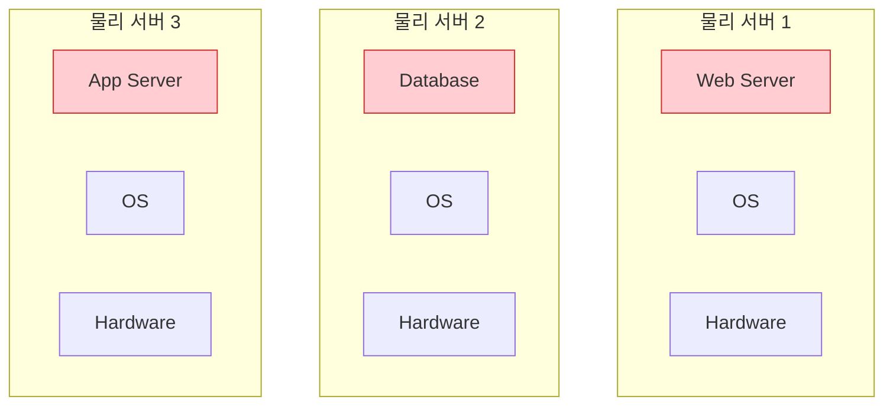
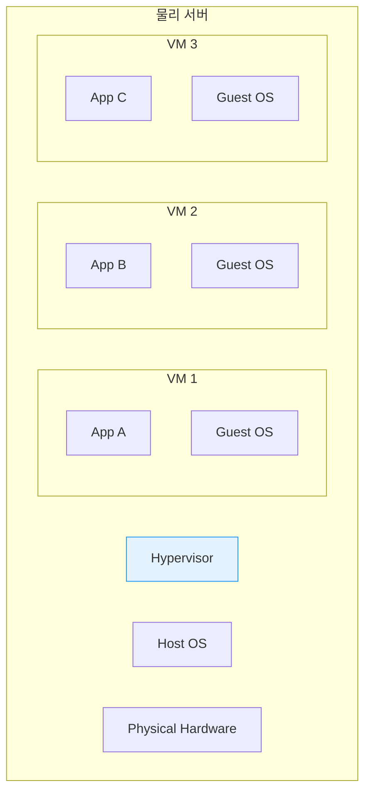
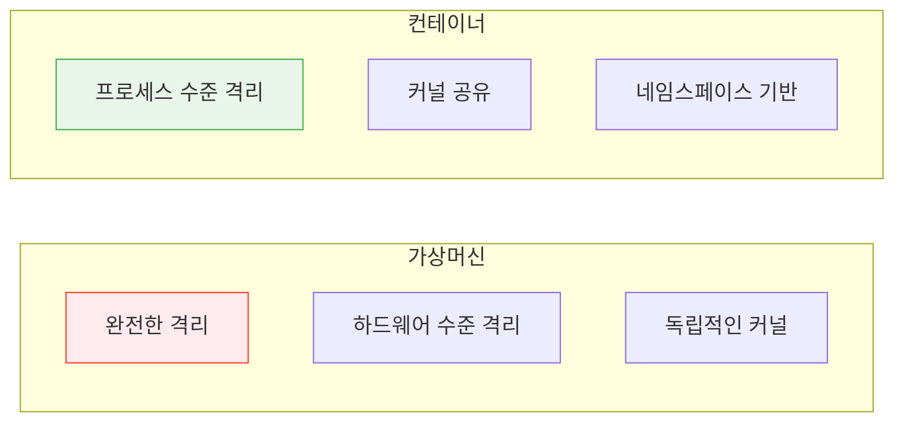

# Session 2: 가상머신 vs 컨테이너

## 📍 교과과정에서의 위치
이 세션은 **Week 1 > Day 2 > Session 2**로, 가상화 기술의 발전 과정을 통해 컨테이너 기술의 위치와 장점을 명확히 이해합니다. 가상머신과 컨테이너의 차이점을 기술적으로 분석하여 적절한 선택 기준을 학습합니다.

## 학습 목표 (5분)
- 가상화 기술의 발전 과정 이해
- 가상머신과 컨테이너의 아키텍처 차이점 파악
- 각 기술의 장단점과 사용 사례 학습

## 1. 가상화 기술의 발전 (15분)

### 물리 서버 시대
**하나의 서버, 하나의 애플리케이션** 방식의 한계:



#### 문제점
- **낮은 자원 활용률**: 평균 10-15% CPU 사용률
- **높은 비용**: 서버마다 별도 하드웨어 필요
- **관리 복잡성**: 물리 서버 개수만큼 관리 포인트 증가
- **확장성 부족**: 하드웨어 추가 시 긴 시간 소요

### 하이퍼바이저 기반 가상화
**하나의 물리 서버에서 여러 가상머신 실행**:



#### 하이퍼바이저 유형
1. **Type 1 (Bare Metal)**: VMware vSphere, Hyper-V
2. **Type 2 (Hosted)**: VMware Workstation, VirtualBox

## 2. 컨테이너 기반 가상화 (20분)

### 컨테이너 아키텍처
**OS 커널을 공유하는 경량 가상화**:


### 핵심 기술 요소
**Linux 커널의 기본 기능을 활용**:

1. **Namespaces**: 프로세스 격리
   - PID: 프로세스 ID 격리
   - NET: 네트워크 격리
   - MNT: 파일 시스템 격리
   - UTS: 호스트명 격리

2. **Control Groups (cgroups)**: 리소스 제한
   - CPU 사용량 제한
   - 메모리 사용량 제한
   - 디스크 I/O 제한

3. **Union File Systems**: 레이어 기반 파일 시스템
   - 이미지 레이어 관리
   - 효율적인 저장공간 사용

## 3. 상세 비교 분석 (10분)

### 성능 비교
**리소스 사용량과 성능 차이**:

| 구분 | 가상머신 | 컨테이너 |
|------|----------|----------|
| **시작 시간** | 수 분 | 수 초 |
| **메모리 오버헤드** | GB 단위 | MB 단위 |
| **디스크 사용량** | 수십 GB | 수백 MB |
| **성능 오버헤드** | 5-10% | 1-2% |

### 격리 수준 비교
**보안과 격리 관점에서의 차이**:



## 4. 사용 사례별 선택 기준 (8분)

### 가상머신이 적합한 경우
**강력한 격리가 필요한 상황**:
- 서로 다른 운영체제 실행
- 높은 보안 요구사항
- 레거시 애플리케이션 마이그레이션
- 멀티 테넌트 환경

### 컨테이너가 적합한 경우
**빠른 배포와 확장이 중요한 상황**:
- 마이크로서비스 아키텍처
- CI/CD 파이프라인
- 클라우드 네이티브 애플리케이션
- 개발 환경 표준화

### 하이브리드 접근법
**두 기술을 함께 사용하는 현실적 방안**:

```mermaid
graph TB
    subgraph "클라우드 인프라"
        subgraph "VM 1 - Web Tier"
            A[Nginx Container]
            B[App Container]
        end
        subgraph "VM 2 - App Tier"
            C[API Container]
            D[Worker Container]
        end
        subgraph "VM 3 - DB Tier"
            E[Database VM]
        end
    end
    
    style E fill:#ffebee,stroke:#f44336
    style A fill:#e8f5e8,stroke:#4caf50
    style B fill:#e8f5e8,stroke:#4caf50
    style C fill=#e8f5e8,stroke=#4caf50
    style D fill=#e8f5e8,stroke=#4caf50
```

## 실습: 비교 분석 (7분)

### 시나리오 분석
"전자상거래 플랫폼을 구축해야 합니다."

#### 요구사항
- 웹 서버 (Nginx)
- 애플리케이션 서버 (Node.js)
- 데이터베이스 (PostgreSQL)
- 캐시 서버 (Redis)

#### 그룹 토론 (5분)
1. 각 컴포넌트별 가상머신 vs 컨테이너 선택
2. 선택 이유와 고려사항
3. 예상되는 장단점

### 발표 및 토론 (2분)

## 다음 세션 예고
Docker의 구체적인 아키텍처와 핵심 컴포넌트들을 자세히 살펴보겠습니다.

## 📚 참고 자료
- [Containers vs VMs - Docker](https://www.docker.com/resources/what-container/)
- [Understanding Container vs VM - Red Hat](https://www.redhat.com/en/topics/containers/containers-vs-vms)
- [Linux Namespaces and cgroups](https://www.nginx.com/blog/what-are-namespaces-cgroups-how-do-they-work/)
- [Hypervisor Types Explained - VMware](https://www.vmware.com/topics/glossary/content/hypervisor.html)