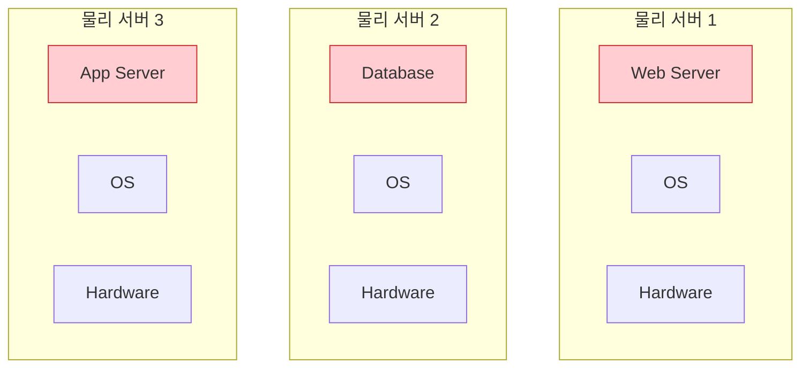
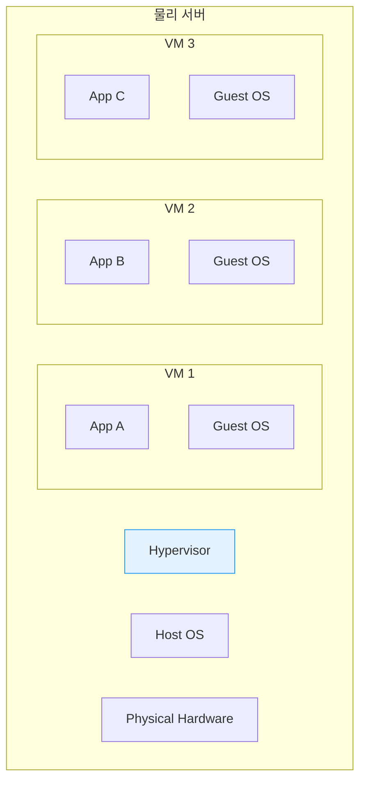
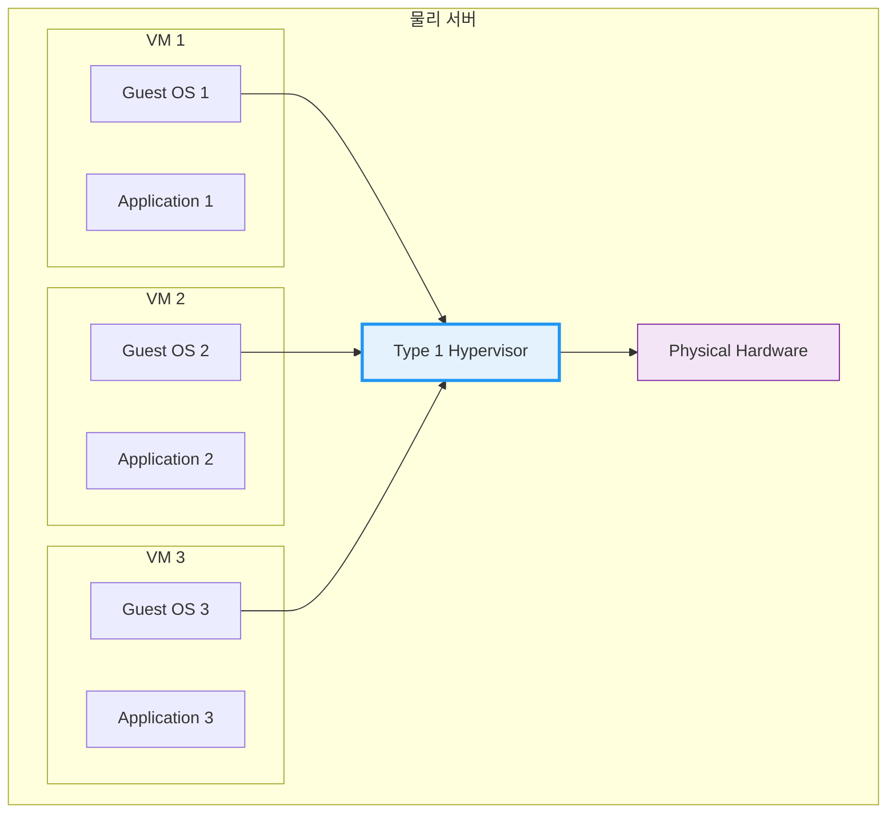
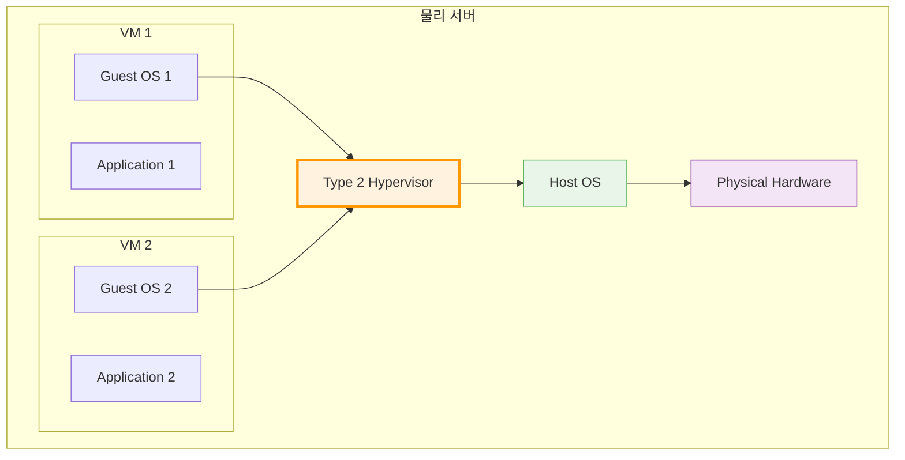
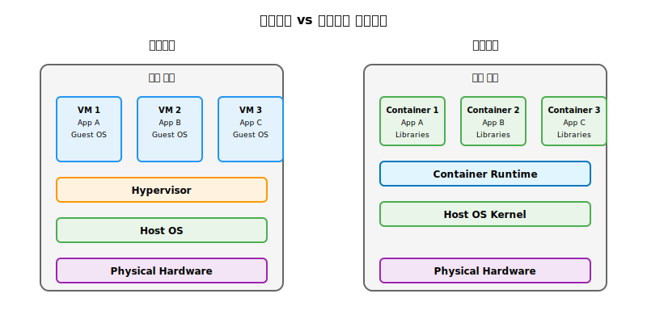
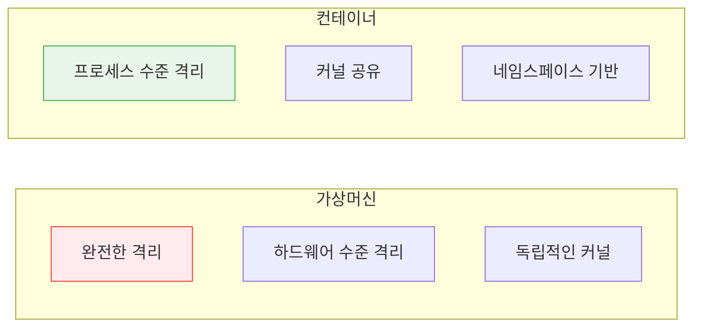
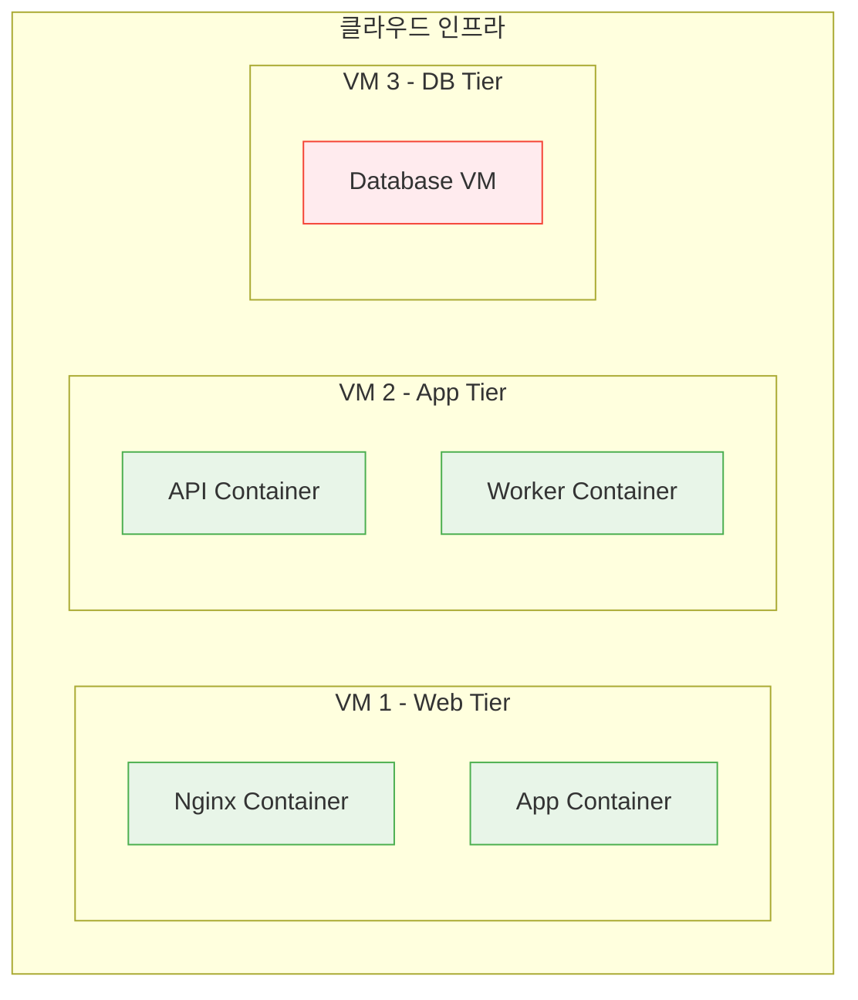

# Session 2: 가상머신 vs 컨테이너

## 📍 교과과정에서의 위치
이 세션은 **Week 1 > Day 2 > Session 2**로, 가상화 기술의 발전 과정을 통해 컨테이너 기술의 위치와 장점을 명확히 이해합니다. 가상머신과 컨테이너의 차이점을 기술적으로 분석하여 적절한 선택 기준을 학습합니다.

## 학습 목표 (5분)
- 가상화 기술의 발전 과정 이해
- 가상머신과 컨테이너의 아키텍처 차이점 파악
- 각 기술의 장단점과 사용 사례 학습

## 1. 가상화 기술의 역사적 진화와 기술적 배경 (20분)

### 가상화 기술의 철학적 기초
**가상화(Virtualization)**는 **물리적 자원을 논리적으로 분할하여 효율성과 유연성을 극대화하는 기술**입니다.

#### 가상화의 근본 개념
**추상화(Abstraction)**와 **격리(Isolation)**의 조합:
- **추상화**: 물리적 자원을 논리적 자원으로 변환
- **격리**: 각 가상 환경의 독립성 보장
- **공유**: 물리적 자원의 효율적 활용
- **관리**: 중앙 집중식 자원 관리

### 물리 서버 시대의 구조적 한계
**"One Server, One Application" 모델의 근본적 문제점:**



#### 물리 서버 모델의 근본적 문제점

**1. 자원 활용률의 비효율성**
```
전형적인 물리 서버 자원 활용률:

┌────────────────────────────────────────┐
│ CPU 사용률:     ███ 15%        (85% 유휴)  │
│ 메모리 사용률:   ████ 20%       (80% 유휴)  │
│ 디스크 사용률:   █████ 25%      (75% 유휴)  │
│ 네트워크 사용률: ██ 10%         (90% 유휴)  │
└────────────────────────────────────────┘

결과: 전체 인프라 비용의 70-80%가 낭비
```

**2. 경제적 비효율성**
- **초기 투자 비용**: 서버당 $10,000-50,000
- **운영 비용**: 전력, 냉각, 데이터센터 공간
- **인력 비용**: 서버별 전담 관리자 필요
- **유지보수 비용**: 하드웨어 장애 대응

**3. 운영상의 복잡성**
- **관리 포인트 증가**: n개 서버 = n개 관리 지점
- **설정 불일치**: 서버별 다른 설정과 환경
- **보안 관리**: 각 서버별 별도 보안 정책 적용
- **백업 및 복구**: 서버별 개별 백업 전략

**4. 확장성과 유연성 부족**
- **하드웨어 의존성**: 특정 하드웨어에 종속
- **스케일링 어려움**: 수직 확장만 가능
- **장애 대응**: 단일 장애점(SPOF) 문제
- **이전 어려움**: 다른 하드웨어로 이전 시 복잡성

### 하이퍼바이저 기반 가상화의 혁신
**가상화 기술의 1차 혁명: 하나의 물리 서버에서 여러 가상머신 실행**

#### 하이퍼바이저의 정의와 역할
**하이퍼바이저(Hypervisor)**는 **물리적 하드웨어 자원을 여러 가상머신에 분할하고 관리하는 소프트웨어 계층**입니다.

**하이퍼바이저의 핵심 기능:**
- **자원 분할**: CPU, 메모리, 스토리지, 네트워크 자원 분배
- **격리 보장**: 각 VM의 독립성과 보안 유지
- **스케줄링**: 자원 사용률에 따른 동적 자원 할당
- **상태 관리**: VM의 생성, 시작, 중지, 삭제 관리



#### 하이퍼바이저 유형별 상세 분석

**Type 1 하이퍼바이저 (Bare Metal)**


**특징:**
- **직접 하드웨어 제어**: 물리 하드웨어에 직접 설치
- **최적 성능**: 호스트 OS 오버헤드 없음
- **엔터프라이즈급**: 데이터센터 환경에 적합
- **대표 제품**: VMware vSphere, Microsoft Hyper-V, Citrix XenServer

**Type 2 하이퍼바이저 (Hosted)**


**특징:**
- **호스트 OS 위에 설치**: 기존 운영체제 위에서 동작
- **사용 편의성**: 일반 사용자도 쉽게 사용
- **개발/테스트용**: 데스크톱 가상화에 적합
- **대표 제품**: VMware Workstation, Oracle VirtualBox, Parallels Desktop

## 2. 컨테이너 기반 가상화의 혁신적 접근법 (22분)

### 컨테이너 아키텍처
**OS 커널을 공유하는 경량 가상화**:



### 핵심 기술 요소
**Linux 커널의 기본 기능을 활용**:

1. **Namespaces**: 프로세스 격리
   - PID: 프로세스 ID 격리
   - NET: 네트워크 격리
   - MNT: 파일 시스템 격리
   - UTS: 호스트명 격리

2. **Control Groups (cgroups)**: 리소스 제한
   - CPU 사용량 제한
   - 메모리 사용량 제한
   - 디스크 I/O 제한

3. **Union File Systems**: 레이어 기반 파일 시스템
   - 이미지 레이어 관리
   - 효율적인 저장공간 사용

## 3. 상세 비교 분석 (10분)

### 성능 비교
**리소스 사용량과 성능 차이**:

| 구분 | 가상머신 | 컨테이너 |
|------|----------|----------|
| **시작 시간** | 수 분 | 수 초 |
| **메모리 오버헤드** | GB 단위 | MB 단위 |
| **디스크 사용량** | 수십 GB | 수백 MB |
| **성능 오버헤드** | 5-10% | 1-2% |

### 격리 수준 비교
**보안과 격리 관점에서의 차이**:



## 4. 사용 사례별 선택 기준 (8분)

### 가상머신이 적합한 경우
**강력한 격리가 필요한 상황**:
- 서로 다른 운영체제 실행
- 높은 보안 요구사항
- 레거시 애플리케이션 마이그레이션
- 멀티 테넌트 환경

### 컨테이너가 적합한 경우
**빠른 배포와 확장이 중요한 상황**:
- 마이크로서비스 아키텍처
- CI/CD 파이프라인
- 클라우드 네이티브 애플리케이션
- 개발 환경 표준화

### 하이브리드 접근법
**두 기술을 함께 사용하는 현실적 방안**:



## 실습: 비교 분석 (7분)

### 시나리오 분석
"전자상거래 플랫폼을 구축해야 합니다."

#### 요구사항
- 웹 서버 (Nginx)
- 애플리케이션 서버 (Node.js)
- 데이터베이스 (PostgreSQL)
- 캐시 서버 (Redis)

#### 그룹 토론 (5분)
1. 각 컴포넌트별 가상머신 vs 컨테이너 선택
2. 선택 이유와 고려사항
3. 예상되는 장단점

### 발표 및 토론 (2분)

## 다음 세션 예고
Docker의 구체적인 아키텍처와 핵심 컴포넌트들을 자세히 살펴보겠습니다.

## 📚 참고 자료
- [Containers vs VMs - Docker](https://www.docker.com/resources/what-container/)
- [Understanding Container vs VM - Red Hat](https://www.redhat.com/en/topics/containers/containers-vs-vms)
- [Linux Namespaces and cgroups](https://www.nginx.com/blog/what-are-namespaces-cgroups-how-do-they-work/)
- [Hypervisor Types Explained - VMware](https://www.vmware.com/topics/glossary/content/hypervisor.html)