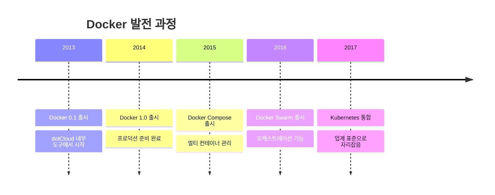
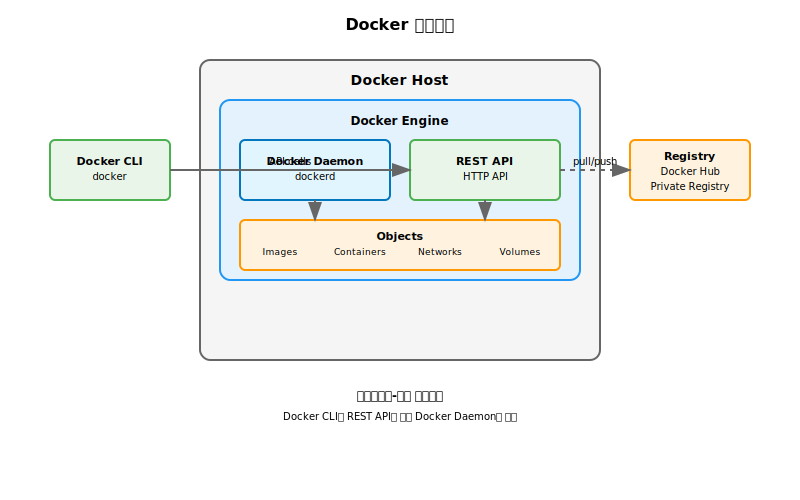
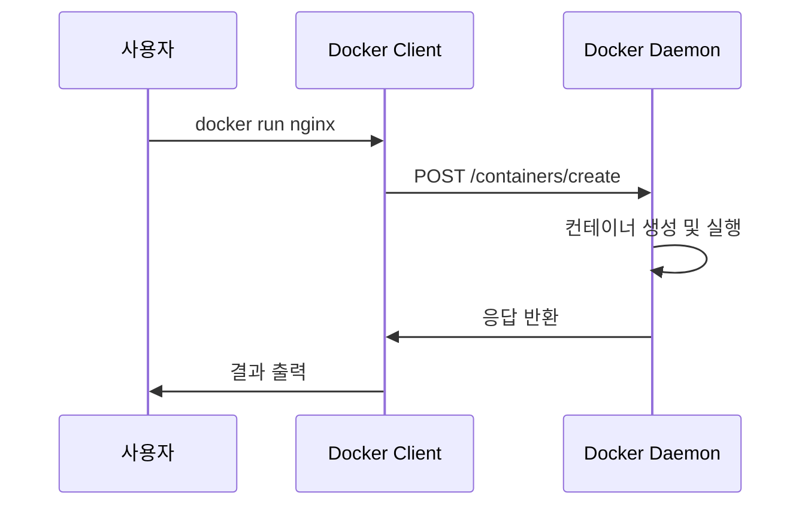
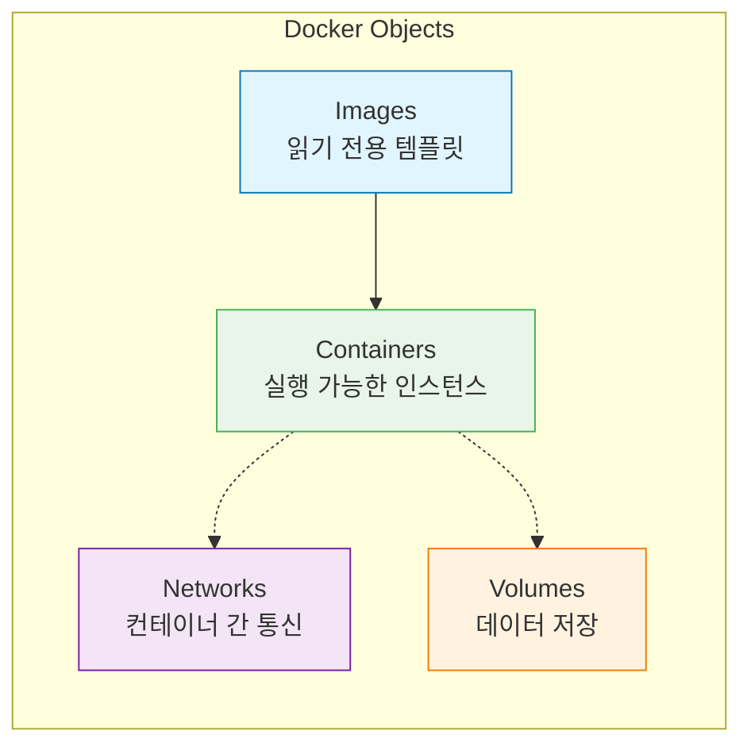
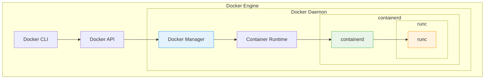
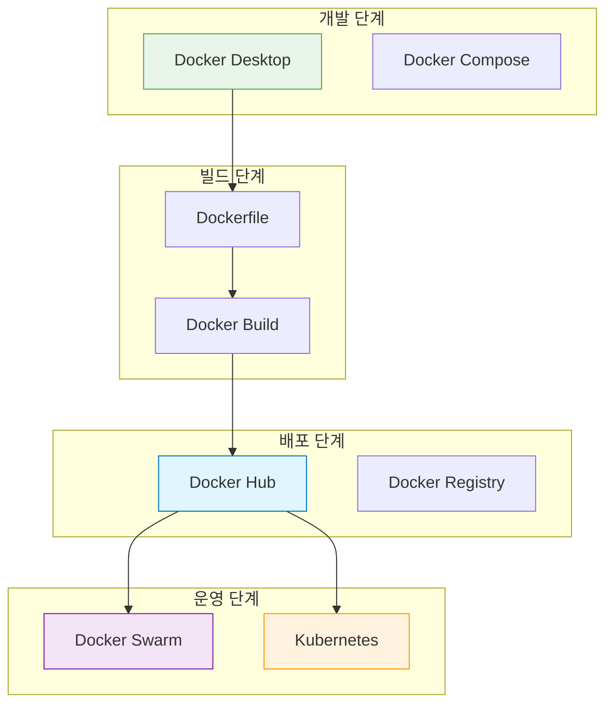

# Session 3: Docker 소개 및 아키텍처

## 📍 교과과정에서의 위치
이 세션은 **Week 1 > Day 2 > Session 3**으로, 컨테이너 기술의 대표주자인 Docker의 등장 배경과 아키텍처를 학습합니다. 내일부터 시작할 실습의 이론적 기초가 되는 중요한 내용입니다.

## 학습 목표 (5분)
- Docker의 등장 배경과 혁신적 특징 이해
- Docker 아키텍처의 핵심 구성 요소 파악
- Docker Engine과 주요 컴포넌트 학습

## 1. Docker의 등장 배경 (15분)

### 컨테이너 기술의 복잡성
**Docker 이전의 컨테이너 기술 사용의 어려움**:

#### LXC(Linux Containers)의 한계
**LXC**는 Linux 커널의 cgroups와 namespaces를 활용한 초기 컨테이너 기술로:
- **복잡한 설정**: 수동으로 cgroups, namespaces, chroot 환경 구성 필요
- **전문 지식 요구**: Linux 커널 내부 동작 원리에 대한 깊은 이해 필수
- **제한적인 도구**: 명령줄 기반의 기본적인 관리 도구만 존재
- **표준화 부족**: 각 배포판마다 다른 구현 방식과 설정 방법
- **이식성 문제**: 환경 간 이동 시 복잡한 재설정 과정 필요

### Docker의 혁신
**Docker**는 **컨테이너 기술을 누구나 쉽게 사용할 수 있도록 추상화한 플랫폼**입니다.

#### Docker의 정의
**Docker**는 애플리케이션을 컨테이너라는 가벼운 가상화 환경에 패키징하고 실행할 수 있게 해주는 오픈소스 플랫폼입니다. 2013년 dotCloud(현 Docker Inc.)에서 오픈소스로 공개되었습니다.



### Docker가 가져온 변화
**컨테이너 기술의 대중화를 이끈 핵심 요소들**:

1. **간단한 사용법**: 직관적인 명령어 인터페이스
2. **이미지 생태계**: Docker Hub를 통한 이미지 공유
3. **개발자 친화적**: 기존 워크플로우와 자연스러운 통합
4. **풍부한 도구**: 개발부터 운영까지 전 과정 지원

## 2. Docker 아키텍처 개요 (20분)

### 클라이언트-서버 아키텍처
**Docker는 클라이언트-서버 모델을 기반**으로 동작합니다:



### 핵심 구성 요소

#### 1. Docker Client
**Docker Client**는 사용자가 Docker와 상호작용하는 **명령줄 인터페이스(CLI)**입니다.

**주요 특징**:
- **CLI 제공**: `docker run`, `docker build`, `docker pull` 등의 직관적인 명령어
- **REST API 통신**: HTTP 기반의 RESTful API를 통해 Docker Daemon과 통신
- **원격 제어**: 네트워크를 통해 원격 Docker Daemon 제어 가능
- **플랫폼 독립적**: Windows, macOS, Linux에서 동일한 명령어 사용

**동작 원리**:


#### 2. Docker Daemon (dockerd)
**Docker Daemon**은 Docker의 **핵심 백그라운드 서비스**로, 모든 Docker 작업을 실제로 수행하는 엔진입니다.

**주요 역할**:
- **리소스 관리**: Images, Containers, Networks, Volumes의 전체 생명주기 관리
- **API 서버**: Docker REST API 엔드포인트 제공 및 요청 처리
- **보안 관리**: 컨테이너 격리, 권한 제어, 네트워크 보안
- **클러스터 통신**: 다른 Docker Daemon과의 통신으로 Swarm 모드 지원

**시스템에서의 위치**:
- **Linux**: systemd 서비스로 실행 (`systemctl status docker`)
- **Windows/macOS**: Docker Desktop 내부에서 VM으로 실행
- **포트**: 기본적으로 Unix 소켓 사용, 필요시 TCP 포트(2376) 개방

#### 3. Docker Objects
**Docker가 관리하는 주요 객체들**:



## 3. Docker Engine 상세 분석 (12분)

### Docker Engine 구성
**모듈화된 아키텍처로 구성**:



### 런타임 계층 구조
**컨테이너 실행을 위한 계층별 역할**:

#### 1. High-level Runtime (containerd)
**containerd**는 **컨테이너의 전체 생명주기를 관리하는 고수준 런타임**입니다.

**핵심 기능**:
- **이미지 관리**: 이미지 다운로드, 저장, 압축 해제, 레이어 관리
- **컨테이너 생명주기**: 생성, 시작, 중지, 삭제의 전체 과정 관리
- **네트워크 관리**: CNI(Container Network Interface) 플러그인 연동
- **스토리지 관리**: 볼륨 마운트, 파일 시스템 격리
- **메타데이터 관리**: 컨테이너 상태 정보, 설정 데이터 저장

**CNCF 프로젝트**: 2017년 Docker에서 분리되어 독립적인 오픈소스 프로젝트가 됨

#### 2. Low-level Runtime (runc)
**runc**는 **실제 컨테이너를 생성하고 실행하는 저수준 런타임**입니다.

**핵심 기능**:
- **OCI 표준 구현**: Open Container Initiative Runtime Specification 완전 구현
- **커널 인터페이스**: Linux namespaces, cgroups, capabilities 직접 조작
- **프로세스 생성**: 격리된 환경에서 애플리케이션 프로세스 실행
- **보안 적용**: seccomp, AppArmor, SELinux 등 보안 정책 적용

**동작 과정**:
1. OCI 번들(config.json + rootfs) 수신
2. Linux namespaces 생성 (PID, NET, MNT, UTS, IPC, USER)
3. cgroups 설정으로 리소스 제한
4. 루트 파일 시스템 마운트
5. 애플리케이션 프로세스 실행

### OCI 표준
**OCI(Open Container Initiative)**는 **컨테이너 기술의 개방형 표준을 정의하는 Linux Foundation 프로젝트**입니다.

#### OCI의 목적
- **상호 운용성**: 다양한 컨테이너 런타임 간 호환성 보장
- **벤더 중립성**: 특정 회사에 종속되지 않는 개방형 표준
- **혁신 촉진**: 표준화를 통한 생태계 발전

#### 3가지 핵심 명세

**1. Runtime Specification (runtime-spec)**
- **목적**: 컨테이너 실행 환경의 표준 정의
- **내용**: config.json 형식, 생명주기 관리, 보안 설정
- **구현체**: runc, crun, kata-runtime

**2. Image Specification (image-spec)**
- **목적**: 컨테이너 이미지 포맷의 표준 정의
- **내용**: 레이어 구조, 메타데이터, 매니페스트 형식
- **호환성**: Docker Image Format v2와 호환

**3. Distribution Specification (distribution-spec)**
- **목적**: 이미지 배포 프로토콜의 표준 정의
- **내용**: 레지스트리 API, 인증, 이미지 전송 방식
- **구현체**: Docker Registry, Harbor, Quay

## 4. Docker 생태계 (8분)

### Docker 도구들
**개발부터 운영까지 전 과정을 지원**하는 도구 모음:



### Docker Hub
**Docker Hub**는 **클라우드 기반의 컨테이너 이미지 레지스트리 서비스**로, Docker의 공식 이미지 저장소입니다.

#### 주요 기능
**1. 이미지 저장소**
- **공식 이미지**: Docker에서 공식 관리하는 검증된 이미지 (nginx, mysql, node 등)
- **인증된 게시자**: Microsoft, Oracle 등 검증된 기업의 이미지
- **커뮤니티 이미지**: 개발자들이 공유하는 오픈소스 이미지

**2. 자동 빌드**
- **GitHub/Bitbucket 연동**: 소스 코드 변경 시 자동으로 이미지 빌드
- **Webhook 지원**: 빌드 완료 시 알림 및 후속 작업 트리거
- **멀티 아키텍처**: x86, ARM 등 다양한 아키텍처 지원

**3. 보안 기능**
- **취약점 스캔**: 이미지 내 알려진 보안 취약점 자동 검사
- **이미지 서명**: Docker Content Trust를 통한 이미지 무결성 보장
- **프라이빗 리포지토리**: 기업용 비공개 이미지 저장

**4. 요금제**
- **Free**: 무제한 공개 리포지토리, 1개 프라이빗 리포지토리
- **Pro**: 무제한 프라이빗 리포지토리, 고급 보안 기능
- **Team/Business**: 팀 협업 기능, 엔터프라이즈 보안

### 대안 기술들
**Docker 생태계의 경쟁 기술들**:

#### Podman
**Podman**은 **Red Hat에서 개발한 데몬리스(daemonless) 컨테이너 엔진**입니다.

**주요 특징**:
- **데몬리스 아키텍처**: 백그라운드 데몬 없이 직접 컨테이너 실행
- **루트리스 실행**: 일반 사용자 권한으로 컨테이너 실행 가능
- **Docker 호환성**: Docker CLI와 거의 동일한 명령어 지원
- **Pod 지원**: Kubernetes Pod 개념을 로컬에서 구현

#### containerd
**containerd**는 **Docker에서 분리된 독립적인 컨테이너 런타임**입니다.

**주요 특징**:
- **CNCF 프로젝트**: Cloud Native Computing Foundation의 졸업 프로젝트
- **Kubernetes 기본**: Kubernetes의 기본 컨테이너 런타임
- **경량화**: Docker보다 가벼운 리소스 사용
- **API 중심**: gRPC API를 통한 프로그래밍 방식 제어

#### CRI-O
**CRI-O**는 **Kubernetes 전용으로 설계된 경량 컨테이너 런타임**입니다.

**주요 특징**:
- **CRI 구현**: Kubernetes Container Runtime Interface 완전 구현
- **OCI 호환**: OCI 표준 완전 준수
- **최소 기능**: Kubernetes에 필요한 기능만 제공
- **Red Hat 지원**: OpenShift의 기본 런타임

## 실습 준비: Docker 구성 요소 확인 (5분)

### 설치된 Docker 정보 확인
```bash
# Docker 버전 정보
docker version

# Docker 시스템 정보
docker system info

# Docker 구성 요소 상태 확인
docker system df
```

### Docker Daemon 상태 확인
```bash
# Windows/Mac (Docker Desktop)
# GUI에서 Docker 상태 확인

# Linux
sudo systemctl status docker
```

## 다음 세션 예고
Docker의 핵심 개념인 이미지와 컨테이너의 관계, 그리고 레이어 구조에 대해 자세히 알아보겠습니다.

## 📚 참고 자료
- [Docker Architecture - Docker Docs](https://docs.docker.com/get-started/overview/)
- [Docker Engine Overview](https://docs.docker.com/engine/)
- [containerd Architecture](https://containerd.io/docs/getting-started/)
- [OCI Specifications](https://opencontainers.org/)
- [Docker vs Podman Comparison](https://www.redhat.com/en/topics/containers/what-is-podman)