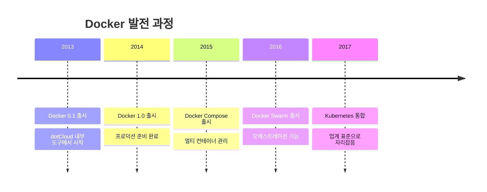

# Session 3: Docker 소개 및 아키텍처

## 📍 교과과정에서의 위치
이 세션은 **Week 1 > Day 2 > Session 3**으로, 컨테이너 기술의 대표주자인 Docker의 등장 배경과 아키텍처를 학습합니다. 내일부터 시작할 실습의 이론적 기초가 되는 중요한 내용입니다.

## 학습 목표 (5분)
- Docker의 등장 배경과 혁신적 특징 이해
- Docker 아키텍처의 핵심 구성 요소 파악
- Docker Engine과 주요 컴포넌트 학습

## 1. Docker의 등장 배경 (15분)

### 컨테이너 기술의 복잡성
**Docker 이전의 컨테이너 기술 사용의 어려움**:
- 복잡한 설정과 관리
- 전문 지식 요구
- 제한적인 도구와 생태계
- 표준화 부족

### Docker의 혁신
**2013년 dotCloud(현 Docker Inc.)에서 오픈소스로 공개**:



### Docker가 가져온 변화
**컨테이너 기술의 대중화를 이끈 핵심 요소들**:

1. **간단한 사용법**: 직관적인 명령어 인터페이스
2. **이미지 생태계**: Docker Hub를 통한 이미지 공유
3. **개발자 친화적**: 기존 워크플로우와 자연스러운 통합
4. **풍부한 도구**: 개발부터 운영까지 전 과정 지원

## 2. Docker 아키텍처 개요 (20분)

### 클라이언트-서버 아키텍처
**Docker는 클라이언트-서버 모델을 기반**으로 동작합니다:


### 핵심 구성 요소

#### 1. Docker Client
**사용자가 Docker와 상호작용하는 인터페이스**:
- `docker` 명령어 제공
- REST API를 통해 Docker Daemon과 통신
- 로컬 또는 원격 Docker Daemon 제어 가능

#### 2. Docker Daemon (dockerd)
**Docker의 핵심 서비스**로 다음 기능을 담당:
- 이미지, 컨테이너, 네트워크, 볼륨 관리
- Docker API 요청 처리
- 다른 Docker Daemon과 통신

#### 3. Docker Objects
**Docker가 관리하는 주요 객체들**:

```mermaid
graph LR
    subgraph "Docker Objects"
        A[Images<br/>읽기 전용 템플릿]
        B[Containers<br/>실행 가능한 인스턴스]
        C[Networks<br/>컨테이너 간 통신]
        D[Volumes<br/>데이터 저장]
    end
    
    A --> B
    B -.-> C
    B -.-> D
    
    style A fill:#e1f5fe,stroke:#0277bd
    style B fill=#e8f5e8,stroke=#4caf50
    style C fill=#f3e5f5,stroke=#7b1fa2
    style D fill=#fff3e0,stroke=#f57c00
```

## 3. Docker Engine 상세 분석 (12분)

### Docker Engine 구성
**모듈화된 아키텍처로 구성**:

```mermaid
graph TB
    subgraph "Docker Engine"
        CLI[Docker CLI]
        API[Docker API]
        
        subgraph "Docker Daemon"
            DM[Docker Manager]
            CR[Container Runtime]
            subgraph "containerd"
                CT[containerd]
                subgraph "runc"
                    RC[runc]
                end
            end
        end
    end
    
    CLI --> API
    API --> DM
    DM --> CR
    CR --> CT
    CT --> RC
    
    style DM fill:#e3f2fd,stroke:#2196f3
    style CT fill=#e8f5e8,stroke:#4caf50
    style RC fill=#fff3e0,stroke:#ff9800
```

### 런타임 계층 구조
**컨테이너 실행을 위한 계층별 역할**:

1. **High-level Runtime (containerd)**
   - 이미지 관리 및 전송
   - 컨테이너 라이프사이클 관리
   - 네트워크 및 스토리지 관리

2. **Low-level Runtime (runc)**
   - OCI(Open Container Initiative) 표준 구현
   - 실제 컨테이너 생성 및 실행
   - Linux 커널과 직접 상호작용

### OCI 표준
**컨테이너 기술의 표준화**를 위한 노력:
- **Runtime Specification**: 컨테이너 실행 표준
- **Image Specification**: 이미지 포맷 표준
- **Distribution Specification**: 이미지 배포 표준

## 4. Docker 생태계 (8분)

### Docker 도구들
**개발부터 운영까지 전 과정을 지원**하는 도구 모음:

```mermaid
graph TB
    subgraph "개발 단계"
        A[Docker Desktop]
        B[Docker Compose]
    end
    
    subgraph "빌드 단계"
        C[Docker Build]
        D[Dockerfile]
    end
    
    subgraph "배포 단계"
        E[Docker Hub]
        F[Docker Registry]
    end
    
    subgraph "운영 단계"
        G[Docker Swarm]
        H[Kubernetes]
    end
    
    A --> D
    D --> C
    C --> E
    E --> G
    E --> H
    
    style A fill:#e8f5e8,stroke:#4caf50
    style E fill:#e1f5fe,stroke:#0277bd
    style G fill:#f3e5f5,stroke:#7b1fa2
    style H fill=#fff3e0,stroke=#ff9800
```

### Docker Hub
**세계 최대의 컨테이너 이미지 레지스트리**:
- 공식 이미지 제공 (nginx, mysql, node 등)
- 커뮤니티 이미지 공유
- 자동 빌드 기능
- 무료 및 유료 플랜 제공

### 대안 기술들
**Docker 생태계의 경쟁 기술들**:
- **Podman**: Red Hat의 데몬리스 컨테이너 엔진
- **containerd**: Docker에서 분리된 런타임
- **CRI-O**: Kubernetes 전용 런타임

## 실습 준비: Docker 구성 요소 확인 (5분)

### 설치된 Docker 정보 확인
```bash
# Docker 버전 정보
docker version

# Docker 시스템 정보
docker system info

# Docker 구성 요소 상태 확인
docker system df
```

### Docker Daemon 상태 확인
```bash
# Windows/Mac (Docker Desktop)
# GUI에서 Docker 상태 확인

# Linux
sudo systemctl status docker
```

## 다음 세션 예고
Docker의 핵심 개념인 이미지와 컨테이너의 관계, 그리고 레이어 구조에 대해 자세히 알아보겠습니다.

## 📚 참고 자료
- [Docker Architecture - Docker Docs](https://docs.docker.com/get-started/overview/)
- [Docker Engine Overview](https://docs.docker.com/engine/)
- [containerd Architecture](https://containerd.io/docs/getting-started/)
- [OCI Specifications](https://opencontainers.org/)
- [Docker vs Podman Comparison](https://www.redhat.com/en/topics/containers/what-is-podman)