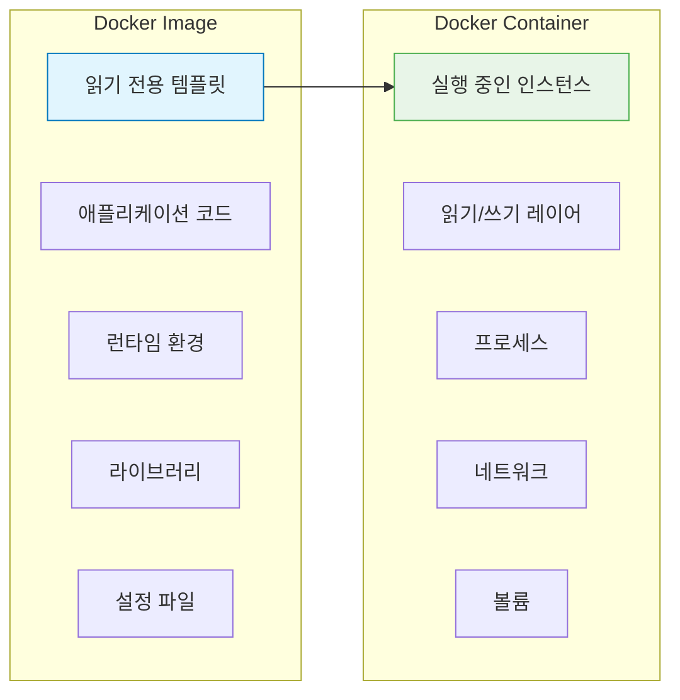
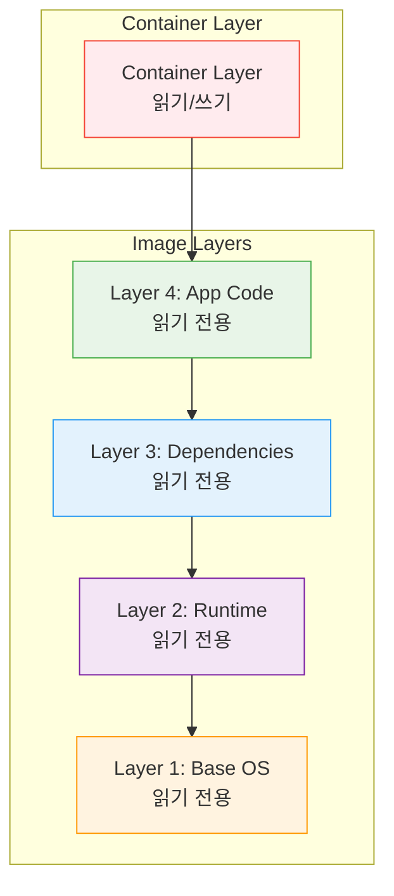
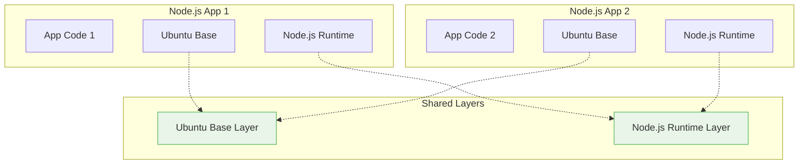

# Session 4: Docker 이미지와 컨테이너

## 📍 교과과정에서의 위치
이 세션은 **Week 1 > Day 2 > Session 4**로, Docker의 핵심 개념인 이미지와 컨테이너의 관계를 학습합니다. 레이어 구조와 Union File System을 이해하여 Docker의 효율성과 이식성의 원리를 파악합니다.

## 학습 목표 (5분)
- 이미지와 컨테이너의 개념과 관계 이해
- 레이어 구조와 Union File System 학습
- 이미지 레지스트리의 역할과 중요성 파악

## 1. 이미지와 컨테이너의 관계 (15분)

### 기본 개념
**이미지는 설계도, 컨테이너는 실제 건물**과 같은 관계입니다:



### 이미지의 특징
**불변성(Immutable)과 재사용성**이 핵심:
- **읽기 전용**: 한 번 생성되면 변경 불가
- **버전 관리**: 태그를 통한 버전 구분
- **재사용 가능**: 여러 컨테이너가 동일 이미지 사용
- **계층 구조**: 레이어 기반으로 구성

### 컨테이너의 특징
**이미지를 기반으로 한 실행 가능한 인스턴스**:
- **상태 변경 가능**: 실행 중 데이터 변경 가능
- **임시성**: 삭제 시 변경사항 소실
- **격리성**: 다른 컨테이너와 독립적 실행

## 2. 레이어 구조 (20분)

### Union File System 개념
**여러 레이어를 하나의 파일 시스템으로 통합**하는 기술:



### 레이어 생성 과정
**Dockerfile의 각 명령어가 새로운 레이어를 생성**:

```dockerfile
FROM ubuntu:20.04          # Layer 1: Base OS
RUN apt-get update         # Layer 2: Package update
RUN apt-get install -y nginx  # Layer 3: Nginx installation
COPY app.js /app/          # Layer 4: Application code
CMD ["nginx", "-g", "daemon off;"]  # Layer 5: Command
```

### 레이어 공유의 효율성
**동일한 베이스 이미지를 사용하는 경우의 이점**:



**공유를 통한 이점**:
- 디스크 공간 절약
- 네트워크 전송량 감소
- 이미지 다운로드 속도 향상

## 3. 이미지 식별과 태그 (10분)

### 이미지 명명 규칙
**레지스트리/네임스페이스/리포지토리:태그** 형식:

```
docker.io/library/nginx:1.21-alpine
│         │       │     │
│         │       │     └── 태그 (버전)
│         │       └────── 리포지토리 (이미지명)
│         └────────────── 네임스페이스 (사용자/조직)
└──────────────────────── 레지스트리 (저장소)
```

### 태그 전략
**효과적인 이미지 버전 관리**를 위한 태그 사용법:

| 태그 유형 | 예시 | 용도 |
|-----------|------|------|
| **Semantic Version** | `1.2.3`, `2.0.0` | 정확한 버전 지정 |
| **Major Version** | `1`, `2` | 주 버전 추적 |
| **Latest** | `latest` | 최신 버전 (기본값) |
| **Environment** | `dev`, `staging`, `prod` | 환경별 구분 |
| **Feature** | `feature-auth` | 기능별 구분 |

### 이미지 다이제스트
**SHA256 해시를 통한 정확한 이미지 식별**:
```bash
# 다이제스트로 이미지 참조
docker pull nginx@sha256:abc123...

# 이미지 다이제스트 확인
docker images --digests
```

## 4. 이미지 레지스트리 (12분)

### Docker Hub
**공식 이미지 레지스트리**의 특징과 활용:

```mermaid
graph TB
    subgraph "Docker Hub"
        A[Official Images<br/>nginx, mysql, node]
        B[Verified Publisher<br/>Microsoft, Oracle]
        C[Community Images<br/>개인/조직 이미지]
    end
    
    subgraph "Local Development"
        D[docker pull]
        E[docker push]
    end
    
    A --> D
    B --> D
    C --> D
    E --> C
    
    style A fill:#e8f5e8,stroke:#4caf50
    style B fill=#e1f5fe,stroke=#0277bd
    style C fill=#fff3e0,stroke=#ff9800
```

#### 이미지 품질 지표
- **Official**: Docker에서 공식 관리
- **Verified Publisher**: 검증된 게시자
- **Stars**: 커뮤니티 평가
- **Downloads**: 다운로드 수

### 프라이빗 레지스트리
**기업 환경에서의 보안과 제어**를 위한 선택지:

1. **Docker Registry**: 오픈소스 레지스트리
2. **Harbor**: CNCF 프로젝트, 보안 기능 강화
3. **AWS ECR**: Amazon Elastic Container Registry
4. **Azure ACR**: Azure Container Registry
5. **Google GCR**: Google Container Registry

### 레지스트리 보안
**이미지 보안을 위한 필수 고려사항**:
- **취약점 스캔**: 알려진 보안 취약점 검사
- **이미지 서명**: 무결성 검증
- **접근 제어**: 인증 및 권한 관리
- **감사 로그**: 이미지 사용 추적

## 실습: 이미지 레이어 분석 (8분)

### 이미지 히스토리 확인
```bash
# 이미지 레이어 확인
docker history nginx:alpine

# 이미지 상세 정보 확인
docker inspect nginx:alpine

# 레이어별 크기 확인
docker images --format "table {{.Repository}}\t{{.Tag}}\t{{.Size}}"
```

### 실습 과제
**다음 명령어들을 실행하고 결과를 분석해보세요**:

1. 여러 이미지의 레이어 구조 비교
2. 동일한 베이스 이미지를 사용하는 이미지들 찾기
3. 이미지 크기와 레이어 수의 관계 분석

## 다음 세션 예고
컨테이너의 생성부터 삭제까지의 전체 라이프사이클과 상태 관리에 대해 학습하겠습니다.

## 📚 참고 자료
- [Docker Images and Layers](https://docs.docker.com/storage/storagedriver/)
- [Docker Hub Official Images](https://docs.docker.com/docker-hub/official_images/)
- [Image Naming Best Practices](https://docs.docker.com/develop/dev-best-practices/)
- [Union File Systems Explained](https://docs.docker.com/storage/storagedriver/overlayfs-driver/)
- [Container Registry Comparison](https://landscape.cncf.io/card-mode?category=container-registry)