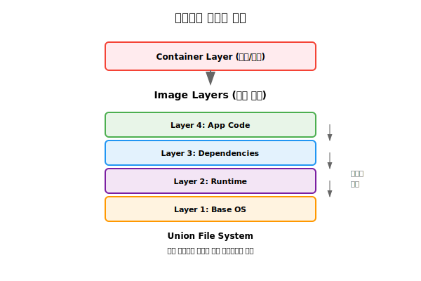
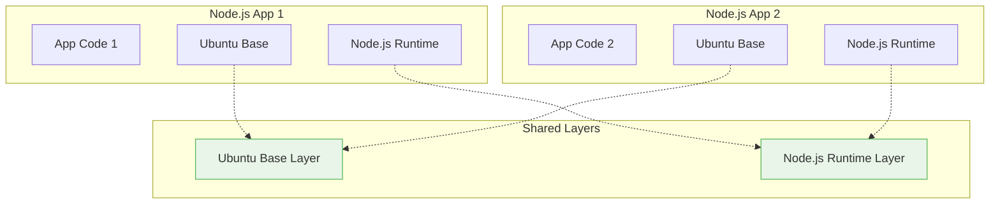
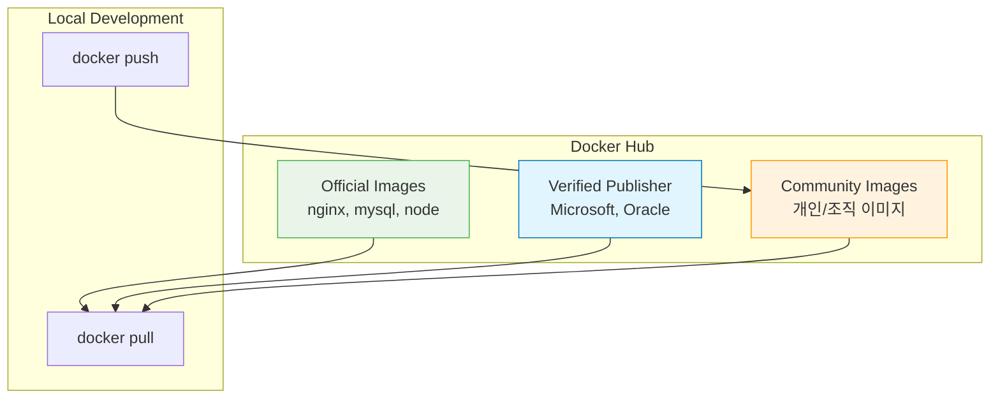

# Session 4: Docker 이미지와 컨테이너

## 📍 교과과정에서의 위치
이 세션은 **Week 1 > Day 2 > Session 4**로, Docker의 핵심 개념인 이미지와 컨테이너의 관계를 학습합니다. 레이어 구조와 Union File System을 이해하여 Docker의 효율성과 이식성의 원리를 파악합니다.

## 학습 목표 (5분)
- 이미지와 컨테이너의 개념과 관계 이해
- 레이어 구조와 Union File System 학습
- 이미지 레지스트리의 역할과 중요성 파악

## 1. 이미지와 컨테이너의 철학적 관계와 설계 원리 (18분)

### 기본 개념
**이미지는 설계도, 컨테이너는 실제 건물**과 같은 관계입니다:


### 이미지의 특징
**Docker 이미지**는 **컨테이너를 생성하기 위한 읽기 전용 템플릿**입니다.

#### 1. 불변성(Immutability)
**이미지는 한 번 생성되면 절대 변경되지 않습니다.**
- 읽기 전용: 이미지 내용을 수정할 수 없음
- 일관성 보장: 언제 어디서 실행해도 동일한 결과
- 보안 이점: 예상치 못한 변경으로부터 보호
- 재현성: 동일한 이미지로 동일한 컨테이너 생성 보장

#### 2. 버전 관리
**태그(Tag) 시스템을 통한 체계적인 버전 관리**
- 시맨틱 버전: `1.0.0`, `2.1.3` 등 의미 있는 버전 번호
- 환경별 태그: `dev`, `staging`, `prod` 등 배포 환경 구분
- 기능별 태그: `feature-auth`, `hotfix-security` 등
- latest 태그: 기본 태그로 최신 버전 지시

#### 3. 재사용성
**하나의 이미지로 여러 컨테이너 생성 가능**
- 메모리 효율성: 동일 이미지를 메모리에서 공유
- 디스크 절약: 이미지 레이어 공유로 저장공간 절약
- 빠른 시작: 이미 로드된 이미지로 즉시 컨테이너 생성

#### 4. 계층 구조
**레이어(Layer) 기반의 적층 구조**
- 베이스 레이어: 기본 운영체제 레이어
- 애플리케이션 레이어: 런타임, 라이브러리, 애플리케이션 코드
- 설정 레이어: 환경 변수, 설정 파일
- 메타데이터 레이어: 실행 명령어, 포트 정보

### 컨테이너의 특징
**Docker 컨테이너**는 **이미지를 기반으로 생성된 실행 가능한 인스턴스**입니다.

#### 1. 상태 변경 가능성
**컨테이너는 실행 중에 데이터를 변경할 수 있습니다.**
- 쓰기 가능 레이어: 이미지 위에 쓰기 가능한 레이어 추가
- 파일 시스템 변경: 새 파일 생성, 기존 파일 수정
- 네트워크 상태: 네트워크 연결 상태 변화
- 프로세스 상태: 실행 중인 프로세스의 메모리 상태

#### 2. 임시성(Ephemeral)
**컨테이너가 삭제되면 변경사항이 모두 사라집니다.**
- 비영구적 데이터: 컨테이너 내부 변경사항은 임시적
- 상태리스 설계: 중요한 데이터는 외부 저장소에 보관
- 빠른 재시작: 새 컨테이너로 빠른 복구 가능
- 스케일링 용이: 인스턴스 수 증감이 자유로움

#### 3. 격리성(Isolation)
**각 컨테이너는 다른 컨테이너와 독립적으로 동작합니다.**
- 프로세스 격리: 다른 컨테이너의 프로세스에 접근 불가
- 네트워크 격리: 독립적인 네트워크 네임스페이스
- 파일 시스템 격리: 독립적인 루트 파일 시스템
- 리소스 격리: CPU, 메모리 사용량 독립 제한

#### 4. 라이프사이클 관리
**컨테이너는 명확한 생명주기를 가집니다.**
- 생성(Created): 이미지로부터 컨테이너 인스턴스 생성
- 실행(Running): 메인 프로세스가 실행 중인 상태
- 중지(Stopped): 프로세스가 종료된 상태
- 삭제(Removed): 컨테이너 인스턴스가 완전히 제거된 상태

## 2. 레이어 구조 (20분)

### Union File System 개념
**Union File System**은 **여러 개의 디렉토리를 마치 하나의 디렉토리처럼 보이게 하는 파일 시스템 기술**입니다.

#### 동작 원리
**레이어 적층 방식으로 파일 시스템을 구성**
- 읽기 전용 레이어: 이미진 레이어들은 변경 불가
- 쓰기 가능 레이어: 최상위에 쓰기 가능한 레이어 추가
- Copy-on-Write: 파일 수정 시에만 상위 레이어로 복사
- 투명성: 사용자에게는 단일 파일 시스템으로 보임

#### 주요 구현체
**Docker에서 사용되는 Union File System 드라이버**
- OverlayFS: 현재 가장 널리 사용되는 기본 드라이버
- AUFS: Ubuntu에서 전통적으로 사용
- Device Mapper: Red Hat 계열 시스템에서 사용
- Btrfs: 고급 파일 시스템 기능 활용
- ZFS: 엔터프라이즈 환경에서 사용

#### 성능 이점
**효율적인 저장공간 사용과 빠른 성능**
- 공간 절약: 동일한 레이어를 여러 컨테이너가 공유
- 빠른 시작: 전체 파일 시스템 복사 없이 즉시 시작
- 효율적 전송: 변경된 레이어만 네트워크로 전송
- 증분 백업: 레이어 단위로 증분 백업 가능



### 레이어 생성 과정
Dockerfile의 각 명령어가 새로운 레이어를 생성:

```dockerfile
FROM ubuntu:20.04          # Layer 1: Base OS
RUN apt-get update         # Layer 2: Package update
RUN apt-get install -y nginx  # Layer 3: Nginx installation
COPY app.js /app/          # Layer 4: Application code
CMD ["nginx", "-g", "daemon off;"]  # Layer 5: Command
```

### 레이어 공유의 효율성
동일한 베이스 이미지를 사용하는 경우의 이점:



공유를 통한 이점:
- 디스크 공간 절약
- 네트워크 전송량 감소
- 이미지 다운로드 속도 향상

## 3. 이미지 식별과 태그 (10분)

### 이미지 명명 규칙
**Docker 이미지 명명**은 **계층적 구조**로 이루어져 있습니다.

#### 전체 이미지 이름 구조
**[REGISTRY_HOST[:PORT]/]NAMESPACE/REPOSITORY[:TAG][@DIGEST]**

#### 각 구성 요소 설명

**1. Registry Host (Optional)**
- 기본값: `docker.io` (Docker Hub)
- 예시: `gcr.io`, `quay.io`, `localhost:5000`
- 역할: 이미지가 저장된 레지스트리 서버 주소

**2. Namespace**
- 기본값: `library` (Docker Hub 공식 이미지)
- 예시: `microsoft`, `google`, `mycompany`
- 역할: 사용자, 조직, 또는 프로젝트 식별

**3. Repository**
- 필수 항목: 반드시 지정해야 함
- 예시: `nginx`, `mysql`, `my-app`
- 역할: 실제 애플리케이션 또는 서비스 이름

**4. Tag (Optional)**
- 기본값: `latest`
- 예시: `1.21`, `alpine`, `v2.0.1`
- 역할: 이미지 버전 또는 변형 식별

**5. Digest (Optional)**
- 형식: `sha256:abc123...`
- 역할: 이미지의 정확한 SHA256 해시값
- 사용 이유: 불변 이미지 참조를 위한 가장 안전한 방법

```
docker.io/library/nginx:1.21-alpine
│         │       │     │
│         │       │     └── 태그 (버전)
         • ──── 리포지토리 (이미지명)
      • ──────────── 네임스페이스 (사용자/조직)
   🔹 ────────────────────── 레지스트리 (저장소)
```

### 태그 전략
**효과적인 이미지 버전 관리**를 위한 태그 사용법:

| 태그 유형 | 예시 | 용도 |
|-----------|------|------|
| **Semantic Version** | `1.2.3`, `2.0.0` | 정확한 버전 지정 |
| **Major Version** | `1`, `2` | 주 버전 추적 |
| **Latest** | `latest` | 최신 버전 (기본값) |
| **Environment** | `dev`, `staging`, `prod` | 환경별 구분 |
| **Feature** | `feature-auth` | 기능별 구분 |

### 이미지 다이제스트
**이미지 다이제스트(Digest)**는 **이미지 내용의 SHA256 해시값으로 이미지를 정확하게 식별하는 방법**입니다.

#### 다이제스트의 특징
**1. 불변성(Immutability)**
- 내용 기반: 이미지 내용이 1바이트라도 변경되면 다이제스트도 변경
- 유일성: 동일한 내용의 이미지는 항상 동일한 다이제스트
- 검증 가능: 다운로드한 이미지의 무결성 검증 가능

**2. 보안성**
- 위변조 방지: 이미지 내용 변조 시 즉시 감지
- 중간자 공격 방지: 네트워크 전송 중 이미지 변조 방지
- 신뢰성: 예상한 이미지와 정확히 일치하는지 확인

**3. 사용 사례**
- 프로덕션 배포: 정확한 이미지 버전 지정
- 보안 스캔: 특정 이미지에 대한 취약점 스캔 결과 추적
- 규정 준수: 정확한 이미지 버전 사용 요구사항 충족
- 재현 가능한 빌드: 동일한 이미지로 일관된 빌드 결과 보장

### 다이제스트 참조 구조
```
이미지 참조 방식:
- 태그 방식: nginx:1.21-alpine
- 다이제스트 방식: nginx@sha256:abc123...

다이제스트 = SHA256(이미지 매니페스트)
```

## 4. 이미지 레지스트리 (12분)

### Docker Hub
**공식 이미지 레지스트리**의 특징과 활용:



#### 이미지 품질 지표
- Official: Docker에서 공식 관리
- Verified Publisher: 검증된 게시자
- Stars: 커뮤니티 평가
- Downloads: 다운로드 수

### 프라이빗 레지스트리
**기업 환경에서의 보안과 제어**를 위한 선택지:

1. Docker Registry: 오픈소스 레지스트리
2. Harbor: CNCF 프로젝트, 보안 기능 강화
3. AWS ECR: Amazon Elastic Container Registry
4. Azure ACR: Azure Container Registry
5. Google GCR: Google Container Registry

### 레지스트리 보안
이미지 보안을 위한 필수 고려사항:
- 취약점 스캔: 알려진 보안 취약점 검사
- 이미지 서명: 무결성 검증
- 접근 제어: 인증 및 권한 관리
- 감사 로그: 이미지 사용 추적

## 이미지 레이어 분석 이론 (8분)

### 이미지 히스토리 구조
```
이미지 레이어 구조 예시:
┌─────────────────────────────────┐
│ nginx:alpine (최종 이미지)        │
   🔹 ───────────────────────────────┤
│ Layer 4: nginx 설정 파일         │ ← 5MB
   🔹 ───────────────────────────────┤
│ Layer 3: nginx 바이너리 설치     │ ← 15MB
   🔹 ───────────────────────────────┤
│ Layer 2: 패키지 매니저 업데이트   │ ← 2MB
   🔹 ───────────────────────────────┤
│ Layer 1: alpine 베이스 이미지    │ ← 8MB
   🔹 ───────────────────────────────┘
```

### 레이어 분석 방법론
- 히스토리 추적: 각 레이어의 생성 명령어 확인
- 크기 분석: 레이어별 디스크 사용량 측정
- 캐시 효율성: 공통 레이어 재사용 패턴 분석

1. 여러 이미지의 레이어 구조 비교
2. 동일한 베이스 이미지를 사용하는 이미지들 찾기
3. 이미지 크기와 레이어 수의 관계 분석

## 다음 세션 예고
컨테이너의 생성부터 삭제까지의 전체 라이프사이클과 상태 관리에 대해 학습하겠습니다.

## 📚 참고 자료
- [Docker Images and Layers](https://docs.docker.com/storage/storagedriver/)
- [Docker Hub Official Images](https://docs.docker.com/docker-hub/official_images/)
- [Image Naming Best Practices](https://docs.docker.com/develop/dev-best-practices/)
- [Union File Systems Explained](https://docs.docker.com/storage/storagedriver/overlayfs-driver/)
- [Container Registry Comparison](https://landscape.cncf.io/card-mode?category=container-registry)