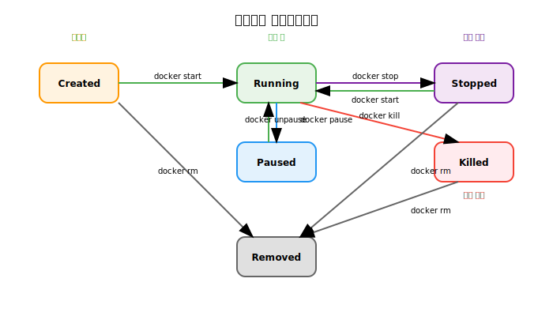
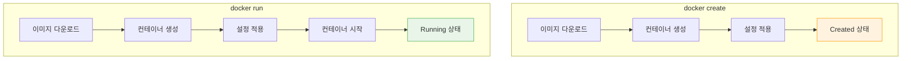
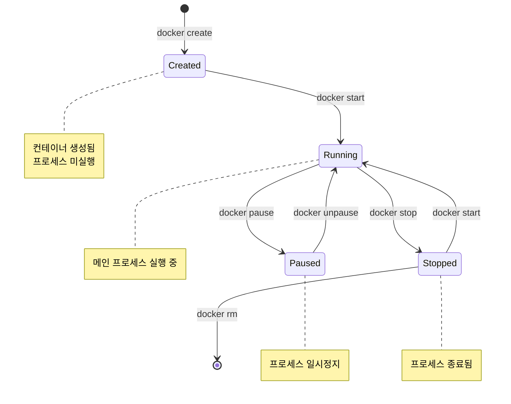
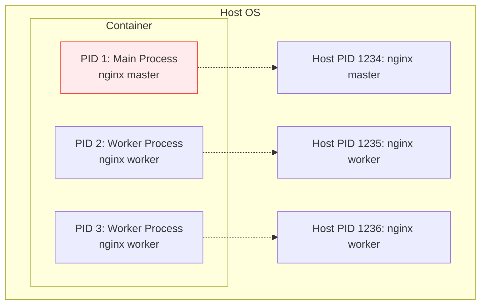
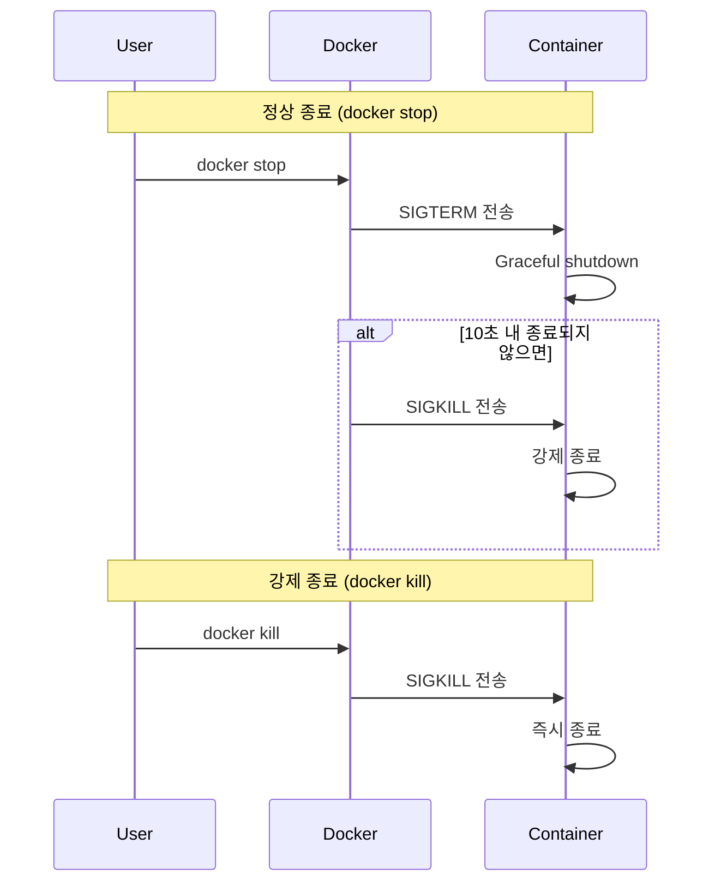

# Session 5: 컨테이너 라이프사이클

## 📍 교과과정에서의 위치
이 세션은 **Week 1 > Day 2 > Session 5**로, 컨테이너의 생성부터 삭제까지의 전체 라이프사이클을 학습합니다. 컨테이너 상태 관리와 프로세스, 네임스페이스의 동작 원리를 이해하여 효과적인 컨테이너 운영 기초를 다집니다.

## 학습 목표 (5분)
- 컨테이너 라이프사이클의 각 단계 이해
- 컨테이너 상태 변화와 관리 방법 학습
- 프로세스와 네임스페이스의 역할 파악

## 1. 컨테이너 라이프사이클 개요 (15분)

### 컨테이너 상태 다이어그램
**컨테이너가 거치는 모든 상태와 전환 과정**:



### 주요 상태 설명
**컨테이너 라이프사이클**은 **명확하게 정의된 상태 전환**을 통해 관리됩니다.

#### 1. Created (생성됨)
**컨테이너 인스턴스가 생성되었지만 아직 시작되지 않은 상태**
- **특징**: 이미지로부터 컨테이너 객체 생성 완료
- **리소스**: 메타데이터만 존재, 실제 프로세스는 없음
- **네트워크**: 네트워크 인터페이스 할당되지 않음
- **전환**: `docker start` 명령으로 Running 상태로 이동

#### 2. Running (실행 중)
**메인 프로세스(PID 1)가 활성 상태로 실행 중**
- **특징**: 컨테이너 내부 애플리케이션이 정상 동작
- **리소스**: CPU, 메모리, 네트워크 리소스 활발히 사용
- **모니터링**: `docker stats`, `docker logs`로 상태 확인 가능
- **전환**: 프로세스 종료 시 Stopped, 일시중지 시 Paused

#### 3. Paused (일시 중지)
**프로세스가 메모리에 유지된 채 실행 중단된 상태**
- **기술**: Linux cgroup freezer 기능 활용
- **특징**: 메모리 상태 보존, CPU 사용 중단
- **네트워크**: 연결 상태 유지
- **용도**: 디버깅, 리소스 절약, 스냅샷 생성

#### 4. Stopped (정상 종료)
**메인 프로세스가 정상적으로 종료된 상태**
- **종료 과정**: SIGTERM → Graceful shutdown → 프로세스 종료
- **데이터**: 컨테이너 레이어의 변경사항 보존
- **재시작**: `docker start`로 동일한 상태에서 재시작 가능
- **정리**: `docker rm`으로 완전 삭제 가능

#### 5. Killed (강제 종료)
**SIGKILL 시그널로 강제 종료된 상태**
- **원인**: 응답하지 않는 프로세스, 시스템 리소스 부족
- **특징**: Graceful shutdown 없이 즉시 종료
- **위험성**: 데이터 손실, 불완전한 상태 가능
- **복구**: 새로운 컨테이너 인스턴스 생성 필요

## 2. 컨테이너 생성과 시작 (18분)

### docker create vs docker run
**컨테이너 생성 방식의 차이점**:



### 컨테이너 생성 과정
**내부적으로 일어나는 단계별 과정**:

1. **이미지 검증**: 로컬에 이미지 존재 여부 확인
2. **이미지 다운로드**: 필요시 레지스트리에서 pull
3. **컨테이너 생성**: 새로운 컨테이너 인스턴스 생성
4. **네트워크 설정**: 네트워크 인터페이스 구성
5. **볼륨 마운트**: 스토리지 연결
6. **환경 변수 설정**: 런타임 환경 구성

### 컨테이너 시작 과정
**Created 상태에서 Running 상태로의 전환**:



## 3. 컨테이너 실행 중 관리 (12분)

### 프로세스 관리
**컨테이너 내부 프로세스의 특징**:



#### PID 1의 중요성
**PID 1 프로세스**는 **컨테이너 내부에서 특별한 역할과 책임**을 가집니다.

**1. 컨테이너 생명주기 제어**
- **직접 연결**: PID 1 프로세스의 상태가 컨테이너 상태를 결정
- **종료 조건**: PID 1이 종료되면 컨테이너 전체가 종료
- **시작 조건**: PID 1이 시작되어야 컨테이너가 Running 상태

**2. 시그널 처리의 특수성**
- **SIGTERM 처리**: Graceful shutdown을 위한 정리 작업 수행
- **SIGKILL 방어**: 일반 프로세스와 달리 SIGKILL을 무시할 수 있음
- **자식 프로세스**: 자식 프로세스의 시그널을 전파하거나 처리

**3. 좀비 프로세스 정리 (Reaping)**
- **고아 프로세스**: 부모 프로세스가 종료된 자식 프로세스를 PID 1이 입양
- **좀비 방지**: 종료된 프로세스의 리소스를 정리하여 메모리 누수 방지
- **wait() 시스템 콜**: 자식 프로세스의 종료 상태를 수집

**4. 모범 사례**
```dockerfile
# 잘못된 예: 쉘 스크립트가 PID 1
CMD ["/bin/sh", "-c", "nginx -g 'daemon off;'"]

# 올바른 예: 애플리케이션이 직접 PID 1
CMD ["nginx", "-g", "daemon off;"]

# 또는 init 시스템 사용
CMD ["tini", "--", "nginx", "-g", "daemon off;"]
```

### 컨테이너 모니터링
**실행 중인 컨테이너 상태 확인**:

```bash
# 실행 중인 컨테이너 목록
docker ps

# 모든 컨테이너 목록 (중지된 것 포함)
docker ps -a

# 컨테이너 리소스 사용량 실시간 모니터링
docker stats

# 컨테이너 내부 프로세스 확인
docker top <container_name>
```

### 컨테이너 일시 중지
**메모리 상태를 유지한 채 실행 중지**:
- `docker pause`: cgroup freezer 사용
- 프로세스는 메모리에 유지
- 네트워크 연결은 유지
- 빠른 재개 가능

## 4. 컨테이너 종료와 정리 (10분)

### 정상 종료 vs 강제 종료
**컨테이너를 안전하게 종료하는 방법**:



### 컨테이너 정리
**사용하지 않는 컨테이너 제거**:

```bash
# 특정 컨테이너 제거
docker rm <container_name>

# 중지된 모든 컨테이너 제거
docker container prune

# 실행 중인 컨테이너 강제 제거
docker rm -f <container_name>

# 컨테이너 종료와 동시에 제거
docker run --rm nginx
```

### 데이터 보존
**컨테이너 삭제 시 데이터 보존 방법**:
- **볼륨 사용**: 영구 데이터 저장
- **바인드 마운트**: 호스트 디렉토리 연결
- **이미지 커밋**: 변경사항을 새 이미지로 저장

## 5. 네임스페이스와 격리 (8분)

### Linux 네임스페이스
**Linux 네임스페이스**는 **컨테이너 격리를 구현하는 핵심 Linux 커널 기능**입니다.

#### 6가지 주요 네임스페이스

**1. PID Namespace (프로세스 ID 격리)**
- **기능**: 프로세스 ID 공간을 격리하여 독립적인 프로세스 트리 생성
- **효과**: 컨테이너 내부에서 PID 1부터 시작하는 독립적 프로세스 공간
- **보안**: 다른 컨테이너의 프로세스를 보거나 조작할 수 없음
- **예시**: 컨테이너 내부에서 `ps aux`를 실행하면 해당 컨테이너의 프로세스만 보임

**2. NET Namespace (네트워크 격리)**
- **기능**: 네트워크 인터페이스, 라우팅 테이블, 방화벽 규칙을 격리
- **구성 요소**: 가상 이더넷 인터페이스(veth), 브리지, IP 주소 공간
- **포트 매핑**: 호스트 포트와 컨테이너 포트 간 매핑 (`-p 8080:80`)
- **네트워크 모드**: bridge, host, none, container 등 다양한 네트워크 구성

**3. MNT Namespace (파일 시스템 격리)**
- **기능**: 마운트 포인트를 격리하여 독립적인 파일 시스템 뷰 제공
- **루트 파일 시스템**: 컨테이너마다 독립적인 `/` 디렉토리
- **볼륨 마운트**: 호스트 디렉토리를 컨테이너 내부로 마운트 (`-v /host:/container`)
- **오버레이**: Union File System을 통한 레이어 겹침

**4. UTS Namespace (호스트명 격리)**
- **기능**: 호스트명(hostname)과 도메인명(domainname)을 격리
- **사용 사례**: 컨테이너별로 다른 호스트명 설정 (`--hostname my-container`)
- **네트워크 식별**: 마이크로서비스 환경에서 서비스 식별에 활용
- **로그 분석**: 로그에서 컨테이너 구분을 위한 식별자

**5. IPC Namespace (프로세스 간 통신 격리)**
- **기능**: System V IPC 객체들을 격리 (공유 메모리, 세마포어, 메시지 큐)
- **보안**: 다른 컨테이너의 IPC 자원에 접근 차단
- **성능**: 컨테이너 내부 프로세스 간 고속 통신 지원
- **예시**: PostgreSQL의 공유 메모리, Redis의 세마포어

**6. USER Namespace (사용자 ID 격리)**
- **기능**: UID/GID 공간을 격리하여 컨테이너 내외부 사용자 ID 매핑
- **보안 이점**: 컨테이너 내부에서 root(UID 0)이어도 호스트에서는 일반 사용자
- **구성**: `/etc/subuid`, `/etc/subgid` 파일을 통한 UID/GID 매핑 설정
- **예시**: 컨테이너 내부 UID 0 → 호스트 UID 1000으로 매핑

### 네임스페이스 공유
**특정 네임스페이스를 공유하는 방법**:

```bash
# 네트워크 네임스페이스 공유
docker run --network container:nginx-container app-container

# PID 네임스페이스 공유
docker run --pid container:nginx-container debug-container

# 호스트 네임스페이스 사용
docker run --network host --pid host privileged-container
```

## 실습: 컨테이너 라이프사이클 체험 (7분)

### 단계별 실습
```bash
# 1. 컨테이너 생성 (시작하지 않음)
docker create --name lifecycle-test nginx

# 2. 상태 확인
docker ps -a

# 3. 컨테이너 시작
docker start lifecycle-test

# 4. 실행 중 상태 확인
docker ps
docker stats lifecycle-test --no-stream

# 5. 컨테이너 일시 중지
docker pause lifecycle-test

# 6. 일시 중지 해제
docker unpause lifecycle-test

# 7. 정상 종료
docker stop lifecycle-test

# 8. 컨테이너 제거
docker rm lifecycle-test
```

### 관찰 포인트
- 각 단계에서의 상태 변화
- 명령어 실행 시간 차이
- 리소스 사용량 변화

## 다음 세션 예고
단일 컨테이너의 한계를 극복하기 위한 컨테이너 오케스트레이션의 필요성과 Kubernetes 소개를 다루겠습니다.

## 📚 참고 자료
- [Container Lifecycle - Docker Docs](https://docs.docker.com/engine/reference/run/)
- [Linux Namespaces Overview](https://man7.org/linux/man-pages/man7/namespaces.7.html)
- [Understanding Container States](https://docs.docker.com/engine/reference/commandline/ps/)
- [Process Management in Containers](https://docs.docker.com/config/containers/multi-service_container/)
- [Container Security Best Practices](https://docs.docker.com/engine/security/)