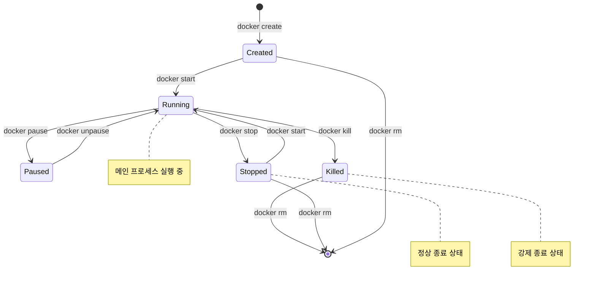
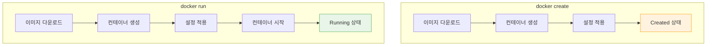
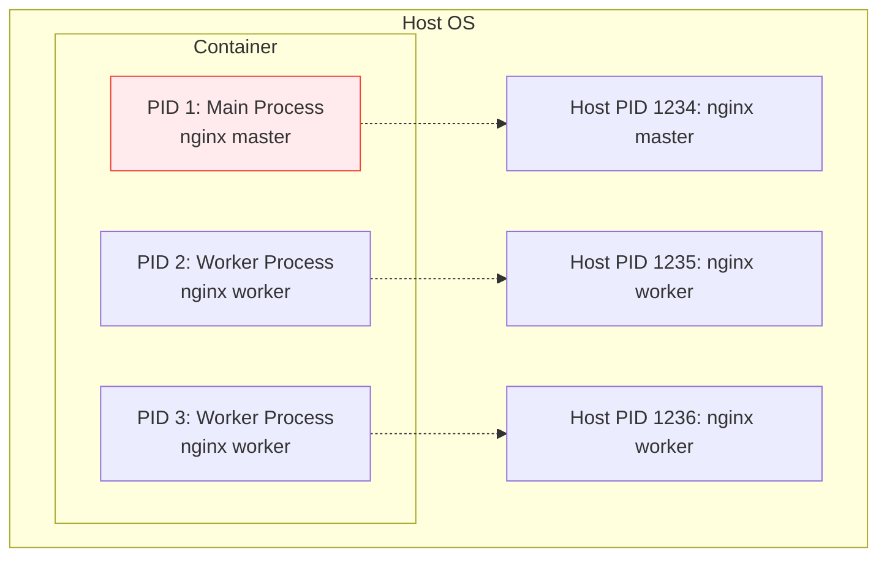
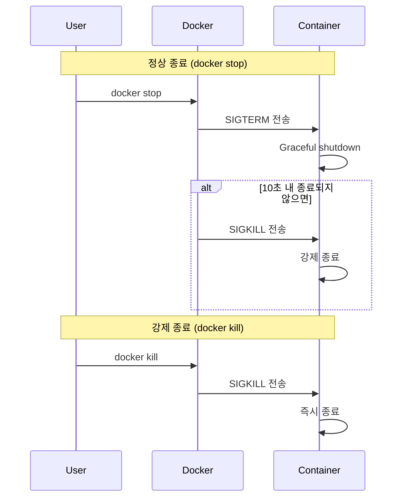

# Session 5: 컨테이너 라이프사이클

## 📍 교과과정에서의 위치
이 세션은 **Week 1 > Day 2 > Session 5**로, 컨테이너의 생성부터 삭제까지의 전체 라이프사이클을 학습합니다. 컨테이너 상태 관리와 프로세스, 네임스페이스의 동작 원리를 이해하여 효과적인 컨테이너 운영 기초를 다집니다.

## 학습 목표 (5분)
- 컨테이너 라이프사이클의 각 단계 이해
- 컨테이너 상태 변화와 관리 방법 학습
- 프로세스와 네임스페이스의 역할 파악

## 1. 컨테이너 라이프사이클 개요 (15분)

### 컨테이너 상태 다이어그램
**컨테이너가 거치는 모든 상태와 전환 과정**:



### 주요 상태 설명
**각 상태의 특징과 의미**:

1. **Created**: 컨테이너 생성됨, 아직 시작되지 않음
2. **Running**: 메인 프로세스가 실행 중
3. **Paused**: 일시 중지 상태 (메모리에 유지)
4. **Stopped**: 정상적으로 종료된 상태
5. **Killed**: 강제로 종료된 상태

## 2. 컨테이너 생성과 시작 (18분)

### docker create vs docker run
**컨테이너 생성 방식의 차이점**:



### 컨테이너 생성 과정
**내부적으로 일어나는 단계별 과정**:

1. **이미지 검증**: 로컬에 이미지 존재 여부 확인
2. **이미지 다운로드**: 필요시 레지스트리에서 pull
3. **컨테이너 생성**: 새로운 컨테이너 인스턴스 생성
4. **네트워크 설정**: 네트워크 인터페이스 구성
5. **볼륨 마운트**: 스토리지 연결
6. **환경 변수 설정**: 런타임 환경 구성

### 컨테이너 시작 과정
**Created 상태에서 Running 상태로의 전환**:

```bash
# 컨테이너 생성만 (시작하지 않음)
docker create --name my-nginx nginx

# 생성된 컨테이너 시작
docker start my-nginx

# 생성과 시작을 동시에
docker run --name my-nginx2 nginx
```

## 3. 컨테이너 실행 중 관리 (12분)

### 프로세스 관리
**컨테이너 내부 프로세스의 특징**:



#### PID 1의 중요성
**컨테이너의 메인 프로세스가 PID 1을 가지는 이유**:
- 컨테이너 생명주기와 직결
- PID 1 종료 시 컨테이너 종료
- 좀비 프로세스 정리 책임
- 시그널 처리의 특별한 역할

### 컨테이너 모니터링
**실행 중인 컨테이너 상태 확인**:

```bash
# 실행 중인 컨테이너 목록
docker ps

# 모든 컨테이너 목록 (중지된 것 포함)
docker ps -a

# 컨테이너 리소스 사용량 실시간 모니터링
docker stats

# 컨테이너 내부 프로세스 확인
docker top <container_name>
```

### 컨테이너 일시 중지
**메모리 상태를 유지한 채 실행 중지**:
- `docker pause`: cgroup freezer 사용
- 프로세스는 메모리에 유지
- 네트워크 연결은 유지
- 빠른 재개 가능

## 4. 컨테이너 종료와 정리 (10분)

### 정상 종료 vs 강제 종료
**컨테이너를 안전하게 종료하는 방법**:



### 컨테이너 정리
**사용하지 않는 컨테이너 제거**:

```bash
# 특정 컨테이너 제거
docker rm <container_name>

# 중지된 모든 컨테이너 제거
docker container prune

# 실행 중인 컨테이너 강제 제거
docker rm -f <container_name>

# 컨테이너 종료와 동시에 제거
docker run --rm nginx
```

### 데이터 보존
**컨테이너 삭제 시 데이터 보존 방법**:
- **볼륨 사용**: 영구 데이터 저장
- **바인드 마운트**: 호스트 디렉토리 연결
- **이미지 커밋**: 변경사항을 새 이미지로 저장

## 5. 네임스페이스와 격리 (8분)

### Linux 네임스페이스
**컨테이너 격리를 구현하는 핵심 기술**:

| 네임스페이스 | 격리 대상 | 설명 |
|--------------|-----------|------|
| **PID** | 프로세스 ID | 프로세스 트리 격리 |
| **NET** | 네트워크 | 네트워크 인터페이스, 라우팅 |
| **MNT** | 파일 시스템 | 마운트 포인트 |
| **UTS** | 호스트명 | 호스트명과 도메인명 |
| **IPC** | 프로세스 간 통신 | 공유 메모리, 세마포어 |
| **USER** | 사용자 ID | UID/GID 매핑 |

### 네임스페이스 공유
**특정 네임스페이스를 공유하는 방법**:

```bash
# 네트워크 네임스페이스 공유
docker run --network container:nginx-container app-container

# PID 네임스페이스 공유
docker run --pid container:nginx-container debug-container

# 호스트 네임스페이스 사용
docker run --network host --pid host privileged-container
```

## 실습: 컨테이너 라이프사이클 체험 (7분)

### 단계별 실습
```bash
# 1. 컨테이너 생성 (시작하지 않음)
docker create --name lifecycle-test nginx

# 2. 상태 확인
docker ps -a

# 3. 컨테이너 시작
docker start lifecycle-test

# 4. 실행 중 상태 확인
docker ps
docker stats lifecycle-test --no-stream

# 5. 컨테이너 일시 중지
docker pause lifecycle-test

# 6. 일시 중지 해제
docker unpause lifecycle-test

# 7. 정상 종료
docker stop lifecycle-test

# 8. 컨테이너 제거
docker rm lifecycle-test
```

### 관찰 포인트
- 각 단계에서의 상태 변화
- 명령어 실행 시간 차이
- 리소스 사용량 변화

## 다음 세션 예고
단일 컨테이너의 한계를 극복하기 위한 컨테이너 오케스트레이션의 필요성과 Kubernetes 소개를 다루겠습니다.

## 📚 참고 자료
- [Container Lifecycle - Docker Docs](https://docs.docker.com/engine/reference/run/)
- [Linux Namespaces Overview](https://man7.org/linux/man-pages/man7/namespaces.7.html)
- [Understanding Container States](https://docs.docker.com/engine/reference/commandline/ps/)
- [Process Management in Containers](https://docs.docker.com/config/containers/multi-service_container/)
- [Container Security Best Practices](https://docs.docker.com/engine/security/)