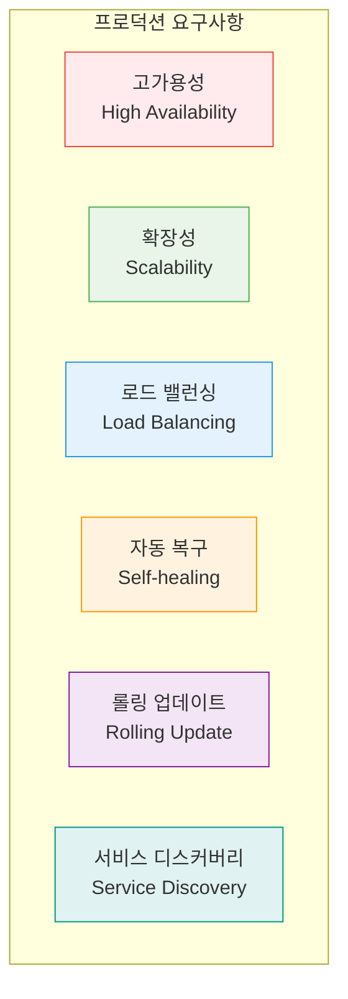
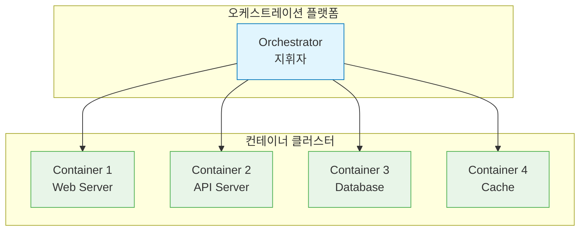
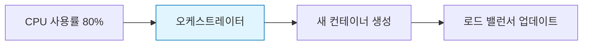
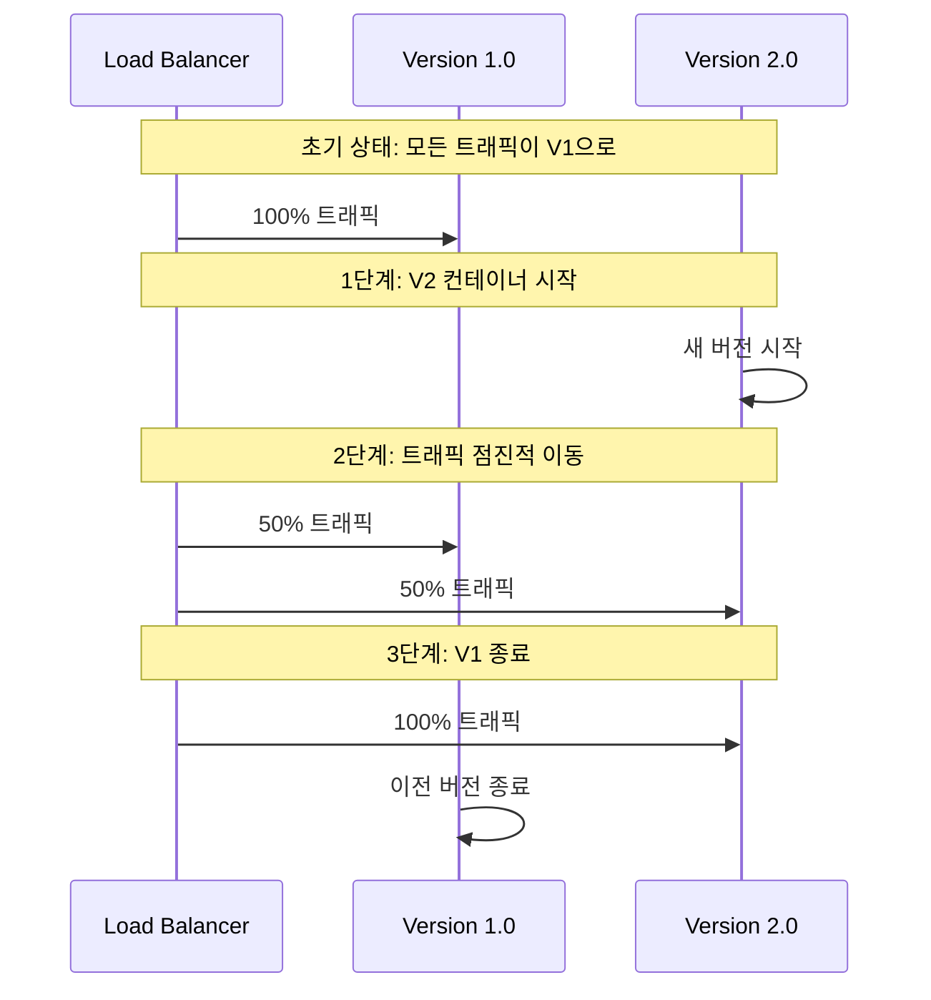
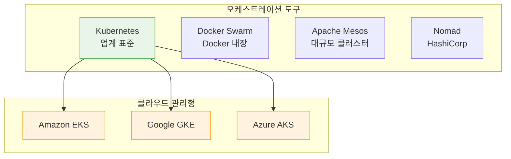
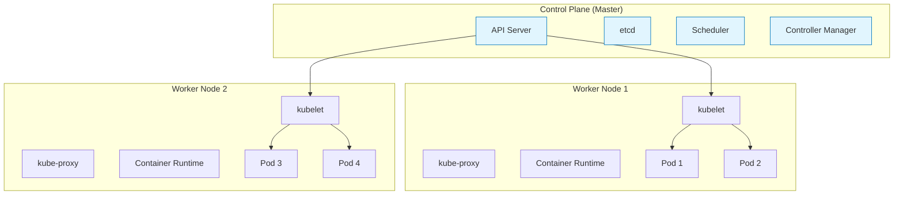

# Session 6: 컨테이너 오케스트레이션 개요

## 📍 교과과정에서의 위치
이 세션은 **Week 1 > Day 2 > Session 6**으로, 단일 컨테이너의 한계를 극복하기 위한 오케스트레이션 기술을 소개합니다. Week 3-4에서 학습할 Kubernetes의 필요성과 기본 개념을 이해하는 중요한 기초 세션입니다.

## 학습 목표 (5분)
- 단일 컨테이너 운영의 한계점 이해
- 컨테이너 오케스트레이션의 필요성과 개념 학습
- Kubernetes의 기본 아키텍처와 주요 기능 파악

## 1. 단일 컨테이너의 한계 (15분)

### 프로덕션 환경의 요구사항
실제 서비스 운영에서 필요한 기능들:

### 단일 컨테이너의 문제점
하나의 컨테이너로는 해결할 수 없는 문제들:

#### 1. 단일 장애점 (Single Point of Failure)

#### 2. 수동 확장의 어려움
- 트래픽 증가 시 수동으로 컨테이너 추가
- 로드 밸런싱 설정의 복잡성
- 리소스 사용량 모니터링의 어려움

#### 3. 네트워크 관리 복잡성
여러 컨테이너 간 통신 문제:
- 포트 충돌 관리
- 서비스 간 연결 설정
- 동적 IP 주소 문제

## 2. 오케스트레이션의 개념 (18분)

### 오케스트레이션이란?
**컨테이너 오케스트레이션(Container Orchestration)**은 **다수의 컨테이너를 자동으로 배포, 관리, 확장, 네트워킹하는 기술**입니다.

#### 오케스트레이션의 정의
**음악에서 오케스트라 지휘자가 여러 악기를 조화롭게 연주하도록 지휘하듯이**, 컨테이너 오케스트레이션은 여러 컨테이너를 조화롭게 동작하도록 관리합니다.

#### 핵심 개념
**1. 선언적 구성(Declarative Configuration)**
- 원하는 상태 선언: "어떻게" 대신 "무엇을" 원하는지 명시
- 자동 수렴: 시스템이 현재 상태를 원하는 상태로 자동 조정
- 예시: "nginx 컨테이너 3개를 실행하고 싶다" → 시스템이 자동으로 3개 유지

**2. 자동 복구(Self-healing)**
- 장애 감지: 컨테이너 또는 노드 장애 자동 감지
- 자동 대체: 장애가 발생한 컨테이너를 새로운 컨테이너로 대체
- 헬스 체크: 주기적으로 애플리케이션 상태 확인

**3. 수평 확장(Horizontal Scaling)**
- 로드 기반 확장: CPU, 메모리 사용률에 따라 인스턴스 수 자동 조정
- 예측 확장: 트래픽 패턴 분석을 통한 사전 확장
- 비용 최적화: 필요한 만큼만 리소스 사용

**4. 서비스 디스커버리(Service Discovery)**
- 동적 서비스 등록: 새로운 컨테이너 인스턴스를 자동으로 서비스에 등록
- 로드 밸런싱: 여러 인스턴스 간 트래픽 분산
- 헬스 체크 통합: 건강한 인스턴스에만 트래픽 전송

### 주요 기능들
오케스트레이션 플랫폼이 제공하는 핵심 기능:

#### 1. 자동 스케일링

#### 2. 자동 복구 (Self-healing)
- 컨테이너 장애 감지
- 자동으로 새 컨테이너 시작
- 불건전한 컨테이너 교체

#### 3. 서비스 디스커버리
동적으로 변하는 서비스 위치 자동 관리:
- DNS 기반 서비스 이름 해결
- 로드 밸런싱 자동 구성
- 헬스 체크 통합

#### 4. 롤링 업데이트
무중단 배포를 위한 점진적 업데이트:

## 3. 오케스트레이션 도구들 (10분)

### 주요 오케스트레이션 플랫폼
시장에서 사용되는 대표적인 도구들:

### 도구별 특징 비교
| 도구 | 장점 | 단점 | 적합한 용도 |
|------|------|------|-------------|
| **Kubernetes** | 풍부한 기능, 큰 생태계 | 복잡한 학습 곡선 | 대규모 프로덕션 |
| **Docker Swarm** | 간단한 설정 | 제한적 기능 | 소규모 클러스터 |
| **Mesos** | 높은 확장성 | 복잡한 운영 | 대규모 데이터센터 |

## 4. Kubernetes 소개 (12분)

### Kubernetes의 등장
**Kubernetes(쿠버네티스)**는 **Google의 15년간 컨테이너 운영 경험을 바탕으로 탄생한 오픈소스 컨테이너 오케스트레이션 플랫폼**입니다.

#### 역사적 배경
**Google Borg 시스템의 진화**
- Borg (2003-2014): Google 내부 컨테이너 관리 시스템
- Omega (2013): Borg의 다음 세대 시스템
- Kubernetes (2014): Borg의 경험을 오픈소스로 재구성

#### 주요 마일스톤
2014년: Google에서 오픈소스로 공개
2015년: CNCF(Cloud Native Computing Foundation)의 첫 번째 프로젝트
2016년: v1.0 릴리스, 프로덕션 준비 완료
2017년: Docker Swarm을 제치고 사실상 표준으로 자리잡음
현재: 모든 주요 클라우드 제공업체에서 관리형 서비스 제공

#### 이름의 의미
**"Kubernetes"**는 그리스어로 **"조타수(helmsman)" 또는 "선장"**을 의미합니다.
- K8s: Kubernetes의 줄임말 (K + 8글자 + s)
- 로고: 선박의 바퀴 모양으로, 컨테이너를 안전하게 운항한다는 의미

### 기본 아키텍처
마스터-워커 노드 구조:

### 핵심 개념들
**Kubernetes의 주요 오브젝트**들은 **선언적 API**를 통해 관리됩니다.

#### 1. Pod (파드)
**Pod**는 **Kubernetes에서 배포할 수 있는 가장 작은 단위**입니다.

구성 요소:
- 컨테이너 그룹: 하나 이상의 컨테이너를 포함 (일반적으로 1개)
- 공유 네트워크: 동일한 IP 주소와 포트 공간
- 공유 스토리지: 볼륨을 통한 데이터 공유
- 생명주기 동기화: 모든 컨테이너가 함께 시작/종료

사용 패턴:
- 단일 컨테이너: 가장 일반적인 패턴
- 사이드카: 메인 컨테이너를 지원하는 보조 컨테이너
- 어댑터: 레거시 애플리케이션을 Kubernetes에 연결

#### 2. Service (서비스)
**Service**는 **Pod들에 대한 안정적인 네트워크 엔드포인트**를 제공합니다.

필요성:
- Pod IP의 동적 성격: Pod는 재시작 시 IP 주소가 변경
- 로드 밸런싱: 여러 Pod 인스턴스 간 트래픽 분산
- 서비스 디스커버리: DNS를 통한 서비스 이름 해결

서비스 유형:
- ClusterIP: 클러스터 내부에서만 접근 가능
- NodePort: 모든 노드의 특정 포트로 외부 노출
- LoadBalancer: 클라우드 로드 밸런서 사용
- ExternalName: 외부 서비스에 대한 DNS 별칭

#### 3. Deployment (디플로이먼트)
**Deployment**는 **Pod의 선언적 업데이트와 롤백을 관리**합니다.

주요 기능:
- 레플리카 관리: 원하는 수의 Pod 인스턴스 유지
- 롤링 업데이트: 점진적으로 새 버전으로 교체
- 롤백: 문제 발생 시 이전 버전으로 복구
- 스케일링: 레플리카 수 동적 조정

롤링 업데이트 전략:
- RollingUpdate: 기본 전략, 점진적 교체
- Recreate: 모든 Pod를 동시에 종료 후 새 Pod 생성

원하는 상태(Desired State) 관리:
- 선언적 설정: YAML/JSON으로 원하는 상태 정의
- 지속적 조정: 현재 상태를 원하는 상태로 지속적으로 조정
- 자동 복구: Pod 장애 시 자동으로 새 Pod 생성

### Kubernetes의 장점
왜 Kubernetes가 표준이 되었는가:
- 선언적 구성: 원하는 상태를 선언하면 자동으로 달성
- 자동 복구: 장애 시 자동으로 복구
- 확장성: 수천 개의 노드까지 확장 가능
- 이식성: 어떤 환경에서든 동일하게 동작

## 실습 준비: 오케스트레이션 시나리오 (5분)

### 시나리오 설계
"온라인 쇼핑몰을 운영한다고 가정하고, 다음 상황들을 어떻게 해결할지 생각해보세요."

#### 상황들
1. 블랙프라이데이 트래픽 급증: 평소의 10배 트래픽
2. 서버 장애 발생: 웹 서버 중 하나가 다운
3. 새 버전 배포: 서비스 중단 없이 업데이트
4. 데이터베이스 연결: 여러 애플리케이션이 DB 접근

#### 토론 포인트
- 단일 컨테이너로는 어떤 문제가 있을까?
- 오케스트레이션이 어떻게 도움이 될까?
- 어떤 기능들이 필요할까?

## 다음 세션 예고
컨테이너 환경에서 고려해야 할 보안 요소들과 기본적인 보안 원칙들을 학습하겠습니다.

## 📚 참고 자료
- [Kubernetes Overview](https://kubernetes.io/docs/concepts/overview/)
- [Container Orchestration Explained](https://www.redhat.com/en/topics/containers/what-is-container-orchestration)
- [Docker Swarm vs Kubernetes](https://www.docker.com/blog/kubernetes-vs-docker-swarm/)
- [CNCF Landscape](https://landscape.cncf.io/)
- [Kubernetes Architecture](https://kubernetes.io/docs/concepts/architecture/)