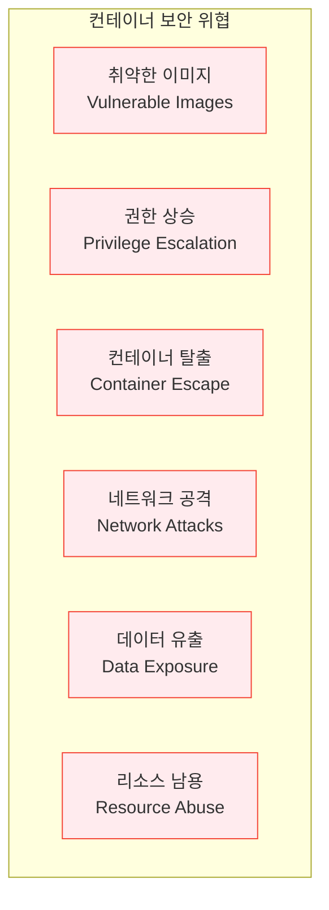
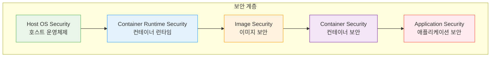
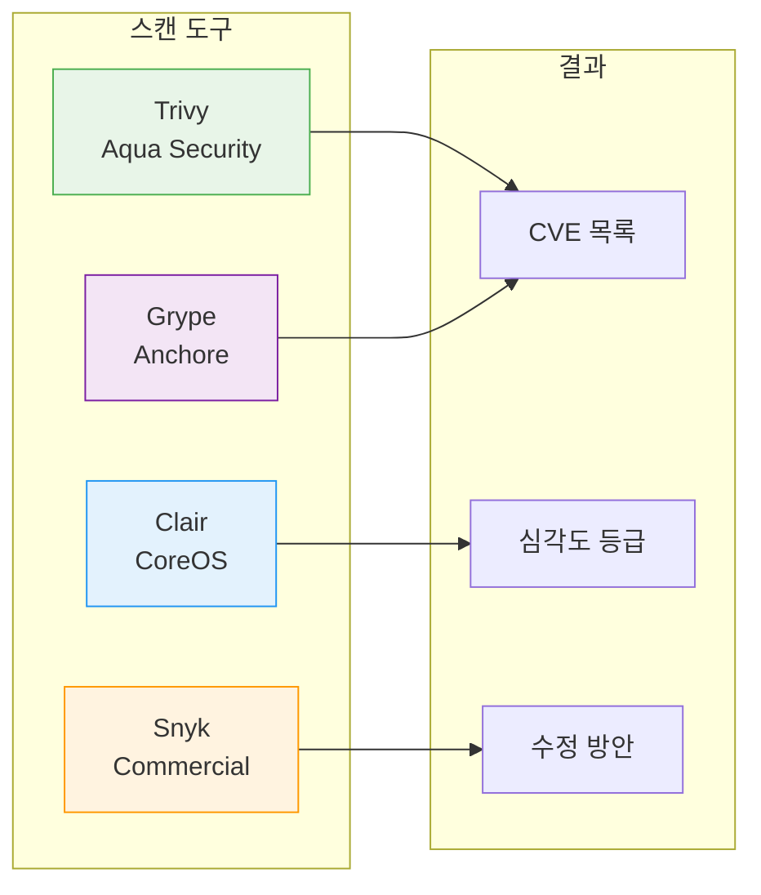
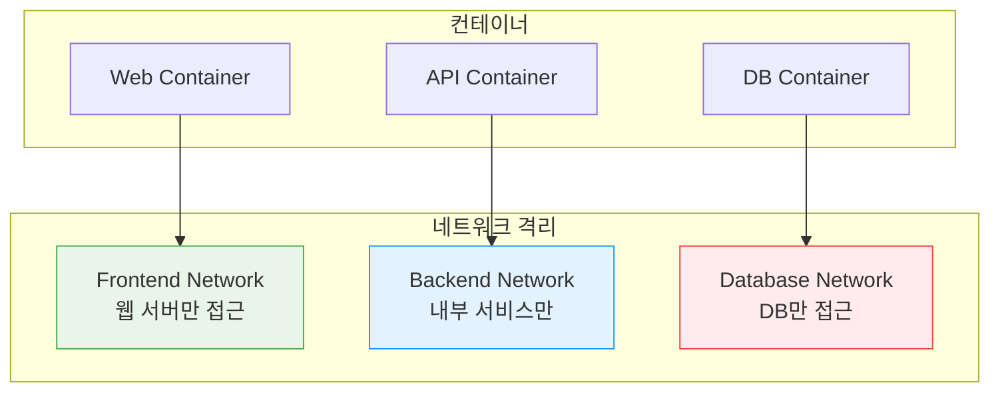

# Session 7: 컨테이너 보안 기초

## 📍 교과과정에서의 위치
이 세션은 **Week 1 > Day 2 > Session 7**로, 컨테이너 환경에서 고려해야 할 보안 요소들을 학습합니다. 프로덕션 환경에서 안전한 컨테이너 운영을 위한 기본 원칙과 모범 사례를 이해합니다.

## 학습 목표 (5분)
- 컨테이너 보안의 중요성과 고려사항 이해
- 이미지 보안과 취약점 스캔 방법 학습
- 런타임 보안의 기본 원칙 파악

## 1. 컨테이너 보안의 중요성 (15분)

### 컨테이너 보안 위협 모델
**컨테이너 보안 위협 모델(Container Security Threat Model)**은 **컨테이너 환경에서 발생할 수 있는 다양한 보안 위험을 체계적으로 분류한 프레임워크**입니다.

#### 주요 위협 벡터

**1. 취약한 이미지(Vulnerable Images)**
- 정의: 알려진 보안 취약점을 포함한 컨테이너 이미지
- 위험 요소: 구 버전 운영체제, 패치되지 않은 라이브러리, 알려진 CVE
- 공격 벡터: 원격 코드 실행, 권한 상승, 데이터 유출
- 예방: 정기적 취약점 스캔, 최신 베이스 이미지 사용

**2. 권한 상승(Privilege Escalation)**
- 정의: 컨테이너 내부에서 더 높은 권한을 획득하는 공격
- 수평 상승: 동일 권한 수준에서 다른 리소스에 접근
- 수직 상승: 일반 사용자에서 root 권한으로 상승
- 예방: 최소 권한 원칙, 비루트 사용자 실행, capabilities 제한

**3. 컨테이너 탈출(Container Escape)**
- 정의: 컨테이너 격리를 뛰어넘어 호스트 시스템에 접근하는 공격
- 공격 방법: 커널 취약점 악용, 잘못된 컨테이너 설정, privileged 모드 악용
- 영향: 호스트 시스템 완전 장악, 다른 컨테이너에 접근
- 예방: 보안 모드 사용, 정기적 커널 업데이트, 런타임 보안 모니터링

**4. 네트워크 공격(Network Attacks)**
- 정의: 컨테이너 네트워크를 통한 공격
- 공격 유형: 네트워크 스니핑, 중간자 공격, 네트워크 세그먼테이션 우회
- 위험: 데이터 도청, 서비스 간 무단 접근, 네트워크 트래픽 조작
- 예방: 네트워크 세그먼테이션, 암호화 통신, 네트워크 정책 적용

**5. 데이터 유출(Data Exposure)**
- 정의: 컨테이너에서 민감한 데이터가 의도치 않게 노출
- 노출 경로: 로그 파일, 환경 변수, 볼륨 마운트, 이미지 레이어
- 위험 데이터: API 키, 데이터베이스 자격 증명, 개인정보, 비즈니스 기밀
- 예방: 시크릿 관리 시스템, 데이터 암호화, 접근 제어

**6. 리소스 남용(Resource Abuse)**
- 정의: 컨테이너가 시스템 리소스를 과도하게 사용하여 서비스 거부 상태 유발
- 공격 유형: CPU 폭탄, 메모리 누수, 디스크 공간 고갈, 네트워크 대역폭 점유
- 영향: 전체 시스템 성능 저하, 다른 컨테이너 영향, 서비스 중단
- 예방: 리소스 제한 설정, 모니터링 및 알림, QoS 정책 적용



### 전통적 보안 vs 컨테이너 보안
컨테이너 환경의 독특한 보안 특성:

| 구분 | 전통적 환경 | 컨테이너 환경 |
|------|-------------|---------------|
| **공격 표면** | 고정적 | 동적으로 변화 |
| **생명주기** | 장기간 | 짧고 빈번한 변경 |
| **격리 수준** | VM 수준 | 프로세스 수준 |
| **모니터링** | 호스트 기반 | 분산된 환경 |

### 보안 계층 모델
컨테이너 보안을 위한 다층 방어 전략:



## 2. 이미지 보안 (18분)

### 베이스 이미지 선택
신뢰할 수 있는 이미지 사용의 중요성:

#### 공식 이미지 우선 사용
```dockerfile
# 좋은 예: 공식 이미지 사용
FROM node:18-alpine

# 피해야 할 예: 출처 불명 이미지
FROM random-user/node-custom
```

#### 최소한의 이미지 사용
공격 표면을 줄이기 위한 전략:
- Alpine Linux: 최소한의 패키지만 포함
- Distroless: 런타임만 포함, 패키지 매니저 없음
- Scratch: 빈 이미지에서 시작

```dockerfile
# Alpine 기반 (작은 크기)
FROM node:18-alpine

# Distroless 기반 (더 안전)
FROM gcr.io/distroless/nodejs18-debian11
```

### 취약점 스캔
이미지의 알려진 취약점 검사:

#### Docker Hub 내장 스캔
```bash
# Docker Hub에서 취약점 정보 확인
docker scout cves nginx:latest

# 로컬 이미지 스캔
docker scout quickview nginx:latest
```

#### 오픈소스 스캔 도구들
무료로 사용할 수 있는 취약점 스캔 도구:



### 이미지 서명과 검증
이미지 무결성 보장:

#### Docker Content Trust
```bash
# Content Trust 활성화
export DOCKER_CONTENT_TRUST=1

# 서명된 이미지만 pull 허용
docker pull nginx:latest
```

#### 이미지 다이제스트 사용
```bash
# 태그 대신 다이제스트로 정확한 이미지 지정
docker pull nginx@sha256:abc123...
```

## 3. 런타임 보안 (12분)

### 최소 권한 원칙
컨테이너에 필요한 최소한의 권한만 부여:

#### 비루트 사용자 실행
```dockerfile
# 전용 사용자 생성
RUN addgroup -g 1001 -S nodejs && \
    adduser -S nodejs -u 1001

# 비루트 사용자로 전환
USER nodejs

# 애플리케이션 실행
CMD ["node", "app.js"]
```

#### 읽기 전용 파일 시스템
```bash
# 루트 파일 시스템을 읽기 전용으로 마운트
docker run --read-only nginx

# 필요한 경우에만 쓰기 가능한 볼륨 마운트
docker run --read-only -v /tmp nginx
```

### 리소스 제한
컨테이너의 리소스 사용량 제한:

```bash
# CPU와 메모리 제한
docker run --cpus="0.5" --memory="512m" nginx

# 프로세스 수 제한
docker run --pids-limit=100 nginx
```

### 네트워크 보안
컨테이너 간 네트워크 격리:



## 4. 보안 모범 사례 (8분)

### Dockerfile 보안 가이드라인
안전한 이미지 빌드를 위한 원칙들:

```dockerfile
# 1. 최신 베이스 이미지 사용
FROM node:18-alpine

# 2. 패키지 업데이트
RUN apk update && apk upgrade

# 3. 불필요한 패키지 설치 금지
RUN apk add --no-cache curl

# 4. 비루트 사용자 생성
RUN addgroup -g 1001 -S appuser && \
    adduser -S appuser -u 1001

# 5. 애플리케이션 파일 복사
COPY --chown=appuser:appuser . /app

# 6. 작업 디렉토리 설정
WORKDIR /app

# 7. 비루트 사용자로 전환
USER appuser

# 8. 필요한 포트만 노출
EXPOSE 3000

# 9. 헬스체크 추가
HEALTHCHECK --interval=30s --timeout=3s \
  CMD curl -f http://localhost:3000/health || exit 1

# 10. 애플리케이션 실행
CMD ["node", "server.js"]
```

### 런타임 보안 체크리스트
프로덕션 배포 전 확인사항:

- [ ] 최신 베이스 이미지 사용
- [ ] 취약점 스캔 완료
- [ ] 비루트 사용자로 실행
- [ ] 읽기 전용 파일 시스템
- [ ] 리소스 제한 설정
- [ ] 네트워크 정책 적용
- [ ] 시크릿 관리 구현
- [ ] 로깅 및 모니터링 설정

### 시크릿 관리
민감한 정보의 안전한 처리:

```bash
# 환경 변수로 시크릿 전달 (권장하지 않음)
docker run -e DB_PASSWORD=secret123 app

# Docker Secrets 사용 (권장)
echo "secret123" | docker secret create db_password -
docker service create --secret db_password app
```

## 실습: 보안 스캔 체험 (7분)

### 취약점 스캔 실습
```bash
# 1. 취약한 이미지 다운로드
docker pull nginx:1.14

# 2. Docker Scout로 스캔
docker scout cves nginx:1.14

# 3. 최신 이미지와 비교
docker scout compare --to nginx:latest nginx:1.14

# 4. 권장사항 확인
docker scout recommendations nginx:1.14
```

### 보안 설정 비교
```bash
# 보안이 약한 실행
docker run -d --privileged --pid=host nginx

# 보안이 강화된 실행
docker run -d --read-only --user 1001:1001 \
  --cap-drop=ALL --security-opt=no-new-privileges nginx
```

## 다음 세션 예고
Docker 설치 상태를 최종 점검하고, 내일부터 시작할 실습을 위한 기본 명령어들을 미리 살펴보겠습니다.

## 📚 참고 자료
- [Docker Security Best Practices](https://docs.docker.com/engine/security/)
- [CIS Docker Benchmark](https://www.cisecurity.org/benchmark/docker)
- [NIST Container Security Guide](https://csrc.nist.gov/publications/detail/sp/800-190/final)
- [OWASP Container Security](https://owasp.org/www-project-container-security/)
- [Trivy Vulnerability Scanner](https://trivy.dev/)