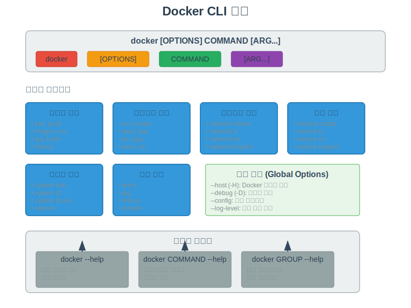
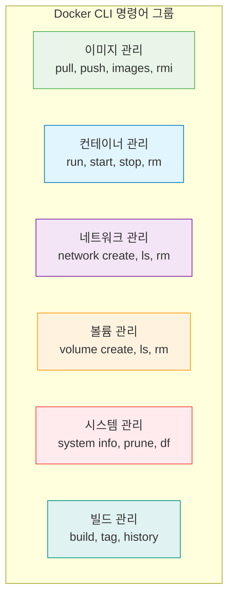

# Session 1: Docker CLI 기초

## 📍 교과과정에서의 위치
이 세션은 **Week 1 > Day 3 > Session 1**로, 본격적인 Docker 실습의 시작점입니다. 지난 이틀간 학습한 이론적 기초를 바탕으로 실제 Docker CLI를 사용하여 컨테이너를 조작하는 실무 기술을 습득합니다.

## 학습 목표 (5분)
- Docker CLI의 구조와 명령어 체계 이해
- 도움말 시스템 효과적 활용법 학습
- 기본 명령어 패턴과 옵션 구조 파악
- Docker 명령어의 일관된 사용 패턴 습득

## 1. Docker CLI 구조 이해 (15분)

### Docker CLI의 기본 구조
**Docker CLI(Command Line Interface)**는 **계층적이고 일관된 명령어 구조**를 가지고 있습니다.



#### 기본 명령어 패턴
**Docker 명령어는 다음과 같은 일관된 패턴을 따릅니다:**

```bash
docker [OPTIONS] COMMAND [ARG...]
```

**구성 요소 설명:**
- **docker**: 기본 명령어
- **[OPTIONS]**: 전역 옵션 (모든 명령어에 적용)
- **COMMAND**: 실행할 작업 (run, pull, build 등)
- **[ARG...]**: 명령어별 인수와 옵션

#### 명령어 카테고리
**Docker CLI 명령어는 기능별로 그룹화되어 있습니다:**



### 전역 옵션 (Global Options)
**모든 Docker 명령어에서 사용할 수 있는 공통 옵션들:**

#### 주요 전역 옵션
```bash
# Docker 호스트 지정 (원격 Docker 데몬 연결)
docker -H tcp://remote-host:2376 ps

# 디버그 모드 활성화 (상세한 로그 출력)
docker --debug info

# 설정 디렉토리 지정
docker --config ~/.docker-custom config ls

# TLS 인증서 디렉토리 지정
docker --tlscert /path/to/cert.pem info

# 로그 레벨 설정 (debug, info, warn, error, fatal)
docker --log-level debug ps
```

#### 환경 변수를 통한 설정
**Docker CLI는 환경 변수를 통해서도 설정할 수 있습니다:**

```bash
# Docker 호스트 설정
export DOCKER_HOST=tcp://remote-host:2376

# TLS 검증 활성화
export DOCKER_TLS_VERIFY=1

# 설정 디렉토리 지정
export DOCKER_CONFIG=~/.docker-custom

# 기본 플랫폼 지정 (멀티 아키텍처 환경)
export DOCKER_DEFAULT_PLATFORM=linux/amd64
```

## 2. 도움말 시스템 활용 (12분)

### 계층적 도움말 구조
**Docker는 계층적 도움말 시스템을 제공합니다:**

#### 1단계: 전체 명령어 개요
```bash
# Docker 전체 명령어 목록과 기본 사용법
docker --help
# 또는
docker help

# 출력 예시:
# Usage:  docker [OPTIONS] COMMAND
# 
# A self-sufficient runtime for containers
# 
# Options:
#       --config string      Location of client config files (default "/home/user/.docker")
#   -c, --context string     Name of the context to use to connect to the daemon
#   -D, --debug              Enable debug mode
#       --help               Print usage
#   -H, --host list          Daemon socket(s) to connect to
# 
# Management Commands:
#   builder     Manage builds
#   config      Manage Docker configs
#   container   Manage containers
#   context     Manage contexts
#   image       Manage images
#   network     Manage networks
#   node        Manage Swarm nodes
#   plugin      Manage plugins
#   secret      Manage Docker secrets
#   service     Manage services
#   stack       Manage Docker stacks
#   swarm       Manage Swarm
#   system      Manage Docker
#   trust       Manage trust on Docker images
#   volume      Manage volumes
```

#### 2단계: 특정 명령어 도움말
```bash
# 특정 명령어의 상세 사용법
docker run --help
docker pull --help
docker network --help

# 예시: docker run 도움말
docker run --help
# Usage:  docker run [OPTIONS] IMAGE [COMMAND] [ARG...]
# 
# Run a command in a new container
# 
# Options:
#   -a, --attach list                    Attach to STDIN, STDOUT or STDERR
#   -d, --detach                         Run container in background and print container ID
#   -e, --env list                       Set environment variables
#       --env-file list                  Read in a file of environment variables
#   -i, --interactive                    Keep STDIN open even if not attached
#       --name string                    Assign a name to the container
#   -p, --publish list                   Publish a container's port(s) to the host
#       --rm                             Automatically remove the container when it exits
#   -t, --tty                            Allocate a pseudo-TTY
#   -v, --volume list                    Bind mount a volume
#   -w, --workdir string                 Working directory inside the container
```

#### 3단계: 관리 명령어 그룹 도움말
```bash
# 관리 명령어 그룹의 하위 명령어들
docker container --help
docker image --help
docker network --help
docker volume --help

# 예시: docker container 관리 명령어들
docker container --help
# Usage:  docker container COMMAND
# 
# Manage containers
# 
# Commands:
#   attach      Attach local standard input, output, and error streams to a running container
#   commit      Create a new image from a container's changes
#   cp          Copy files/folders between a container and the local filesystem
#   create      Create a new container
#   diff        Inspect changes to files or directories on a container's filesystem
#   exec        Run a command in a running container
#   export      Export a container's filesystem as a tar archive
#   inspect     Display detailed information on one or more containers
#   kill        Kill one or more running containers
#   logs        Fetch the logs of a container
#   ls          List containers
#   pause       Pause all processes within one or more containers
#   port        List port mappings or a specific mapping for the container
#   prune       Remove all stopped containers
#   rename      Rename a container
#   restart     Restart one or more containers
#   rm          Remove one or more containers
#   run         Run a command in a new container
#   start       Start one or more stopped containers
#   stats       Display a live stream of container(s) resource usage statistics
#   stop        Stop one or more running containers
#   top         Display the running processes of a container
#   unpause     Unpause all processes within one or more containers
#   update      Update configuration of one or more containers
#   wait        Block until one or more containers stop, then print their exit codes
```

### 실용적인 도움말 활용 팁
**효율적인 도움말 사용 방법:**

#### 명령어 검색과 필터링
```bash
# 특정 키워드가 포함된 명령어 찾기
docker --help | grep network
docker --help | grep volume

# 특정 옵션 찾기
docker run --help | grep -A 2 -B 2 port
docker run --help | grep -A 2 -B 2 volume
```

#### 예제와 함께 학습
```bash
# 명령어 예제 확인 (일부 명령어에서 제공)
docker run --help | grep -A 10 "Examples:"

# 온라인 문서 참조
# https://docs.docker.com/engine/reference/commandline/docker/
```

## 3. 기본 명령어 패턴 (15분)

### 명령어 별칭과 단축형
**Docker는 자주 사용되는 명령어에 대해 단축형을 제공합니다:**

#### 전체 형식 vs 단축형
```bash
# 전체 형식 (Management Commands)
docker container ls        # 컨테이너 목록
docker image ls            # 이미지 목록
docker volume ls           # 볼륨 목록
docker network ls          # 네트워크 목록

# 단축형 (Legacy Commands)
docker ps                  # = docker container ls
docker images              # = docker image ls
docker volume ls           # 단축형 없음
docker network ls          # 단축형 없음
```

#### 권장 사용 패턴
**현대적인 Docker 사용에서는 Management Commands를 권장합니다:**

```bash
# 권장: Management Commands 사용
docker container run nginx
docker image pull ubuntu
docker network create mynet
docker volume create myvolume

# 허용: Legacy Commands (하위 호환성)
docker run nginx
docker pull ubuntu
# network, volume은 Management Commands만 사용
```

### 공통 옵션 패턴
**Docker 명령어들이 공통으로 사용하는 옵션 패턴들:**

#### 출력 형식 제어
```bash
# 테이블 형식 (기본값)
docker ps
docker images

# JSON 형식 출력
docker ps --format json
docker images --format json

# 사용자 정의 형식
docker ps --format "table {{.Names}}\t{{.Status}}\t{{.Ports}}"
docker images --format "table {{.Repository}}\t{{.Tag}}\t{{.Size}}"

# 조용한 모드 (ID만 출력)
docker ps -q
docker images -q
```

#### 필터링 옵션
```bash
# 상태별 필터링
docker ps --filter "status=running"
docker ps --filter "status=exited"

# 이름별 필터링
docker ps --filter "name=nginx"
docker images --filter "reference=ubuntu"

# 라벨별 필터링
docker ps --filter "label=env=production"
docker images --filter "label=version=1.0"

# 시간별 필터링
docker ps --filter "since=container_name"
docker images --filter "since=24h"
```

## 4. 실습: CLI 탐색과 기본 사용 (8분)

### 단계별 실습

#### 1단계: 도움말 시스템 탐색
```bash
# 전체 명령어 구조 파악
docker --help

# 주요 관리 명령어 그룹 확인
docker container --help
docker image --help
docker network --help
docker volume --help

# 자주 사용할 명령어 도움말 확인
docker run --help
docker ps --help
docker logs --help
```

#### 2단계: 기본 정보 확인
```bash
# Docker 버전과 시스템 정보
docker version
docker system info

# 현재 상태 확인
docker ps -a          # 모든 컨테이너
docker images          # 로컬 이미지
docker volume ls       # 볼륨 목록
docker network ls      # 네트워크 목록
```

#### 3단계: 출력 형식 실험
```bash
# 다양한 출력 형식 시도
docker ps --format json
docker ps --format "table {{.Names}}\t{{.Status}}"
docker images --format "table {{.Repository}}:{{.Tag}}\t{{.Size}}"

# 필터링 실험
docker ps --filter "status=exited"
docker images --filter "dangling=true"
```

### 실습 과제
**다음 작업을 수행해보세요:**

1. **명령어 탐색**: `docker network` 관리 명령어의 모든 하위 명령어 나열
2. **도움말 활용**: `docker run` 명령어에서 포트 관련 옵션 3개 찾기
3. **출력 형식**: 컨테이너 이름과 상태만 표시하는 사용자 정의 형식 작성
4. **시스템 정보**: 현재 Docker가 사용 중인 스토리지 드라이버 확인

## 다음 세션 예고
Docker 이미지 관리의 핵심 명령어들을 학습하고, 실제 이미지를 다운로드하고 관리하는 실습을 진행하겠습니다.

## 📚 참고 자료
- [Docker CLI Reference](https://docs.docker.com/engine/reference/commandline/cli/)
- [Docker Command Line Best Practices](https://docs.docker.com/develop/dev-best-practices/)
- [Docker CLI Cheat Sheet](https://docs.docker.com/get-started/docker_cheatsheet.pdf)
- [Docker Management Commands](https://docs.docker.com/engine/reference/commandline/docker/)