# Session 1: Docker CLI 아키텍처와 명령어 체계

## 📍 교과과정에서의 위치
이 세션은 **Week 1 > Day 3 > Session 1**로, Docker의 이론적 기초를 바탕으로 실제 Docker CLI 아키텍처와 명령어 체계를 심층 분석합니다. 컨테이너 기술의 실무 적용을 위한 핵심 인터페이스를 완전히 이해합니다.

## 학습 목표 (5분)
- Docker CLI 아키텍처와 클라이언트-서버 모델 완전 이해
- 명령어 체계의 설계 철학과 일관성 원칙 학습
- 도움말 시스템의 계층적 구조와 효율적 활용법 습득
- Docker 명령어 패턴의 확장성과 호환성 분석
- 엔터프라이즈 환경에서의 CLI 활용 전략 이해

## 1. Docker CLI 아키텍처와 설계 철학 (20분)

### Docker CLI의 아키텍처럴 설계
**Docker CLI는 클라이언트-서버 아키텍처를 기반으로 한 정교한 명령어 인터페이스**입니다.


#### Docker 아키텍처의 다층 구조
```
Docker 전체 아키텍처:

클라이언트 층 (Client Layer):
├── Docker CLI (docker 명령어)
│   ├── 명령어 파싱 및 검증
│   ├── REST API 호출 변환
│   ├── 인증 및 보안 처리
│   ├── 오류 처리 및 사용자 피드백
│   └── 로컬/원격 데몬 연결 관리
├── Docker Compose CLI
├── Docker Desktop GUI
└── 서드파티 도구 통합

통신 층 (Communication Layer):
├── Docker Engine API (REST API)
│   ├── HTTP/HTTPS 프로토콜
│   ├── JSON 데이터 형식
│   ├── 비동기 스트리밍 지원
│   ├── 버전 호환성 관리
│   └── 인증 및 권한 부여
├── Unix Domain Socket (Local)
├── TCP Socket (Remote)
└── Named Pipes (Windows)

서버 층 (Server Layer):
├── Docker Daemon (dockerd)
│   ├── API 서버 및 요청 처리
│   ├── 이미지 관리 엔진
│   ├── 컨테이너 라이프사이클 관리
│   ├── 네트워크 및 스토리지 관리
│   ├── 보안 및 접근 제어
│   └── 로깅 및 모니터링
├── containerd (컨테이너 런타임)
├── runc (OCI 런타임)
└── Linux Kernel (커널 기능)
```

### 명령어 체계의 설계 철학

#### 1. 일관성 원칙 (Consistency Principle)
**Docker CLI는 모든 명령어에서 일관된 패턴을 유지합니다:**

```
Docker CLI 일관성 원칙:

기본 구조 패턴:
docker [전역옵션] <관리명령어> <하위명령어> [옵션] [인수]

예시 분석:
docker --debug container run --name web -p 80:80 nginx:latest
│      │       │         │   │          │        │
│      │       │         │   │          │        └─ 인수 (이미지)
│      │       │         │   │          └─ 옵션 (포트 매핑)
│      │       │         │   └─ 옵션 (컨테이너 이름)
│      │       │         └─ 하위명령어 (실행)
│      │       └─ 관리명령어 (컨테이너 관리)
│      └─ 전역옵션 (디버그 모드)
└─ 기본 명령어

일관성 규칙:
1. 모든 옵션은 -- 또는 - 로 시작
2. 짧은 옵션(-p)과 긴 옵션(--port) 병존
3. 옵션 순서는 유연하지만 관례적 순서 존재
4. 도움말은 --help 또는 -h로 통일
5. 상호작용 모드는 -i, 터미널은 -t로 통일
```

#### 2. 계층적 구조 (Hierarchical Structure)
**복잡한 기능을 논리적으로 그룹화하여 학습과 사용을 용이하게 합니다:**

```
Docker CLI 계층 구조:

최상위 레벨 (docker):
└── 전역 설정과 공통 기능

관리 명령어 레벨 (Management Commands):
├── container: 컨테이너 전체 라이프사이클 관리
│   ├── create, start, stop, restart, pause, unpause
│   ├── run, exec, attach, logs
│   ├── ls, inspect, stats, top
│   └── rm, prune, kill
├── image: 이미지 전체 라이프사이클 관리
│   ├── build, pull, push, save, load
│   ├── ls, inspect, history, tag
│   └── rm, prune
├── network: 네트워크 인프라 관리
│   ├── create, connect, disconnect
│   ├── ls, inspect
│   └── rm, prune
├── volume: 스토리지 볼륨 관리
│   ├── create, mount, unmount
│   ├── ls, inspect
│   └── rm, prune
├── system: 전체 시스템 관리
│   ├── info, version, df
│   ├── prune, events
│   └── auth, config
└── context: 다중 Docker 환경 관리
    ├── create, use, update
    ├── ls, inspect, show
    └── rm, export, import

레거시 명령어 레벨 (Legacy Commands):
├── 직접 실행 명령어 (하위 호환성)
├── run, ps, images, pull, push, build
├── start, stop, restart, rm, rmi
└── exec, logs, inspect, stats
```

#### 3. 확장성 원칙 (Extensibility Principle)
**Docker CLI는 플러그인 아키텍처를 통해 확장 가능하게 설계되었습니다:**

```
Docker CLI 확장성 메커니즘:

플러그인 시스템:
├── 커스텀 명령어 추가 가능
│   ├── docker-compose (멀티 컨테이너 관리)
│   ├── docker-machine (도커 호스트 관리)
│   ├── docker-buildx (고급 빌드 기능)
│   └── docker-scan (보안 스캔)
├── 서드파티 통합:
│   ├── Kubernetes 통합 (docker stack)
│   ├── Docker Swarm 통합
│   ├── CI/CD 도구 통합
│   └── 모니터링 도구 통합
├── API 확장성:
│   ├── REST API 직접 호출
│   ├── SDK 라이브러리 활용
│   ├── 웹훅 및 이벤트 시스템
│   └── 커스텀 인증 시스템
└── 설정 확장성:
    ├── 환경 변수 기반 설정
    ├── 설정 파일 커스터마이징
    ├── 다중 컨텍스트 관리
    └── 사용자 정의 에일리어스
```

#### 명령어 카테고리
**Docker CLI 명령어는 기능별로 그룹화되어 있습니다:**

```mermaid
graph TB
    subgraph "Docker CLI 명령어 그룹"
        A[이미지 관리<br/>pull, push, images, rmi]
        B[컨테이너 관리<br/>run, start, stop, rm]
        C[네트워크 관리<br/>network create, ls, rm]
        D[볼륨 관리<br/>volume create, ls, rm]
        E[시스템 관리<br/>system info, prune, df]
        F[빌드 관리<br/>build, tag, history]
    end
    
    style A fill:#e8f5e8,stroke:#4caf50
    style B fill:#e1f5fe,stroke:#0277bd
    style C fill:#f3e5f5,stroke:#7b1fa2
    style D fill:#fff3e0,stroke:#ff9800
    style E fill:#ffebee,stroke:#f44336
    style F fill:#e0f2f1,stroke:#009688
```



### 전역 옵션 (Global Options)
**모든 Docker 명령어에서 사용할 수 있는 공통 옵션들:**

#### 주요 전역 옵션
```bash
# Docker 호스트 지정 (원격 Docker 데몬 연결)
docker -H tcp://remote-host:2376 ps

# 디버그 모드 활성화 (상세한 로그 출력)
docker --debug info

# 설정 디렉토리 지정
docker --config ~/.docker-custom config ls

# TLS 인증서 디렉토리 지정
docker --tlscert /path/to/cert.pem info

# 로그 레벨 설정 (debug, info, warn, error, fatal)
docker --log-level debug ps
```

#### 환경 변수를 통한 설정
**Docker CLI는 환경 변수를 통해서도 설정할 수 있습니다:**

```bash
# Docker 호스트 설정
export DOCKER_HOST=tcp://remote-host:2376

# TLS 검증 활성화
export DOCKER_TLS_VERIFY=1

# 설정 디렉토리 지정
export DOCKER_CONFIG=~/.docker-custom

# 기본 플랫폼 지정 (멀티 아키텍처 환경)
export DOCKER_DEFAULT_PLATFORM=linux/amd64
```

## 2. 도움말 시스템 구조 (12분)

### 계층적 도움말 아키텍처
**Docker는 3단계 계층적 도움말 시스템을 제공합니다:**

```mermaid
graph TD
    A[docker --help] --> B[전체 명령어 개요]
    A --> C[Management Commands]
    A --> D[Legacy Commands]
    
    C --> E[docker container --help]
    C --> F[docker image --help]
    C --> G[docker network --help]
    
    E --> H[docker container run --help]
    F --> I[docker image build --help]
    G --> J[docker network create --help]
```



### 도움말 구조 분석
```
1단계: 전체 개요 (docker --help)
├── Usage 패턴
├── Management Commands 목록
├── Legacy Commands 목록
└── Global Options

2단계: 관리 명령어 그룹 (docker container --help)
├── 하위 명령어 목록
├── 각 명령어 간단 설명
└── 사용 예시

3단계: 특정 명령어 (docker container run --help)
├── 상세 사용법
├── 모든 옵션 설명
├── 예제 코드
└── 관련 명령어 참조
```
# 
# Options:
#       --config string      Location of client config files (default "/home/user/.docker")
#   -c, --context string     Name of the context to use to connect to the daemon
#   -D, --debug              Enable debug mode
#       --help               Print usage
#   -H, --host list          Daemon socket(s) to connect to
# 
# Management Commands:
#   builder     Manage builds
#   config      Manage Docker configs
#   container   Manage containers
#   context     Manage contexts
#   image       Manage images
#   network     Manage networks
#   node        Manage Swarm nodes
#   plugin      Manage plugins
#   secret      Manage Docker secrets
#   service     Manage services
#   stack       Manage Docker stacks
#   swarm       Manage Swarm
#   system      Manage Docker
#   trust       Manage trust on Docker images
#   volume      Manage volumes
```

#### 2단계: 특정 명령어 도움말
```bash
# 특정 명령어의 상세 사용법
docker run --help
docker pull --help
docker network --help

# 예시: docker run 도움말
docker run --help
# Usage:  docker run [OPTIONS] IMAGE [COMMAND] [ARG...]
# 
# Run a command in a new container
# 
# Options:
#   -a, --attach list                    Attach to STDIN, STDOUT or STDERR
#   -d, --detach                         Run container in background and print container ID
#   -e, --env list                       Set environment variables
#       --env-file list                  Read in a file of environment variables
#   -i, --interactive                    Keep STDIN open even if not attached
#       --name string                    Assign a name to the container
#   -p, --publish list                   Publish a container's port(s) to the host
#       --rm                             Automatically remove the container when it exits
#   -t, --tty                            Allocate a pseudo-TTY
#   -v, --volume list                    Bind mount a volume
#   -w, --workdir string                 Working directory inside the container
```

#### 3단계: 관리 명령어 그룹 도움말
```bash
# 관리 명령어 그룹의 하위 명령어들
docker container --help
docker image --help
docker network --help
docker volume --help

# 예시: docker container 관리 명령어들
docker container --help
# Usage:  docker container COMMAND
# 
# Manage containers
# 
# Commands:
#   attach      Attach local standard input, output, and error streams to a running container
#   commit      Create a new image from a container's changes
#   cp          Copy files/folders between a container and the local filesystem
#   create      Create a new container
#   diff        Inspect changes to files or directories on a container's filesystem
#   exec        Run a command in a running container
#   export      Export a container's filesystem as a tar archive
#   inspect     Display detailed information on one or more containers
#   kill        Kill one or more running containers
#   logs        Fetch the logs of a container
#   ls          List containers
#   pause       Pause all processes within one or more containers
#   port        List port mappings or a specific mapping for the container
#   prune       Remove all stopped containers
#   rename      Rename a container
#   restart     Restart one or more containers
#   rm          Remove one or more containers
#   run         Run a command in a new container
#   start       Start one or more stopped containers
#   stats       Display a live stream of container(s) resource usage statistics
#   stop        Stop one or more running containers
#   top         Display the running processes of a container
#   unpause     Unpause all processes within one or more containers
#   update      Update configuration of one or more containers
#   wait        Block until one or more containers stop, then print their exit codes
```

### 실용적인 도움말 활용 팁
**효율적인 도움말 사용 방법:**

#### 명령어 검색과 필터링
```bash
# 특정 키워드가 포함된 명령어 찾기
docker --help | grep network
docker --help | grep volume

# 특정 옵션 찾기
docker run --help | grep -A 2 -B 2 port
docker run --help | grep -A 2 -B 2 volume
```

#### 예제와 함께 학습
```bash
# 명령어 예제 확인 (일부 명령어에서 제공)
docker run --help | grep -A 10 "Examples:"

# 온라인 문서 참조
# https://docs.docker.com/engine/reference/commandline/docker/
```

## 3. 기본 명령어 패턴 (15분)

### 명령어 별칭과 단축형
**Docker는 자주 사용되는 명령어에 대해 단축형을 제공합니다:**

#### 전체 형식 vs 단축형
```bash
# 전체 형식 (Management Commands)
docker container ls        # 컨테이너 목록
docker image ls            # 이미지 목록
docker volume ls           # 볼륨 목록
docker network ls          # 네트워크 목록

# 단축형 (Legacy Commands)
docker ps                  # = docker container ls
docker images              # = docker image ls
docker volume ls           # 단축형 없음
docker network ls          # 단축형 없음
```

#### 권장 사용 패턴
**현대적인 Docker 사용에서는 Management Commands를 권장합니다:**

```bash
# 권장: Management Commands 사용
docker container run nginx
docker image pull ubuntu
docker network create mynet
docker volume create myvolume

# 허용: Legacy Commands (하위 호환성)
docker run nginx
docker pull ubuntu
# network, volume은 Management Commands만 사용
```

### 공통 옵션 패턴
**Docker 명령어들이 공통으로 사용하는 옵션 패턴들:**

#### 출력 형식 제어
```bash
# 테이블 형식 (기본값)
docker ps
docker images

# JSON 형식 출력
docker ps --format json
docker images --format json

# 사용자 정의 형식
docker ps --format "table {{.Names}}\t{{.Status}}\t{{.Ports}}"
docker images --format "table {{.Repository}}\t{{.Tag}}\t{{.Size}}"

# 조용한 모드 (ID만 출력)
docker ps -q
docker images -q
```

#### 필터링 옵션
```bash
# 상태별 필터링
docker ps --filter "status=running"
docker ps --filter "status=exited"

# 이름별 필터링
docker ps --filter "name=nginx"
docker images --filter "reference=ubuntu"

# 라벨별 필터링
docker ps --filter "label=env=production"
docker images --filter "label=version=1.0"

# 시간별 필터링
docker ps --filter "since=container_name"
docker images --filter "since=24h"
```

## 4. 실습: CLI 탐색과 기본 사용 (8분)

### 단계별 실습

#### 1단계: 도움말 시스템 탐색
```bash
# 전체 명령어 구조 파악
docker --help

# 주요 관리 명령어 그룹 확인
docker container --help
docker image --help
docker network --help
docker volume --help

# 자주 사용할 명령어 도움말 확인
docker run --help
docker ps --help
docker logs --help
```

#### 2단계: 기본 정보 확인
```bash
# Docker 버전과 시스템 정보
docker version
docker system info

# 현재 상태 확인
docker ps -a          # 모든 컨테이너
docker images          # 로컬 이미지
docker volume ls       # 볼륨 목록
docker network ls      # 네트워크 목록
```

#### 3단계: 출력 형식 실험
```bash
# 다양한 출력 형식 시도
docker ps --format json
docker ps --format "table {{.Names}}\t{{.Status}}"
docker images --format "table {{.Repository}}:{{.Tag}}\t{{.Size}}"

# 필터링 실험
docker ps --filter "status=exited"
docker images --filter "dangling=true"
```

### 실습 과제
**다음 작업을 수행해보세요:**

1. **명령어 탐색**: `docker network` 관리 명령어의 모든 하위 명령어 나열
2. **도움말 활용**: `docker run` 명령어에서 포트 관련 옵션 3개 찾기
3. **출력 형식**: 컨테이너 이름과 상태만 표시하는 사용자 정의 형식 작성
4. **시스템 정보**: 현재 Docker가 사용 중인 스토리지 드라이버 확인

## 다음 세션 예고
Docker 이미지 관리의 핵심 명령어들을 학습하고, 실제 이미지를 다운로드하고 관리하는 실습을 진행하겠습니다.

## 📚 참고 자료
- [Docker CLI Reference](https://docs.docker.com/engine/reference/commandline/cli/)
- [Docker Command Line Best Practices](https://docs.docker.com/develop/dev-best-practices/)
- [Docker CLI Cheat Sheet](https://docs.docker.com/get-started/docker_cheatsheet.pdf)
- [Docker Management Commands](https://docs.docker.com/engine/reference/commandline/docker/)