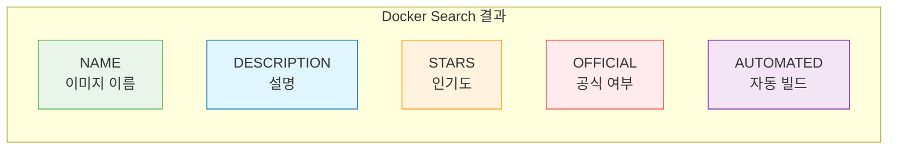
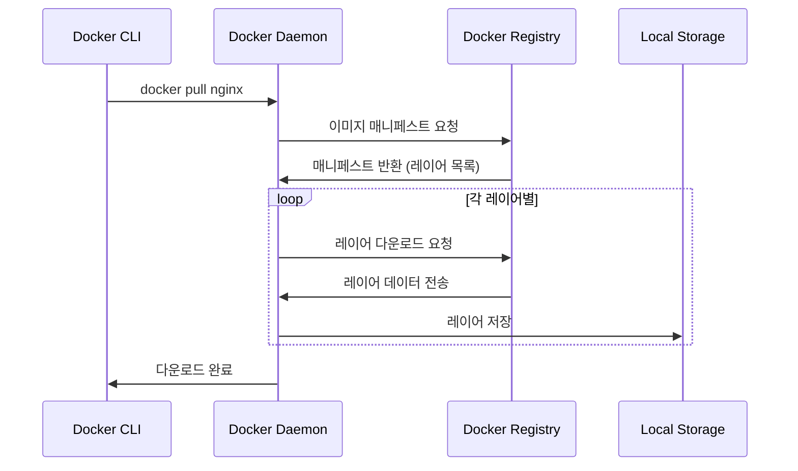
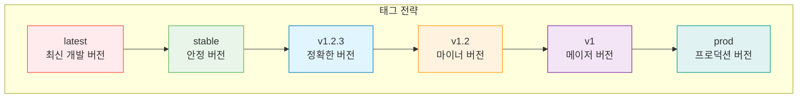

# Session 2: 이미지 관리 명령어

## 📍 교과과정에서의 위치
이 세션은 **Week 1 > Day 3 > Session 2**로, Docker 이미지 관리의 핵심 명령어들을 학습합니다. 이미지 다운로드부터 삭제까지 전체 이미지 라이프사이클을 관리하는 실무 기술을 습득합니다.

## 학습 목표 (5분)
- 이미지 검색과 다운로드 명령어 마스터
- 이미지 태그 관리와 버전 제어 이해
- 이미지 정보 조회와 분석 기법 학습
- 이미지 정리와 최적화 방법 습득

## 1. 이미지 검색과 다운로드 (15분)

### docker search - 이미지 검색
**Docker Hub에서 이미지를 검색하는 명령어입니다.**

#### 기본 검색
```bash
# 기본 이미지 검색
docker search nginx
docker search ubuntu
docker search mysql

# 출력 예시:
# NAME                     DESCRIPTION                                     STARS     OFFICIAL   AUTOMATED
# nginx                    Official build of Nginx.                       19000     [OK]       
# nginx/nginx-ingress      NGINX and  NGINX Plus Ingress Controllers...   200                  [OK]
# nginxinc/nginx-unprivileged   Unprivileged NGINX Dockerfiles            100                  [OK]
```

#### 고급 검색 옵션
```bash
# 공식 이미지만 검색
docker search --filter is-official=true nginx

# 자동화된 빌드만 검색
docker search --filter is-automated=true nginx

# 최소 스타 수 지정
docker search --filter stars=100 nginx

# 검색 결과 제한
docker search --limit 10 nginx

# 출력 형식 지정
docker search --format "table {{.Name}}\t{{.Description}}\t{{.Stars}}" nginx
```

#### 검색 결과 해석
**검색 결과의 각 컬럼 의미:**



**선택 기준:**
- **OFFICIAL [OK]**: Docker에서 공식 관리하는 이미지 (최우선 선택)
- **높은 STARS**: 커뮤니티에서 검증된 인기 이미지
- **상세한 DESCRIPTION**: 명확한 용도와 기능 설명
- **AUTOMATED [OK]**: 소스 코드 변경 시 자동 빌드되는 이미지

### docker pull - 이미지 다운로드
**Docker Hub 또는 다른 레지스트리에서 이미지를 다운로드합니다.**

#### 기본 다운로드
```bash
# 최신 버전 다운로드 (latest 태그)
docker pull nginx
docker pull ubuntu
docker pull mysql

# 특정 태그 다운로드
docker pull nginx:1.21
docker pull ubuntu:20.04
docker pull mysql:8.0

# 특정 아키텍처 다운로드
docker pull --platform linux/amd64 nginx
docker pull --platform linux/arm64 nginx
```

#### 고급 다운로드 옵션
```bash
# 모든 태그 다운로드 (주의: 용량 많이 사용)
docker pull --all-tags nginx

# 다운로드 진행 상황 비활성화
docker pull --quiet nginx

# 다이제스트로 정확한 이미지 다운로드
docker pull nginx@sha256:abc123...

# 프라이빗 레지스트리에서 다운로드
docker pull myregistry.com/myimage:latest
```

#### 다운로드 과정 이해
**이미지 다운로드 시 일어나는 과정:**



**레이어별 다운로드:**
- **병렬 다운로드**: 여러 레이어를 동시에 다운로드
- **중복 제거**: 이미 존재하는 레이어는 재사용
- **압축 해제**: 다운로드된 레이어를 압축 해제하여 저장
- **검증**: SHA256 해시로 무결성 검증

## 2. 이미지 목록과 정보 조회 (12분)

### docker images - 로컬 이미지 목록
**로컬에 저장된 이미지들을 조회합니다.**

#### 기본 목록 조회
```bash
# 모든 로컬 이미지 목록
docker images
# 또는
docker image ls

# 출력 예시:
# REPOSITORY    TAG       IMAGE ID       CREATED        SIZE
# nginx         latest    f652ca386ed1   2 weeks ago    141MB
# nginx         1.21      f652ca386ed1   2 weeks ago    141MB
# ubuntu        20.04     ba6acccedd29   3 weeks ago    72.8MB
# mysql         8.0       3218b38490ce   4 weeks ago    516MB
```

#### 고급 목록 조회
```bash
# 모든 이미지 (중간 레이어 포함)
docker images -a

# 이미지 ID만 출력
docker images -q

# 댕글링 이미지만 표시 (태그가 없는 이미지)
docker images --filter "dangling=true"

# 특정 리포지토리만 표시
docker images nginx
docker images ubuntu:20.04

# 크기별 정렬
docker images --format "table {{.Repository}}\t{{.Tag}}\t{{.Size}}" | sort -k3 -h

# 생성 시간별 정렬
docker images --format "table {{.Repository}}\t{{.Tag}}\t{{.CreatedAt}}"
```

#### 사용자 정의 출력 형식
```bash
# 기본 테이블 형식
docker images --format "table {{.Repository}}\t{{.Tag}}\t{{.ID}}\t{{.Size}}"

# JSON 형식
docker images --format json

# 간단한 형식
docker images --format "{{.Repository}}:{{.Tag}} ({{.Size}})"

# 상세 정보 포함
docker images --format "table {{.Repository}}\t{{.Tag}}\t{{.ID}}\t{{.CreatedSince}}\t{{.Size}}"
```

### docker inspect - 이미지 상세 정보
**이미지의 상세한 메타데이터와 구성 정보를 조회합니다.**

#### 기본 정보 조회
```bash
# 전체 상세 정보 (JSON 형식)
docker inspect nginx

# 특정 필드만 추출
docker inspect --format='{{.Config.Env}}' nginx
docker inspect --format='{{.Config.ExposedPorts}}' nginx
docker inspect --format='{{.Architecture}}' nginx
docker inspect --format='{{.Os}}' nginx
```

#### 유용한 정보 추출
```bash
# 이미지 생성 시간
docker inspect --format='{{.Created}}' nginx

# 이미지 크기
docker inspect --format='{{.Size}}' nginx

# 환경 변수
docker inspect --format='{{range .Config.Env}}{{println .}}{{end}}' nginx

# 노출된 포트
docker inspect --format='{{range $port, $config := .Config.ExposedPorts}}{{$port}} {{end}}' nginx

# 레이어 정보
docker inspect --format='{{range .RootFS.Layers}}{{println .}}{{end}}' nginx

# 작업 디렉토리
docker inspect --format='{{.Config.WorkingDir}}' nginx

# 기본 명령어
docker inspect --format='{{.Config.Cmd}}' nginx
```

### docker history - 이미지 레이어 히스토리
**이미지의 레이어 구성과 생성 과정을 조회합니다.**

#### 기본 히스토리 조회
```bash
# 이미지 레이어 히스토리
docker history nginx

# 출력 예시:
# IMAGE          CREATED        CREATED BY                                      SIZE      COMMENT
# f652ca386ed1   2 weeks ago    /bin/sh -c #(nop)  CMD ["nginx" "-g" "daemon…   0B        
# <missing>      2 weeks ago    /bin/sh -c #(nop)  STOPSIGNAL SIGQUIT           0B        
# <missing>      2 weeks ago    /bin/sh -c #(nop)  EXPOSE 80                    0B        
# <missing>      2 weeks ago    /bin/sh -c #(nop) COPY file:... in /docker-e…   4.61kB    
# <missing>      2 weeks ago    /bin/sh -c apt-get update && apt-get install…   54.3MB    
```

#### 상세 히스토리 옵션
```bash
# 전체 명령어 표시 (잘리지 않음)
docker history --no-trunc nginx

# 사람이 읽기 쉬운 크기 형식
docker history --human nginx

# 출력 형식 지정
docker history --format "table {{.ID}}\t{{.CreatedBy}}\t{{.Size}}" nginx

# JSON 형식으로 출력
docker history --format json nginx
```

## 3. 이미지 태그 관리 (10분)

### docker tag - 이미지 태그 생성
**기존 이미지에 새로운 태그를 부여합니다.**

#### 기본 태그 생성
```bash
# 로컬 태그 생성
docker tag nginx:latest nginx:stable
docker tag nginx:latest nginx:v1.0
docker tag nginx:latest myregistry.com/nginx:latest

# 이미지 ID로 태그 생성
docker tag f652ca386ed1 nginx:backup
```

#### 태그 명명 규칙
**효과적인 태그 관리를 위한 명명 규칙:**

```bash
# 시맨틱 버전 태그
docker tag myapp:latest myapp:1.2.3
docker tag myapp:latest myapp:1.2
docker tag myapp:latest myapp:1

# 환경별 태그
docker tag myapp:latest myapp:dev
docker tag myapp:latest myapp:staging
docker tag myapp:latest myapp:prod

# 날짜 기반 태그
docker tag myapp:latest myapp:2024-01-15
docker tag myapp:latest myapp:$(date +%Y%m%d)

# 기능별 태그
docker tag myapp:latest myapp:feature-auth
docker tag myapp:latest myapp:hotfix-security
```

### 태그 전략과 모범 사례
**프로덕션 환경에서의 태그 관리 전략:**

#### 버전 관리 전략


#### 태그 모범 사례
```bash
# 1. 절대 latest 태그를 프로덕션에서 사용하지 말 것
# 나쁜 예:
docker run myapp:latest

# 좋은 예:
docker run myapp:1.2.3

# 2. 불변 태그 사용 (다이제스트)
docker run myapp@sha256:abc123...

# 3. 의미 있는 태그 사용
docker tag myapp:latest myapp:$(git rev-parse --short HEAD)
docker tag myapp:latest myapp:build-$(date +%Y%m%d-%H%M%S)
```

## 4. 이미지 삭제와 정리 (8분)

### docker rmi - 이미지 삭제
**로컬에서 불필요한 이미지를 삭제합니다.**

#### 기본 삭제
```bash
# 태그로 이미지 삭제
docker rmi nginx:1.21
docker rmi ubuntu:18.04

# 이미지 ID로 삭제
docker rmi f652ca386ed1

# 여러 이미지 동시 삭제
docker rmi nginx:1.21 ubuntu:18.04 mysql:5.7

# 강제 삭제 (컨테이너가 사용 중이어도 삭제)
docker rmi -f nginx:latest
```

#### 고급 삭제 옵션
```bash
# 댕글링 이미지 삭제 (태그가 없는 이미지)
docker image prune

# 사용하지 않는 모든 이미지 삭제
docker image prune -a

# 특정 기간 이전 이미지 삭제
docker image prune --filter "until=24h"
docker image prune --filter "until=2024-01-01T00:00:00"

# 특정 라벨을 가진 이미지 삭제
docker image prune --filter "label=version=old"
```

### 시스템 정리 명령어
**Docker 시스템 전체의 불필요한 리소스를 정리합니다.**

#### 종합 정리
```bash
# 사용하지 않는 모든 리소스 정리
docker system prune

# 모든 미사용 리소스 정리 (이미지 포함)
docker system prune -a

# 볼륨까지 포함하여 정리
docker system prune --volumes

# 강제 정리 (확인 없이)
docker system prune -f
```

#### 선택적 정리
```bash
# 컨테이너만 정리
docker container prune

# 이미지만 정리
docker image prune

# 네트워크만 정리
docker network prune

# 볼륨만 정리
docker volume prune

# 빌드 캐시 정리
docker builder prune
```

## 5. 실습: 이미지 관리 워크플로우 (10분)

### 종합 실습 시나리오
**웹 개발 프로젝트를 위한 이미지 관리 실습**

#### 1단계: 이미지 검색과 선택
```bash
# 웹 서버 이미지 검색
docker search nginx
docker search apache

# 데이터베이스 이미지 검색
docker search mysql
docker search postgresql

# 선택한 이미지 정보 확인
docker search --filter is-official=true nginx
docker search --filter stars=1000 mysql
```

#### 2단계: 이미지 다운로드
```bash
# 필요한 이미지들 다운로드
docker pull nginx:alpine
docker pull mysql:8.0
docker pull node:18-alpine
docker pull redis:alpine

# 다운로드 확인
docker images
```

#### 3단계: 이미지 분석
```bash
# 각 이미지의 상세 정보 확인
docker inspect nginx:alpine
docker history nginx:alpine

# 이미지 크기 비교
docker images --format "table {{.Repository}}\t{{.Tag}}\t{{.Size}}"

# 환경 변수와 포트 확인
docker inspect --format='{{.Config.Env}}' nginx:alpine
docker inspect --format='{{.Config.ExposedPorts}}' nginx:alpine
```

#### 4단계: 태그 관리
```bash
# 개발 환경용 태그 생성
docker tag nginx:alpine nginx:dev
docker tag mysql:8.0 mysql:dev
docker tag node:18-alpine node:dev

# 버전 태그 생성
docker tag nginx:alpine nginx:v1.0
docker tag mysql:8.0 mysql:v8.0

# 태그 확인
docker images | grep -E "(nginx|mysql|node)"
```

#### 5단계: 정리 작업
```bash
# 불필요한 태그 삭제
docker rmi nginx:dev
docker rmi mysql:dev

# 댕글링 이미지 정리
docker image prune

# 시스템 상태 확인
docker system df
```

### 실습 과제
**다음 작업을 완료해보세요:**

1. **이미지 검색**: Python 공식 이미지 중 Alpine 기반 이미지 찾기
2. **버전 관리**: 동일한 이미지에 3가지 다른 태그 부여하기
3. **정보 분석**: 선택한 이미지의 기본 작업 디렉토리와 명령어 확인
4. **크기 최적화**: 가장 작은 크기의 웹 서버 이미지 찾기
5. **정리 작업**: 실습 후 불필요한 이미지들 정리하기

## 다음 세션 예고
이미지를 기반으로 실제 컨테이너를 생성하고 실행하는 방법을 학습하겠습니다. docker run 명령어의 다양한 옵션들을 실습해보겠습니다.

## 📚 참고 자료
- [Docker Image Management](https://docs.docker.com/engine/reference/commandline/image/)
- [Docker Hub Official Images](https://docs.docker.com/docker-hub/official_images/)
- [Image Naming Best Practices](https://docs.docker.com/develop/dev-best-practices/)
- [Docker Registry API](https://docs.docker.com/registry/spec/api/)
- [Multi-platform Images](https://docs.docker.com/build/building/multi-platform/)