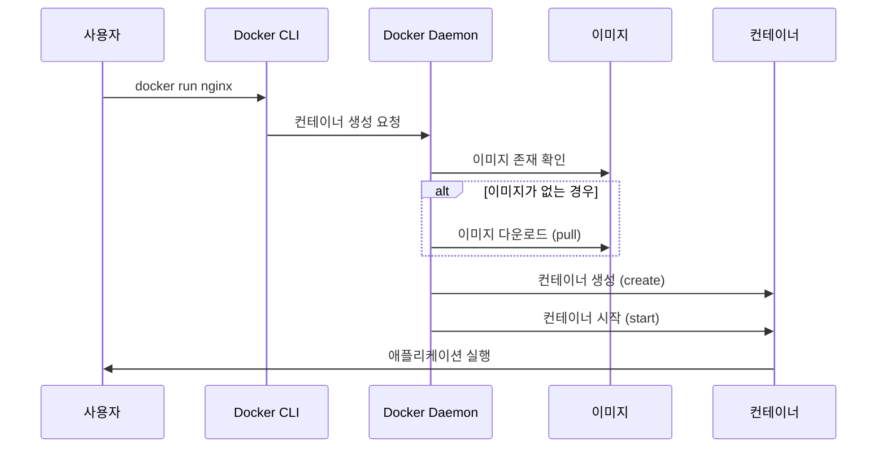
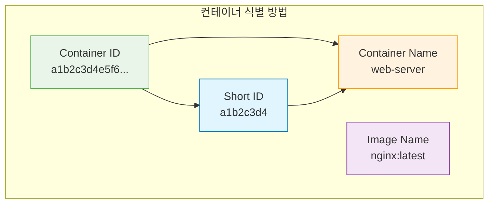

# Session 3: 컨테이너 생성과 실행

## 📍 교과과정에서의 위치
이 세션은 **Week 1 > Day 3 > Session 3**으로, Docker의 핵심 명령어인 `docker run`을 마스터합니다. 이미지로부터 컨테이너를 생성하고 실행하는 다양한 방법과 옵션들을 실습을 통해 학습합니다.

## 학습 목표 (5분)
- docker run 명령어의 기본 구조와 동작 원리 이해
- 포그라운드와 백그라운드 실행 방식 구분
- 컨테이너 이름 지정과 관리 방법 학습
- 실무에서 자주 사용되는 run 옵션들 습득

## 1. docker run 기본 개념 (15분)

### docker run의 동작 원리
**docker run**은 **이미지로부터 새로운 컨테이너를 생성하고 즉시 실행하는 명령어**입니다.

#### 내부 동작 과정


#### docker run = docker create + docker start
**docker run은 실제로 두 단계의 조합입니다:**

```bash
# docker run과 동일한 효과
docker create --name my-nginx nginx
docker start my-nginx

# 한 번에 실행
docker run --name my-nginx nginx
```

### 기본 명령어 구조
**docker run의 완전한 구문:**

```bash
docker run [OPTIONS] IMAGE [COMMAND] [ARG...]
```

**구성 요소 설명:**
- [OPTIONS]: 컨테이너 실행 옵션 (포트, 볼륨, 환경변수 등)
- IMAGE: 사용할 이미지 이름과 태그
- [COMMAND]: 컨테이너 내부에서 실행할 명령어 (선택사항)
- [ARG...]: 명령어의 인수들 (선택사항)

#### 기본 실행 예제
```bash
# 가장 간단한 형태
docker run hello-world

# 이미지 태그 지정
docker run ubuntu:20.04

# 컨테이너 내부 명령어 실행
docker run ubuntu:20.04 echo "Hello Docker"

# 대화형 셸 실행
docker run -it ubuntu:20.04 /bin/bash
```

### 컨테이너 실행 모드
**컨테이너는 두 가지 모드로 실행할 수 있습니다:**

#### 1. 포그라운드 모드 (기본값)
**컨테이너가 터미널에 연결되어 실행됩니다:**

```bash
# 포그라운드 실행 (기본값)
docker run nginx

# 대화형 모드 (-i: interactive, -t: tty)
docker run -it ubuntu /bin/bash

# 출력만 연결 (-a: attach)
docker run -a stdout -a stderr nginx
```

**특징:**
- 터미널이 컨테이너에 연결됨
- Ctrl+C로 컨테이너 종료 가능
- 컨테이너 로그가 실시간으로 표시됨
- 터미널을 닫으면 컨테이너도 종료됨

#### 2. 백그라운드 모드 (Detached)
**컨테이너가 백그라운드에서 실행됩니다:**

```bash
# 백그라운드 실행 (-d: detached)
docker run -d nginx

# 백그라운드 실행 후 컨테이너 ID 반환
# 출력 예시: a1b2c3d4e5f6...

# 이름을 지정한 백그라운드 실행
docker run -d --name web-server nginx
```

**특징:**
- 컨테이너가 백그라운드에서 실행됨
- 컨테이너 ID가 반환됨
- 터미널을 닫아도 컨테이너 계속 실행
- 별도 명령어로 로그 확인 필요

## 2. 컨테이너 이름 관리 (12분)

### 자동 이름 vs 수동 이름
**Docker는 컨테이너에 자동으로 이름을 부여하거나 수동으로 지정할 수 있습니다.**

#### 자동 이름 생성
```bash
# 자동 이름으로 컨테이너 생성
docker run -d nginx

# 생성된 컨테이너 확인
docker ps
# 출력 예시:
# CONTAINER ID   IMAGE   COMMAND                  CREATED         STATUS         PORTS     NAMES
# a1b2c3d4e5f6   nginx   "/docker-entrypoint.…"   2 minutes ago   Up 2 minutes   80/tcp    quirky_einstein
```

**자동 이름 생성 규칙:**
- **형용사 + 과학자/해커 이름** 조합
- 예시: `quirky_einstein`, `brave_tesla`, `amazing_turing`
- 중복되지 않는 유니크한 이름 보장

#### 수동 이름 지정
```bash
# --name 옵션으로 이름 지정
docker run -d --name web-server nginx
docker run -d --name database mysql:8.0
docker run -d --name cache redis:alpine

# 이름으로 컨테이너 관리
docker stop web-server
docker start web-server
docker logs web-server
```

### 이름 지정 모범 사례
**효과적인 컨테이너 이름 지정 전략:**

#### 명명 규칙
```bash
# 1. 서비스 기반 명명
docker run -d --name nginx-web nginx
docker run -d --name mysql-db mysql:8.0
docker run -d --name redis-cache redis

# 2. 환경 포함 명명
docker run -d --name web-prod nginx
docker run -d --name web-dev nginx
docker run -d --name web-test nginx

# 3. 프로젝트 기반 명명
docker run -d --name myapp-web nginx
docker run -d --name myapp-db mysql
docker run -d --name myapp-cache redis

# 4. 버전 포함 명명
docker run -d --name nginx-v1.21 nginx:1.21
docker run -d --name mysql-v8.0 mysql:8.0
```

#### 이름 충돌 처리
```bash
# 이름 충돌 시 오류 발생
docker run -d --name web nginx
docker run -d --name web nginx  # 오류: 이미 존재하는 이름

# 기존 컨테이너 제거 후 재생성
docker rm -f web
docker run -d --name web nginx

# 또는 다른 이름 사용
docker run -d --name web-new nginx
```

### 컨테이너 식별 방법
**컨테이너를 식별하는 다양한 방법:**



```bash
# Container ID로 관리 (전체)
docker stop a1b2c3d4e5f6789012345678901234567890

# Short ID로 관리 (앞 12자리)
docker stop a1b2c3d4e5f6

# 이름으로 관리 (권장)
docker stop web-server

# 여러 컨테이너 동시 관리
docker stop web-server database cache
```

## 3. 주요 실행 옵션들 (15분)

### 기본 실행 옵션
**자주 사용되는 docker run 옵션들:**

#### 실행 모드 옵션
```bash
# -d: 백그라운드 실행 (detached)
docker run -d nginx

# -i: 대화형 모드 (interactive)
docker run -i ubuntu

# -t: TTY 할당 (pseudo-tty)
docker run -t ubuntu

# -it: 대화형 TTY (가장 일반적)
docker run -it ubuntu /bin/bash

# --rm: 종료 시 자동 삭제
docker run --rm -it ubuntu /bin/bash
```

#### 리소스 제한 옵션
```bash
# 메모리 제한
docker run -d --memory="512m" nginx
docker run -d --memory="1g" nginx

# CPU 제한
docker run -d --cpus="0.5" nginx
docker run -d --cpus="2" nginx

# CPU 코어 지정
docker run -d --cpuset-cpus="0,1" nginx

# 프로세스 수 제한
docker run -d --pids-limit=100 nginx
```

#### 보안 관련 옵션
```bash
# 읽기 전용 파일 시스템
docker run -d --read-only nginx

# 권한 제거
docker run -d --cap-drop=ALL nginx

# 특정 권한 추가
docker run -d --cap-add=NET_ADMIN nginx

# 비특권 모드
docker run -d --user 1000:1000 nginx

# 보안 옵션
docker run -d --security-opt=no-new-privileges nginx
```

### 환경 설정 옵션
**컨테이너 실행 환경을 설정하는 옵션들:**

#### 환경 변수 설정
```bash
# 단일 환경 변수
docker run -d -e MYSQL_ROOT_PASSWORD=secret mysql:8.0

# 여러 환경 변수
docker run -d \
  -e MYSQL_ROOT_PASSWORD=secret \
  -e MYSQL_DATABASE=myapp \
  -e MYSQL_USER=user \
  -e MYSQL_PASSWORD=password \
  mysql:8.0

# 환경 변수 파일 사용
echo "MYSQL_ROOT_PASSWORD=secret" > .env
echo "MYSQL_DATABASE=myapp" >> .env
docker run -d --env-file .env mysql:8.0

# 호스트 환경 변수 전달
export DB_PASSWORD=secret
docker run -d -e DB_PASSWORD mysql:8.0
```

#### 작업 디렉토리 설정
```bash
# 작업 디렉토리 지정
docker run -it -w /app ubuntu /bin/bash

# 호스트 디렉토리를 작업 디렉토리로 마운트
docker run -it -w /app -v $(pwd):/app ubuntu /bin/bash
```

#### 사용자 설정
```bash
# 특정 사용자로 실행
docker run -it --user 1000 ubuntu /bin/bash
docker run -it --user www-data nginx /bin/bash

# 사용자:그룹 지정
docker run -it --user 1000:1000 ubuntu /bin/bash

# 현재 사용자로 실행 (Linux/Mac)
docker run -it --user $(id -u):$(id -g) ubuntu /bin/bash
```

### 네트워크와 포트 옵션
**컨테이너의 네트워크 설정 옵션들:**

#### 포트 매핑
```bash
# 기본 포트 매핑 (호스트:컨테이너)
docker run -d -p 8080:80 nginx

# 여러 포트 매핑
docker run -d -p 8080:80 -p 8443:443 nginx

# 특정 인터페이스에 바인딩
docker run -d -p 127.0.0.1:8080:80 nginx

# 랜덤 포트 할당
docker run -d -p 80 nginx

# UDP 포트 매핑
docker run -d -p 53:53/udp dns-server
```

#### 네트워크 모드
```bash
# 기본 브리지 네트워크
docker run -d nginx

# 호스트 네트워크 사용
docker run -d --network host nginx

# 네트워크 없음
docker run -d --network none nginx

# 다른 컨테이너의 네트워크 공유
docker run -d --name web nginx
docker run -d --network container:web app
```

## 4. 실습: 웹 서버 컨테이너 실행 (8분)

### 단계별 실습

#### 1단계: 기본 웹 서버 실행
```bash
# Nginx 웹 서버 실행 (포그라운드)
docker run nginx

# Ctrl+C로 종료 후 백그라운드 실행
docker run -d --name web-server nginx

# 컨테이너 상태 확인
docker ps
```

#### 2단계: 포트 매핑으로 접근 가능하게 설정
```bash
# 기존 컨테이너 정지 및 삭제
docker stop web-server
docker rm web-server

# 포트 매핑으로 재실행
docker run -d --name web-server -p 8080:80 nginx

# 웹 브라우저에서 http://localhost:8080 접속 확인
# 또는 curl로 테스트
curl http://localhost:8080
```

#### 3단계: 환경 변수와 사용자 정의 설정
```bash
# 환경 변수를 포함한 웹 서버 실행
docker run -d --name web-custom \
  -p 8081:80 \
  -e NGINX_HOST=localhost \
  -e NGINX_PORT=80 \
  nginx

# Apache 웹 서버도 실행해보기
docker run -d --name apache-server \
  -p 8082:80 \
  httpd:alpine

# 두 웹 서버 동시 실행 확인
docker ps
curl http://localhost:8081
curl http://localhost:8082
```

#### 4단계: 리소스 제한 적용
```bash
# 메모리와 CPU 제한을 적용한 웹 서버
docker run -d --name web-limited \
  -p 8083:80 \
  --memory="128m" \
  --cpus="0.5" \
  nginx:alpine

# 리소스 사용량 모니터링
docker stats web-limited
```

#### 5단계: 보안 강화 설정
```bash
# 읽기 전용 파일 시스템과 비루트 사용자
docker run -d --name web-secure \
  -p 8084:80 \
  --read-only \
  --user 101:101 \
  --cap-drop=ALL \
  --security-opt=no-new-privileges \
  nginx:alpine

# 보안 설정 확인
docker inspect web-secure | grep -A 10 "SecurityOpt"
```

### 실습 과제
**다음 요구사항을 만족하는 컨테이너를 실행해보세요:**

1. 멀티 포트 웹 서버: Nginx를 8080, 8443 포트로 동시 접근 가능하게 설정
2. 환경별 컨테이너: 동일한 이미지로 dev, staging, prod 환경 컨테이너 생성
3. 리소스 최적화: 메모리 256MB, CPU 0.5 코어로 제한된 웹 서버
4. 자동 정리: 종료 시 자동으로 삭제되는 임시 테스트 컨테이너
5. 보안 강화: 모든 보안 옵션을 적용한 프로덕션급 웹 서버

### 정리 작업
```bash
# 실습에서 생성한 모든 컨테이너 정리
docker stop $(docker ps -q)
docker rm $(docker ps -aq)

# 또는 개별 정리
docker stop web-server web-custom apache-server web-limited web-secure
docker rm web-server web-custom apache-server web-limited web-secure
```

## 다음 세션 예고
생성된 컨테이너들의 상태를 관리하는 방법을 학습하겠습니다. 컨테이너 시작, 중지, 재시작, 삭제 등의 라이프사이클 관리 명령어들을 실습해보겠습니다.

## 📚 참고 자료
- [Docker Run Reference](https://docs.docker.com/engine/reference/run/)
- [Docker Run Command](https://docs.docker.com/engine/reference/commandline/run/)
- [Container Networking](https://docs.docker.com/config/containers/container-networking/)
- [Runtime Options](https://docs.docker.com/config/containers/resource_constraints/)
- [Security Configuration](https://docs.docker.com/engine/security/)