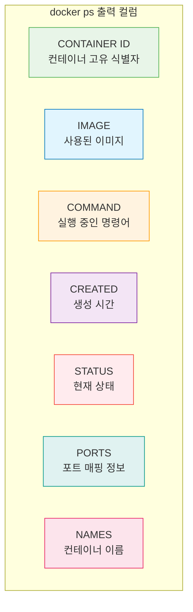
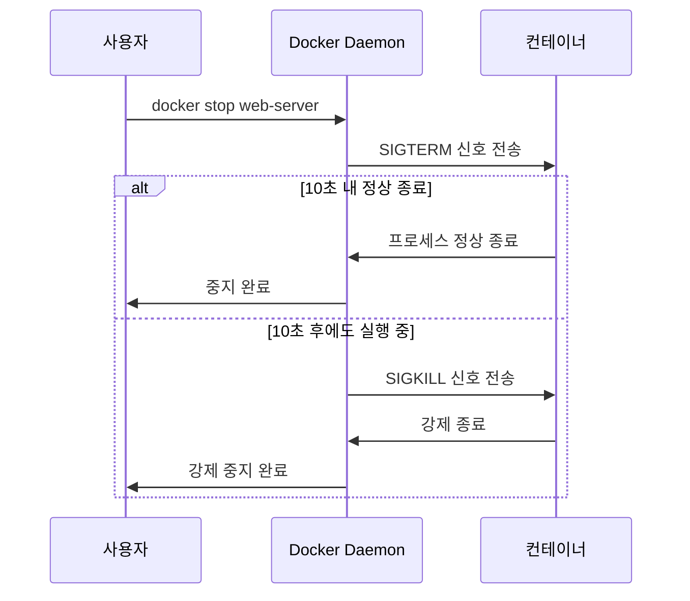
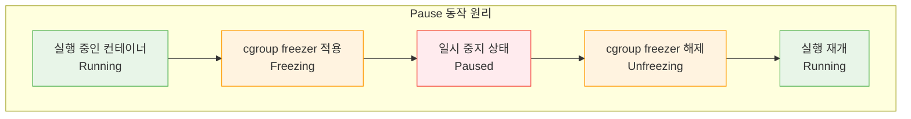

# Session 4: 컨테이너 상태 관리

## 📍 교과과정에서의 위치
이 세션은 **Week 1 > Day 3 > Session 4**로, 생성된 컨테이너들의 상태를 효과적으로 관리하는 방법을 학습합니다. 컨테이너 라이프사이클의 각 단계별 관리 명령어와 실무에서 필요한 상태 제어 기법을 습득합니다.

## 학습 목표 (5분)
- 컨테이너 상태 조회와 모니터링 방법 학습
- 컨테이너 시작, 중지, 재시작 명령어 마스터
- 컨테이너 일시 중지와 재개 기능 이해
- 컨테이너 삭제와 정리 작업 습득

## 1. 컨테이너 상태 조회 (15분)

### docker ps - 컨테이너 목록 조회
**docker ps**는 **컨테이너의 현재 상태를 조회하는 가장 기본적인 명령어**입니다.

#### 기본 조회 명령어
```bash
# 실행 중인 컨테이너만 표시 (기본값)
docker ps

# 모든 컨테이너 표시 (중지된 것 포함)
docker ps -a
# 또는
docker ps --all

# 출력 예시:
# CONTAINER ID   IMAGE     COMMAND                  CREATED         STATUS                     PORTS                  NAMES
# a1b2c3d4e5f6   nginx     "/docker-entrypoint.…"   2 minutes ago   Up 2 minutes               0.0.0.0:8080->80/tcp   web-server
# b2c3d4e5f6a1   mysql     "docker-entrypoint.s…"   5 minutes ago   Exited (0) 3 minutes ago                          database
```

#### 출력 컬럼 이해
**각 컬럼의 의미와 활용법:**



**STATUS 컬럼 상세 분석:**
- Up X minutes/hours: 실행 중 (X 시간 동안)
- Exited (0) X minutes ago: 정상 종료 (종료 코드 0)
- Exited (1) X minutes ago: 오류로 종료 (종료 코드 1)
- Restarting: 재시작 중
- Paused: 일시 중지됨
- Dead: 데드 상태 (복구 불가능)

#### 고급 조회 옵션
```bash
# 컨테이너 ID만 출력 (스크립트에서 유용)
docker ps -q
docker ps -aq  # 모든 컨테이너 ID

# 최근 생성된 N개 컨테이너
docker ps -n 5
docker ps --last 5

# 특정 크기로 출력 제한
docker ps --size  # 컨테이너 크기 정보 포함

# 필터링 옵션
docker ps --filter "status=running"
docker ps --filter "status=exited"
docker ps --filter "name=web"
docker ps --filter "ancestor=nginx"
docker ps --filter "expose=80"

# 여러 필터 조합
docker ps --filter "status=running" --filter "name=web"
```

#### 사용자 정의 출력 형식
```bash
# 기본 테이블 형식 커스터마이징
docker ps --format "table {{.Names}}\t{{.Status}}\t{{.Ports}}"

# 간단한 목록 형식
docker ps --format "{{.Names}}: {{.Status}}"

# JSON 형식 출력
docker ps --format json

# 상세 정보 포함
docker ps --format "table {{.Names}}\t{{.Image}}\t{{.Status}}\t{{.RunningFor}}\t{{.Ports}}"

# 스크립트 친화적 형식
docker ps --format "{{.Names}}|{{.Status}}|{{.Ports}}"
```

### 컨테이너 상태 모니터링
**실시간으로 컨테이너 상태를 모니터링하는 방법:**

#### docker stats - 리소스 사용량 모니터링
```bash
# 모든 실행 중인 컨테이너의 리소스 사용량
docker stats

# 특정 컨테이너만 모니터링
docker stats web-server database

# 한 번만 출력 (실시간 아님)
docker stats --no-stream

# 출력 형식 지정
docker stats --format "table {{.Container}}\t{{.CPUPerc}}\t{{.MemUsage}}\t{{.NetIO}}"

# 출력 예시:
# CONTAINER ID   NAME        CPU %     MEM USAGE / LIMIT     MEM %     NET I/O           BLOCK I/O         PIDS
# a1b2c3d4e5f6   web-server  0.00%     2.5MiB / 1.944GiB     0.13%     1.2kB / 0B        0B / 0B           2
```

#### docker top - 컨테이너 내부 프로세스 확인
```bash
# 컨테이너 내부 실행 중인 프로세스
docker top web-server

# 출력 예시:
# UID                 PID                 PPID                C                   STIME               TTY                 TIME                CMD
# root                1234                1233                0                   14:30               ?                   00:00:00            nginx: master process nginx -g daemon off;
# 101                 1235                1234                0                   14:30               ?                   00:00:00            nginx: worker process

# 특정 형식으로 프로세스 정보 출력
docker top web-server -o pid,ppid,user,time,comm
```

## 2. 컨테이너 시작과 중지 (12분)

### 컨테이너 시작 명령어
**중지된 컨테이너를 다시 시작하는 방법들:**

#### docker start - 컨테이너 시작
```bash
# 단일 컨테이너 시작
docker start web-server

# 여러 컨테이너 동시 시작
docker start web-server database cache

# 컨테이너 ID로 시작
docker start a1b2c3d4e5f6

# 시작과 동시에 로그 출력 (-a: attach)
docker start -a web-server

# 대화형 모드로 시작 (-i: interactive)
docker start -i web-server
```

#### docker restart - 컨테이너 재시작
```bash
# 컨테이너 재시작 (stop + start)
docker restart web-server

# 여러 컨테이너 재시작
docker restart web-server database

# 재시작 대기 시간 지정 (기본 10초)
docker restart -t 30 web-server

# 즉시 재시작 (대기 시간 0초)
docker restart -t 0 web-server
```

### 컨테이너 중지 명령어
**실행 중인 컨테이너를 안전하게 중지하는 방법들:**

#### docker stop - 정상 중지
```bash
# 단일 컨테이너 중지
docker stop web-server

# 여러 컨테이너 동시 중지
docker stop web-server database cache

# 모든 실행 중인 컨테이너 중지
docker stop $(docker ps -q)

# 중지 대기 시간 지정 (기본 10초)
docker stop -t 30 web-server

# 즉시 중지 시도
docker stop -t 0 web-server
```

**docker stop의 동작 과정:**


#### docker kill - 강제 중지
```bash
# 강제 중지 (SIGKILL)
docker kill web-server

# 여러 컨테이너 강제 중지
docker kill web-server database

# 특정 신호로 중지
docker kill --signal=SIGTERM web-server
docker kill --signal=SIGUSR1 web-server

# 모든 컨테이너 강제 중지
docker kill $(docker ps -q)
```

**docker stop vs docker kill 비교:**

| 구분 | docker stop | docker kill |
|------|-------------|-------------|
| **신호** | SIGTERM → SIGKILL | SIGKILL |
| **대기 시간** | 10초 (설정 가능) | 즉시 |
| **안전성** | 안전한 종료 | 강제 종료 |
| **데이터 보존** | 보장됨 | 위험 가능성 |
| **사용 시기** | 일반적인 중지 | 응답 없는 컨테이너 |

## 3. 컨테이너 일시 중지와 재개 (8분)

### docker pause/unpause - 일시 중지 기능
**컨테이너를 메모리에 유지한 채 실행을 일시 중지하는 기능:**

#### 일시 중지 (Pause)
```bash
# 컨테이너 일시 중지
docker pause web-server

# 여러 컨테이너 일시 중지
docker pause web-server database

# 일시 중지 상태 확인
docker ps
# STATUS 컬럼에 "Up X minutes (Paused)" 표시
```

#### 재개 (Unpause)
```bash
# 컨테이너 재개
docker unpause web-server

# 여러 컨테이너 재개
docker unpause web-server database

# 재개 후 상태 확인
docker ps
```

### Pause 기능의 특징과 활용
**일시 중지 기능의 기술적 특징:**

#### 기술적 구현


**특징:**
- 메모리 보존: 프로세스 상태가 메모리에 그대로 유지됨
- 네트워크 유지: 네트워크 연결 상태 보존
- 빠른 재개: 프로세스 재시작 없이 즉시 재개
- CPU 사용 중단: CPU 사용량이 0%로 감소

#### 활용 사례
```bash
# 1. 디버깅 목적
docker run -d --name debug-app myapp
docker pause debug-app
# 메모리 덤프나 상태 분석 수행
docker unpause debug-app

# 2. 리소스 절약
docker pause low-priority-service
# 중요한 작업 수행
docker unpause low-priority-service

# 3. 스냅샷 생성
docker pause database
# 일관된 상태에서 백업 수행
docker unpause database

# 4. 로드 밸런싱
docker pause web-server-1
# 서버 업데이트 수행
docker unpause web-server-1
```

## 4. 컨테이너 삭제와 정리 (10분)

### docker rm - 컨테이너 삭제
**불필요한 컨테이너를 시스템에서 완전히 제거:**

#### 기본 삭제
```bash
# 중지된 컨테이너 삭제
docker rm web-server

# 여러 컨테이너 동시 삭제
docker rm web-server database cache

# 컨테이너 ID로 삭제
docker rm a1b2c3d4e5f6

# 강제 삭제 (실행 중인 컨테이너도 삭제)
docker rm -f web-server

# 볼륨도 함께 삭제
docker rm -v web-server
```

#### 대량 삭제
```bash
# 모든 중지된 컨테이너 삭제
docker rm $(docker ps -aq --filter "status=exited")

# 모든 컨테이너 강제 삭제
docker rm -f $(docker ps -aq)

# 특정 패턴의 컨테이너 삭제
docker rm $(docker ps -aq --filter "name=test-*")

# 특정 이미지로 생성된 컨테이너 삭제
docker rm $(docker ps -aq --filter "ancestor=nginx")
```

### 자동 정리 기능
**컨테이너 생성 시 자동 정리 설정:**

#### --rm 옵션 활용
```bash
# 종료 시 자동 삭제되는 컨테이너
docker run --rm -it ubuntu /bin/bash

# 테스트용 임시 컨테이너
docker run --rm --name temp-test nginx

# 일회성 작업용 컨테이너
docker run --rm -v $(pwd):/workspace ubuntu ls -la /workspace
```

### 시스템 정리 명령어
**Docker 시스템 전체의 불필요한 리소스 정리:**

#### docker container prune
```bash
# 중지된 모든 컨테이너 삭제
docker container prune

# 확인 없이 삭제
docker container prune -f

# 특정 조건의 컨테이너만 삭제
docker container prune --filter "until=24h"
docker container prune --filter "label=version=old"
```

#### 종합 정리
```bash
# 사용하지 않는 모든 리소스 정리
docker system prune

# 이미지까지 포함하여 정리
docker system prune -a

# 볼륨까지 포함하여 정리
docker system prune --volumes

# 강제 정리 (확인 없이)
docker system prune -af --volumes
```

## 5. 실습: 컨테이너 라이프사이클 관리 (10분)

### 종합 실습 시나리오
**웹 애플리케이션 스택의 라이프사이클 관리 실습**

#### 1단계: 다중 컨테이너 환경 구성
```bash
# 웹 서버 컨테이너 생성
docker run -d --name web-server -p 8080:80 nginx

# 데이터베이스 컨테이너 생성
docker run -d --name database \
  -e MYSQL_ROOT_PASSWORD=secret \
  -e MYSQL_DATABASE=myapp \
  mysql:8.0

# 캐시 서버 컨테이너 생성
docker run -d --name cache redis:alpine

# 전체 상태 확인
docker ps
```

#### 2단계: 상태 모니터링
```bash
# 리소스 사용량 확인
docker stats --no-stream

# 각 컨테이너의 프로세스 확인
docker top web-server
docker top database
docker top cache

# 상세 상태 정보 확인
docker ps --format "table {{.Names}}\t{{.Status}}\t{{.Ports}}"
```

#### 3단계: 서비스 중단 없는 업데이트 시뮬레이션
```bash
# 웹 서버 일시 중지 (로드 밸런서에서 제외)
docker pause web-server

# 새로운 웹 서버 시작
docker run -d --name web-server-new -p 8081:80 nginx:alpine

# 트래픽 확인 후 기존 서버 제거
docker stop web-server
docker rm web-server

# 새 서버를 메인으로 변경
docker stop web-server-new
docker rm web-server-new
docker run -d --name web-server -p 8080:80 nginx:alpine
```

#### 4단계: 장애 상황 대응
```bash
# 데이터베이스 강제 종료 시뮬레이션
docker kill database

# 상태 확인
docker ps -a

# 데이터베이스 재시작
docker start database

# 전체 스택 재시작
docker restart web-server database cache
```

#### 5단계: 정리 작업
```bash
# 개별 컨테이너 정리
docker stop web-server database cache
docker rm web-server database cache

# 또는 한 번에 정리
docker rm -f $(docker ps -aq)

# 시스템 정리
docker system prune -f
```

### 실습 과제
**다음 시나리오를 구현해보세요:**

1. 롤링 업데이트: 3개의 웹 서버 컨테이너를 순차적으로 업데이트
2. 장애 복구: 컨테이너 장애 감지 후 자동 재시작 스크립트 작성
3. 리소스 모니터링: CPU 사용률이 높은 컨테이너 자동 감지
4. 배치 작업: 특정 시간에 실행되는 임시 컨테이너 관리
5. 환경별 관리: dev, staging, prod 환경의 컨테이너 그룹 관리

### 모니터링 스크립트 예제
```bash
#!/bin/bash
# 컨테이너 상태 모니터링 스크립트

echo "=== 컨테이너 상태 모니터링 ==="
echo "실행 중인 컨테이너:"
docker ps --format "table {{.Names}}\t{{.Status}}\t{{.Ports}}"

echo -e "\n중지된 컨테이너:"
docker ps -a --filter "status=exited" --format "table {{.Names}}\t{{.Status}}"

echo -e "\n리소스 사용량:"
docker stats --no-stream --format "table {{.Container}}\t{{.CPUPerc}}\t{{.MemUsage}}"

echo -e "\n디스크 사용량:"
docker system df
```

## 다음 세션 예고
컨테이너의 네트워크 설정과 포트 매핑에 대해 자세히 학습하겠습니다. 컨테이너 간 통신과 외부 접근을 위한 네트워크 구성 방법을 실습해보겠습니다.

## 📚 참고 자료
- [Container Lifecycle Management](https://docs.docker.com/engine/reference/commandline/container/)
- [Docker PS Command](https://docs.docker.com/engine/reference/commandline/ps/)
- [Container Resource Monitoring](https://docs.docker.com/config/containers/resource_constraints/)
- [Container States and Signals](https://docs.docker.com/engine/reference/run/#foreground)
- [System Maintenance](https://docs.docker.com/config/pruning/)