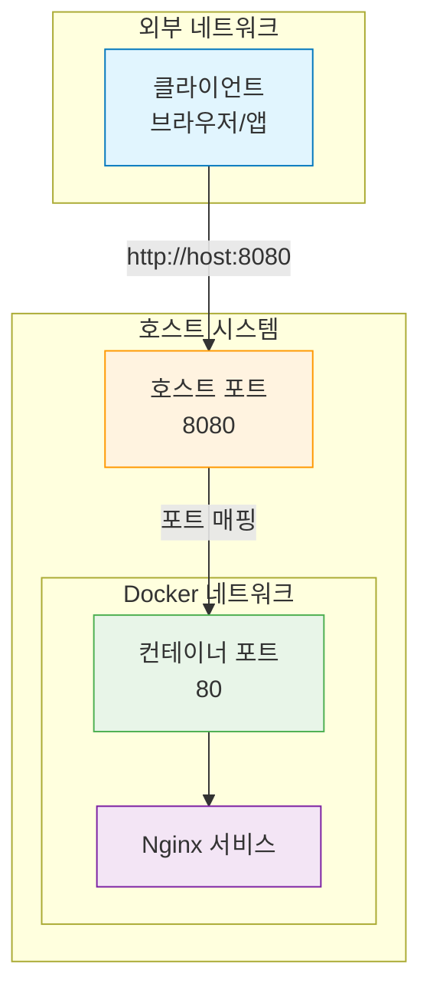
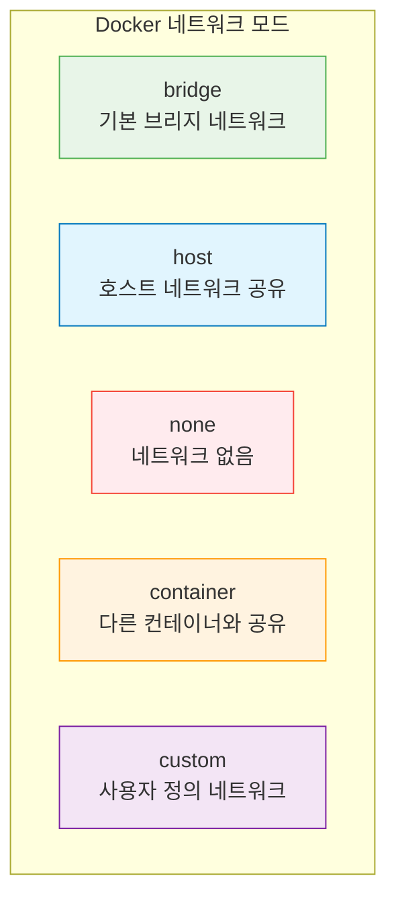

# Session 5: 포트와 네트워크

## 📍 교과과정에서의 위치
이 세션은 **Week 1 > Day 3 > Session 5**로, Docker 컨테이너의 네트워크 설정과 포트 매핑을 학습합니다. 컨테이너를 외부에서 접근 가능하게 만들고, 컨테이너 간 통신을 구성하는 실무 기술을 습득합니다.

## 학습 목표 (5분)
- 포트 매핑과 포워딩의 개념과 구현 방법 이해
- Docker 네트워크 모드의 종류와 특징 학습
- 컨테이너 간 통신 설정과 관리 방법 습득
- 실무에서 활용되는 네트워크 구성 패턴 학습

## 1. 포트 매핑 기초 (15분)

### 포트 매핑의 개념
**포트 매핑(Port Mapping)**은 **호스트의 포트를 컨테이너의 포트에 연결하여 외부에서 컨테이너 서비스에 접근할 수 있게 하는 기술**입니다.

#### 포트 매핑이 필요한 이유


**문제 상황:**
- 컨테이너는 격리된 네트워크 환경에서 실행됨
- 기본적으로 외부에서 컨테이너 내부 서비스에 직접 접근 불가
- 컨테이너 IP는 동적으로 할당되어 예측 불가능

**해결책:**
- 호스트의 고정된 포트를 컨테이너 포트에 매핑
- 외부에서 호스트 IP:포트로 접근하면 컨테이너로 전달

### 기본 포트 매핑 문법
**docker run의 -p 옵션을 사용한 포트 매핑:**

#### 기본 문법
```bash
# 기본 형식: -p [호스트포트]:[컨테이너포트]
docker run -d -p 8080:80 nginx

# 여러 포트 매핑
docker run -d -p 8080:80 -p 8443:443 nginx

# 프로토콜 지정 (TCP가 기본값)
docker run -d -p 8080:80/tcp nginx
docker run -d -p 53:53/udp dns-server
```

#### 다양한 포트 매핑 패턴
```bash
# 1. 기본 매핑 (모든 인터페이스)
docker run -d -p 8080:80 nginx
# 접근: http://localhost:8080, http://호스트IP:8080

# 2. 특정 인터페이스에만 바인딩
docker run -d -p 127.0.0.1:8080:80 nginx
# 접근: http://localhost:8080 (외부에서 접근 불가)

# 3. 랜덤 포트 할당
docker run -d -p 80 nginx
# Docker가 사용 가능한 포트를 자동 할당

# 4. 포트 범위 매핑
docker run -d -p 8080-8090:80-90 multi-port-app

# 5. IPv6 주소 바인딩
docker run -d -p [::1]:8080:80 nginx
```

### 포트 매핑 확인과 관리
**설정된 포트 매핑을 확인하고 관리하는 방법:**

#### 포트 매핑 확인
```bash
# docker ps로 포트 정보 확인
docker ps
# PORTS 컬럼에서 확인: 0.0.0.0:8080->80/tcp

# docker port 명령어로 상세 확인
docker port web-server
# 출력 예시: 80/tcp -> 0.0.0.0:8080

# 특정 포트만 확인
docker port web-server 80
# 출력 예시: 0.0.0.0:8080

# JSON 형식으로 상세 정보 확인
docker inspect web-server | grep -A 10 "Ports"
```

#### 동적 포트 할당 확인
```bash
# 랜덤 포트로 컨테이너 실행
docker run -d --name random-port -p 80 nginx

# 할당된 포트 확인
docker port random-port 80
# 출력 예시: 0.0.0.0:32768

# 할당된 포트로 접근 테스트
PORT=$(docker port random-port 80 | cut -d: -f2)
curl http://localhost:$PORT
```

## 2. Docker 네트워크 모드 (12분)

### 네트워크 모드 개요
**Docker는 컨테이너의 네트워크 연결 방식을 제어하는 여러 네트워크 모드를 제공합니다.**

#### 주요 네트워크 모드


### 1. Bridge 네트워크 (기본값)
**가장 일반적으로 사용되는 네트워크 모드:**

#### 특징과 동작 방식
```bash
# 기본 브리지 네트워크 사용 (명시적 지정)
docker run -d --network bridge nginx

# 기본값이므로 생략 가능
docker run -d nginx

# 브리지 네트워크 정보 확인
docker network ls
docker network inspect bridge
```

**Bridge 네트워크의 특징:**
- **격리된 네트워크**: 컨테이너마다 독립적인 IP 주소 할당
- **NAT 기반**: 호스트를 통해 외부 네트워크 접근
- **포트 매핑 필요**: 외부 접근을 위해서는 포트 매핑 필수
- **컨테이너 간 통신**: 같은 브리지 네트워크의 컨테이너끼리 통신 가능

#### 브리지 네트워크 실습
```bash
# 두 개의 컨테이너를 브리지 네트워크에서 실행
docker run -d --name web1 nginx
docker run -d --name web2 nginx

# 각 컨테이너의 IP 주소 확인
docker inspect web1 | grep IPAddress
docker inspect web2 | grep IPAddress

# 컨테이너 간 통신 테스트
docker exec web1 ping $(docker inspect web2 | grep IPAddress | cut -d'"' -f4)
```

### 2. Host 네트워크
**호스트의 네트워크를 직접 사용하는 모드:**

#### 특징과 사용법
```bash
# 호스트 네트워크 모드로 실행
docker run -d --network host nginx

# 포트 매핑 불필요 (호스트 포트 직접 사용)
# 접근: http://localhost:80
```

**Host 네트워크의 특징:**
- **네트워크 격리 없음**: 호스트와 동일한 네트워크 인터페이스 사용
- **포트 매핑 불필요**: 컨테이너가 호스트 포트를 직접 사용
- **성능 우수**: 네트워크 오버헤드 최소화
- **보안 위험**: 네트워크 격리 부족으로 보안 위험 증가

#### 사용 사례
```bash
# 네트워크 성능이 중요한 애플리케이션
docker run -d --network host high-performance-app

# 네트워크 모니터링 도구
docker run -d --network host network-monitor

# 로드 밸런서
docker run -d --network host nginx-lb
```

### 3. None 네트워크
**네트워크 연결이 없는 완전 격리 모드:**

```bash
# 네트워크 없는 컨테이너 실행
docker run -d --network none isolated-app

# 네트워크 인터페이스 확인 (loopback만 존재)
docker exec isolated-app ip addr show
```

### 4. Container 네트워크
**다른 컨테이너의 네트워크를 공유하는 모드:**

```bash
# 기본 컨테이너 실행
docker run -d --name primary nginx

# 네트워크를 공유하는 컨테이너 실행
docker run -d --network container:primary sidecar-app

# 동일한 네트워크 인터페이스 사용 확인
docker exec primary ip addr show
docker exec sidecar-app ip addr show
```

## 3. 사용자 정의 네트워크 (10분)

### 사용자 정의 네트워크 생성
**특정 요구사항에 맞는 네트워크를 직접 생성하고 관리:**

#### 네트워크 생성과 관리
```bash
# 기본 브리지 네트워크 생성
docker network create mynetwork

# 서브넷 지정하여 네트워크 생성
docker network create --subnet=172.20.0.0/16 mynetwork

# 게이트웨이 지정
docker network create --subnet=172.20.0.0/16 --gateway=172.20.0.1 mynetwork

# 드라이버 지정 (기본값: bridge)
docker network create --driver bridge mynetwork

# 네트워크 목록 확인
docker network ls

# 네트워크 상세 정보 확인
docker network inspect mynetwork
```

#### 고급 네트워크 옵션
```bash
# IPAM (IP Address Management) 설정
docker network create \
  --driver bridge \
  --subnet=172.20.0.0/16 \
  --ip-range=172.20.240.0/20 \
  --gateway=172.20.0.1 \
  --aux-address="host1=172.20.1.5" \
  --aux-address="host2=172.20.1.6" \
  mynetwork

# 네트워크 옵션 설정
docker network create \
  --driver bridge \
  --opt com.docker.network.bridge.name=mybr0 \
  --opt com.docker.network.bridge.enable_ip_masquerade=true \
  mynetwork

# 라벨 추가
docker network create \
  --label environment=production \
  --label team=backend \
  mynetwork
```

### 컨테이너를 사용자 정의 네트워크에 연결
**생성한 네트워크에 컨테이너를 연결하고 관리:**

#### 네트워크 연결
```bash
# 컨테이너 생성 시 네트워크 지정
docker run -d --name web --network mynetwork nginx

# 실행 중인 컨테이너를 네트워크에 연결
docker network connect mynetwork existing-container

# 컨테이너를 네트워크에서 분리
docker network disconnect mynetwork web

# 특정 IP 주소로 연결
docker run -d --name web --network mynetwork --ip 172.20.0.10 nginx
```

#### 네트워크 별칭 사용
```bash
# 네트워크 별칭으로 컨테이너 실행
docker run -d --name web --network mynetwork --network-alias webserver nginx

# 별칭으로 접근 테스트
docker run --rm --network mynetwork alpine ping webserver

# 여러 별칭 지정
docker run -d --name web --network mynetwork \
  --network-alias webserver \
  --network-alias www \
  nginx
```

## 4. 컨테이너 간 통신 (8분)

### DNS 기반 서비스 디스커버리
**사용자 정의 네트워크에서는 컨테이너 이름으로 DNS 해석이 가능합니다:**

#### 기본 DNS 통신
```bash
# 사용자 정의 네트워크 생성
docker network create app-network

# 데이터베이스 컨테이너 실행
docker run -d --name database --network app-network \
  -e MYSQL_ROOT_PASSWORD=secret \
  mysql:8.0

# 웹 애플리케이션 컨테이너 실행
docker run -d --name webapp --network app-network \
  -e DB_HOST=database \
  -e DB_PORT=3306 \
  myapp:latest

# DNS 해석 테스트
docker exec webapp nslookup database
docker exec webapp ping database
```

#### 링크 기능 (레거시)
```bash
# --link 옵션 사용 (권장하지 않음)
docker run -d --name database mysql:8.0
docker run -d --name webapp --link database:db myapp:latest

# 환경 변수로 연결 정보 전달
docker exec webapp env | grep DB_
```

### 멀티 컨테이너 애플리케이션 구성
**실제 애플리케이션 스택을 구성하는 예제:**

#### 3-Tier 웹 애플리케이션
```bash
# 애플리케이션 네트워크 생성
docker network create webapp-network

# 1. 데이터베이스 계층
docker run -d --name database --network webapp-network \
  -e MYSQL_ROOT_PASSWORD=rootpass \
  -e MYSQL_DATABASE=myapp \
  -e MYSQL_USER=appuser \
  -e MYSQL_PASSWORD=apppass \
  mysql:8.0

# 2. 애플리케이션 계층
docker run -d --name backend --network webapp-network \
  -e DB_HOST=database \
  -e DB_USER=appuser \
  -e DB_PASSWORD=apppass \
  -e DB_NAME=myapp \
  mybackend:latest

# 3. 웹 서버 계층
docker run -d --name frontend --network webapp-network \
  -p 80:80 \
  -e BACKEND_URL=http://backend:8080 \
  nginx:alpine

# 연결 테스트
curl http://localhost/api/health
```

## 5. 실습: 웹 애플리케이션 포트 매핑 (10분)

### 종합 실습 시나리오
**마이크로서비스 아키텍처의 네트워크 구성 실습**

#### 1단계: 네트워크 인프라 구성
```bash
# 프론트엔드 네트워크 (외부 접근 가능)
docker network create frontend-network

# 백엔드 네트워크 (내부 통신용)
docker network create backend-network

# 데이터베이스 네트워크 (보안 강화)
docker network create database-network

# 네트워크 목록 확인
docker network ls
```

#### 2단계: 데이터베이스 계층 구성
```bash
# MySQL 데이터베이스
docker run -d --name mysql-db \
  --network database-network \
  -e MYSQL_ROOT_PASSWORD=rootpass \
  -e MYSQL_DATABASE=ecommerce \
  -e MYSQL_USER=app \
  -e MYSQL_PASSWORD=apppass \
  mysql:8.0

# Redis 캐시
docker run -d --name redis-cache \
  --network database-network \
  redis:alpine

# 데이터베이스 연결 테스트
docker exec mysql-db mysql -u app -papppass -e "SHOW DATABASES;"
```

#### 3단계: 백엔드 서비스 구성
```bash
# API 서버 (데이터베이스와 백엔드 네트워크에 연결)
docker run -d --name api-server \
  --network backend-network \
  -e DB_HOST=mysql-db \
  -e REDIS_HOST=redis-cache \
  node:alpine sh -c "while true; do sleep 30; done"

# 백엔드 네트워크에 데이터베이스 연결
docker network connect database-network api-server

# 인증 서비스
docker run -d --name auth-service \
  --network backend-network \
  -e DB_HOST=mysql-db \
  node:alpine sh -c "while true; do sleep 30; done"

docker network connect database-network auth-service
```

#### 4단계: 프론트엔드 구성
```bash
# 웹 서버 (프론트엔드와 백엔드 네트워크에 연결)
docker run -d --name web-server \
  --network frontend-network \
  -p 80:80 \
  -p 443:443 \
  nginx:alpine

docker network connect backend-network web-server

# 로드 밸런서
docker run -d --name load-balancer \
  --network frontend-network \
  -p 8080:80 \
  nginx:alpine
```

#### 5단계: 네트워크 연결 테스트
```bash
# 각 계층 간 연결 테스트
echo "=== 데이터베이스 연결 테스트 ==="
docker exec api-server ping mysql-db
docker exec api-server ping redis-cache

echo "=== 백엔드 서비스 간 통신 테스트 ==="
docker exec api-server ping auth-service
docker exec web-server ping api-server

echo "=== 외부 접근 테스트 ==="
curl -I http://localhost:80
curl -I http://localhost:8080

# 네트워크 토폴로지 확인
docker network inspect frontend-network
docker network inspect backend-network
docker network inspect database-network
```

### 실습 과제
**다음 요구사항을 만족하는 네트워크 구성을 구현해보세요:**

1. **보안 강화**: 데이터베이스는 외부에서 직접 접근 불가능하게 구성
2. **로드 밸런싱**: 여러 API 서버 인스턴스 간 로드 밸런싱
3. **서비스 디스커버리**: 컨테이너 이름으로 서비스 간 통신
4. **포트 분리**: 개발(8080), 스테이징(8081), 프로덕션(80) 환경별 포트
5. **모니터링**: 네트워크 트래픽 모니터링 컨테이너 추가

### 정리 작업
```bash
# 모든 컨테이너 정지 및 삭제
docker stop $(docker ps -q)
docker rm $(docker ps -aq)

# 사용자 정의 네트워크 삭제
docker network rm frontend-network backend-network database-network

# 시스템 정리
docker system prune -f
```

## 다음 세션 예고
컨테이너의 데이터 영속성을 위한 볼륨과 바인드 마운트에 대해 학습하겠습니다. 컨테이너가 삭제되어도 데이터를 보존하는 방법과 호스트와 데이터를 공유하는 기법을 실습해보겠습니다.

## 📚 참고 자료
- [Docker Networking Overview](https://docs.docker.com/network/)
- [Port Publishing](https://docs.docker.com/config/containers/container-networking/)
- [User-defined Networks](https://docs.docker.com/network/bridge/)
- [Network Drivers](https://docs.docker.com/network/drivers/)
- [Container Communication](https://docs.docker.com/config/containers/container-networking/#communication-between-containers)