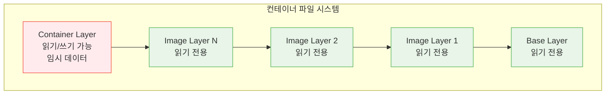
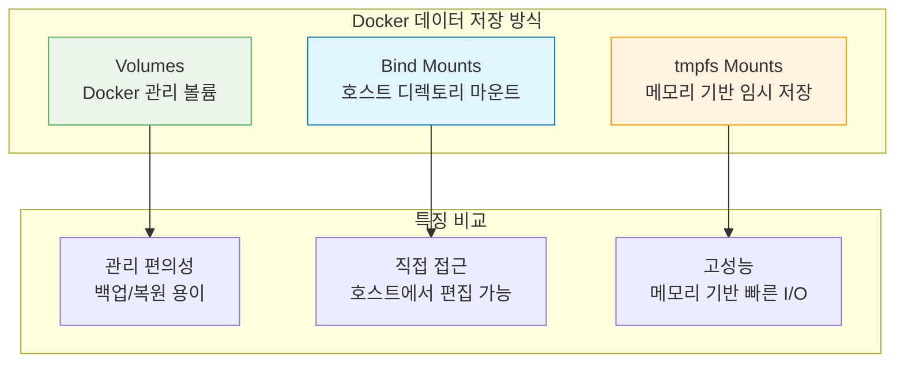

# Session 6: 볼륨과 데이터 관리

## 📍 교과과정에서의 위치
이 세션은 **Week 1 > Day 3 > Session 6**으로, Docker 컨테이너의 데이터 영속성과 관리 방법을 학습합니다. 컨테이너의 임시적 특성을 극복하고 중요한 데이터를 안전하게 보존하는 실무 기술을 습득합니다.

## 학습 목표 (5분)
- Docker 볼륨과 바인드 마운트의 개념과 차이점 이해
- 데이터 영속성 보장을 위한 볼륨 관리 방법 학습
- 컨테이너 간 데이터 공유 기법 습득
- 백업과 복원을 위한 데이터 관리 전략 학습

## 1. 컨테이너 데이터 저장 방식 (15분)

### 컨테이너 파일 시스템의 특성
**컨테이너의 파일 시스템은 기본적으로 임시적(ephemeral) 특성을 가집니다.**

#### 컨테이너 레이어 구조


**문제점:**
- **데이터 손실**: 컨테이너 삭제 시 모든 변경사항 소실
- **성능 저하**: Union File System의 오버헤드
- **공유 불가**: 컨테이너 간 데이터 공유 어려움
- **백업 복잡**: 컨테이너 전체를 백업해야 함

### Docker 데이터 저장 방식 비교
**Docker는 데이터 영속성을 위해 세 가지 방식을 제공합니다:**



#### 방식별 특징 비교

| 구분 | Volumes | Bind Mounts | tmpfs Mounts |
|------|---------|-------------|--------------|
| **관리 주체** | Docker | 사용자 | Docker |
| **저장 위치** | Docker 영역 | 호스트 파일시스템 | 메모리 |
| **성능** | 우수 | 보통 | 최고 |
| **이식성** | 높음 | 낮음 | 해당없음 |
| **백업** | 용이 | 복잡 | 불가능 |
| **보안** | 높음 | 보통 | 높음 |
| **사용 사례** | 데이터베이스, 로그 | 개발, 설정파일 | 캐시, 임시파일 |

## 2. Docker 볼륨 (Volume) (12분)

### 볼륨 생성과 관리
**Docker 볼륨은 Docker가 완전히 관리하는 데이터 저장 방식입니다.**

#### 볼륨 기본 조작
```bash
# 볼륨 생성
docker volume create myvolume

# 볼륨 목록 확인
docker volume ls

# 볼륨 상세 정보 확인
docker volume inspect myvolume

# 볼륨 삭제
docker volume rm myvolume

# 사용하지 않는 볼륨 정리
docker volume prune
```

#### 고급 볼륨 생성 옵션
```bash
# 드라이버 지정하여 볼륨 생성
docker volume create --driver local myvolume

# 라벨 추가
docker volume create --label environment=production --label backup=daily myvolume

# 볼륨 옵션 지정 (로컬 드라이버)
docker volume create --driver local \
  --opt type=nfs \
  --opt o=addr=192.168.1.100,rw \
  --opt device=:/path/to/dir \
  nfs-volume

# 암호화된 볼륨 생성 (Linux)
docker volume create --driver local \
  --opt type=tmpfs \
  --opt device=tmpfs \
  --opt o=size=100m,uid=1000 \
  encrypted-volume
```

### 컨테이너에서 볼륨 사용
**생성된 볼륨을 컨테이너에 마운트하여 사용:**

#### 기본 볼륨 마운트
```bash
# 볼륨을 컨테이너에 마운트
docker run -d --name web-server \
  -v myvolume:/var/www/html \
  nginx

# 여러 볼륨 마운트
docker run -d --name app-server \
  -v data-volume:/app/data \
  -v config-volume:/app/config \
  -v logs-volume:/app/logs \
  myapp:latest

# 읽기 전용 볼륨 마운트
docker run -d --name readonly-app \
  -v config-volume:/app/config:ro \
  myapp:latest
```

#### 익명 볼륨 (Anonymous Volume)
```bash
# 익명 볼륨 생성 (Docker가 자동으로 이름 생성)
docker run -d --name temp-app -v /app/data nginx

# 익명 볼륨 확인
docker volume ls
# 출력 예시: local     a1b2c3d4e5f6...

# 컨테이너 삭제 시 익명 볼륨도 함께 삭제
docker run --rm -v /app/data nginx
```

### 볼륨 데이터 관리
**볼륨의 데이터를 백업, 복원, 공유하는 방법:**

#### 볼륨 백업
```bash
# 볼륨 데이터를 tar 파일로 백업
docker run --rm \
  -v myvolume:/data \
  -v $(pwd):/backup \
  ubuntu tar czf /backup/myvolume-backup.tar.gz -C /data .

# 백업 파일 확인
ls -la myvolume-backup.tar.gz
```

#### 볼륨 복원
```bash
# 새 볼륨 생성
docker volume create restored-volume

# 백업 파일에서 데이터 복원
docker run --rm \
  -v restored-volume:/data \
  -v $(pwd):/backup \
  ubuntu tar xzf /backup/myvolume-backup.tar.gz -C /data

# 복원된 데이터 확인
docker run --rm -v restored-volume:/data ubuntu ls -la /data
```

#### 볼륨 간 데이터 복사
```bash
# 볼륨 간 데이터 복사
docker run --rm \
  -v source-volume:/source \
  -v target-volume:/target \
  ubuntu cp -r /source/. /target/

# 또는 rsync 사용
docker run --rm \
  -v source-volume:/source \
  -v target-volume:/target \
  ubuntu rsync -av /source/ /target/
```

## 3. 바인드 마운트 (Bind Mount) (10분)

### 바인드 마운트 개념과 사용법
**호스트의 특정 디렉토리나 파일을 컨테이너에 직접 마운트하는 방식:**

#### 기본 바인드 마운트
```bash
# 호스트 디렉토리를 컨테이너에 마운트
docker run -d --name web-server \
  -v /host/path:/container/path \
  nginx

# 현재 디렉토리 마운트
docker run -d --name dev-server \
  -v $(pwd):/app \
  -w /app \
  node:alpine

# Windows에서의 바인드 마운트
docker run -d --name win-server \
  -v C:\Users\username\project:/app \
  nginx
```

#### 고급 바인드 마운트 옵션
```bash
# 읽기 전용 마운트
docker run -d --name readonly-server \
  -v /host/config:/app/config:ro \
  nginx

# 바인드 전파 설정 (Linux)
docker run -d --name shared-mount \
  -v /host/shared:/container/shared:shared \
  ubuntu

# SELinux 라벨 설정 (CentOS/RHEL)
docker run -d --name selinux-app \
  -v /host/data:/app/data:Z \
  myapp:latest

# 일관성 설정 (macOS/Windows)
docker run -d --name consistent-app \
  -v /host/data:/app/data:consistent \
  myapp:latest
```

### 개발 환경에서의 활용
**바인드 마운트를 활용한 효율적인 개발 워크플로우:**

#### 라이브 코드 편집
```bash
# 소스 코드 디렉토리 마운트
mkdir -p ./webapp
echo "<h1>Hello Docker</h1>" > ./webapp/index.html

docker run -d --name dev-nginx \
  -p 8080:80 \
  -v $(pwd)/webapp:/usr/share/nginx/html \
  nginx

# 호스트에서 파일 수정 시 즉시 반영
echo "<h1>Updated Content</h1>" > ./webapp/index.html
curl http://localhost:8080
```

#### 설정 파일 관리
```bash
# Nginx 설정 파일 커스터마이징
mkdir -p ./config
cat > ./config/nginx.conf << EOF
server {
    listen 80;
    server_name localhost;
    
    location / {
        root /usr/share/nginx/html;
        index index.html;
    }
    
    location /api {
        proxy_pass http://backend:8080;
    }
}
EOF

docker run -d --name custom-nginx \
  -p 8080:80 \
  -v $(pwd)/config/nginx.conf:/etc/nginx/conf.d/default.conf:ro \
  -v $(pwd)/webapp:/usr/share/nginx/html \
  nginx
```

#### 로그 파일 접근
```bash
# 로그 디렉토리 마운트
mkdir -p ./logs

docker run -d --name app-with-logs \
  -v $(pwd)/logs:/var/log/app \
  myapp:latest

# 호스트에서 직접 로그 확인
tail -f ./logs/app.log
```

## 4. tmpfs 마운트 (8분)

### tmpfs 마운트 개념과 활용
**메모리 기반의 임시 파일 시스템을 컨테이너에 마운트:**

#### 기본 tmpfs 마운트
```bash
# tmpfs 마운트 생성
docker run -d --name memory-app \
  --tmpfs /tmp:rw,noexec,nosuid,size=100m \
  myapp:latest

# 여러 tmpfs 마운트
docker run -d --name multi-tmpfs \
  --tmpfs /tmp:size=100m \
  --tmpfs /var/cache:size=50m \
  myapp:latest
```

#### tmpfs 옵션 설정
```bash
# 크기 제한과 권한 설정
docker run -d --name secure-tmpfs \
  --tmpfs /secure:rw,noexec,nosuid,nodev,size=200m,uid=1000,gid=1000 \
  myapp:latest

# 마운트 옵션 확인
docker exec secure-tmpfs mount | grep tmpfs
```

### 활용 사례
**tmpfs 마운트의 실제 사용 사례들:**

#### 1. 캐시 데이터 저장
```bash
# Redis 캐시 서버
docker run -d --name redis-cache \
  --tmpfs /data:size=512m \
  redis:alpine redis-server --save ""

# 애플리케이션 캐시
docker run -d --name app-cache \
  --tmpfs /app/cache:size=256m \
  -e CACHE_DIR=/app/cache \
  myapp:latest
```

#### 2. 임시 파일 처리
```bash
# 파일 처리 애플리케이션
docker run -d --name file-processor \
  --tmpfs /tmp/processing:size=1g \
  -v /host/input:/input:ro \
  -v /host/output:/output \
  file-processor:latest
```

#### 3. 보안 강화
```bash
# 민감한 데이터 처리
docker run -d --name secure-processor \
  --tmpfs /secure:rw,noexec,nosuid,nodev,size=100m \
  --read-only \
  secure-app:latest
```

## 5. 실습: 데이터베이스 컨테이너 데이터 보존 (10분)

### 종합 실습 시나리오
**데이터베이스 컨테이너의 데이터 영속성 보장 실습**

#### 1단계: 볼륨을 사용한 MySQL 데이터베이스
```bash
# 데이터베이스 볼륨 생성
docker volume create mysql-data
docker volume create mysql-config
docker volume create mysql-logs

# MySQL 컨테이너 실행
docker run -d --name mysql-server \
  -e MYSQL_ROOT_PASSWORD=rootpass \
  -e MYSQL_DATABASE=testdb \
  -e MYSQL_USER=testuser \
  -e MYSQL_PASSWORD=testpass \
  -v mysql-data:/var/lib/mysql \
  -v mysql-config:/etc/mysql/conf.d \
  -v mysql-logs:/var/log/mysql \
  -p 3306:3306 \
  mysql:8.0

# 데이터베이스 연결 테스트
docker exec mysql-server mysql -u testuser -ptestpass testdb -e "CREATE TABLE users (id INT PRIMARY KEY, name VARCHAR(50));"
docker exec mysql-server mysql -u testuser -ptestpass testdb -e "INSERT INTO users VALUES (1, 'John Doe');"
docker exec mysql-server mysql -u testuser -ptestpass testdb -e "SELECT * FROM users;"
```

#### 2단계: 데이터 영속성 테스트
```bash
# 컨테이너 중지 및 삭제
docker stop mysql-server
docker rm mysql-server

# 동일한 볼륨으로 새 컨테이너 생성
docker run -d --name mysql-server-new \
  -e MYSQL_ROOT_PASSWORD=rootpass \
  -v mysql-data:/var/lib/mysql \
  -v mysql-config:/etc/mysql/conf.d \
  -v mysql-logs:/var/log/mysql \
  -p 3306:3306 \
  mysql:8.0

# 데이터 보존 확인
sleep 30  # MySQL 시작 대기
docker exec mysql-server-new mysql -u testuser -ptestpass testdb -e "SELECT * FROM users;"
```

#### 3단계: 백업과 복원
```bash
# 데이터베이스 백업
docker exec mysql-server-new mysqldump -u root -prootpass --all-databases > backup.sql

# 볼륨 레벨 백업
docker run --rm \
  -v mysql-data:/data \
  -v $(pwd):/backup \
  ubuntu tar czf /backup/mysql-volume-backup.tar.gz -C /data .

# 새 볼륨에 복원
docker volume create mysql-data-restored
docker run --rm \
  -v mysql-data-restored:/data \
  -v $(pwd):/backup \
  ubuntu tar xzf /backup/mysql-volume-backup.tar.gz -C /data

# 복원된 볼륨으로 MySQL 실행
docker run -d --name mysql-restored \
  -e MYSQL_ROOT_PASSWORD=rootpass \
  -v mysql-data-restored:/var/lib/mysql \
  -p 3307:3306 \
  mysql:8.0
```

#### 4단계: 개발 환경 구성
```bash
# 개발용 설정 파일 준비
mkdir -p ./mysql-dev-config
cat > ./mysql-dev-config/my.cnf << EOF
[mysqld]
innodb_buffer_pool_size = 128M
max_connections = 50
query_cache_size = 32M
slow_query_log = 1
slow_query_log_file = /var/log/mysql/slow.log
long_query_time = 2
EOF

# 개발 환경 MySQL 실행
docker run -d --name mysql-dev \
  -e MYSQL_ROOT_PASSWORD=devpass \
  -e MYSQL_DATABASE=devdb \
  -v mysql-dev-data:/var/lib/mysql \
  -v $(pwd)/mysql-dev-config:/etc/mysql/conf.d:ro \
  -v $(pwd)/mysql-dev-logs:/var/log/mysql \
  -p 3308:3306 \
  mysql:8.0

# 개발 로그 모니터링
tail -f ./mysql-dev-logs/slow.log
```

### 실습 과제
**다음 요구사항을 만족하는 데이터 관리 시스템을 구현해보세요:**

1. **멀티 데이터베이스**: MySQL, PostgreSQL, MongoDB를 각각 다른 볼륨으로 관리
2. **자동 백업**: 매일 자정에 실행되는 백업 컨테이너 구성
3. **개발/운영 분리**: 개발과 운영 환경의 데이터 완전 분리
4. **로그 중앙화**: 모든 데이터베이스 로그를 중앙 로그 서버로 수집
5. **성능 모니터링**: tmpfs를 활용한 고성능 메트릭 수집

### 정리 작업
```bash
# 모든 컨테이너 정지 및 삭제
docker stop $(docker ps -q)
docker rm $(docker ps -aq)

# 볼륨 정리 (주의: 데이터 손실)
docker volume rm mysql-data mysql-config mysql-logs mysql-data-restored mysql-dev-data

# 시스템 정리
docker system prune -f
```

## 다음 세션 예고
컨테이너 내부에 접속하여 디버깅하고 문제를 해결하는 방법을 학습하겠습니다. docker exec, 로그 확인, 파일 시스템 탐색 등의 디버깅 기법을 실습해보겠습니다.

## 📚 참고 자료
- [Docker Storage Overview](https://docs.docker.com/storage/)
- [Use Volumes](https://docs.docker.com/storage/volumes/)
- [Use Bind Mounts](https://docs.docker.com/storage/bind-mounts/)
- [Use tmpfs Mounts](https://docs.docker.com/storage/tmpfs/)
- [Storage Best Practices](https://docs.docker.com/develop/dev-best-practices/)