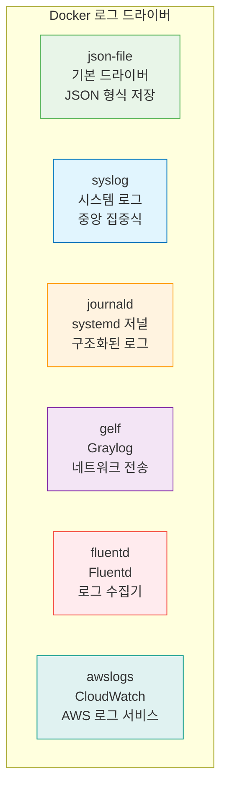

# Session 7: 컨테이너 디버깅

## 📍 교과과정에서의 위치
이 세션은 **Week 1 > Day 3 > Session 7**로, 컨테이너 내부에 접속하여 문제를 진단하고 해결하는 디버깅 기법을 학습합니다. 실무에서 자주 발생하는 컨테이너 문제 상황을 해결하는 실용적인 기술을 습득합니다.

## 학습 목표 (5분)
- docker exec을 활용한 컨테이너 내부 접속 방법 학습
- 컨테이너 로그 확인과 분석 기법 습득
- 컨테이너 파일 시스템 탐색과 문제 진단 방법 이해
- 실무에서 활용되는 디버깅 도구와 기법 학습

## 1. 컨테이너 내부 접속 (15분)

### docker exec - 실행 중인 컨테이너에 접속
**docker exec**은 **실행 중인 컨테이너 내부에서 새로운 프로세스를 실행하는 명령어**입니다.

#### 기본 사용법
```bash
# 대화형 셸로 컨테이너 접속
docker exec -it container_name /bin/bash

# Alpine Linux 기반 컨테이너 (bash가 없는 경우)
docker exec -it container_name /bin/sh

# 특정 명령어 실행
docker exec container_name ls -la /app
docker exec container_name ps aux
docker exec container_name cat /etc/os-release
```

#### exec 옵션 상세 분석
```bash
# -i: 대화형 모드 (STDIN 열어둠)
docker exec -i container_name cat > /tmp/file.txt

# -t: TTY 할당 (터미널 에뮬레이션)
docker exec -t container_name ls --color=auto

# -it: 대화형 TTY (가장 일반적)
docker exec -it container_name /bin/bash

# -d: 백그라운드에서 실행
docker exec -d container_name touch /tmp/background_task

# -e: 환경 변수 설정
docker exec -e DEBUG=true -it container_name /bin/bash

# -w: 작업 디렉토리 지정
docker exec -w /app -it container_name /bin/bash

# -u: 특정 사용자로 실행
docker exec -u root -it container_name /bin/bash
docker exec -u 1000:1000 -it container_name /bin/bash
```

### 다양한 셸 환경 접속
**컨테이너의 베이스 이미지에 따른 적절한 셸 선택:**

#### 베이스 이미지별 셸 확인
```bash
# 사용 가능한 셸 확인
docker exec container_name cat /etc/shells

# 기본 셸 확인
docker exec container_name echo $SHELL

# 프로세스 목록에서 셸 확인
docker exec container_name ps aux | grep -E "(bash|sh|zsh)"
```

#### 셸별 접속 방법
```bash
# Ubuntu/Debian 기반 (bash 사용)
docker exec -it ubuntu_container /bin/bash

# Alpine Linux 기반 (ash 사용)
docker exec -it alpine_container /bin/sh

# CentOS/RHEL 기반 (bash 사용)
docker exec -it centos_container /bin/bash

# BusyBox 기반 (ash 사용)
docker exec -it busybox_container /bin/sh

# 셸이 없는 경우 (distroless 이미지)
docker exec -it distroless_container /busybox/sh
```

### 컨테이너 접속 시 유용한 명령어들
**컨테이너 내부에서 시스템 정보를 확인하는 명령어들:**

#### 시스템 정보 확인
```bash
# 운영체제 정보
cat /etc/os-release
uname -a

# 프로세스 목록
ps aux
ps -ef
top
htop  # 설치된 경우

# 메모리 사용량
free -h
cat /proc/meminfo

# 디스크 사용량
df -h
du -sh /*

# 네트워크 정보
ip addr show
netstat -tulpn
ss -tulpn

# 환경 변수
env
printenv
```

#### 애플리케이션 디버깅
```bash
# 로그 파일 확인
tail -f /var/log/app.log
journalctl -f  # systemd 기반

# 설정 파일 확인
cat /etc/nginx/nginx.conf
cat /app/config.json

# 포트 사용 상황
netstat -an | grep LISTEN
lsof -i :80

# 파일 권한 확인
ls -la /app/
find /app -type f -perm 777
```

## 2. 로그 확인과 분석 (12분)

### docker logs - 컨테이너 로그 조회
**컨테이너의 표준 출력(stdout)과 표준 에러(stderr)를 확인하는 명령어:**

#### 기본 로그 조회
```bash
# 전체 로그 출력
docker logs container_name

# 실시간 로그 모니터링 (-f: follow)
docker logs -f container_name

# 최근 N줄만 출력
docker logs --tail 50 container_name

# 특정 시간 이후 로그
docker logs --since "2024-01-15T10:00:00" container_name
docker logs --since "1h" container_name
docker logs --since "30m" container_name

# 특정 시간 범위의 로그
docker logs --since "2024-01-15T09:00:00" --until "2024-01-15T10:00:00" container_name
```

#### 고급 로그 옵션
```bash
# 타임스탬프 포함
docker logs -t container_name

# 로그 크기 제한
docker logs --tail 100 -f container_name

# 여러 옵션 조합
docker logs -f -t --tail 50 --since "10m" container_name

# 로그를 파일로 저장
docker logs container_name > container.log 2>&1

# 실시간 로그를 파일로 저장
docker logs -f container_name | tee container.log
```

### 로그 드라이버와 설정
**Docker의 다양한 로그 드라이버와 설정 방법:**

#### 로그 드라이버 종류


#### 로그 드라이버 설정
```bash
# 컨테이너별 로그 드라이버 설정
docker run -d --log-driver=syslog --log-opt syslog-address=tcp://192.168.1.100:514 nginx

# JSON 파일 로그 옵션
docker run -d \
  --log-driver=json-file \
  --log-opt max-size=10m \
  --log-opt max-file=3 \
  nginx

# Fluentd 로그 드라이버
docker run -d \
  --log-driver=fluentd \
  --log-opt fluentd-address=localhost:24224 \
  --log-opt tag="docker.{{.Name}}" \
  nginx

# AWS CloudWatch 로그
docker run -d \
  --log-driver=awslogs \
  --log-opt awslogs-group=myapp \
  --log-opt awslogs-region=us-west-2 \
  --log-opt awslogs-stream=myapp-container \
  nginx
```

### 로그 분석 기법
**효과적인 로그 분석을 위한 도구와 기법:**

#### 로그 필터링과 검색
```bash
# grep을 사용한 로그 필터링
docker logs container_name | grep ERROR
docker logs container_name | grep -i "exception"
docker logs container_name | grep -v "DEBUG"

# 특정 패턴 검색
docker logs container_name | grep -E "(ERROR|WARN|FATAL)"

# 시간대별 로그 분석
docker logs -t container_name | grep "2024-01-15T10:"

# 로그 통계
docker logs container_name | grep ERROR | wc -l
docker logs container_name | awk '{print $1}' | sort | uniq -c
```

#### 로그 모니터링 스크립트
```bash
#!/bin/bash
# 컨테이너 로그 모니터링 스크립트

CONTAINER_NAME=$1
LOG_FILE="/tmp/${CONTAINER_NAME}_monitor.log"

if [ -z "$CONTAINER_NAME" ]; then
    echo "Usage: $0 <container_name>"
    exit 1
fi

echo "=== 컨테이너 로그 모니터링 시작: $(date) ===" | tee -a $LOG_FILE

# 실시간 로그 모니터링 및 에러 감지
docker logs -f $CONTAINER_NAME | while read line; do
    echo "$(date '+%Y-%m-%d %H:%M:%S') $line" | tee -a $LOG_FILE
    
    # 에러 패턴 감지
    if echo "$line" | grep -qE "(ERROR|FATAL|Exception)"; then
        echo "🚨 에러 감지: $line" | tee -a $LOG_FILE
        # 알림 발송 (예: 이메일, 슬랙 등)
    fi
done
```

## 3. 파일 시스템 탐색과 진단 (10분)

### 컨테이너 파일 시스템 구조 이해
**컨테이너 내부의 파일 시스템 구조와 특징:**

#### 기본 디렉토리 구조 탐색
```bash
# 루트 디렉토리 구조 확인
docker exec container_name ls -la /

# 주요 디렉토리 탐색
docker exec container_name ls -la /etc/     # 설정 파일
docker exec container_name ls -la /var/log/ # 로그 파일
docker exec container_name ls -la /tmp/     # 임시 파일
docker exec container_name ls -la /app/     # 애플리케이션 파일

# 마운트 포인트 확인
docker exec container_name mount | grep -v "proc\|sys\|dev"
docker exec container_name df -h
```

#### 파일 권한과 소유권 확인
```bash
# 파일 권한 상세 확인
docker exec container_name ls -la /app/

# 특정 권한의 파일 찾기
docker exec container_name find /app -type f -perm 777
docker exec container_name find /app -type f -perm 644

# 소유권 확인
docker exec container_name ls -ln /app/
docker exec container_name stat /app/config.json

# SUID/SGID 파일 찾기
docker exec container_name find / -type f \( -perm -4000 -o -perm -2000 \) 2>/dev/null
```

### 컨테이너와 호스트 간 파일 복사
**docker cp 명령어를 사용한 파일 전송:**

#### 기본 파일 복사
```bash
# 호스트에서 컨테이너로 파일 복사
docker cp /host/path/file.txt container_name:/container/path/

# 컨테이너에서 호스트로 파일 복사
docker cp container_name:/container/path/file.txt /host/path/

# 디렉토리 전체 복사
docker cp /host/directory/ container_name:/container/path/
docker cp container_name:/container/directory/ /host/path/

# 압축 파일로 복사 (대용량 파일)
docker exec container_name tar czf - /app/logs | tar xzf - -C ./logs/
```

#### 고급 파일 복사 기법
```bash
# 파일 권한 보존하며 복사
docker cp --archive container_name:/app/config/ ./config/

# 심볼릭 링크 따라가며 복사
docker cp --follow-link container_name:/app/link_file ./

# 실시간 로그 파일 복사
docker exec container_name tail -f /var/log/app.log > ./app.log &

# 설정 파일 백업
docker cp container_name:/etc/nginx/nginx.conf ./backup/nginx.conf.$(date +%Y%m%d)
```

### 프로세스와 리소스 모니터링
**컨테이너 내부의 프로세스와 리소스 사용량 모니터링:**

#### 프로세스 모니터링
```bash
# 프로세스 트리 확인
docker exec container_name ps auxf
docker exec container_name pstree -p

# 특정 프로세스 모니터링
docker exec container_name ps aux | grep nginx
docker exec container_name pidof nginx

# 프로세스 시그널 전송
docker exec container_name kill -HUP $(pidof nginx)
docker exec container_name kill -USR1 $(pidof nginx)

# 프로세스 리소스 사용량
docker exec container_name top -p $(pidof nginx)
```

#### 네트워크 연결 상태 확인
```bash
# 네트워크 연결 확인
docker exec container_name netstat -tulpn
docker exec container_name ss -tulpn

# 특정 포트 확인
docker exec container_name lsof -i :80
docker exec container_name netstat -an | grep :80

# 네트워크 인터페이스 확인
docker exec container_name ip addr show
docker exec container_name ifconfig

# DNS 설정 확인
docker exec container_name cat /etc/resolv.conf
docker exec container_name nslookup google.com
```

## 4. 디버깅 도구와 기법 (8분)

### 컨테이너 디버깅 도구 설치
**디버깅에 필요한 도구들을 컨테이너에 설치:**

#### 기본 디버깅 도구 설치
```bash
# Ubuntu/Debian 기반 컨테이너
docker exec container_name apt-get update
docker exec container_name apt-get install -y \
  curl wget telnet netcat-openbsd \
  htop iotop strace tcpdump \
  vim nano less

# Alpine Linux 기반 컨테이너
docker exec container_name apk update
docker exec container_name apk add \
  curl wget busybox-extras \
  htop strace tcpdump \
  vim nano less

# CentOS/RHEL 기반 컨테이너
docker exec container_name yum install -y \
  curl wget telnet nc \
  htop iotop strace tcpdump \
  vim nano less
```

#### 네트워크 디버깅 도구
```bash
# 네트워크 연결 테스트
docker exec container_name curl -I http://google.com
docker exec container_name wget -O- http://httpbin.org/ip

# 포트 연결 테스트
docker exec container_name telnet google.com 80
docker exec container_name nc -zv google.com 80

# DNS 테스트
docker exec container_name nslookup google.com
docker exec container_name dig google.com

# 네트워크 트래픽 분석
docker exec container_name tcpdump -i eth0 -n
```

### 성능 분석과 프로파일링
**컨테이너의 성능 문제를 진단하는 방법:**

#### 시스템 리소스 분석
```bash
# CPU 사용률 분석
docker exec container_name top -p $(pidof myapp)
docker exec container_name htop

# 메모리 사용량 분석
docker exec container_name free -h
docker exec container_name cat /proc/meminfo
docker exec container_name pmap $(pidof myapp)

# I/O 성능 분석
docker exec container_name iotop
docker exec container_name iostat -x 1

# 파일 시스템 사용량
docker exec container_name du -sh /app/*
docker exec container_name find /app -type f -size +100M
```

#### 애플리케이션 프로파일링
```bash
# 시스템 콜 추적
docker exec container_name strace -p $(pidof myapp)
docker exec container_name strace -c -p $(pidof myapp)

# 라이브러리 호출 추적
docker exec container_name ltrace -p $(pidof myapp)

# 파일 접근 모니터링
docker exec container_name lsof -p $(pidof myapp)

# 네트워크 연결 모니터링
docker exec container_name netstat -p | grep $(pidof myapp)
```

## 5. 실습: 문제 상황 진단과 해결 (10분)

### 실습 시나리오 1: 웹 서버 응답 없음
**Nginx 웹 서버가 응답하지 않는 문제 해결:**

#### 문제 상황 재현
```bash
# 문제가 있는 Nginx 컨테이너 실행
docker run -d --name broken-nginx -p 8080:80 nginx

# 설정 파일을 잘못 수정하여 문제 발생
docker exec broken-nginx sh -c 'echo "invalid config" > /etc/nginx/nginx.conf'
docker exec broken-nginx nginx -s reload
```

#### 문제 진단 과정
```bash
# 1. 컨테이너 상태 확인
docker ps -a
docker logs broken-nginx

# 2. 컨테이너 내부 접속
docker exec -it broken-nginx /bin/bash

# 3. Nginx 프로세스 확인
ps aux | grep nginx
systemctl status nginx  # systemd가 있는 경우

# 4. 설정 파일 검증
nginx -t
cat /etc/nginx/nginx.conf

# 5. 포트 사용 상황 확인
netstat -tulpn | grep :80
lsof -i :80

# 6. 로그 파일 확인
tail -f /var/log/nginx/error.log
tail -f /var/log/nginx/access.log
```

#### 문제 해결
```bash
# 올바른 설정 파일 복원
docker exec broken-nginx cp /etc/nginx/nginx.conf.default /etc/nginx/nginx.conf

# Nginx 재시작
docker exec broken-nginx nginx -s reload

# 또는 컨테이너 재시작
docker restart broken-nginx

# 해결 확인
curl -I http://localhost:8080
```

### 실습 시나리오 2: 데이터베이스 연결 실패
**애플리케이션이 데이터베이스에 연결할 수 없는 문제:**

#### 문제 상황 구성
```bash
# 네트워크 생성
docker network create app-network

# 데이터베이스 컨테이너 (잘못된 설정)
docker run -d --name database --network app-network \
  -e MYSQL_ROOT_PASSWORD=wrongpass \
  mysql:8.0

# 애플리케이션 컨테이너
docker run -d --name webapp --network app-network \
  -e DB_HOST=database \
  -e DB_USER=root \
  -e DB_PASSWORD=correctpass \
  -p 3000:3000 \
  node:alpine sh -c "while true; do sleep 30; done"
```

#### 진단 및 해결
```bash
# 1. 네트워크 연결 테스트
docker exec webapp ping database
docker exec webapp telnet database 3306

# 2. 데이터베이스 로그 확인
docker logs database

# 3. 환경 변수 확인
docker exec webapp env | grep DB_
docker exec database env | grep MYSQL_

# 4. 데이터베이스 접속 테스트
docker exec -it database mysql -u root -p

# 5. 문제 해결 (비밀번호 수정)
docker stop database
docker rm database
docker run -d --name database --network app-network \
  -e MYSQL_ROOT_PASSWORD=correctpass \
  mysql:8.0

# 6. 해결 확인
docker exec webapp nc -zv database 3306
```

### 실습 시나리오 3: 디스크 공간 부족
**컨테이너 내부의 디스크 공간 부족 문제:**

#### 문제 진단
```bash
# 컨테이너 실행
docker run -d --name space-test ubuntu:20.04 sh -c "while true; do sleep 30; done"

# 디스크 사용량 확인
docker exec space-test df -h
docker exec space-test du -sh /*

# 큰 파일 찾기
docker exec space-test find / -type f -size +100M 2>/dev/null
docker exec space-test du -sh /var/log/* | sort -hr

# 로그 파일 정리
docker exec space-test truncate -s 0 /var/log/large.log
docker exec space-test find /tmp -type f -mtime +7 -delete
```

### 디버깅 체크리스트
**컨테이너 문제 해결을 위한 체계적 접근법:**

```bash
#!/bin/bash
# 컨테이너 디버깅 체크리스트

CONTAINER_NAME=$1

echo "=== 컨테이너 디버깅 체크리스트 ==="
echo "컨테이너: $CONTAINER_NAME"
echo

# 1. 기본 상태 확인
echo "1. 컨테이너 상태:"
docker ps -a --filter name=$CONTAINER_NAME

# 2. 로그 확인
echo -e "\n2. 최근 로그 (마지막 20줄):"
docker logs --tail 20 $CONTAINER_NAME

# 3. 리소스 사용량
echo -e "\n3. 리소스 사용량:"
docker stats --no-stream $CONTAINER_NAME

# 4. 프로세스 확인
echo -e "\n4. 실행 중인 프로세스:"
docker exec $CONTAINER_NAME ps aux 2>/dev/null || echo "컨테이너 접속 불가"

# 5. 네트워크 확인
echo -e "\n5. 네트워크 상태:"
docker exec $CONTAINER_NAME netstat -tulpn 2>/dev/null || echo "netstat 명령어 없음"

# 6. 디스크 사용량
echo -e "\n6. 디스크 사용량:"
docker exec $CONTAINER_NAME df -h 2>/dev/null || echo "df 명령어 없음"

echo -e "\n=== 체크리스트 완료 ==="
```

## 다음 세션 예고
오늘 학습한 모든 Docker 명령어들을 종합하여 실무 시나리오 기반의 종합 실습을 진행하겠습니다. 멀티 컨테이너 애플리케이션을 구성하고 관리하는 프로젝트를 수행해보겠습니다.

## 📚 참고 자료
- [Docker Exec Reference](https://docs.docker.com/engine/reference/commandline/exec/)
- [Container Logs](https://docs.docker.com/config/containers/logging/)
- [Debugging Containers](https://docs.docker.com/config/containers/troubleshooting/)
- [Docker CP Command](https://docs.docker.com/engine/reference/commandline/cp/)
- [Container Monitoring](https://docs.docker.com/config/containers/resource_constraints/)