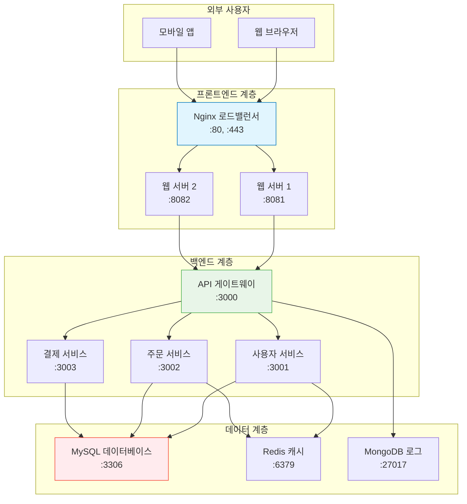

# Session 8: 종합 실습 및 정리

## 📍 교과과정에서의 위치
이 세션은 **Week 1 > Day 3**의 마지막 세션으로, 오늘 학습한 모든 Docker 명령어들을 종합하여 실무 시나리오 기반의 프로젝트를 수행합니다. 멀티 컨테이너 애플리케이션을 구성하고 관리하는 실전 경험을 쌓습니다.

## 학습 목표 (5분)
- Docker 명령어들의 조합과 워크플로우 구성 능력 습득
- 실무 시나리오 기반의 문제 해결 능력 개발
- 멀티 컨테이너 애플리케이션 구성과 관리 경험
- Docker 기본 명령어 완전 마스터

## 1. 종합 프로젝트: 전자상거래 플랫폼 구축 (25분)

### 프로젝트 개요
**Docker를 활용하여 완전한 전자상거래 플랫폼을 구축하는 종합 실습:**

#### 시스템 아키텍처


### 1단계: 네트워크 인프라 구성
**보안과 성능을 고려한 네트워크 설계:**

```bash
# 네트워크 생성
docker network create --subnet=172.20.0.0/16 frontend-net
docker network create --subnet=172.21.0.0/16 backend-net
docker network create --subnet=172.22.0.0/16 database-net

# 네트워크 정보 확인
docker network ls
docker network inspect frontend-net
```

### 2단계: 데이터 계층 구성
**영속적 데이터 저장을 위한 데이터베이스 서비스 구성:**

```bash
# 볼륨 생성
docker volume create mysql-data
docker volume create mysql-config
docker volume create redis-data
docker volume create mongo-data

# MySQL 데이터베이스 서버
docker run -d --name mysql-db \
  --network database-net \
  --ip 172.22.0.10 \
  -e MYSQL_ROOT_PASSWORD=rootpass123 \
  -e MYSQL_DATABASE=ecommerce \
  -e MYSQL_USER=appuser \
  -e MYSQL_PASSWORD=apppass123 \
  -v mysql-data:/var/lib/mysql \
  -v mysql-config:/etc/mysql/conf.d \
  --restart unless-stopped \
  mysql:8.0

# Redis 캐시 서버
docker run -d --name redis-cache \
  --network database-net \
  --ip 172.22.0.11 \
  -v redis-data:/data \
  --restart unless-stopped \
  redis:alpine redis-server --appendonly yes

# MongoDB 로그 서버
docker run -d --name mongo-logs \
  --network database-net \
  --ip 172.22.0.12 \
  -e MONGO_INITDB_ROOT_USERNAME=admin \
  -e MONGO_INITDB_ROOT_PASSWORD=adminpass \
  -v mongo-data:/data/db \
  --restart unless-stopped \
  mongo:latest

# 데이터베이스 초기화 대기
sleep 30

# 데이터베이스 연결 테스트
docker exec mysql-db mysql -u appuser -papppass123 ecommerce -e "CREATE TABLE products (id INT PRIMARY KEY AUTO_INCREMENT, name VARCHAR(100), price DECIMAL(10,2));"
docker exec mysql-db mysql -u appuser -papppass123 ecommerce -e "INSERT INTO products (name, price) VALUES ('Docker Book', 29.99), ('Kubernetes Guide', 39.99);"
```

### 3단계: 백엔드 서비스 구성
**마이크로서비스 아키텍처의 백엔드 서비스들:**

```bash
# API 게이트웨이 (Node.js 기반)
docker run -d --name api-gateway \
  --network backend-net \
  --ip 172.21.0.10 \
  -e DB_HOST=mysql-db \
  -e REDIS_HOST=redis-cache \
  -e MONGO_HOST=mongo-logs \
  -p 3000:3000 \
  node:18-alpine sh -c "
    npm init -y && 
    npm install express mysql2 redis mongodb && 
    node -e \"
      const express = require('express');
      const app = express();
      app.get('/health', (req, res) => res.json({status: 'OK', service: 'API Gateway'}));
      app.get('/api/products', (req, res) => res.json([{id: 1, name: 'Docker Book', price: 29.99}]));
      app.listen(3000, () => console.log('API Gateway running on port 3000'));
    \"
  "

# 사용자 서비스
docker run -d --name user-service \
  --network backend-net \
  --ip 172.21.0.11 \
  -e DB_HOST=mysql-db \
  -e REDIS_HOST=redis-cache \
  node:18-alpine sh -c "
    npm init -y && 
    npm install express && 
    node -e \"
      const express = require('express');
      const app = express();
      app.get('/health', (req, res) => res.json({status: 'OK', service: 'User Service'}));
      app.get('/users', (req, res) => res.json([{id: 1, name: 'John Doe', email: 'john@example.com'}]));
      app.listen(3001, () => console.log('User Service running on port 3001'));
    \"
  "

# 주문 서비스
docker run -d --name order-service \
  --network backend-net \
  --ip 172.21.0.12 \
  -e DB_HOST=mysql-db \
  -e REDIS_HOST=redis-cache \
  node:18-alpine sh -c "
    npm init -y && 
    npm install express && 
    node -e \"
      const express = require('express');
      const app = express();
      app.get('/health', (req, res) => res.json({status: 'OK', service: 'Order Service'}));
      app.get('/orders', (req, res) => res.json([{id: 1, userId: 1, productId: 1, quantity: 2}]));
      app.listen(3002, () => console.log('Order Service running on port 3002'));
    \"
  "

# 백엔드 서비스들을 데이터베이스 네트워크에 연결
docker network connect database-net api-gateway
docker network connect database-net user-service
docker network connect database-net order-service

# 서비스 헬스 체크
sleep 10
curl http://localhost:3000/health
```

### 4단계: 프론트엔드 구성
**로드 밸런싱과 정적 파일 서빙을 위한 웹 서버 구성:**

```bash
# Nginx 설정 파일 생성
mkdir -p ./nginx-config
cat > ./nginx-config/nginx.conf << 'EOF'
upstream backend {
    server api-gateway:3000;
}

server {
    listen 80;
    server_name localhost;
    
    location / {
        root /usr/share/nginx/html;
        index index.html;
        try_files $uri $uri/ /index.html;
    }
    
    location /api/ {
        proxy_pass http://backend/;
        proxy_set_header Host $host;
        proxy_set_header X-Real-IP $remote_addr;
        proxy_set_header X-Forwarded-For $proxy_add_x_forwarded_for;
    }
    
    location /health {
        access_log off;
        return 200 "healthy\n";
        add_header Content-Type text/plain;
    }
}
EOF

# 웹 콘텐츠 생성
mkdir -p ./webapp
cat > ./webapp/index.html << 'EOF'
<!DOCTYPE html>
<html>
<head>
    <title>Docker 전자상거래</title>
    <style>
        body { font-family: Arial, sans-serif; margin: 40px; }
        .container { max-width: 800px; margin: 0 auto; }
        .product { border: 1px solid #ddd; padding: 20px; margin: 10px 0; }
        button { background: #007bff; color: white; padding: 10px 20px; border: none; cursor: pointer; }
    </style>
</head>
<body>
    <div class="container">
        <h1>🐳 Docker 전자상거래 플랫폼</h1>
        <div id="products"></div>
    </div>
    
    <script>
        fetch('/api/products')
            .then(response => response.json())
            .then(products => {
                const container = document.getElementById('products');
                products.forEach(product => {
                    container.innerHTML += `
                        <div class="product">
                            <h3>${product.name}</h3>
                            <p>가격: $${product.price}</p>
                            <button onclick="alert('주문 기능은 구현 예정입니다!')">주문하기</button>
                        </div>
                    `;
                });
            })
            .catch(error => {
                document.getElementById('products').innerHTML = '<p>상품을 불러올 수 없습니다.</p>';
                console.error('Error:', error);
            });
    </script>
</body>
</html>
EOF

# Nginx 웹 서버 실행
docker run -d --name web-server \
  --network frontend-net \
  --ip 172.20.0.10 \
  -p 80:80 \
  -v $(pwd)/nginx-config/nginx.conf:/etc/nginx/conf.d/default.conf:ro \
  -v $(pwd)/webapp:/usr/share/nginx/html:ro \
  nginx:alpine

# 프론트엔드를 백엔드 네트워크에 연결
docker network connect backend-net web-server

# 웹 애플리케이션 테스트
curl http://localhost/
curl http://localhost/api/products
curl http://localhost/health
```

## 2. 모니터링 및 관리 시스템 구성 (10분)

### 모니터링 대시보드 구성
**전체 시스템의 상태를 모니터링하는 도구들:**

#### 시스템 모니터링
```bash
# 모든 컨테이너 상태 모니터링 스크립트
cat > monitor.sh << 'EOF'
#!/bin/bash

while true; do
    clear
    echo "=== Docker 전자상거래 플랫폼 모니터링 ==="
    echo "시간: $(date)"
    echo
    
    echo "=== 컨테이너 상태 ==="
    docker ps --format "table {{.Names}}\t{{.Status}}\t{{.Ports}}"
    echo
    
    echo "=== 리소스 사용량 ==="
    docker stats --no-stream --format "table {{.Container}}\t{{.CPUPerc}}\t{{.MemUsage}}\t{{.NetIO}}"
    echo
    
    echo "=== 네트워크 연결 테스트 ==="
    echo -n "웹 서버: "
    curl -s -o /dev/null -w "%{http_code}" http://localhost/ || echo "FAIL"
    echo -n " | API 게이트웨이: "
    curl -s -o /dev/null -w "%{http_code}" http://localhost:3000/health || echo "FAIL"
    echo
    
    echo "=== 디스크 사용량 ==="
    docker system df
    echo
    
    sleep 5
done
EOF

chmod +x monitor.sh
# ./monitor.sh  # 별도 터미널에서 실행
```

#### 로그 수집 시스템
```bash
# 중앙 로그 수집 컨테이너
docker run -d --name log-collector \
  --network backend-net \
  -v /var/run/docker.sock:/var/run/docker.sock:ro \
  -v $(pwd)/logs:/logs \
  alpine sh -c "
    while true; do
      echo '=== $(date) ===' >> /logs/system.log
      docker ps --format 'Container: {{.Names}} Status: {{.Status}}' >> /logs/system.log
      docker stats --no-stream --format 'Stats: {{.Container}} CPU: {{.CPUPerc}} MEM: {{.MemUsage}}' >> /logs/system.log
      echo '' >> /logs/system.log
      sleep 60
    done
  "

# 로그 파일 확인
tail -f ./logs/system.log
```

### 백업 및 복원 시스템
**데이터 보호를 위한 자동 백업 시스템:**

```bash
# 백업 스크립트 생성
cat > backup.sh << 'EOF'
#!/bin/bash

BACKUP_DIR="./backups/$(date +%Y%m%d_%H%M%S)"
mkdir -p $BACKUP_DIR

echo "=== 백업 시작: $(date) ==="

# 데이터베이스 백업
echo "MySQL 백업 중..."
docker exec mysql-db mysqldump -u root -prootpass123 --all-databases > $BACKUP_DIR/mysql_backup.sql

# 볼륨 백업
echo "볼륨 백업 중..."
docker run --rm \
  -v mysql-data:/data \
  -v $(pwd)/$BACKUP_DIR:/backup \
  ubuntu tar czf /backup/mysql-volume.tar.gz -C /data .

docker run --rm \
  -v redis-data:/data \
  -v $(pwd)/$BACKUP_DIR:/backup \
  ubuntu tar czf /backup/redis-volume.tar.gz -C /data .

# 설정 파일 백업
echo "설정 파일 백업 중..."
cp -r ./nginx-config $BACKUP_DIR/
cp -r ./webapp $BACKUP_DIR/

echo "=== 백업 완료: $(date) ==="
echo "백업 위치: $BACKUP_DIR"
ls -la $BACKUP_DIR
EOF

chmod +x backup.sh
# ./backup.sh  # 백업 실행
```

## 3. 성능 테스트 및 최적화 (8분)

### 부하 테스트
**시스템의 성능과 안정성을 테스트:**

#### 기본 부하 테스트
```bash
# Apache Bench를 사용한 부하 테스트
docker run --rm --network frontend-net \
  httpd:alpine ab -n 1000 -c 10 http://web-server/

# curl을 사용한 반복 테스트
for i in {1..100}; do
  curl -s http://localhost/ > /dev/null
  echo "Request $i completed"
done

# 동시 연결 테스트
for i in {1..10}; do
  curl -s http://localhost/api/products &
done
wait
```

#### 성능 모니터링
```bash
# 부하 테스트 중 리소스 모니터링
docker stats --format "table {{.Container}}\t{{.CPUPerc}}\t{{.MemUsage}}\t{{.NetIO}}"

# 개별 컨테이너 상세 모니터링
docker exec web-server top
docker exec mysql-db mysqladmin -u root -prootpass123 processlist
docker exec redis-cache redis-cli info stats
```

### 성능 최적화
**시스템 성능을 개선하는 방법들:**

#### 리소스 제한 적용
```bash
# 기존 컨테이너 중지
docker stop web-server api-gateway

# 리소스 제한을 적용한 재시작
docker run -d --name web-server-optimized \
  --network frontend-net \
  --network backend-net \
  -p 80:80 \
  --memory="256m" \
  --cpus="0.5" \
  -v $(pwd)/nginx-config/nginx.conf:/etc/nginx/conf.d/default.conf:ro \
  -v $(pwd)/webapp:/usr/share/nginx/html:ro \
  nginx:alpine

docker run -d --name api-gateway-optimized \
  --network backend-net \
  --network database-net \
  -p 3000:3000 \
  --memory="512m" \
  --cpus="1.0" \
  node:18-alpine sh -c "
    npm init -y && 
    npm install express mysql2 redis mongodb && 
    node -e \"
      const express = require('express');
      const app = express();
      app.get('/health', (req, res) => res.json({status: 'OK', service: 'API Gateway', timestamp: new Date()}));
      app.listen(3000, () => console.log('Optimized API Gateway running'));
    \"
  "
```

## 4. 문제 해결 실습 (7분)

### 일반적인 문제 상황과 해결
**실무에서 자주 발생하는 문제들을 시뮬레이션하고 해결:**

#### 시나리오 1: 서비스 응답 없음
```bash
# 문제 상황 재현
docker exec api-gateway-optimized pkill node

# 문제 진단
docker ps -a | grep api-gateway
docker logs api-gateway-optimized

# 해결 방법
docker restart api-gateway-optimized

# 자동 재시작 설정
docker update --restart=always api-gateway-optimized
```

#### 시나리오 2: 데이터베이스 연결 실패
```bash
# 네트워크 연결 테스트
docker exec api-gateway-optimized ping mysql-db
docker exec api-gateway-optimized telnet mysql-db 3306

# 데이터베이스 상태 확인
docker exec mysql-db mysqladmin -u root -prootpass123 ping
docker exec mysql-db mysql -u root -prootpass123 -e "SHOW PROCESSLIST;"

# 연결 설정 확인
docker exec api-gateway-optimized env | grep DB_
```

#### 시나리오 3: 디스크 공간 부족
```bash
# 디스크 사용량 확인
docker system df
docker exec mysql-db df -h

# 로그 파일 정리
docker exec mysql-db find /var/log -name "*.log" -mtime +7 -delete
docker logs --tail 0 mysql-db  # 로그 버퍼 정리

# 시스템 정리
docker system prune -f
```

## 5. 3일차 학습 정리 및 평가 (5분)

### 학습 성과 점검
**오늘 습득한 Docker 기술들:**

#### 마스터한 명령어들
```bash
# 이미지 관리
docker search, pull, images, inspect, history, tag, rmi

# 컨테이너 관리  
docker run, ps, start, stop, restart, pause, unpause, rm

# 네트워크 관리
docker network create, ls, inspect, connect, disconnect

# 볼륨 관리
docker volume create, ls, inspect, rm

# 디버깅 도구
docker exec, logs, cp, stats, top, diff

# 시스템 관리
docker system info, df, prune, events
```

#### 실무 역량 평가
**다음 작업을 독립적으로 수행할 수 있는지 확인:**

- [ ] 요구사항에 맞는 컨테이너 환경 구성
- [ ] 네트워크와 포트 매핑 설정
- [ ] 데이터 영속성을 위한 볼륨 관리
- [ ] 컨테이너 문제 상황 진단과 해결
- [ ] 멀티 컨테이너 애플리케이션 구성
- [ ] 성능 모니터링과 최적화
- [ ] 백업과 복원 작업 수행

### 내일 준비사항
**Week 1 Day 4: Docker 이미지 관리 심화**

#### 사전 학습
- Dockerfile 기본 문법 예습
- 이미지 레이어 최적화 개념 복습
- 멀티 스테이지 빌드 개념 학습

#### 실습 준비
- 텍스트 에디터로 Dockerfile 작성 준비
- Git 기본 명령어 복습 (소스 코드 관리용)
- 간단한 웹 애플리케이션 소스 코드 준비

### 정리 작업
```bash
# 프로젝트 컨테이너들 정리
docker stop $(docker ps -q)
docker rm $(docker ps -aq)

# 네트워크 정리
docker network rm frontend-net backend-net database-net

# 볼륨 정리 (선택사항 - 데이터 보존하려면 생략)
# docker volume rm mysql-data mysql-config redis-data mongo-data

# 시스템 정리
docker system prune -f
```

## 3일차 완료! 🎉
Docker CLI의 기본 명령어들을 완전히 마스터했습니다. 내일부터는 Dockerfile을 작성하여 직접 이미지를 빌드하고, 더 고급 기능들을 학습하겠습니다.

## 📚 참고 자료
- [Docker CLI Complete Reference](https://docs.docker.com/engine/reference/commandline/docker/)
- [Docker Best Practices](https://docs.docker.com/develop/best-practices/)
- [Production Container Management](https://docs.docker.com/config/containers/start-containers-automatically/)
- [Docker Monitoring](https://docs.docker.com/config/containers/resource_constraints/)
- [Container Troubleshooting](https://docs.docker.com/config/containers/troubleshooting/)