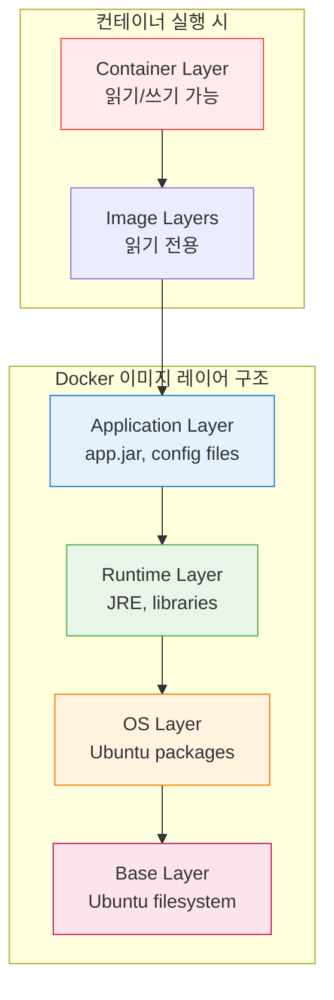
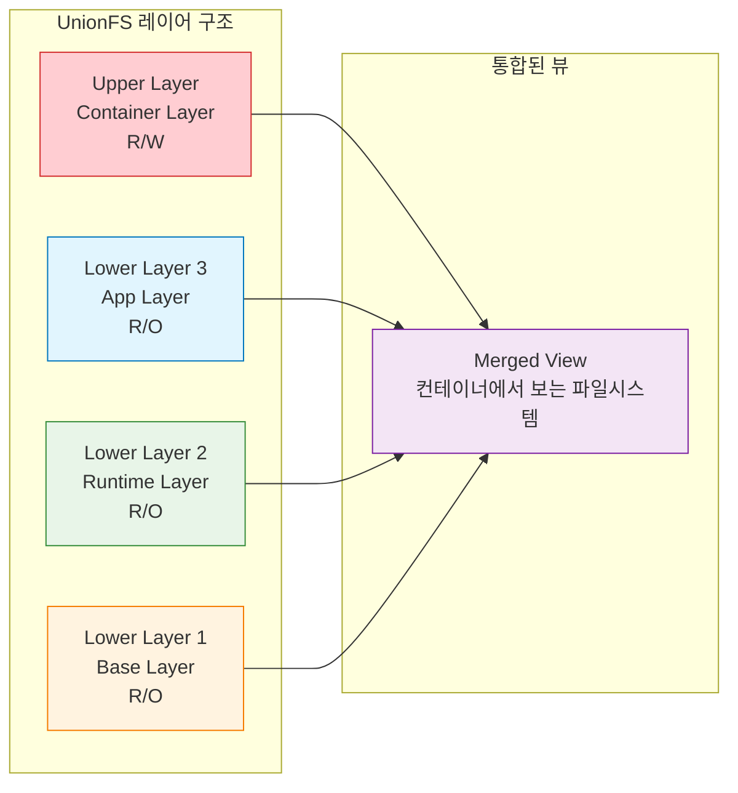
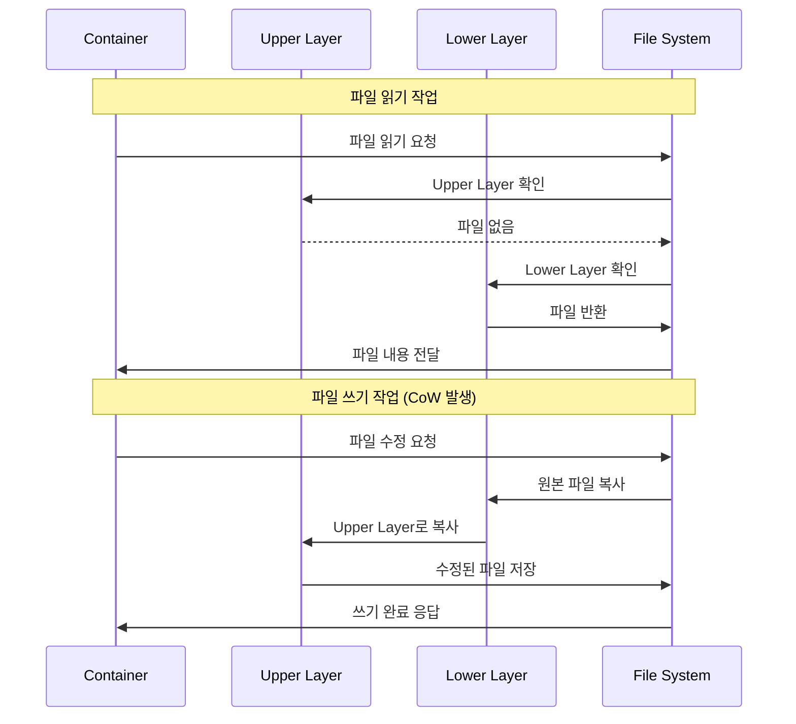

# Session 1: Docker 이미지 아키텍처 심화

## 📍 교과과정에서의 위치
이 세션은 **Week 1 > Day 4**의 첫 번째 세션으로, Docker 이미지의 내부 구조와 작동 원리를 심층적으로 학습합니다. 이전 3일간 학습한 Docker 기초 지식을 바탕으로 이미지 관리의 핵심 개념을 마스터합니다.

## 학습 목표 (5분)
- **Docker 이미지 레이어 시스템**의 내부 구조 완전 이해
- **Union File System**과 **Copy-on-Write** 메커니즘 원리 파악
- **이미지 메타데이터**와 **매니페스트** 구조 분석
- **이미지 저장소**의 물리적 구조 탐구

## 1. Docker 이미지 레이어 시스템 (15분)

### 레이어 기반 아키텍처의 핵심 개념

Docker 이미지는 **읽기 전용 레이어들의 스택**으로 구성됩니다. 각 레이어는 이전 레이어에 대한 **변경사항(delta)**만을 포함하여 효율적인 저장과 전송을 가능하게 합니다.




### 레이어 식별과 관리

```bash
# 이미지 레이어 구조 확인
docker image inspect ubuntu:20.04 --format='{{json .RootFS.Layers}}' | jq

# 이미지 히스토리 확인 (각 레이어의 생성 과정)
docker image history ubuntu:20.04

# 상세한 레이어 정보 확인
docker image inspect ubuntu:20.04 | jq '.RootFS'

# 실제 레이어 파일 위치 확인 (Linux/macOS)
sudo find /var/lib/docker -name "*.json" | head -5
```

### 레이어 공유 메커니즘

**동일한 베이스 이미지를 사용하는 여러 이미지들은 공통 레이어를 공유**하여 디스크 공간을 절약합니다:

```bash
# 레이어 공유 실험
docker pull nginx:alpine
docker pull node:alpine
docker pull python:alpine

# 시스템 전체 이미지 사용량 확인
docker system df -v

# 공유되는 레이어 확인
docker image ls --digests
```

## 2. Union File System (UnionFS) 심화 (15분)

### UnionFS의 작동 원리

**Union File System**은 여러 개의 디렉토리를 하나의 통합된 뷰로 마운트하는 파일 시스템입니다. Docker는 이를 통해 레이어들을 효율적으로 관리합니다.



### 스토리지 드라이버별 특성

Docker는 다양한 스토리지 드라이버를 지원하며, 각각 고유한 특성을 가집니다:

| 드라이버 | 특징 | 사용 사례 | 성능 |
|---------|------|----------|------|
| **overlay2** | 현재 기본값, 효율적 | 대부분의 Linux 배포판 | 높음 |
| **aufs** | 레거시, 안정적 | 오래된 Ubuntu 시스템 | 중간 |
| **devicemapper** | Red Hat 계열 | RHEL, CentOS | 중간 |
| **btrfs** | 고급 기능 지원 | 스냅샷, 압축 필요 시 | 높음 |

```bash
# 현재 사용 중인 스토리지 드라이버 확인
docker info | grep "Storage Driver"

# 스토리지 드라이버 상세 정보
docker info | grep -A 10 "Storage Driver"

# overlay2 드라이버의 실제 파일 구조 확인 (Linux)
sudo ls -la /var/lib/docker/overlay2/
```

## 3. Copy-on-Write (CoW) 메커니즘 (10분)

### CoW의 작동 원리

**Copy-on-Write**는 파일이 실제로 수정될 때까지 복사를 지연시키는 최적화 기법입니다. 이를 통해 메모리와 디스크 공간을 효율적으로 사용합니다.



### CoW 성능 최적화

```bash
# CoW 동작 실험
docker run -it --name cow-test ubuntu:20.04 bash

# 컨테이너 내에서 대용량 파일 생성
dd if=/dev/zero of=/large-file bs=1M count=100

# 다른 터미널에서 컨테이너 레이어 크기 확인
docker exec cow-test du -sh /large-file
docker container diff cow-test

# 파일 수정 시 CoW 동작 확인
echo "modified content" >> /large-file
```

## 4. 이미지 메타데이터와 매니페스트 (10분)

### 이미지 매니페스트 구조

Docker 이미지의 **매니페스트(Manifest)**는 이미지의 구성 정보를 JSON 형태로 저장합니다:

```bash
# 이미지 매니페스트 확인
docker manifest inspect nginx:alpine

# 상세한 이미지 정보 확인
docker image inspect nginx:alpine | jq '.Config'

# 이미지 레이어 정보 추출
docker image inspect nginx:alpine | jq '.RootFS.Layers[]'
```

### 매니페스트 구조 분석

```json
{
  "schemaVersion": 2,
  "mediaType": "application/vnd.docker.distribution.manifest.v2+json",
  "config": {
    "mediaType": "application/vnd.docker.container.image.v1+json",
    "size": 7023,
    "digest": "sha256:..."
  },
  "layers": [
    {
      "mediaType": "application/vnd.docker.image.rootfs.diff.tar.gzip",
      "size": 2797612,
      "digest": "sha256:..."
    }
  ]
}
```

### 이미지 메타데이터 활용

```bash
# 이미지 생성 시간 확인
docker image inspect nginx:alpine --format='{{.Created}}'

# 이미지 아키텍처 정보
docker image inspect nginx:alpine --format='{{.Architecture}}'

# 환경 변수 확인
docker image inspect nginx:alpine --format='{{.Config.Env}}'

# 포트 정보 확인
docker image inspect nginx:alpine --format='{{.Config.ExposedPorts}}'
```

## 5. 실습: 이미지 구조 분석 (5분)

### 종합 실습 프로젝트

```bash
# 1. 복잡한 이미지 다운로드
docker pull postgres:13

# 2. 레이어 구조 완전 분석
echo "=== 이미지 히스토리 ==="
docker history postgres:13

echo "=== 레이어 정보 ==="
docker image inspect postgres:13 | jq '.RootFS.Layers'

echo "=== 크기 정보 ==="
docker image ls postgres:13

echo "=== 메타데이터 ==="
docker image inspect postgres:13 | jq '.Config | {Env, ExposedPorts, Cmd}'

# 3. 컨테이너 실행 후 변경사항 추적
docker run -d --name pg-test postgres:13
sleep 10

# 4. 컨테이너 레이어 변경사항 확인
docker container diff pg-test

# 5. 정리
docker stop pg-test
docker rm pg-test
```

## 핵심 키워드 정리
- 레이어 시스템: 이미지의 계층 구조와 효율적 저장
- Union File System: 여러 레이어를 통합하는 파일 시스템
- Copy-on-Write: 수정 시점에 복사하는 최적화 기법
- 매니페스트: 이미지 구성 정보를 담은 메타데이터
- 스토리지 드라이버: 레이어 관리를 담당하는 백엔드 시스템

## 참고 자료
- [Docker 이미지 아키텍처 공식 문서](https://docs.docker.com/storage/storagedriver/)
- [Union File System 상세 가이드](https://docs.docker.com/storage/storagedriver/overlayfs-driver/)
- [이미지 매니페스트 스펙](https://docs.docker.com/registry/spec/manifest-v2-2/)
- [스토리지 드라이버 비교](https://docs.docker.com/storage/storagedriver/select-storage-driver/)

---
*다음 세션에서는 Dockerfile 작성의 기초와 핵심 명령어들을 학습합니다.*