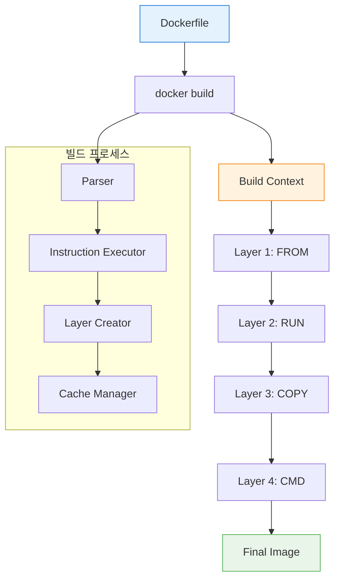
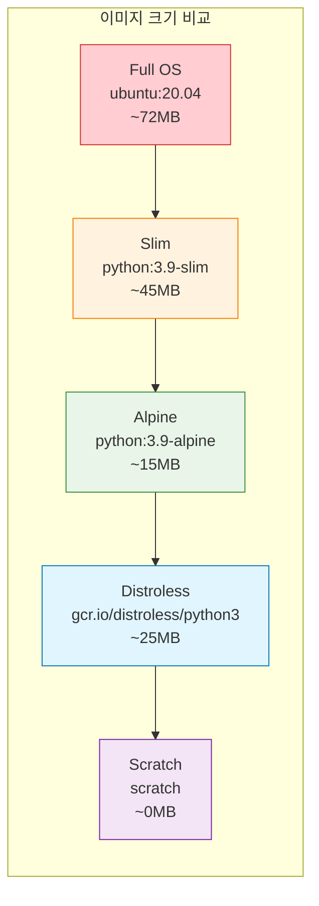

# Session 2: Dockerfile 기초 및 명령어

## 📍 교과과정에서의 위치
이 세션은 **Week 1 > Day 4**의 두 번째 세션으로, Dockerfile 작성의 기초와 핵심 명령어들을 상세히 학습합니다. 이전 세션에서 학습한 이미지 레이어 구조를 바탕으로 실제 이미지를 구축하는 방법을 마스터합니다.

## 학습 목표 (5분)
- **Dockerfile 문법**과 **명령어 체계** 완전 이해
- **베이스 이미지 선택 전략**과 **최적화 기법** 습득
- **효율적인 레이어 구성**을 위한 명령어 순서 최적화
- **빌드 컨텍스트**와 **캐시 메커니즘** 활용법 마스터

## 1. Dockerfile 기본 구조와 문법 (15분)

### Dockerfile의 핵심 개념

**Dockerfile**은 Docker 이미지를 자동으로 빌드하기 위한 **텍스트 기반 스크립트**입니다. 각 명령어는 새로운 레이어를 생성하며, 순차적으로 실행됩니다.



### 기본 Dockerfile 구조

```dockerfile
# 주석: 베이스 이미지 지정 (필수)
FROM ubuntu:20.04

# 메타데이터 설정
LABEL maintainer="devops@company.com"
LABEL version="1.0"
LABEL description="Sample web application"

# 환경 변수 설정
ENV APP_HOME=/app
ENV NODE_ENV=production

# 작업 디렉토리 설정
WORKDIR $APP_HOME

# 패키지 설치 및 업데이트
RUN apt-get update && \
    apt-get install -y \
        curl \
        wget \
        vim \
    && rm -rf /var/lib/apt/lists/*

# 파일 복사
COPY package*.json ./
COPY src/ ./src/

# 애플리케이션 설치
RUN npm install --production

# 포트 노출
EXPOSE 3000

# 볼륨 마운트 포인트
VOLUME ["/app/data"]

# 실행 사용자 설정
USER node

# 컨테이너 시작 명령어
CMD ["npm", "start"]
```

## 2. 핵심 Dockerfile 명령어 상세 분석 (20분)

### FROM - 베이스 이미지 선택

**FROM** 명령어는 빌드의 시작점을 정의하며, 모든 Dockerfile의 첫 번째 명령어여야 합니다.

```dockerfile
# 공식 이미지 사용 (권장)
FROM node:18-alpine

# 특정 태그 지정
FROM ubuntu:20.04

# 다이제스트를 사용한 정확한 버전 지정 (보안 강화)
FROM nginx@sha256:10d1f5b58f74683ad34eb29287e07dab1e90f10af243f151bb50aa5dbb4d62ee

# 멀티 스테이지 빌드에서 별칭 사용
FROM node:18-alpine AS builder
FROM nginx:alpine AS runtime

# 스크래치 이미지 (최소 크기)
FROM scratch
```

### RUN - 명령어 실행

**RUN** 명령어는 이미지 빌드 시점에 실행되며, 새로운 레이어를 생성합니다.

```dockerfile
# 단일 명령어
RUN apt-get update

# 여러 명령어를 하나의 레이어로 결합 (권장)
RUN apt-get update && \
    apt-get install -y \
        python3 \
        python3-pip \
        git \
    && apt-get clean \
    && rm -rf /var/lib/apt/lists/*

# 복잡한 스크립트 실행
RUN set -ex && \
    groupadd -r app && \
    useradd -r -g app app && \
    mkdir -p /app/logs && \
    chown -R app:app /app

# 조건부 실행
RUN if [ "$BUILD_ENV" = "development" ]; then \
        apt-get install -y debugging-tools; \
    fi
```

### COPY vs ADD - 파일 복사

**COPY**와 **ADD**는 모두 파일을 복사하지만, 서로 다른 특성을 가집니다.

```dockerfile
# COPY - 단순 파일 복사 (권장)
COPY package.json /app/
COPY src/ /app/src/
COPY --chown=app:app config/ /app/config/

# ADD - 고급 기능 포함 (URL 다운로드, 압축 해제)
ADD https://github.com/user/repo/archive/main.tar.gz /tmp/
ADD archive.tar.gz /app/  # 자동 압축 해제

# 권한 설정과 함께 복사
COPY --chown=1000:1000 --chmod=755 script.sh /usr/local/bin/

# 특정 파일만 선택적 복사
COPY package*.json ./
COPY *.conf /etc/nginx/conf.d/
```

### WORKDIR - 작업 디렉토리 설정

```dockerfile
# 절대 경로 사용 (권장)
WORKDIR /app

# 환경 변수 활용
ENV APP_HOME=/opt/myapp
WORKDIR $APP_HOME

# 중첩된 디렉토리 자동 생성
WORKDIR /app/src/components  # 디렉토리가 없으면 자동 생성

# 상대 경로 사용 (이전 WORKDIR 기준)
WORKDIR /app
WORKDIR src  # 결과: /app/src
```

### ENV vs ARG - 변수 설정

```dockerfile
# ARG - 빌드 시점 변수 (빌드 후 사라짐)
ARG NODE_VERSION=18
ARG BUILD_DATE
ARG GIT_COMMIT

FROM node:${NODE_VERSION}-alpine

# ENV - 런타임 환경 변수 (컨테이너에서 유지)
ENV NODE_ENV=production
ENV APP_PORT=3000
ENV DATABASE_URL=postgresql://localhost:5432/mydb

# ARG를 ENV로 전달
ARG BUILD_VERSION
ENV APP_VERSION=$BUILD_VERSION

# 복잡한 환경 변수 설정
ENV PATH="/app/bin:$PATH" \
    PYTHONPATH="/app/lib" \
    LANG=C.UTF-8
```

### EXPOSE - 포트 노출

```dockerfile
# 단일 포트
EXPOSE 80

# 여러 포트
EXPOSE 80 443

# 프로토콜 지정
EXPOSE 53/udp
EXPOSE 80/tcp

# 변수 사용
ENV APP_PORT=3000
EXPOSE $APP_PORT

# 포트 범위 (비권장)
EXPOSE 8000-8010
```

### USER - 실행 사용자 설정

```dockerfile
# 기존 사용자 사용
USER nobody

# 사용자 ID 사용
USER 1000

# 그룹과 함께 지정
USER app:app

# 사용자 생성 후 전환
RUN groupadd -r appgroup && \
    useradd -r -g appgroup -s /bin/false appuser
USER appuser

# 권한이 필요한 작업 후 사용자 전환
RUN apt-get update && apt-get install -y some-package
USER app
```

## 3. 베이스 이미지 선택 전략 (10분)

### 이미지 크기별 분류



### 베이스 이미지 선택 가이드

| 이미지 타입 | 장점 | 단점 | 사용 사례 |
|------------|------|------|----------|
| **Full OS** | 완전한 도구 세트, 디버깅 용이 | 큰 크기, 보안 취약점 많음 | 개발 환경, 복잡한 애플리케이션 |
| **Slim** | 적당한 크기, 필수 도구 포함 | 일부 도구 누락 | 일반적인 프로덕션 환경 |
| **Alpine** | 매우 작은 크기, 보안성 우수 | musl libc 호환성 문제 | 마이크로서비스, 경량 애플리케이션 |
| **Distroless** | 최소 런타임만 포함, 보안 우수 | 디버깅 어려움, 제한적 도구 | 보안이 중요한 프로덕션 |
| **Scratch** | 최소 크기 | 아무것도 포함되지 않음 | 정적 바이너리, Go 애플리케이션 |

```dockerfile
# 개발 환경용 - 풍부한 도구
FROM ubuntu:20.04
RUN apt-get update && apt-get install -y \
    build-essential \
    gdb \
    strace \
    vim

# 프로덕션 환경용 - 최적화된 크기
FROM python:3.9-alpine
RUN apk add --no-cache \
    gcc \
    musl-dev

# 보안 중심 - Distroless
FROM gcr.io/distroless/python3
COPY app.py /
CMD ["app.py"]

# 최소 크기 - Go 애플리케이션
FROM scratch
COPY myapp /
CMD ["/myapp"]
```

## 4. 실습: 다양한 Dockerfile 작성 (10분)

### 실습 1: Node.js 웹 애플리케이션

```bash
# 프로젝트 디렉토리 생성
mkdir nodejs-app && cd nodejs-app

# package.json 생성
cat > package.json << 'EOF'
{
  "name": "docker-node-app",
  "version": "1.0.0",
  "description": "Sample Node.js app for Docker",
  "main": "server.js",
  "scripts": {
    "start": "node server.js"
  },
  "dependencies": {
    "express": "^4.18.0"
  }
}
EOF

# 애플리케이션 코드 생성
cat > server.js << 'EOF'
const express = require('express');
const app = express();
const PORT = process.env.PORT || 3000;

app.get('/', (req, res) => {
  res.json({
    message: 'Hello from Docker!',
    timestamp: new Date().toISOString(),
    version: process.env.APP_VERSION || '1.0.0'
  });
});

app.get('/health', (req, res) => {
  res.json({ status: 'healthy' });
});

app.listen(PORT, () => {
  console.log(`Server running on port ${PORT}`);
});
EOF

# Dockerfile 작성
cat > Dockerfile << 'EOF'
# 베이스 이미지 선택
FROM node:18-alpine

# 메타데이터 설정
LABEL maintainer="devops@company.com"
LABEL version="1.0.0"
LABEL description="Node.js web application"

# 환경 변수 설정
ENV NODE_ENV=production
ENV APP_VERSION=1.0.0

# 작업 디렉토리 설정
WORKDIR /app

# 의존성 파일 복사 (캐시 최적화)
COPY package*.json ./

# 의존성 설치
RUN npm ci --only=production && \
    npm cache clean --force

# 애플리케이션 코드 복사
COPY server.js ./

# 비특권 사용자 생성 및 전환
RUN addgroup -g 1001 -S nodejs && \
    adduser -S nodejs -u 1001 -G nodejs
USER nodejs

# 포트 노출
EXPOSE 3000

# 헬스체크 설정
HEALTHCHECK --interval=30s --timeout=3s --start-period=5s --retries=3 \
  CMD curl -f http://localhost:3000/health || exit 1

# 시작 명령어
CMD ["npm", "start"]
EOF

# 이미지 빌드
docker build -t nodejs-app:1.0.0 .

# 컨테이너 실행
docker run -d -p 3000:3000 --name nodejs-app nodejs-app:1.0.0

# 테스트
curl http://localhost:3000
curl http://localhost:3000/health
```

### 실습 2: Python Flask 애플리케이션

```bash
# 새 프로젝트 디렉토리
mkdir python-app && cd python-app

# requirements.txt 생성
cat > requirements.txt << 'EOF'
Flask==2.3.2
gunicorn==21.2.0
redis==4.6.0
EOF

# Flask 애플리케이션 생성
cat > app.py << 'EOF'
from flask import Flask, jsonify
import os
import redis
from datetime import datetime

app = Flask(__name__)

# Redis 연결 (선택적)
try:
    r = redis.Redis(host=os.getenv('REDIS_HOST', 'localhost'), port=6379, decode_responses=True)
    r.ping()
    redis_available = True
except:
    redis_available = False

@app.route('/')
def hello():
    return jsonify({
        'message': 'Hello from Python Flask!',
        'timestamp': datetime.now().isoformat(),
        'redis_available': redis_available
    })

@app.route('/health')
def health():
    return jsonify({'status': 'healthy'})

if __name__ == '__main__':
    app.run(host='0.0.0.0', port=5000)
EOF

# 멀티 스테이지 Dockerfile
cat > Dockerfile << 'EOF'
# 빌드 스테이지
FROM python:3.11-slim as builder

WORKDIR /app

# 빌드 의존성 설치
RUN apt-get update && \
    apt-get install -y --no-install-recommends \
        build-essential \
        gcc \
    && rm -rf /var/lib/apt/lists/*

# Python 의존성 설치
COPY requirements.txt .
RUN pip install --user --no-cache-dir -r requirements.txt

# 프로덕션 스테이지
FROM python:3.11-slim

# 메타데이터
LABEL maintainer="devops@company.com"
LABEL version="1.0.0"

# 환경 변수
ENV PYTHONUNBUFFERED=1
ENV PYTHONDONTWRITEBYTECODE=1
ENV FLASK_APP=app.py

# 시스템 사용자 생성
RUN groupadd -r flask && useradd -r -g flask flask

# 작업 디렉토리
WORKDIR /app

# 빌드 스테이지에서 설치된 패키지 복사
COPY --from=builder /root/.local /home/flask/.local

# 애플리케이션 코드 복사
COPY --chown=flask:flask app.py .

# PATH 업데이트
ENV PATH=/home/flask/.local/bin:$PATH

# 사용자 전환
USER flask

# 포트 노출
EXPOSE 5000

# 헬스체크
HEALTHCHECK --interval=30s --timeout=10s --start-period=5s --retries=3 \
  CMD curl -f http://localhost:5000/health || exit 1

# 시작 명령어
CMD ["gunicorn", "--bind", "0.0.0.0:5000", "app:app"]
EOF

# 빌드 및 실행
docker build -t python-app:1.0.0 .
docker run -d -p 5000:5000 --name python-app python-app:1.0.0

# 테스트
curl http://localhost:5000
```

## 핵심 키워드 정리
- **Dockerfile**: 이미지 빌드를 위한 명령어 스크립트
- **레이어 최적화**: 명령어 순서와 결합을 통한 효율성 향상
- **베이스 이미지**: 애플리케이션 요구사항에 맞는 최적 선택
- **빌드 컨텍스트**: 빌드 시 Docker 데몬으로 전송되는 파일들
- **캐시 활용**: 변경되지 않은 레이어의 재사용을 통한 빌드 속도 향상

## 참고 자료
- [Dockerfile 레퍼런스](https://docs.docker.com/engine/reference/builder/)
- [Docker 베스트 프랙티스](https://docs.docker.com/develop/dev-best-practices/)
- [공식 Docker 이미지](https://hub.docker.com/search?q=&type=image&image_filter=official)
- [Distroless 이미지](https://github.com/GoogleContainerTools/distroless)

---
*다음 세션에서는 Dockerfile 최적화 기법과 이미지 크기 최소화 전략을 학습합니다.*