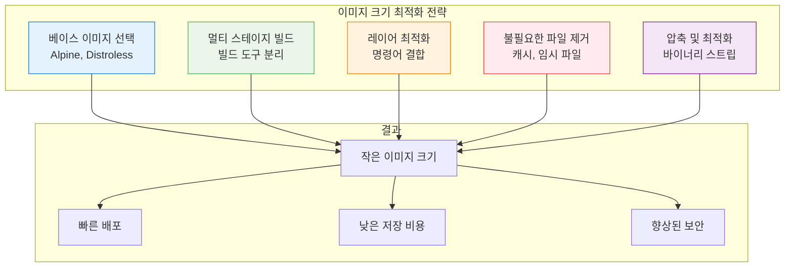
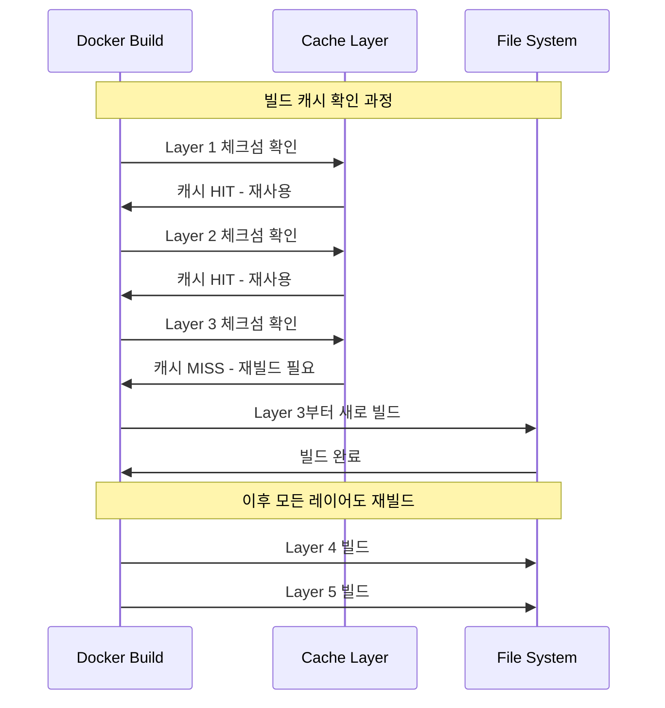

# Session 3: Dockerfile 최적화 기법

## 📍 교과과정에서의 위치
이 세션은 **Week 1 > Day 4**의 세 번째 세션으로, Dockerfile 작성의 고급 최적화 기법을 학습합니다. 이전 세션에서 학습한 기본 명령어를 바탕으로 프로덕션 환경에 적합한 효율적이고 안전한 이미지를 구축하는 방법을 마스터합니다.

## 학습 목표 (5분)
- **이미지 크기 최소화** 전략과 기법 습득
- **빌드 캐시 최적화**를 통한 빌드 속도 향상
- **.dockerignore** 활용법과 **보안 모범 사례** 적용
- **레이어 최적화**와 **명령어 결합** 기법 마스터

## 1. 이미지 크기 최소화 전략 (15분)

### 크기 최적화의 중요성

이미지 크기는 **배포 속도**, **저장 비용**, **보안 공격 표면**에 직접적인 영향을 미칩니다. 최적화된 이미지는 더 빠른 배포와 향상된 보안을 제공합니다.




### 베이스 이미지 최적화

```dockerfile
# ❌ 비효율적: 큰 베이스 이미지
FROM ubuntu:20.04
RUN apt-get update && \
    apt-get install -y python3 python3-pip
COPY app.py /app/
CMD ["python3", "/app/app.py"]

# ✅ 효율적: Alpine 기반
FROM python:3.11-alpine
COPY app.py /app/
CMD ["python", "/app/app.py"]

# ✅ 더 효율적: Distroless
FROM python:3.11-alpine AS builder
RUN pip install --user pyinstaller
COPY app.py .
RUN pyinstaller --onefile app.py

FROM gcr.io/distroless/python3
COPY --from=builder /root/.local/bin/app /
CMD ["/app"]
```

### 패키지 관리자 최적화

```dockerfile
# ❌ 비효율적: 캐시가 남아있음
FROM ubuntu:20.04
RUN apt-get update
RUN apt-get install -y python3 python3-pip
RUN apt-get install -y curl wget

# ✅ 효율적: 한 번에 설치하고 캐시 정리
FROM ubuntu:20.04
RUN apt-get update && \
    apt-get install -y --no-install-recommends \
        python3 \
        python3-pip \
        curl \
        wget \
    && apt-get clean \
    && rm -rf /var/lib/apt/lists/* \
    && rm -rf /tmp/* \
    && rm -rf /var/tmp/*

# Alpine의 경우
FROM alpine:3.18
RUN apk add --no-cache \
        python3 \
        py3-pip \
        curl \
        wget \
    && rm -rf /var/cache/apk/*
```

### Python 패키지 최적화

```dockerfile
# ❌ 비효율적: 개발 의존성 포함
FROM python:3.11
COPY requirements.txt .
RUN pip install -r requirements.txt
COPY . .
CMD ["python", "app.py"]

# ✅ 효율적: 프로덕션 전용 설치
FROM python:3.11-alpine
COPY requirements.txt .
RUN pip install --no-cache-dir --no-compile -r requirements.txt && \
    find /usr/local -name '*.pyc' -delete && \
    find /usr/local -name '__pycache__' -delete
COPY . .
CMD ["python", "app.py"]

# ✅ 더 효율적: 가상환경과 멀티스테이지
FROM python:3.11-alpine AS builder
RUN python -m venv /opt/venv
ENV PATH="/opt/venv/bin:$PATH"
COPY requirements.txt .
RUN pip install --no-cache-dir -r requirements.txt

FROM python:3.11-alpine
COPY --from=builder /opt/venv /opt/venv
ENV PATH="/opt/venv/bin:$PATH"
COPY . .
CMD ["python", "app.py"]
```

## 2. 빌드 캐시 최적화 (15분)

### Docker 빌드 캐시 메커니즘

Docker는 각 명령어의 **체크섬**을 계산하여 캐시 유효성을 판단합니다. 파일 내용이나 명령어가 변경되면 해당 레이어부터 다시 빌드됩니다.



### 캐시 친화적 Dockerfile 작성

```dockerfile
# ❌ 캐시 비효율적: 자주 변경되는 파일을 먼저 복사
FROM node:18-alpine
COPY . .                    # 소스 코드 변경 시 모든 레이어 무효화
RUN npm install            # 의존성도 매번 재설치
CMD ["npm", "start"]

# ✅ 캐시 효율적: 의존성 파일을 먼저 복사
FROM node:18-alpine
WORKDIR /app

# 1. 의존성 파일만 먼저 복사 (변경 빈도 낮음)
COPY package*.json ./
RUN npm ci --only=production  # 의존성 변경 시만 재실행

# 2. 소스 코드는 나중에 복사 (변경 빈도 높음)
COPY src/ ./src/
COPY public/ ./public/

CMD ["npm", "start"]

# ✅ 더 효율적: 단계별 최적화
FROM node:18-alpine
WORKDIR /app

# 의존성 설치 (캐시 레이어)
COPY package*.json ./
RUN npm ci --only=production && npm cache clean --force

# 빌드 도구 설치 (필요한 경우만)
COPY webpack.config.js babel.config.js ./
RUN npm run build

# 런타임 파일만 복사
COPY --from=builder /app/dist ./dist
COPY server.js ./

CMD ["node", "server.js"]
```

### BuildKit 캐시 마운트 활용

```dockerfile
# syntax=docker/dockerfile:1
FROM node:18-alpine

WORKDIR /app

# 캐시 마운트를 사용한 npm 설치
COPY package*.json ./
RUN --mount=type=cache,target=/root/.npm \
    npm ci --only=production

# 캐시 마운트를 사용한 빌드
COPY . .
RUN --mount=type=cache,target=/app/node_modules/.cache \
    npm run build

CMD ["npm", "start"]
```

```bash
# BuildKit 활성화하여 빌드
DOCKER_BUILDKIT=1 docker build -t myapp .

# 캐시 확인
docker builder prune --filter type=exec.cachemount
```

## 3. .dockerignore 활용법 (10분)

### .dockerignore의 중요성

**.dockerignore** 파일은 빌드 컨텍스트에서 제외할 파일과 디렉토리를 지정하여 **빌드 속도 향상**과 **보안 강화**를 제공합니다.

```bash
# .dockerignore 파일 생성
cat > .dockerignore << 'EOF'
# 버전 관리
.git
.gitignore
.gitattributes

# 의존성 디렉토리
node_modules
npm-debug.log*
yarn-debug.log*
yarn-error.log*

# 빌드 출력
dist
build
*.log

# 개발 도구
.vscode
.idea
*.swp
*.swo

# 운영체제 파일
.DS_Store
Thumbs.db

# 환경 설정 (보안)
.env
.env.local
.env.*.local

# 테스트 관련
coverage
.nyc_output
test-results

# 문서
README.md
CHANGELOG.md
docs/

# Docker 관련
Dockerfile*
docker-compose*.yml
.dockerignore

# 임시 파일
*.tmp
*.temp
.cache
EOF
```

### 고급 .dockerignore 패턴

```bash
# 복잡한 패턴 예제
cat > .dockerignore << 'EOF'
# 모든 마크다운 파일 제외
*.md

# 특정 마크다운 파일은 포함
!README.md

# 특정 디렉토리 전체 제외
temp/
logs/

# 특정 확장자 제외
*.log
*.tmp

# 중첩된 패턴
**/node_modules
**/coverage
**/.git

# 조건부 제외 (특정 환경에서만)
# 개발 환경 파일들
.env.development
.env.test
webpack.dev.js

# 프로덕션에서는 불필요한 파일들
src/**/*.test.js
src/**/*.spec.js
__tests__/
jest.config.js
EOF
```

### 빌드 컨텍스트 크기 최적화

```bash
# 빌드 컨텍스트 크기 확인
docker build --no-cache -t test-context . 2>&1 | grep "Sending build context"

# .dockerignore 적용 전후 비교
echo "=== .dockerignore 적용 전 ==="
mv .dockerignore .dockerignore.bak
docker build --no-cache -t test-before . 2>&1 | grep "Sending build context"

echo "=== .dockerignore 적용 후 ==="
mv .dockerignore.bak .dockerignore
docker build --no-cache -t test-after . 2>&1 | grep "Sending build context"
```

## 4. 레이어 최적화 고급 기법 (10분)

### 명령어 결합과 순서 최적화

```dockerfile
# ❌ 비효율적: 많은 레이어 생성
FROM ubuntu:20.04
RUN apt-get update
RUN apt-get install -y curl
RUN apt-get install -y wget  
RUN apt-get install -y vim
RUN apt-get clean
RUN rm -rf /var/lib/apt/lists/*

# ✅ 효율적: 명령어 결합
FROM ubuntu:20.04
RUN apt-get update && \
    apt-get install -y \
        curl \
        wget \
        vim \
    && apt-get clean \
    && rm -rf /var/lib/apt/lists/*

# ✅ 더 효율적: 함수형 접근
FROM ubuntu:20.04
RUN set -ex && \
    apt-get update && \
    apt-get install -y --no-install-recommends \
        curl \
        wget \
        vim \
    && apt-get autoremove -y && \
    apt-get clean && \
    rm -rf /var/lib/apt/lists/* /tmp/* /var/tmp/*
```

### 조건부 설치 최적화

```dockerfile
# 환경별 조건부 설치
FROM node:18-alpine
WORKDIR /app

# 기본 의존성
COPY package*.json ./
RUN npm ci --only=production

# 개발 도구 조건부 설치
ARG NODE_ENV=production
RUN if [ "$NODE_ENV" = "development" ]; then \
        npm install --only=dev; \
    fi

# 플랫폼별 조건부 설치
ARG TARGETPLATFORM
RUN case "$TARGETPLATFORM" in \
        "linux/amd64") \
            echo "Installing x86_64 specific packages" && \
            apk add --no-cache some-x86-package ;; \
        "linux/arm64") \
            echo "Installing ARM64 specific packages" && \
            apk add --no-cache some-arm-package ;; \
        *) \
            echo "Installing generic packages" ;; \
    esac
```

## 5. 실습: 최적화된 이미지 구축 (5분)

### 종합 최적화 실습

```bash
# 프로젝트 디렉토리 생성
mkdir optimization-demo && cd optimization-demo

# 샘플 Node.js 애플리케이션 생성
cat > package.json << 'EOF'
{
  "name": "optimized-app",
  "version": "1.0.0",
  "scripts": {
    "start": "node server.js",
    "test": "jest",
    "build": "webpack --mode=production"
  },
  "dependencies": {
    "express": "^4.18.0",
    "compression": "^1.7.4"
  },
  "devDependencies": {
    "jest": "^29.0.0",
    "webpack": "^5.74.0",
    "webpack-cli": "^4.10.0"
  }
}
EOF

cat > server.js << 'EOF'
const express = require('express');
const compression = require('compression');
const app = express();

app.use(compression());

app.get('/', (req, res) => {
  res.json({ 
    message: 'Optimized Docker App',
    timestamp: new Date().toISOString(),
    memory: process.memoryUsage()
  });
});

const PORT = process.env.PORT || 3000;
app.listen(PORT, () => {
  console.log(`Server running on port ${PORT}`);
});
EOF

# .dockerignore 생성
cat > .dockerignore << 'EOF'
node_modules
npm-debug.log*
.git
.gitignore
README.md
Dockerfile*
.dockerignore
coverage
.nyc_output
.env
.env.local
*.log
.DS_Store
EOF

# 최적화된 Dockerfile 작성
cat > Dockerfile << 'EOF'
# syntax=docker/dockerfile:1

# 멀티 스테이지 빌드
FROM node:18-alpine AS base
WORKDIR /app
RUN apk add --no-cache dumb-init

# 의존성 설치 스테이지
FROM base AS deps
COPY package*.json ./
RUN --mount=type=cache,target=/root/.npm \
    npm ci --only=production && \
    npm cache clean --force

# 개발 의존성 설치 스테이지 (빌드용)
FROM base AS build-deps
COPY package*.json ./
RUN --mount=type=cache,target=/root/.npm \
    npm ci

# 빌드 스테이지
FROM build-deps AS build
COPY . .
RUN npm run build 2>/dev/null || echo "No build script"

# 프로덕션 스테이지
FROM base AS production

# 보안: 비특권 사용자 생성
RUN addgroup -g 1001 -S nodejs && \
    adduser -S nodejs -u 1001 -G nodejs

# 의존성 복사
COPY --from=deps --chown=nodejs:nodejs /app/node_modules ./node_modules

# 애플리케이션 코드 복사
COPY --chown=nodejs:nodejs server.js ./

# 사용자 전환
USER nodejs

# 포트 노출
EXPOSE 3000

# 헬스체크
HEALTHCHECK --interval=30s --timeout=3s --start-period=5s --retries=3 \
  CMD wget --no-verbose --tries=1 --spider http://localhost:3000/ || exit 1

# 시작 명령어 (dumb-init 사용)
ENTRYPOINT ["dumb-init", "--"]
CMD ["node", "server.js"]
EOF

# 빌드 및 크기 비교
echo "=== 최적화된 이미지 빌드 ==="
DOCKER_BUILDKIT=1 docker build -t optimized-app:latest .

echo "=== 이미지 크기 확인 ==="
docker images optimized-app:latest

echo "=== 이미지 레이어 분석 ==="
docker history optimized-app:latest

# 실행 테스트
docker run -d -p 3000:3000 --name optimized-app optimized-app:latest
sleep 3
curl http://localhost:3000

# 정리
docker stop optimized-app
docker rm optimized-app
```

### 크기 비교 분석

```bash
# 다양한 최적화 수준 비교
cat > compare-sizes.sh << 'EOF'
#!/bin/bash

echo "=== Docker 이미지 크기 비교 ==="

# 기본 이미지
docker build -f Dockerfile.basic -t app:basic . 2>/dev/null
basic_size=$(docker images app:basic --format "{{.Size}}")

# 최적화된 이미지  
docker build -f Dockerfile.optimized -t app:optimized . 2>/dev/null
optimized_size=$(docker images app:optimized --format "{{.Size}}")

echo "기본 이미지: $basic_size"
echo "최적화된 이미지: $optimized_size"

# 상세 분석
echo -e "\n=== 레이어 분석 ==="
docker history app:optimized --format "table {{.CreatedBy}}\t{{.Size}}"
EOF

chmod +x compare-sizes.sh
```

## 핵심 키워드 정리
- **이미지 크기 최적화**: Alpine, Distroless, 멀티스테이지 빌드
- **빌드 캐시**: 레이어 순서 최적화와 캐시 마운트 활용
- **빌드 컨텍스트**: .dockerignore를 통한 불필요한 파일 제외
- **레이어 최적화**: 명령어 결합과 조건부 설치
- **보안 최적화**: 최소 권한 원칙과 불필요한 도구 제거

## 참고 자료
- [Docker 이미지 최적화 가이드](https://docs.docker.com/develop/dev-best-practices/)
- [BuildKit 고급 기능](https://docs.docker.com/build/buildkit/)
- [.dockerignore 문법](https://docs.docker.com/engine/reference/builder/#dockerignore-file)
- [멀티 스테이지 빌드](https://docs.docker.com/develop/dev-best-practices/#use-multi-stage-builds)

---
*다음 세션에서는 멀티 스테이지 빌드를 활용한 고급 이미지 구축 기법을 학습합니다.*