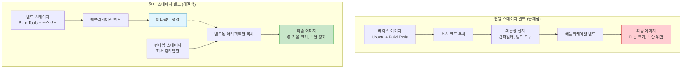

# Session 4: 멀티 스테이지 빌드

## 📍 교과과정에서의 위치
이 세션은 **Week 1 > Day 4**의 네 번째 세션으로, Docker의 멀티 스테이지 빌드 기능을 심층적으로 학습합니다. 이전 세션에서 학습한 최적화 기법을 바탕으로 빌드 도구와 런타임을 분리하여 최적화된 프로덕션 이미지를 구축하는 고급 기법을 마스터합니다.

## 학습 목표 (5분)
- **멀티 스테이지 빌드**의 개념과 장점 완전 이해
- **빌드 스테이지 분리** 전략과 **아티팩트 전달** 기법 습득
- **프로덕션 이미지 최적화**를 위한 고급 패턴 마스터
- **복잡한 애플리케이션**의 멀티 스테이지 구성 능력 개발

## 1. 멀티 스테이지 빌드 개념 (15분)

### 멀티 스테이지 빌드의 필요성

전통적인 단일 스테이지 빌드는 **빌드 도구**와 **런타임 환경**이 함께 포함되어 이미지 크기가 커지고 보안 위험이 증가합니다. 멀티 스테이지 빌드는 이러한 문제를 해결합니다.




### 멀티 스테이지 빌드의 장점

| 장점 | 설명 | 효과 |
|------|------|------|
| **크기 최적화** | 빌드 도구 제외, 런타임만 포함 | 50-90% 크기 감소 |
| **보안 강화** | 공격 표면 최소화 | 취약점 수 대폭 감소 |
| **성능 향상** | 작은 이미지로 빠른 배포 | 배포 시간 단축 |
| **관심사 분리** | 빌드와 런타임 환경 분리 | 유지보수성 향상 |

### 기본 멀티 스테이지 구조

```dockerfile
# 빌드 스테이지
FROM node:18 AS builder
WORKDIR /app
COPY package*.json ./
RUN npm install
COPY . .
RUN npm run build

# 프로덕션 스테이지
FROM nginx:alpine AS production
COPY --from=builder /app/dist /usr/share/nginx/html
EXPOSE 80
CMD ["nginx", "-g", "daemon off;"]
```

## 2. 고급 멀티 스테이지 패턴 (20분)

### 패턴 1: 컴파일 언어 최적화 (Go 예제)

```dockerfile
# syntax=docker/dockerfile:1

# 빌드 스테이지
FROM golang:1.21-alpine AS builder

# 빌드 최적화를 위한 환경 설정
ENV CGO_ENABLED=0 \
    GOOS=linux \
    GOARCH=amd64

WORKDIR /build

# 의존성 다운로드 (캐시 최적화)
COPY go.mod go.sum ./
RUN go mod download && go mod verify

# 소스 코드 복사 및 빌드
COPY . .
RUN go build \
    -ldflags='-w -s -extldflags "-static"' \
    -a -installsuffix cgo \
    -o app ./cmd/main.go

# 런타임 스테이지 (Distroless 사용)
FROM gcr.io/distroless/static-debian11 AS production

# 메타데이터
LABEL maintainer="devops@company.com" \
      version="1.0.0" \
      description="Optimized Go application"

# 비특권 사용자로 실행
USER nonroot:nonroot

# 빌드된 바이너리만 복사
COPY --from=builder --chown=nonroot:nonroot /build/app /app

# 포트 노출
EXPOSE 8080

# 헬스체크
HEALTHCHECK --interval=30s --timeout=3s --start-period=5s --retries=3 \
  CMD ["/app", "healthcheck"]

# 실행 명령어
ENTRYPOINT ["/app"]
```

### 패턴 2: 프론트엔드 애플리케이션 (React 예제)

```dockerfile
# syntax=docker/dockerfile:1

# Node.js 빌드 스테이지
FROM node:18-alpine AS dependencies
WORKDIR /app

# 패키지 매니저 최적화
RUN apk add --no-cache libc6-compat
COPY package*.json yarn.lock* ./
RUN yarn install --frozen-lockfile --production=false

# 빌드 스테이지
FROM node:18-alpine AS builder
WORKDIR /app

# 의존성 복사
COPY --from=dependencies /app/node_modules ./node_modules
COPY . .

# 환경별 빌드
ARG NODE_ENV=production
ARG API_URL
ARG BUILD_VERSION

ENV NODE_ENV=$NODE_ENV
ENV REACT_APP_API_URL=$API_URL
ENV REACT_APP_VERSION=$BUILD_VERSION

# 빌드 실행
RUN yarn build && \
    yarn cache clean

# 프로덕션 스테이지 (Nginx)
FROM nginx:alpine AS production

# Nginx 설정 복사
COPY nginx.conf /etc/nginx/nginx.conf
COPY default.conf /etc/nginx/conf.d/default.conf

# 빌드된 정적 파일 복사
COPY --from=builder /app/build /usr/share/nginx/html

# 보안 헤더 설정
RUN echo 'add_header X-Frame-Options "SAMEORIGIN" always;' > /etc/nginx/conf.d/security.conf && \
    echo 'add_header X-Content-Type-Options "nosniff" always;' >> /etc/nginx/conf.d/security.conf && \
    echo 'add_header X-XSS-Protection "1; mode=block" always;' >> /etc/nginx/conf.d/security.conf

# 포트 노출
EXPOSE 80 443

# 헬스체크
HEALTHCHECK --interval=30s --timeout=3s --start-period=5s --retries=3 \
  CMD wget --no-verbose --tries=1 --spider http://localhost/ || exit 1

# Nginx 실행
CMD ["nginx", "-g", "daemon off;"]
```

### 패턴 3: 마이크로서비스 아키텍처 (Java Spring Boot)

```dockerfile
# syntax=docker/dockerfile:1

# 베이스 빌드 이미지
FROM eclipse-temurin:17-jdk-alpine AS base
WORKDIR /app
RUN apk add --no-cache curl

# 의존성 다운로드 스테이지
FROM base AS dependencies
COPY gradle/wrapper/ gradle/wrapper/
COPY gradlew build.gradle settings.gradle ./
RUN ./gradlew dependencies --no-daemon

# 빌드 스테이지
FROM dependencies AS builder
COPY src/ src/
RUN ./gradlew build --no-daemon -x test && \
    java -Djarmode=layertools -jar build/libs/*.jar extract

# 테스트 스테이지 (선택적)
FROM dependencies AS tester
COPY src/ src/
RUN ./gradlew test --no-daemon

# 프로덕션 스테이지
FROM eclipse-temurin:17-jre-alpine AS production

# 보안 및 모니터링 도구 설치
RUN apk add --no-cache \
    curl \
    dumb-init \
    && addgroup -g 1001 -S spring \
    && adduser -S spring -u 1001 -G spring

WORKDIR /app

# 레이어별 복사 (Spring Boot 레이어 최적화)
COPY --from=builder --chown=spring:spring /app/dependencies/ ./
COPY --from=builder --chown=spring:spring /app/spring-boot-loader/ ./
COPY --from=builder --chown=spring:spring /app/snapshot-dependencies/ ./
COPY --from=builder --chown=spring:spring /app/application/ ./

# 사용자 전환
USER spring:spring

# JVM 최적화 설정
ENV JAVA_OPTS="-XX:+UseContainerSupport \
               -XX:MaxRAMPercentage=75.0 \
               -XX:+UseG1GC \
               -XX:+UseStringDeduplication \
               -Djava.security.egd=file:/dev/./urandom"

# 포트 노출
EXPOSE 8080

# 헬스체크
HEALTHCHECK --interval=30s --timeout=10s --start-period=60s --retries=3 \
  CMD curl -f http://localhost:8080/actuator/health || exit 1

# 애플리케이션 실행
ENTRYPOINT ["dumb-init", "--"]
CMD ["sh", "-c", "java $JAVA_OPTS org.springframework.boot.loader.JarLauncher"]
```

## 3. 고급 스테이지 관리 기법 (10분)

### 스테이지 간 아티팩트 전달

```dockerfile
# 복잡한 아티팩트 전달 예제
FROM node:18-alpine AS frontend-builder
WORKDIR /frontend
COPY frontend/ .
RUN npm install && npm run build

FROM golang:1.21-alpine AS backend-builder  
WORKDIR /backend
COPY backend/ .
RUN go build -o server ./cmd/server

FROM python:3.11-alpine AS ml-processor
WORKDIR /ml
COPY ml-models/ .
RUN pip install -r requirements.txt && \
    python preprocess.py

# 최종 통합 스테이지
FROM nginx:alpine AS production
# 프론트엔드 정적 파일
COPY --from=frontend-builder /frontend/dist /usr/share/nginx/html

# 백엔드 바이너리
COPY --from=backend-builder /backend/server /usr/local/bin/

# ML 모델 파일
COPY --from=ml-processor /ml/models /app/models

# 설정 파일
COPY nginx.conf /etc/nginx/nginx.conf
COPY startup.sh /startup.sh
RUN chmod +x /startup.sh

CMD ["/startup.sh"]
```

### 조건부 스테이지 빌드

```dockerfile
# syntax=docker/dockerfile:1

# 공통 베이스
FROM node:18-alpine AS base
WORKDIR /app
COPY package*.json ./

# 개발 스테이지
FROM base AS development
ENV NODE_ENV=development
RUN npm install
COPY . .
CMD ["npm", "run", "dev"]

# 테스트 스테이지
FROM base AS testing
ENV NODE_ENV=test
RUN npm ci
COPY . .
RUN npm run test
RUN npm run lint

# 프로덕션 빌드 스테이지
FROM base AS builder
ENV NODE_ENV=production
RUN npm ci --only=production
COPY . .
RUN npm run build

# 프로덕션 스테이지
FROM nginx:alpine AS production
COPY --from=builder /app/dist /usr/share/nginx/html
COPY nginx.conf /etc/nginx/nginx.conf
CMD ["nginx", "-g", "daemon off;"]
```

```bash
# 특정 스테이지만 빌드
docker build --target development -t myapp:dev .
docker build --target testing -t myapp:test .
docker build --target production -t myapp:prod .
```

## 4. 실습: 복합 애플리케이션 멀티 스테이지 빌드 (10분)

### 실습 프로젝트: 풀스택 웹 애플리케이션

```bash
# 프로젝트 구조 생성
mkdir fullstack-app && cd fullstack-app
mkdir -p frontend backend database

# 프론트엔드 (React) 설정
cd frontend
cat > package.json << 'EOF'
{
  "name": "frontend",
  "version": "1.0.0",
  "scripts": {
    "build": "echo 'Building React app...' && mkdir -p dist && echo '<h1>React App</h1>' > dist/index.html",
    "start": "echo 'Starting dev server...'"
  },
  "dependencies": {
    "react": "^18.0.0"
  }
}
EOF

# 백엔드 (Node.js API) 설정
cd ../backend
cat > package.json << 'EOF'
{
  "name": "backend",
  "version": "1.0.0",
  "main": "server.js",
  "scripts": {
    "start": "node server.js"
  },
  "dependencies": {
    "express": "^4.18.0"
  }
}
EOF

cat > server.js << 'EOF'
const express = require('express');
const app = express();

app.get('/api/health', (req, res) => {
  res.json({ status: 'healthy', timestamp: new Date().toISOString() });
});

app.get('/api/data', (req, res) => {
  res.json({ message: 'Hello from backend!', data: [1, 2, 3, 4, 5] });
});

const PORT = process.env.PORT || 3001;
app.listen(PORT, () => {
  console.log(`Backend server running on port ${PORT}`);
});
EOF

# 루트 디렉토리로 이동
cd ..

# 통합 멀티 스테이지 Dockerfile 작성
cat > Dockerfile << 'EOF'
# syntax=docker/dockerfile:1

# 프론트엔드 빌드 스테이지
FROM node:18-alpine AS frontend-builder
WORKDIR /frontend
COPY frontend/package*.json ./
RUN npm install
COPY frontend/ .
RUN npm run build

# 백엔드 빌드 스테이지
FROM node:18-alpine AS backend-builder
WORKDIR /backend
COPY backend/package*.json ./
RUN npm ci --only=production
COPY backend/ .

# Nginx 설정 준비 스테이지
FROM alpine:3.18 AS config-builder
RUN mkdir -p /config
COPY << 'NGINX_CONF' /config/nginx.conf
events {
    worker_connections 1024;
}

http {
    include /etc/nginx/mime.types;
    default_type application/octet-stream;
    
    upstream backend {
        server localhost:3001;
    }
    
    server {
        listen 80;
        server_name localhost;
        
        # 프론트엔드 정적 파일
        location / {
            root /usr/share/nginx/html;
            index index.html;
            try_files $uri $uri/ /index.html;
        }
        
        # API 프록시
        location /api/ {
            proxy_pass http://backend/;
            proxy_set_header Host $host;
            proxy_set_header X-Real-IP $remote_addr;
        }
        
        # 헬스체크
        location /health {
            access_log off;
            return 200 "healthy\n";
            add_header Content-Type text/plain;
        }
    }
}
NGINX_CONF

# 시작 스크립트 생성
COPY << 'START_SCRIPT' /config/start.sh
#!/bin/sh
set -e

echo "Starting backend server..."
cd /backend && node server.js &

echo "Starting nginx..."
nginx -g "daemon off;" &

# 프로세스 관리
wait
START_SCRIPT

RUN chmod +x /config/start.sh

# 최종 프로덕션 스테이지
FROM nginx:alpine AS production

# 필요한 도구 설치
RUN apk add --no-cache nodejs npm supervisor

# 설정 파일 복사
COPY --from=config-builder /config/nginx.conf /etc/nginx/nginx.conf
COPY --from=config-builder /config/start.sh /start.sh

# 프론트엔드 정적 파일 복사
COPY --from=frontend-builder /frontend/dist /usr/share/nginx/html

# 백엔드 애플리케이션 복사
COPY --from=backend-builder /backend /backend

# Supervisor 설정
COPY << 'SUPERVISOR_CONF' /etc/supervisor/conf.d/supervisord.conf
[supervisord]
nodaemon=true
user=root

[program:backend]
command=node server.js
directory=/backend
autostart=true
autorestart=true
stdout_logfile=/var/log/backend.log
stderr_logfile=/var/log/backend.log

[program:nginx]
command=nginx -g "daemon off;"
autostart=true
autorestart=true
stdout_logfile=/var/log/nginx.log
stderr_logfile=/var/log/nginx.log
SUPERVISOR_CONF

# 포트 노출
EXPOSE 80

# 헬스체크
HEALTHCHECK --interval=30s --timeout=10s --start-period=15s --retries=3 \
  CMD wget --no-verbose --tries=1 --spider http://localhost/health || exit 1

# 애플리케이션 시작
CMD ["/usr/bin/supervisord", "-c", "/etc/supervisor/conf.d/supervisord.conf"]
EOF

# 빌드 및 실행
echo "=== 멀티 스테이지 빌드 시작 ==="
DOCKER_BUILDKIT=1 docker build -t fullstack-app:latest .

echo "=== 이미지 크기 확인 ==="
docker images fullstack-app:latest

echo "=== 레이어 분석 ==="
docker history fullstack-app:latest

echo "=== 애플리케이션 실행 ==="
docker run -d -p 8080:80 --name fullstack-app fullstack-app:latest

# 테스트
sleep 10
echo "=== 헬스체크 ==="
curl http://localhost:8080/health

echo "=== API 테스트 ==="
curl http://localhost:8080/api/health

echo "=== 프론트엔드 테스트 ==="
curl -s http://localhost:8080/ | head -1

# 정리
docker stop fullstack-app
docker rm fullstack-app
```

### 빌드 성능 분석

```bash
# 빌드 시간 측정
cat > benchmark.sh << 'EOF'
#!/bin/bash

echo "=== 멀티 스테이지 빌드 성능 분석 ==="

# 캐시 없이 빌드
echo "1. 캐시 없이 전체 빌드"
time DOCKER_BUILDKIT=1 docker build --no-cache -t fullstack:no-cache .

# 캐시 활용 빌드
echo "2. 캐시 활용 빌드"
time DOCKER_BUILDKIT=1 docker build -t fullstack:cached .

# 특정 스테이지만 빌드
echo "3. 프론트엔드만 빌드"
time DOCKER_BUILDKIT=1 docker build --target frontend-builder -t frontend:only .

echo "4. 백엔드만 빌드"  
time DOCKER_BUILDKIT=1 docker build --target backend-builder -t backend:only .

# 이미지 크기 비교
echo "=== 이미지 크기 비교 ==="
docker images | grep -E "(fullstack|frontend|backend)"
EOF

chmod +x benchmark.sh
```

## 핵심 키워드 정리
- **멀티 스테이지 빌드**: 빌드와 런타임 환경 분리를 통한 최적화
- **스테이지 별칭**: AS 키워드를 사용한 스테이지 명명과 참조
- **아티팩트 전달**: COPY --from을 통한 스테이지 간 파일 전송
- **조건부 빌드**: --target 옵션을 통한 특정 스테이지 빌드
- **레이어 최적화**: 각 스테이지별 최적화된 베이스 이미지 선택

## 참고 자료
- [멀티 스테이지 빌드 공식 문서](https://docs.docker.com/develop/dev-best-practices/#use-multi-stage-builds)
- [BuildKit 고급 기능](https://docs.docker.com/build/buildkit/)
- [Distroless 이미지 가이드](https://github.com/GoogleContainerTools/distroless)
- [Docker 이미지 최적화 모범 사례](https://docs.docker.com/develop/dev-best-practices/)

---
*다음 세션에서는 이미지 태깅 및 버전 관리 전략을 학습합니다.*