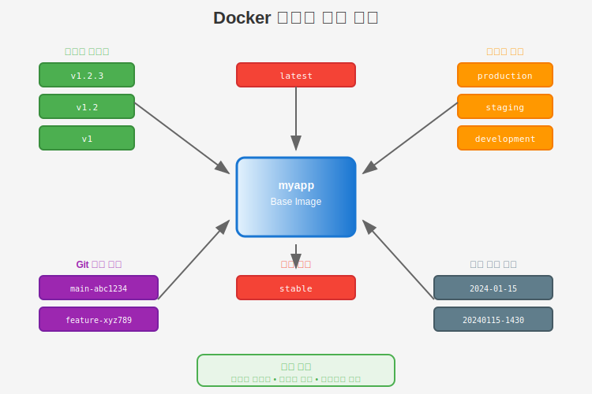
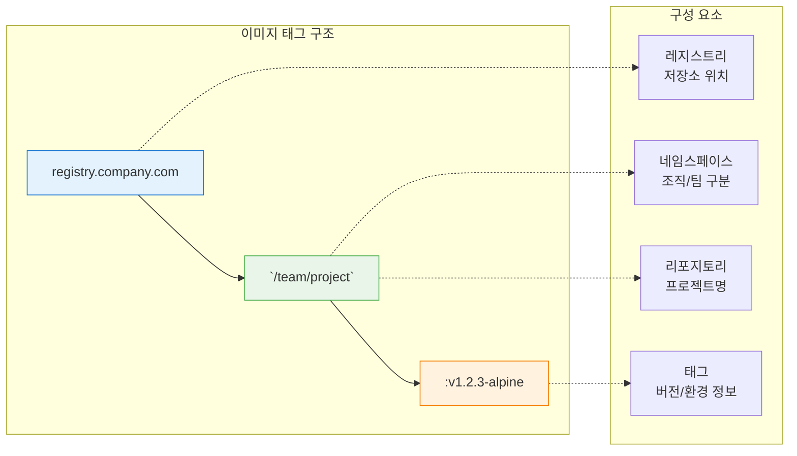
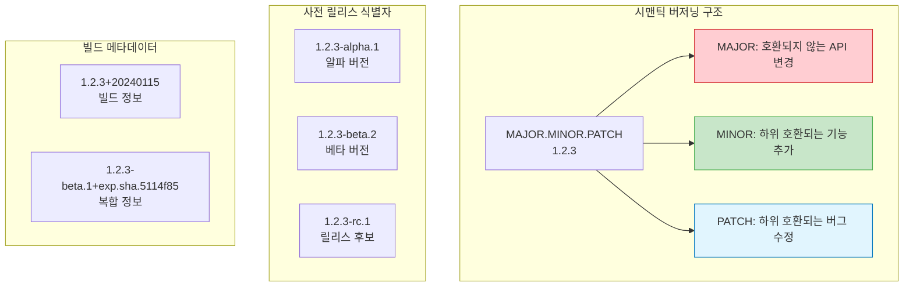
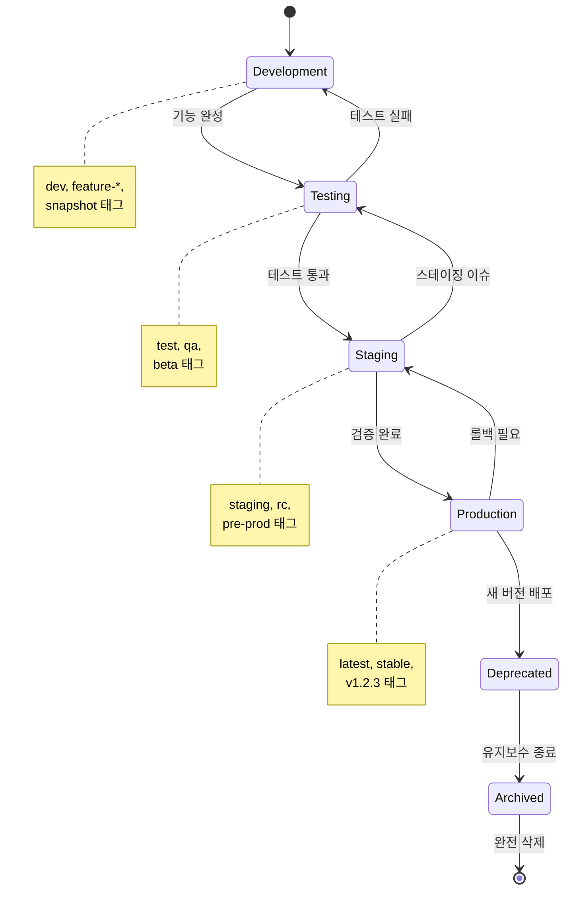

# Session 5: 이미지 태깅 및 버전 관리

## 📍 교과과정에서의 위치
이 세션은 **Week 1 > Day 4**의 다섯 번째 세션으로, Docker 이미지의 태깅 전략과 버전 관리 시스템을 학습합니다. 이전 세션에서 구축한 최적화된 이미지들을 체계적으로 관리하고 배포하는 전문적인 방법론을 마스터합니다.

## 학습 목표 (5분)
- **이미지 태깅 전략**과 **네이밍 컨벤션** 수립
- **시맨틱 버저닝** 적용과 **자동화된 태깅** 구현
- **이미지 라이프사이클 관리**와 **롤백 전략** 습득
- **멀티 아키텍처 이미지** 관리 기법 마스터

## 1. Docker 이미지 태깅 시스템 (15분)

### 태그의 구조와 의미

Docker 이미지 태그는 **레지스트리/네임스페이스/리포지토리:태그** 형식을 따르며, 각 구성 요소는 특정한 의미를 가집니다.





### 태깅 전략 유형

| 전략 | 예시 | 사용 사례 | 장점 | 단점 |
|------|------|----------|------|------|
| **시맨틱 버저닝** | `v1.2.3`, `v2.0.0-beta.1` | 프로덕션 릴리스 | 명확한 버전 관리 | 수동 관리 필요 |
| **날짜 기반** | `2024-01-15`, `20240115-1430` | 일일 빌드 | 시간 순서 명확 | 기능 변경 추적 어려움 |
| **Git 기반** | `main-abc1234`, `feature-xyz789` | CI/CD 파이프라인 | 소스 추적 용이 | 태그명 길어짐 |
| **환경 기반** | `prod`, `staging`, `dev` | 환경별 배포 | 환경 구분 명확 | 버전 추적 어려움 |
| **하이브리드** | `v1.2.3-prod-abc1234` | 엔터프라이즈 | 모든 정보 포함 | 복잡성 증가 |

### 실용적인 태깅 컨벤션

```bash
# 기본 태깅 예제
docker build -t myapp:latest .
docker build -t myapp:v1.0.0 .
docker build -t myapp:1.0.0 .

# 환경별 태깅
docker build -t myapp:v1.0.0-prod .
docker build -t myapp:v1.0.0-staging .
docker build -t myapp:v1.0.0-dev .

# 아키텍처별 태깅
docker build -t myapp:v1.0.0-amd64 .
docker build -t myapp:v1.0.0-arm64 .

# Git 정보 포함 태깅
GIT_COMMIT=$(git rev-parse --short HEAD)
GIT_BRANCH=$(git rev-parse --abbrev-ref HEAD)
BUILD_DATE=$(date +%Y%m%d-%H%M%S)

docker build -t myapp:${GIT_BRANCH}-${GIT_COMMIT} .
docker build -t myapp:v1.0.0-${BUILD_DATE}-${GIT_COMMIT} .

# 복합 태깅 (여러 태그 동시 적용)
docker build \
  -t myapp:latest \
  -t myapp:v1.0.0 \
  -t myapp:v1.0 \
  -t myapp:v1 \
  -t myapp:stable \
  .
```

## 2. 시맨틱 버저닝 적용 (15분)

### 시맨틱 버저닝 규칙

**시맨틱 버저닝(Semantic Versioning)**은 `MAJOR.MINOR.PATCH` 형식을 따르며, 각 숫자는 특정한 의미를 가집니다.



### 자동화된 버전 관리 스크립트

```bash
#!/bin/bash
# version-manager.sh - 자동화된 버전 관리 스크립트

set -e

# 현재 버전 가져오기
get_current_version() {
    if [ -f VERSION ]; then
        cat VERSION
    else
        echo "0.0.0"
    fi
}

# 버전 증가 함수
bump_version() {
    local version=$1
    local type=$2
    
    IFS='.' read -ra VERSION_PARTS <<< "$version"
    local major=${VERSION_PARTS[0]}
    local minor=${VERSION_PARTS[1]}
    local patch=${VERSION_PARTS[2]}
    
    case $type in
        "major")
            major=$((major + 1))
            minor=0
            patch=0
            ;;
        "minor")
            minor=$((minor + 1))
            patch=0
            ;;
        "patch")
            patch=$((patch + 1))
            ;;
        *)
            echo "Invalid version type: $type"
            exit 1
            ;;
    esac
    
    echo "${major}.${minor}.${patch}"
}

# Git 정보 수집
get_git_info() {
    export GIT_COMMIT=$(git rev-parse --short HEAD)
    export GIT_BRANCH=$(git rev-parse --abbrev-ref HEAD)
    export GIT_TAG=$(git describe --tags --exact-match 2>/dev/null || echo "")
    export BUILD_DATE=$(date +%Y%m%d-%H%M%S)
}

# 이미지 빌드 및 태깅
build_and_tag() {
    local app_name=$1
    local version=$2
    local dockerfile=${3:-Dockerfile}
    
    echo "Building $app_name:$version..."
    
    # 기본 빌드
    docker build -f $dockerfile -t $app_name:$version .
    
    # 추가 태그 적용
    docker tag $app_name:$version $app_name:latest
    
    # 버전 별칭 태그
    IFS='.' read -ra VERSION_PARTS <<< "$version"
    local major=${VERSION_PARTS[0]}
    local minor=${VERSION_PARTS[1]}
    
    docker tag $app_name:$version $app_name:v$version
    docker tag $app_name:$version $app_name:v$major.$minor
    docker tag $app_name:$version $app_name:v$major
    
    # Git 정보 포함 태그
    if [ ! -z "$GIT_COMMIT" ]; then
        docker tag $app_name:$version $app_name:$version-$GIT_COMMIT
        docker tag $app_name:$version $app_name:$GIT_BRANCH-$GIT_COMMIT
    fi
    
    echo "Tagged images:"
    docker images $app_name --format "table {{.Repository}}:{{.Tag}}\t{{.Size}}\t{{.CreatedAt}}"
}

# 메인 실행 로직
main() {
    local command=${1:-"patch"}
    local app_name=${2:-"myapp"}
    
    get_git_info
    
    case $command in
        "major"|"minor"|"patch")
            current_version=$(get_current_version)
            new_version=$(bump_version $current_version $command)
            echo $new_version > VERSION
            
            echo "Version bumped: $current_version -> $new_version"
            build_and_tag $app_name $new_version
            
            # Git 태그 생성
            git add VERSION
            git commit -m "Bump version to $new_version"
            git tag -a "v$new_version" -m "Release version $new_version"
            ;;
        "build")
            version=$(get_current_version)
            build_and_tag $app_name $version
            ;;
        "release")
            version=$(get_current_version)
            build_and_tag $app_name $version
            
            # 프로덕션 태그 추가
            docker tag $app_name:$version $app_name:stable
            docker tag $app_name:$version $app_name:production
            ;;
        *)
            echo "Usage: $0 {major|minor|patch|build|release} [app_name]"
            exit 1
            ;;
    esac
}

# 스크립트 실행
main "$@"
```

### 사용 예제

```bash
# 스크립트 실행 권한 부여
chmod +x version-manager.sh

# 패치 버전 증가 (0.0.0 -> 0.0.1)
./version-manager.sh patch myapp

# 마이너 버전 증가 (0.0.1 -> 0.1.0)
./version-manager.sh minor myapp

# 메이저 버전 증가 (0.1.0 -> 1.0.0)
./version-manager.sh major myapp

# 현재 버전으로 빌드만 수행
./version-manager.sh build myapp

# 릴리스 태그 추가
./version-manager.sh release myapp
```

## 3. 이미지 라이프사이클 관리 (10분)

### 이미지 생명주기 단계



### 환경별 태깅 전략

```bash
# 개발 환경 태깅
cat > tag-dev.sh << 'EOF'
#!/bin/bash
APP_NAME=${1:-myapp}
FEATURE_BRANCH=$(git rev-parse --abbrev-ref HEAD)
COMMIT_HASH=$(git rev-parse --short HEAD)
TIMESTAMP=$(date +%Y%m%d-%H%M%S)

# 개발 환경 태그
docker build -t $APP_NAME:dev-$FEATURE_BRANCH-$COMMIT_HASH .
docker tag $APP_NAME:dev-$FEATURE_BRANCH-$COMMIT_HASH $APP_NAME:dev-latest
docker tag $APP_NAME:dev-$FEATURE_BRANCH-$COMMIT_HASH $APP_NAME:dev-$TIMESTAMP

echo "Development tags created:"
docker images $APP_NAME | grep dev
EOF

# 테스트 환경 태깅
cat > tag-test.sh << 'EOF'
#!/bin/bash
APP_NAME=${1:-myapp}
VERSION=${2:-$(cat VERSION 2>/dev/null || echo "0.0.1")}
BUILD_NUMBER=${3:-${BUILD_NUMBER:-1}}

# 테스트 환경 태그
docker build -t $APP_NAME:test-v$VERSION-build$BUILD_NUMBER .
docker tag $APP_NAME:test-v$VERSION-build$BUILD_NUMBER $APP_NAME:test-latest
docker tag $APP_NAME:test-v$VERSION-build$BUILD_NUMBER $APP_NAME:qa-ready

echo "Test tags created:"
docker images $APP_NAME | grep -E "(test|qa)"
EOF

# 프로덕션 환경 태깅
cat > tag-prod.sh << 'EOF'
#!/bin/bash
APP_NAME=${1:-myapp}
VERSION=${2:-$(cat VERSION 2>/dev/null || echo "1.0.0")}

# 프로덕션 환경 태그
docker build -t $APP_NAME:v$VERSION .
docker tag $APP_NAME:v$VERSION $APP_NAME:latest
docker tag $APP_NAME:v$VERSION $APP_NAME:stable
docker tag $APP_NAME:v$VERSION $APP_NAME:production

# 백업 태그 (롤백용)
BACKUP_TAG="backup-$(date +%Y%m%d-%H%M%S)"
docker tag $APP_NAME:v$VERSION $APP_NAME:$BACKUP_TAG

echo "Production tags created:"
docker images $APP_NAME | grep -E "(latest|stable|production|backup)"
EOF

chmod +x tag-*.sh
```

### 이미지 정리 및 보관 정책

```bash
# 이미지 정리 스크립트
cat > cleanup-images.sh << 'EOF'
#!/bin/bash

APP_NAME=${1:-myapp}
KEEP_DAYS=${2:-30}
KEEP_COUNT=${3:-10}

echo "=== Docker 이미지 정리 시작 ==="
echo "앱: $APP_NAME, 보관 기간: $KEEP_DAYS일, 보관 개수: $KEEP_COUNT개"

# 1. 오래된 개발 이미지 정리 (7일 이상)
echo "1. 개발 이미지 정리..."
docker images $APP_NAME --format "table {{.Repository}}:{{.Tag}}\t{{.CreatedAt}}" | \
grep "dev-" | \
awk -v days=7 '
{
    cmd = "date -d \"" $2 " " $3 "\" +%s 2>/dev/null || date -j -f \"%Y-%m-%d %H:%M:%S\" \"" $2 " " $3 "\" +%s"
    cmd | getline created
    close(cmd)
    
    cmd = "date +%s"
    cmd | getline now
    close(cmd)
    
    if ((now - created) > (days * 24 * 3600)) {
        print $1
    }
}' | while read image; do
    echo "삭제: $image"
    docker rmi $image 2>/dev/null || true
done

# 2. 테스트 이미지 정리 (14일 이상)
echo "2. 테스트 이미지 정리..."
docker images $APP_NAME --format "{{.Repository}}:{{.Tag}} {{.CreatedAt}}" | \
grep -E "(test-|qa-)" | \
awk -v days=14 '
{
    cmd = "date -d \"" $2 " " $3 "\" +%s 2>/dev/null || date -j -f \"%Y-%m-%d %H:%M:%S\" \"" $2 " " $3 "\" +%s"
    cmd | getline created
    close(cmd)
    
    cmd = "date +%s"
    cmd | getline now
    close(cmd)
    
    if ((now - created) > (days * 24 * 3600)) {
        print $1
    }
}' | while read image; do
    echo "삭제: $image"
    docker rmi $image 2>/dev/null || true
done

# 3. 백업 이미지 정리 (보관 개수 초과분)
echo "3. 백업 이미지 정리..."
docker images $APP_NAME --format "{{.Repository}}:{{.Tag}} {{.CreatedAt}}" | \
grep "backup-" | \
sort -k2,3 -r | \
tail -n +$((KEEP_COUNT + 1)) | \
awk '{print $1}' | while read image; do
    echo "삭제: $image"
    docker rmi $image 2>/dev/null || true
done

# 4. 댕글링 이미지 정리
echo "4. 댕글링 이미지 정리..."
docker image prune -f

# 5. 사용하지 않는 이미지 정리
echo "5. 사용하지 않는 이미지 정리..."
docker image prune -a -f --filter "until=${KEEP_DAYS * 24}h"

echo "=== 정리 완료 ==="
docker images $APP_NAME
EOF

chmod +x cleanup-images.sh
```

## 4. 멀티 아키텍처 이미지 관리 (10분)

### 멀티 아키텍처 빌드 설정

```bash
# buildx 설정 및 멀티 아키텍처 빌드
setup_multiarch() {
    # buildx 활성화
    docker buildx create --name multiarch-builder --use
    docker buildx inspect --bootstrap
    
    # 지원 플랫폼 확인
    docker buildx ls
}

# 멀티 아키텍처 이미지 빌드
build_multiarch() {
    local app_name=$1
    local version=$2
    
    echo "Building multi-architecture image: $app_name:$version"
    
    docker buildx build \
        --platform linux/amd64,linux/arm64,linux/arm/v7 \
        --tag $app_name:$version \
        --tag $app_name:latest \
        --push \
        .
}

# 매니페스트 확인
inspect_multiarch() {
    local app_name=$1
    local version=$2
    
    echo "=== 매니페스트 정보 ==="
    docker buildx imagetools inspect $app_name:$version
    
    echo "=== 플랫폼별 이미지 ==="
    docker manifest inspect $app_name:$version | jq '.manifests[] | {platform: .platform, size: .size}'
}

# 실행 예제
setup_multiarch
build_multiarch myapp v1.0.0
inspect_multiarch myapp v1.0.0
```

### 플랫폼별 최적화 Dockerfile

```dockerfile
# syntax=docker/dockerfile:1

# 멀티 아키텍처 지원 Dockerfile
FROM --platform=$BUILDPLATFORM node:18-alpine AS base
ARG TARGETPLATFORM
ARG BUILDPLATFORM
RUN echo "Building on $BUILDPLATFORM, targeting $TARGETPLATFORM"

# 플랫폼별 의존성 설치
FROM base AS dependencies
RUN case "$TARGETPLATFORM" in \
    "linux/amd64") \
        echo "Installing x86_64 optimized packages" && \
        apk add --no-cache python3 make g++ ;; \
    "linux/arm64") \
        echo "Installing ARM64 optimized packages" && \
        apk add --no-cache python3 make g++ ;; \
    "linux/arm/v7") \
        echo "Installing ARMv7 optimized packages" && \
        apk add --no-cache python3 make g++ ;; \
    *) \
        echo "Installing generic packages" && \
        apk add --no-cache python3 make g++ ;; \
esac

WORKDIR /app
COPY package*.json ./
RUN npm ci --only=production

# 최종 이미지
FROM node:18-alpine
WORKDIR /app
COPY --from=dependencies /app/node_modules ./node_modules
COPY . .

# 플랫폼 정보 라벨
ARG TARGETPLATFORM
LABEL platform=$TARGETPLATFORM

EXPOSE 3000
CMD ["npm", "start"]
```

## 5. 실습: 통합 버전 관리 시스템 (5분)

### 실습 프로젝트 설정

```bash
# 통합 버전 관리 실습
mkdir version-management-demo && cd version-management-demo

# 샘플 애플리케이션 생성
cat > package.json << 'EOF'
{
  "name": "version-demo",
  "version": "1.0.0",
  "scripts": {
    "start": "node server.js"
  },
  "dependencies": {
    "express": "^4.18.0"
  }
}
EOF

cat > server.js << 'EOF'
const express = require('express');
const app = express();
const packageJson = require('./package.json');

app.get('/', (req, res) => {
  res.json({
    name: packageJson.name,
    version: packageJson.version,
    platform: process.platform,
    arch: process.arch,
    timestamp: new Date().toISOString()
  });
});

const PORT = process.env.PORT || 3000;
app.listen(PORT, () => {
  console.log(`Server running on port ${PORT}`);
});
EOF

# Dockerfile 생성
cat > Dockerfile << 'EOF'
FROM node:18-alpine
WORKDIR /app
COPY package*.json ./
RUN npm ci --only=production
COPY . .
EXPOSE 3000
CMD ["npm", "start"]
EOF

# 초기 버전 파일 생성
echo "1.0.0" > VERSION

# Git 저장소 초기화
git init
git add .
git commit -m "Initial commit"

# 버전 관리 스크립트 실행
echo "=== 패치 버전 업데이트 ==="
./version-manager.sh patch version-demo

echo "=== 마이너 버전 업데이트 ==="
./version-manager.sh minor version-demo

echo "=== 릴리스 태그 생성 ==="
./version-manager.sh release version-demo

echo "=== 최종 이미지 목록 ==="
docker images version-demo

# 테스트 실행
docker run -d -p 3000:3000 --name version-demo version-demo:latest
sleep 3
curl http://localhost:3000

# 정리
docker stop version-demo
docker rm version-demo
```

## 핵심 키워드 정리
- **시맨틱 버저닝**: MAJOR.MINOR.PATCH 형식의 체계적 버전 관리
- **태깅 전략**: 환경, 아키텍처, Git 정보를 포함한 체계적 명명
- **라이프사이클 관리**: 개발부터 폐기까지의 이미지 생명주기 관리
- **멀티 아키텍처**: 다양한 플랫폼을 지원하는 이미지 빌드
- **자동화**: 스크립트를 통한 버전 관리 및 태깅 자동화

## 참고 자료
- [시맨틱 버저닝 공식 사이트](https://semver.org/)
- [Docker 태깅 모범 사례](https://docs.docker.com/develop/dev-best-practices/#how-to-keep-your-images-small)
- [Docker Buildx 멀티 플랫폼](https://docs.docker.com/build/building/multi-platform/)
- [이미지 매니페스트 관리](https://docs.docker.com/engine/reference/commandline/manifest/)

---
*다음 세션에서는 Docker Registry 활용과 이미지 배포 전략을 학습합니다.*