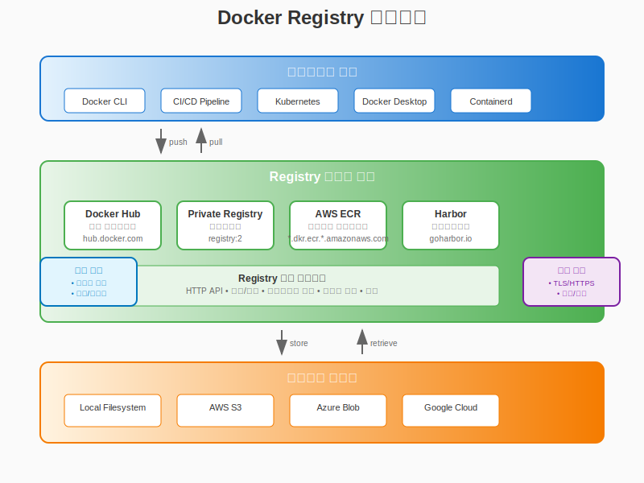
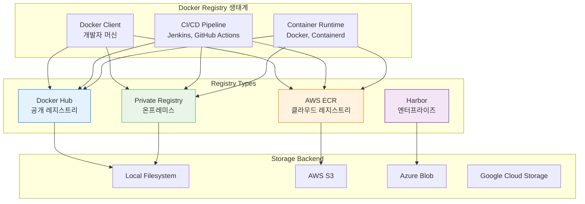

# Session 6: Docker Registry 활용

## 📍 교과과정에서의 위치
이 세션은 **Week 1 > Day 4**의 여섯 번째 세션으로, Docker Registry를 활용한 이미지 저장, 배포, 관리 시스템을 학습합니다. 이전 세션에서 구축하고 태깅한 이미지들을 중앙 저장소에서 효율적으로 관리하고 배포하는 전문적인 방법론을 마스터합니다.

## 학습 목표 (5분)
- **Docker Hub**와 **프라이빗 레지스트리** 활용법 마스터
- **이미지 푸시/풀 전략**과 **배포 파이프라인** 구축
- **레지스트리 보안** 및 **인증 시스템** 구현
- **레지스트리 최적화**와 **성능 튜닝** 기법 습득

## 1. Docker Registry 아키텍처 (15분)

### Registry 생태계 구조

Docker Registry는 **이미지 저장소**의 중앙 집중식 관리를 제공하며, 다양한 형태로 구성될 수 있습니다.





### Registry 구성 요소

| 구성 요소 | 역할 | 특징 |
|-----------|------|------|
| **Registry** | 이미지 저장 및 배포 서비스 | HTTP API 제공 |
| **Repository** | 동일한 이름의 이미지 집합 | 태그별 버전 관리 |
| **Manifest** | 이미지 메타데이터 | 레이어 정보 포함 |
| **Blob** | 실제 이미지 데이터 | 레이어별 저장 |
| **Index** | 멀티 아키텍처 매니페스트 | 플랫폼별 이미지 참조 |

### Docker Hub 심화 활용

```bash
# Docker Hub 로그인
docker login

# 네임스페이스 확인
docker info | grep Username

# 이미지 푸시 (기본 네임스페이스)
docker tag myapp:latest username/myapp:latest
docker push username/myapp:latest

# 조직 네임스페이스 사용
docker tag myapp:latest myorg/myapp:latest
docker push myorg/myapp:latest

# 여러 태그 동시 푸시
docker push username/myapp:v1.0.0
docker push username/myapp:latest
docker push username/myapp:stable

# 이미지 정보 확인
docker search myapp
docker pull username/myapp:latest
```

## 2. 프라이빗 Registry 구축 (20분)

### 기본 프라이빗 Registry 설정

```bash
# 기본 Registry 컨테이너 실행
docker run -d \
  --name registry \
  --restart=always \
  -p 5000:5000 \
  -v registry-data:/var/lib/registry \
  registry:2

# Registry 상태 확인
curl http://localhost:5000/v2/

# 이미지 푸시 테스트
docker tag myapp:latest localhost:5000/myapp:latest
docker push localhost:5000/myapp:latest

# Registry 카탈로그 확인
curl http://localhost:5000/v2/_catalog

# 특정 이미지 태그 목록
curl http://localhost:5000/v2/myapp/tags/list
```

### 고급 Registry 설정

```yaml
# registry-config.yml - 고급 설정 파일
version: 0.1
log:
  accesslog:
    disabled: false
  level: info
  formatter: text
  fields:
    service: registry

storage:
  cache:
    blobdescriptor: inmemory
  filesystem:
    rootdirectory: /var/lib/registry
  delete:
    enabled: true

http:
  addr: :5000
  headers:
    X-Content-Type-Options: [nosniff]
    Access-Control-Allow-Origin: ['*']
    Access-Control-Allow-Methods: ['HEAD', 'GET', 'OPTIONS', 'DELETE']
    Access-Control-Allow-Headers: ['Authorization', 'Accept', 'Cache-Control']

health:
  storagedriver:
    enabled: true
    interval: 10s
    threshold: 3

proxy:
  remoteurl: https://registry-1.docker.io
  username: your-dockerhub-username
  password: your-dockerhub-password

notifications:
  events:
    includereferences: true
  endpoints:
    - name: webhook
      url: http://webhook-server:8080/registry-events
      headers:
        Authorization: [Bearer <token>]
      timeout: 1s
      threshold: 10
      backoff: 1s
```

```bash
# 고급 설정으로 Registry 실행
docker run -d \
  --name advanced-registry \
  --restart=always \
  -p 5000:5000 \
  -v $(pwd)/registry-config.yml:/etc/docker/registry/config.yml \
  -v registry-data:/var/lib/registry \
  -v registry-certs:/certs \
  -e REGISTRY_HTTP_TLS_CERTIFICATE=/certs/domain.crt \
  -e REGISTRY_HTTP_TLS_KEY=/certs/domain.key \
  registry:2
```

### TLS 보안 설정

```bash
# 자체 서명 인증서 생성
mkdir -p certs

# 개인키 생성
openssl genrsa -out certs/domain.key 4096

# 인증서 서명 요청 생성
openssl req -new -key certs/domain.key -out certs/domain.csr \
  -subj "/C=KR/ST=Seoul/L=Seoul/O=Company/CN=registry.company.com"

# 자체 서명 인증서 생성
openssl x509 -req -days 365 -in certs/domain.csr \
  -signkey certs/domain.key -out certs/domain.crt

# TLS 지원 Registry 실행
docker run -d \
  --name secure-registry \
  --restart=always \
  -p 443:5000 \
  -v $(pwd)/certs:/certs \
  -v registry-data:/var/lib/registry \
  -e REGISTRY_HTTP_ADDR=0.0.0.0:5000 \
  -e REGISTRY_HTTP_TLS_CERTIFICATE=/certs/domain.crt \
  -e REGISTRY_HTTP_TLS_KEY=/certs/domain.key \
  registry:2

# 클라이언트에서 인증서 신뢰 설정 (Linux)
sudo mkdir -p /etc/docker/certs.d/registry.company.com:443
sudo cp certs/domain.crt /etc/docker/certs.d/registry.company.com:443/ca.crt

# 보안 Registry에 이미지 푸시
docker tag myapp:latest registry.company.com:443/myapp:latest
docker push registry.company.com:443/myapp:latest
```

## 3. 인증 및 권한 관리 (10분)

### 기본 인증 (htpasswd) 설정

```bash
# 인증 파일 생성
mkdir -p auth
docker run --rm --entrypoint htpasswd \
  httpd:2 -Bbn admin password123 > auth/htpasswd

# 추가 사용자 생성
docker run --rm --entrypoint htpasswd \
  httpd:2 -Bbn developer devpass >> auth/htpasswd
docker run --rm --entrypoint htpasswd \
  httpd:2 -Bbn readonly readpass >> auth/htpasswd

# 인증 파일 확인
cat auth/htpasswd

# 인증 지원 Registry 실행
docker run -d \
  --name auth-registry \
  --restart=always \
  -p 5000:5000 \
  -v $(pwd)/auth:/auth \
  -v registry-data:/var/lib/registry \
  -e REGISTRY_AUTH=htpasswd \
  -e REGISTRY_AUTH_HTPASSWD_REALM="Registry Realm" \
  -e REGISTRY_AUTH_HTPASSWD_PATH=/auth/htpasswd \
  registry:2

# 인증된 접근 테스트
docker login localhost:5000
# Username: admin
# Password: password123

docker push localhost:5000/myapp:latest
```

### JWT 토큰 기반 인증

```bash
# JWT 인증 서버 설정 (docker-auth 사용)
mkdir -p jwt-auth

cat > jwt-auth/auth_config.yml << 'EOF'
server:
  addr: ":5001"
  certificate: "/certs/server.pem"
  key: "/certs/server-key.pem"

token:
  issuer: "Auth Service"
  expiration: 900
  certificate: "/certs/server.pem"
  key: "/certs/server-key.pem"

users:
  "admin":
    password: "$2y$10$2b2cu2Fw1ZfqmVq.f0cBqO6D2KFHRWDfhi4CiP9npFAWK2h4Qbvzu"
  "developer":
    password: "$2y$10$2b2cu2Fw1ZfqmVq.f0cBqO6D2KFHRWDfhi4CiP9npFAWK2h4Qbvzu"

acl:
  - match: {account: "admin"}
    actions: ["*"]
  - match: {account: "developer"}
    actions: ["pull", "push"]
  - match: {account: "readonly"}
    actions: ["pull"]
EOF

# JWT 인증 서버 실행
docker run -d \
  --name jwt-auth \
  -p 5001:5001 \
  -v $(pwd)/jwt-auth:/config \
  -v $(pwd)/certs:/certs \
  cesanta/docker_auth:1 /config/auth_config.yml

# JWT 인증 지원 Registry 실행
docker run -d \
  --name jwt-registry \
  --restart=always \
  -p 5002:5000 \
  -v registry-data:/var/lib/registry \
  -e REGISTRY_AUTH=token \
  -e REGISTRY_AUTH_TOKEN_REALM="https://localhost:5001/auth" \
  -e REGISTRY_AUTH_TOKEN_SERVICE="Docker registry" \
  -e REGISTRY_AUTH_TOKEN_ISSUER="Auth Service" \
  -e REGISTRY_AUTH_TOKEN_ROOTCERTBUNDLE=/certs/server.pem \
  -v $(pwd)/certs:/certs \
  registry:2
```

## 4. 클라우드 Registry 서비스 (10분)

### AWS ECR (Elastic Container Registry)

```bash
# AWS CLI 설치 및 설정
aws configure

# ECR 로그인
aws ecr get-login-password --region us-west-2 | \
docker login --username AWS --password-stdin \
123456789012.dkr.ecr.us-west-2.amazonaws.com

# ECR 리포지토리 생성
aws ecr create-repository \
  --repository-name myapp \
  --region us-west-2

# 이미지 태깅 및 푸시
docker tag myapp:latest \
  123456789012.dkr.ecr.us-west-2.amazonaws.com/myapp:latest

docker push \
  123456789012.dkr.ecr.us-west-2.amazonaws.com/myapp:latest

# ECR 이미지 목록 확인
aws ecr list-images \
  --repository-name myapp \
  --region us-west-2

# 이미지 스캔 실행
aws ecr start-image-scan \
  --repository-name myapp \
  --image-id imageTag=latest \
  --region us-west-2

# 스캔 결과 확인
aws ecr describe-image-scan-findings \
  --repository-name myapp \
  --image-id imageTag=latest \
  --region us-west-2
```

### Google Container Registry (GCR)

```bash
# gcloud CLI 인증
gcloud auth configure-docker

# 프로젝트 설정
export PROJECT_ID=my-project-id

# 이미지 태깅
docker tag myapp:latest gcr.io/$PROJECT_ID/myapp:latest

# GCR에 푸시
docker push gcr.io/$PROJECT_ID/myapp:latest

# 이미지 목록 확인
gcloud container images list --repository=gcr.io/$PROJECT_ID

# 특정 이미지 태그 확인
gcloud container images list-tags gcr.io/$PROJECT_ID/myapp
```

### Azure Container Registry (ACR)

```bash
# Azure CLI 로그인
az login

# ACR 생성
az acr create \
  --resource-group myResourceGroup \
  --name myregistry \
  --sku Basic

# ACR 로그인
az acr login --name myregistry

# 이미지 태깅 및 푸시
docker tag myapp:latest myregistry.azurecr.io/myapp:latest
docker push myregistry.azurecr.io/myapp:latest

# ACR 이미지 목록
az acr repository list --name myregistry
az acr repository show-tags --name myregistry --repository myapp
```

## 5. 실습: 통합 Registry 관리 시스템 (5분)

### 실습 프로젝트: 멀티 Registry 배포 시스템

```bash
# 프로젝트 디렉토리 생성
mkdir registry-management && cd registry-management

# 멀티 Registry 배포 스크립트 작성
cat > deploy-multi-registry.sh << 'EOF'
#!/bin/bash

set -e

APP_NAME=${1:-myapp}
VERSION=${2:-latest}
BUILD_NUMBER=${3:-$(date +%Y%m%d-%H%M%S)}

# 설정
DOCKER_HUB_REPO="username/$APP_NAME"
PRIVATE_REGISTRY="localhost:5000"
AWS_ECR_REPO="123456789012.dkr.ecr.us-west-2.amazonaws.com/$APP_NAME"

echo "=== 멀티 Registry 배포 시작 ==="
echo "앱: $APP_NAME, 버전: $VERSION, 빌드: $BUILD_NUMBER"

# 1. 이미지 빌드
echo "1. 이미지 빌드 중..."
docker build -t $APP_NAME:$VERSION .
docker tag $APP_NAME:$VERSION $APP_NAME:$BUILD_NUMBER

# 2. Docker Hub 배포
echo "2. Docker Hub 배포 중..."
docker tag $APP_NAME:$VERSION $DOCKER_HUB_REPO:$VERSION
docker tag $APP_NAME:$VERSION $DOCKER_HUB_REPO:$BUILD_NUMBER

if docker push $DOCKER_HUB_REPO:$VERSION; then
    echo "✅ Docker Hub 배포 성공"
    docker push $DOCKER_HUB_REPO:$BUILD_NUMBER
else
    echo "❌ Docker Hub 배포 실패"
fi

# 3. 프라이빗 Registry 배포
echo "3. 프라이빗 Registry 배포 중..."
docker tag $APP_NAME:$VERSION $PRIVATE_REGISTRY/$APP_NAME:$VERSION
docker tag $APP_NAME:$VERSION $PRIVATE_REGISTRY/$APP_NAME:$BUILD_NUMBER

if docker push $PRIVATE_REGISTRY/$APP_NAME:$VERSION; then
    echo "✅ 프라이빗 Registry 배포 성공"
    docker push $PRIVATE_REGISTRY/$APP_NAME:$BUILD_NUMBER
else
    echo "❌ 프라이빗 Registry 배포 실패"
fi

# 4. AWS ECR 배포 (선택적)
if command -v aws &> /dev/null; then
    echo "4. AWS ECR 배포 중..."
    
    # ECR 로그인
    aws ecr get-login-password --region us-west-2 | \
    docker login --username AWS --password-stdin \
    123456789012.dkr.ecr.us-west-2.amazonaws.com
    
    docker tag $APP_NAME:$VERSION $AWS_ECR_REPO:$VERSION
    docker tag $APP_NAME:$VERSION $AWS_ECR_REPO:$BUILD_NUMBER
    
    if docker push $AWS_ECR_REPO:$VERSION; then
        echo "✅ AWS ECR 배포 성공"
        docker push $AWS_ECR_REPO:$BUILD_NUMBER
    else
        echo "❌ AWS ECR 배포 실패"
    fi
else
    echo "4. AWS CLI 없음 - ECR 배포 건너뜀"
fi

# 5. 배포 결과 요약
echo "=== 배포 완료 ==="
echo "배포된 이미지:"
echo "- Docker Hub: $DOCKER_HUB_REPO:$VERSION"
echo "- Private Registry: $PRIVATE_REGISTRY/$APP_NAME:$VERSION"
echo "- AWS ECR: $AWS_ECR_REPO:$VERSION"

# 6. 이미지 정보 확인
echo "=== 이미지 정보 ==="
docker images | grep -E "($APP_NAME|$DOCKER_HUB_REPO)"
EOF

chmod +x deploy-multi-registry.sh

# Registry 상태 모니터링 스크립트
cat > monitor-registries.sh << 'EOF'
#!/bin/bash

echo "=== Registry 상태 모니터링 ==="

# 1. 로컬 프라이빗 Registry 상태
echo "1. 로컬 프라이빗 Registry (localhost:5000)"
if curl -s http://localhost:5000/v2/ > /dev/null; then
    echo "✅ 연결 성공"
    echo "   카탈로그: $(curl -s http://localhost:5000/v2/_catalog | jq -r '.repositories | length') 개 리포지토리"
else
    echo "❌ 연결 실패"
fi

# 2. Docker Hub 연결 테스트
echo "2. Docker Hub 연결 테스트"
if curl -s https://registry-1.docker.io/v2/ > /dev/null; then
    echo "✅ Docker Hub 연결 성공"
else
    echo "❌ Docker Hub 연결 실패"
fi

# 3. 로컬 이미지 통계
echo "3. 로컬 이미지 통계"
total_images=$(docker images -q | wc -l)
total_size=$(docker images --format "table {{.Size}}" | tail -n +2 | \
    awk '{sum += $1} END {print sum "MB"}')
echo "   총 이미지: $total_images 개"
echo "   총 크기: $total_size"

# 4. 댕글링 이미지 확인
dangling=$(docker images -f "dangling=true" -q | wc -l)
echo "   댕글링 이미지: $dangling 개"

# 5. Registry별 이미지 분포
echo "4. Registry별 이미지 분포"
echo "   Docker Hub: $(docker images | grep -c '.*/.*/.*' || echo 0) 개"
echo "   로컬: $(docker images | grep -v '.*/.*/.*' | tail -n +2 | wc -l) 개"
EOF

chmod +x monitor-registries.sh

# 샘플 애플리케이션 생성
cat > Dockerfile << 'EOF'
FROM nginx:alpine
COPY index.html /usr/share/nginx/html/
EXPOSE 80
CMD ["nginx", "-g", "daemon off;"]
EOF

cat > index.html << 'EOF'
<!DOCTYPE html>
<html>
<head>
    <title>Registry Demo App</title>
</head>
<body>
    <h1>Multi-Registry Deployment Demo</h1>
    <p>This app is deployed across multiple registries!</p>
    <p>Build time: <span id="buildTime"></span></p>
    <script>
        document.getElementById('buildTime').textContent = new Date().toISOString();
    </script>
</body>
</html>
EOF

# 실행 예제
echo "=== 멀티 Registry 배포 실행 ==="
./deploy-multi-registry.sh registry-demo v1.0.0

echo "=== Registry 상태 확인 ==="
./monitor-registries.sh
```

## 핵심 키워드 정리
- **Docker Registry**: 이미지 저장 및 배포를 위한 중앙 저장소
- **프라이빗 Registry**: 조직 내부용 보안 이미지 저장소
- **인증 시스템**: htpasswd, JWT 토큰 기반 접근 제어
- **클라우드 Registry**: AWS ECR, GCR, ACR 등 관리형 서비스
- **멀티 Registry**: 여러 저장소를 활용한 분산 배포 전략

## 참고 자료
- [Docker Registry 공식 문서](https://docs.docker.com/registry/)
- [Docker Hub 사용 가이드](https://docs.docker.com/docker-hub/)
- [AWS ECR 사용자 가이드](https://docs.aws.amazon.com/ecr/)
- [Harbor 엔터프라이즈 Registry](https://goharbor.io/docs/)

---
*다음 세션에서는 이미지 보안 및 취약점 스캐닝 기법을 학습합니다.*