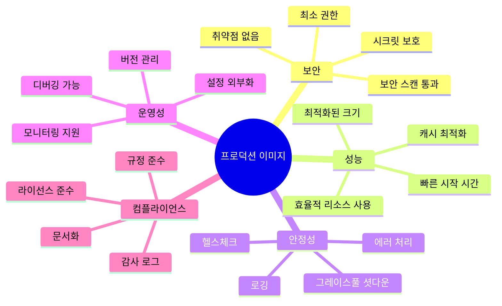

# Session 8: 종합 실습 - 프로덕션 이미지 구축

## 📍 교과과정에서의 위치
이 세션은 **Week 1 > Day 4**의 마지막 세션으로, 지금까지 학습한 모든 Docker 이미지 관리 기법을 종합하여 실제 프로덕션 환경에 배포 가능한 완전한 이미지를 구축합니다. 실무에서 요구되는 모든 요소를 포함한 엔터프라이즈급 이미지 구축 프로젝트를 수행합니다.

## 학습 목표 (5분)
- **프로덕션 환경** 요구사항을 만족하는 **완전한 이미지** 구축
- **CI/CD 파이프라인** 통합과 **자동화된 배포** 시스템 구현
- **성능 모니터링** 및 **최적화** 기법 적용
- **실무 시나리오** 기반의 **종합적 문제 해결** 능력 개발

## 1. 프로덕션 이미지 요구사항 정의 (10분)

### 엔터프라이즈 이미지 체크리스트

프로덕션 환경에서 사용되는 Docker 이미지는 다음 요구사항을 모두 만족해야 합니다.




### 프로젝트 시나리오: E-commerce 마이크로서비스

실습에서 구축할 시스템은 다음과 같은 구성을 가집니다:

| 서비스 | 기술 스택 | 요구사항 |
|---------|----------|----------|
| **Frontend** | React + Nginx | SPA, 정적 파일 서빙, HTTPS |
| **API Gateway** | Node.js + Express | 라우팅, 인증, 로깅 |
| **User Service** | Python + FastAPI | 사용자 관리, JWT 토큰 |
| **Product Service** | Java + Spring Boot | 상품 관리, 데이터베이스 연동 |
| **Order Service** | Go + Gin | 주문 처리, 메시지 큐 |

## 2. 멀티 서비스 이미지 구축 (25분)

### Frontend 서비스 (React + Nginx)

```bash
# 프로젝트 구조 생성
mkdir -p ecommerce-platform/{frontend,api-gateway,user-service,product-service,order-service}
cd ecommerce-platform

# Frontend 구성
cd frontend
cat > package.json << 'EOF'
{
  "name": "ecommerce-frontend",
  "version": "1.0.0",
  "private": true,
  "dependencies": {
    "react": "^18.2.0",
    "react-dom": "^18.2.0",
    "react-router-dom": "^6.8.0",
    "axios": "^1.3.0"
  },
  "scripts": {
    "start": "react-scripts start",
    "build": "react-scripts build",
    "test": "react-scripts test",
    "eject": "react-scripts eject"
  },
  "devDependencies": {
    "react-scripts": "5.0.1"
  },
  "browserslist": {
    "production": [
      ">0.2%",
      "not dead",
      "not op_mini all"
    ],
    "development": [
      "last 1 chrome version",
      "last 1 firefox version",
      "last 1 safari version"
    ]
  }
}
EOF

mkdir -p src public
cat > src/App.js << 'EOF'
import React, { useState, useEffect } from 'react';
import './App.css';

function App() {
  const [products, setProducts] = useState([]);
  const [loading, setLoading] = useState(true);

  useEffect(() => {
    fetch('/api/products')
      .then(response => response.json())
      .then(data => {
        setProducts(data);
        setLoading(false);
      })
      .catch(error => {
        console.error('Error fetching products:', error);
        setLoading(false);
      });
  }, []);

  return (
    <div className="App">
      <header className="App-header">
        <h1>🛒 E-commerce Platform</h1>
        <p>Powered by Docker & Microservices</p>
      </header>
      
      <main className="product-grid">
        {loading ? (
          <p>Loading products...</p>
        ) : (
          products.map(product => (
            <div key={product.id} className="product-card">
              <h3>{product.name}</h3>
              <p>${product.price}</p>
              <button>Add to Cart</button>
            </div>
          ))
        )}
      </main>
      
      <footer>
        <p>Build: {process.env.REACT_APP_BUILD_VERSION || 'dev'}</p>
        <p>Environment: {process.env.NODE_ENV}</p>
      </footer>
    </div>
  );
}

export default App;
EOF

cat > src/App.css << 'EOF'
.App {
  text-align: center;
  min-height: 100vh;
  display: flex;
  flex-direction: column;
}

.App-header {
  background-color: #282c34;
  padding: 20px;
  color: white;
}

.product-grid {
  display: grid;
  grid-template-columns: repeat(auto-fill, minmax(250px, 1fr));
  gap: 20px;
  padding: 20px;
  flex: 1;
}

.product-card {
  border: 1px solid #ddd;
  border-radius: 8px;
  padding: 16px;
  box-shadow: 0 2px 4px rgba(0,0,0,0.1);
}

footer {
  background-color: #f5f5f5;
  padding: 10px;
  margin-top: auto;
}
EOF

cat > public/index.html << 'EOF'
<!DOCTYPE html>
<html lang="en">
<head>
    <meta charset="utf-8" />
    <meta name="viewport" content="width=device-width, initial-scale=1" />
    <title>E-commerce Platform</title>
</head>
<body>
    <div id="root"></div>
</body>
</html>
EOF

cat > src/index.js << 'EOF'
import React from 'react';
import ReactDOM from 'react-dom/client';
import App from './App';

const root = ReactDOM.createRoot(document.getElementById('root'));
root.render(<App />);
EOF

# Nginx 설정
cat > nginx.conf << 'EOF'
user nginx;
worker_processes auto;
error_log /var/log/nginx/error.log notice;
pid /var/run/nginx.pid;

events {
    worker_connections 1024;
}

http {
    include /etc/nginx/mime.types;
    default_type application/octet-stream;
    
    log_format main '$remote_addr - $remote_user [$time_local] "$request" '
                    '$status $body_bytes_sent "$http_referer" '
                    '"$http_user_agent" "$http_x_forwarded_for"';
    
    access_log /var/log/nginx/access.log main;
    
    sendfile on;
    tcp_nopush on;
    keepalive_timeout 65;
    gzip on;
    gzip_vary on;
    gzip_min_length 1024;
    gzip_types text/plain text/css application/json application/javascript text/xml application/xml application/xml+rss text/javascript;
    
    # Security headers
    add_header X-Frame-Options "SAMEORIGIN" always;
    add_header X-Content-Type-Options "nosniff" always;
    add_header X-XSS-Protection "1; mode=block" always;
    add_header Referrer-Policy "no-referrer-when-downgrade" always;
    add_header Content-Security-Policy "default-src 'self' http: https: data: blob: 'unsafe-inline'" always;
    
    upstream api_backend {
        server api-gateway:3000;
    }
    
    server {
        listen 80;
        server_name localhost;
        root /usr/share/nginx/html;
        index index.html;
        
        # Frontend routes
        location / {
            try_files $uri $uri/ /index.html;
        }
        
        # API proxy
        location /api/ {
            proxy_pass http://api_backend/;
            proxy_set_header Host $host;
            proxy_set_header X-Real-IP $remote_addr;
            proxy_set_header X-Forwarded-For $proxy_add_x_forwarded_for;
            proxy_set_header X-Forwarded-Proto $scheme;
        }
        
        # Health check
        location /health {
            access_log off;
            return 200 "healthy\n";
            add_header Content-Type text/plain;
        }
        
        # Static assets caching
        location ~* \.(js|css|png|jpg|jpeg|gif|ico|svg)$ {
            expires 1y;
            add_header Cache-Control "public, immutable";
        }
    }
}
EOF

# 프로덕션 Dockerfile
cat > Dockerfile << 'EOF'
# syntax=docker/dockerfile:1

# Build stage
FROM node:18-alpine AS builder

# 보안 업데이트
RUN apk update && apk upgrade && apk add --no-cache dumb-init

WORKDIR /app

# 의존성 설치 (캐시 최적화)
COPY package*.json ./
RUN npm ci --only=production --silent

# 소스 코드 복사 및 빌드
COPY src/ src/
COPY public/ public/
ARG REACT_APP_BUILD_VERSION
ARG NODE_ENV=production
ENV REACT_APP_BUILD_VERSION=$REACT_APP_BUILD_VERSION
ENV NODE_ENV=$NODE_ENV

RUN npm run build

# Production stage
FROM nginx:1.24-alpine AS production

# 보안 업데이트
RUN apk update && apk upgrade && apk add --no-cache curl

# 비특권 사용자 생성
RUN addgroup -g 1001 -S nginx && \
    adduser -S nginx -u 1001 -G nginx

# Nginx 설정
COPY nginx.conf /etc/nginx/nginx.conf

# 빌드된 앱 복사
COPY --from=builder --chown=nginx:nginx /app/build /usr/share/nginx/html

# 권한 설정
RUN chown -R nginx:nginx /var/cache/nginx && \
    chown -R nginx:nginx /var/log/nginx && \
    chown -R nginx:nginx /etc/nginx/conf.d && \
    touch /var/run/nginx.pid && \
    chown -R nginx:nginx /var/run/nginx.pid

# 비특권 사용자로 실행
USER nginx

# 포트 노출
EXPOSE 8080

# 헬스체크
HEALTHCHECK --interval=30s --timeout=10s --start-period=5s --retries=3 \
  CMD curl -f http://localhost:8080/health || exit 1

# 시작 명령어
CMD ["nginx", "-g", "daemon off;"]
EOF

cd ..
```

### API Gateway 서비스 (Node.js)

```bash
cd api-gateway

cat > package.json << 'EOF'
{
  "name": "api-gateway",
  "version": "1.0.0",
  "description": "API Gateway for E-commerce Platform",
  "main": "server.js",
  "scripts": {
    "start": "node server.js",
    "dev": "nodemon server.js",
    "test": "jest"
  },
  "dependencies": {
    "express": "^4.18.2",
    "helmet": "^6.0.1",
    "cors": "^2.8.5",
    "morgan": "^1.10.0",
    "http-proxy-middleware": "^2.0.6",
    "express-rate-limit": "^6.7.0",
    "jsonwebtoken": "^9.0.0",
    "winston": "^3.8.2"
  },
  "devDependencies": {
    "nodemon": "^2.0.20",
    "jest": "^29.4.0"
  }
}
EOF

cat > server.js << 'EOF'
const express = require('express');
const helmet = require('helmet');
const cors = require('cors');
const morgan = require('morgan');
const rateLimit = require('express-rate-limit');
const { createProxyMiddleware } = require('http-proxy-middleware');
const winston = require('winston');

const app = express();
const PORT = process.env.PORT || 3000;

// Logger 설정
const logger = winston.createLogger({
  level: 'info',
  format: winston.format.combine(
    winston.format.timestamp(),
    winston.format.errors({ stack: true }),
    winston.format.json()
  ),
  transports: [
    new winston.transports.Console(),
    new winston.transports.File({ filename: 'logs/error.log', level: 'error' }),
    new winston.transports.File({ filename: 'logs/combined.log' })
  ]
});

// 미들웨어 설정
app.use(helmet());
app.use(cors());
app.use(morgan('combined', { stream: { write: message => logger.info(message.trim()) } }));
app.use(express.json({ limit: '10mb' }));

// Rate limiting
const limiter = rateLimit({
  windowMs: 15 * 60 * 1000, // 15분
  max: 100, // 최대 100 요청
  message: 'Too many requests from this IP'
});
app.use(limiter);

// 서비스 프록시 설정
const services = {
  user: process.env.USER_SERVICE_URL || 'http://user-service:8001',
  product: process.env.PRODUCT_SERVICE_URL || 'http://product-service:8002',
  order: process.env.ORDER_SERVICE_URL || 'http://order-service:8003'
};

// 프록시 미들웨어
app.use('/users', createProxyMiddleware({
  target: services.user,
  changeOrigin: true,
  pathRewrite: { '^/users': '' },
  onError: (err, req, res) => {
    logger.error('User service proxy error:', err);
    res.status(503).json({ error: 'User service unavailable' });
  }
}));

app.use('/products', createProxyMiddleware({
  target: services.product,
  changeOrigin: true,
  pathRewrite: { '^/products': '' },
  onError: (err, req, res) => {
    logger.error('Product service proxy error:', err);
    res.status(503).json({ error: 'Product service unavailable' });
  }
}));

app.use('/orders', createProxyMiddleware({
  target: services.order,
  changeOrigin: true,
  pathRewrite: { '^/orders': '' },
  onError: (err, req, res) => {
    logger.error('Order service proxy error:', err);
    res.status(503).json({ error: 'Order service unavailable' });
  }
}));

// 헬스체크
app.get('/health', (req, res) => {
  res.json({
    status: 'healthy',
    timestamp: new Date().toISOString(),
    version: process.env.APP_VERSION || '1.0.0',
    uptime: process.uptime()
  });
});

// 기본 라우트
app.get('/', (req, res) => {
  res.json({
    service: 'API Gateway',
    version: process.env.APP_VERSION || '1.0.0',
    endpoints: ['/users', '/products', '/orders', '/health']
  });
});

// 에러 핸들링
app.use((err, req, res, next) => {
  logger.error('Unhandled error:', err);
  res.status(500).json({ error: 'Internal server error' });
});

// 404 핸들링
app.use('*', (req, res) => {
  res.status(404).json({ error: 'Endpoint not found' });
});

// 그레이스풀 셧다운
process.on('SIGTERM', () => {
  logger.info('SIGTERM received, shutting down gracefully');
  server.close(() => {
    logger.info('Process terminated');
    process.exit(0);
  });
});

const server = app.listen(PORT, () => {
  logger.info(`API Gateway running on port ${PORT}`);
});

module.exports = app;
EOF

cat > Dockerfile << 'EOF'
# syntax=docker/dockerfile:1

FROM node:18-alpine AS base
RUN apk add --no-cache dumb-init
WORKDIR /app
RUN chown node:node /app
USER node

# Dependencies stage
FROM base AS dependencies
COPY --chown=node:node package*.json ./
RUN npm ci --only=production && npm cache clean --force

# Production stage
FROM base AS production
COPY --from=dependencies --chown=node:node /app/node_modules ./node_modules
COPY --chown=node:node server.js ./

# 로그 디렉토리 생성
RUN mkdir -p logs

# 환경 변수
ENV NODE_ENV=production
ENV PORT=3000

# 포트 노출
EXPOSE 3000

# 헬스체크
HEALTHCHECK --interval=30s --timeout=10s --start-period=5s --retries=3 \
  CMD node -e "require('http').get('http://localhost:3000/health', (res) => { process.exit(res.statusCode === 200 ? 0 : 1) }).on('error', () => process.exit(1))"

# 시작 명령어
ENTRYPOINT ["dumb-init", "--"]
CMD ["node", "server.js"]
EOF

cd ..
```

### User Service (Python FastAPI)

```bash
cd user-service

cat > requirements.txt << 'EOF'
fastapi==0.95.0
uvicorn[standard]==0.21.0
pydantic==1.10.7
python-jose[cryptography]==3.3.0
passlib[bcrypt]==1.7.4
python-multipart==0.0.6
sqlalchemy==2.0.7
psycopg2-binary==2.9.5
redis==4.5.4
prometheus-client==0.16.0
EOF

cat > main.py << 'EOF'
from fastapi import FastAPI, HTTPException, Depends, status
from fastapi.security import HTTPBearer, HTTPAuthorizationCredentials
from fastapi.middleware.cors import CORSMiddleware
from pydantic import BaseModel
from typing import Optional, List
import uvicorn
import os
import logging
from datetime import datetime, timedelta
import jwt
from passlib.context import CryptContext
import redis
from prometheus_client import Counter, Histogram, generate_latest, CONTENT_TYPE_LATEST
from fastapi.responses import Response

# 로깅 설정
logging.basicConfig(level=logging.INFO)
logger = logging.getLogger(__name__)

# 메트릭스 설정
REQUEST_COUNT = Counter('http_requests_total', 'Total HTTP requests', ['method', 'endpoint'])
REQUEST_DURATION = Histogram('http_request_duration_seconds', 'HTTP request duration')

app = FastAPI(
    title="User Service",
    description="User management microservice",
    version="1.0.0"
)

# CORS 설정
app.add_middleware(
    CORSMiddleware,
    allow_origins=["*"],
    allow_credentials=True,
    allow_methods=["*"],
    allow_headers=["*"],
)

# 보안 설정
security = HTTPBearer()
pwd_context = CryptContext(schemes=["bcrypt"], deprecated="auto")
SECRET_KEY = os.getenv("SECRET_KEY", "your-secret-key-change-in-production")
ALGORITHM = "HS256"

# Redis 연결
try:
    redis_client = redis.Redis(
        host=os.getenv("REDIS_HOST", "localhost"),
        port=int(os.getenv("REDIS_PORT", "6379")),
        decode_responses=True
    )
    redis_client.ping()
    logger.info("Redis connected successfully")
except Exception as e:
    logger.warning(f"Redis connection failed: {e}")
    redis_client = None

# 데이터 모델
class User(BaseModel):
    id: Optional[int] = None
    username: str
    email: str
    full_name: Optional[str] = None
    is_active: bool = True
    created_at: Optional[datetime] = None

class UserCreate(BaseModel):
    username: str
    email: str
    password: str
    full_name: Optional[str] = None

class UserLogin(BaseModel):
    username: str
    password: str

# 임시 사용자 저장소 (실제로는 데이터베이스 사용)
users_db = {
    1: {
        "id": 1,
        "username": "admin",
        "email": "admin@example.com",
        "full_name": "Administrator",
        "hashed_password": pwd_context.hash("admin123"),
        "is_active": True,
        "created_at": datetime.now()
    }
}

# 유틸리티 함수
def create_access_token(data: dict, expires_delta: Optional[timedelta] = None):
    to_encode = data.copy()
    if expires_delta:
        expire = datetime.utcnow() + expires_delta
    else:
        expire = datetime.utcnow() + timedelta(minutes=15)
    to_encode.update({"exp": expire})
    encoded_jwt = jwt.encode(to_encode, SECRET_KEY, algorithm=ALGORITHM)
    return encoded_jwt

def verify_token(credentials: HTTPAuthorizationCredentials = Depends(security)):
    try:
        payload = jwt.decode(credentials.credentials, SECRET_KEY, algorithms=[ALGORITHM])
        username: str = payload.get("sub")
        if username is None:
            raise HTTPException(status_code=401, detail="Invalid token")
        return username
    except jwt.PyJWTError:
        raise HTTPException(status_code=401, detail="Invalid token")

# API 엔드포인트
@app.get("/health")
async def health_check():
    return {
        "status": "healthy",
        "timestamp": datetime.now().isoformat(),
        "version": "1.0.0",
        "redis_connected": redis_client is not None
    }

@app.get("/metrics")
async def metrics():
    return Response(generate_latest(), media_type=CONTENT_TYPE_LATEST)

@app.post("/register", response_model=User)
async def register_user(user: UserCreate):
    REQUEST_COUNT.labels(method="POST", endpoint="/register").inc()
    
    # 사용자 중복 확인
    for existing_user in users_db.values():
        if existing_user["username"] == user.username:
            raise HTTPException(status_code=400, detail="Username already exists")
        if existing_user["email"] == user.email:
            raise HTTPException(status_code=400, detail="Email already exists")
    
    # 새 사용자 생성
    user_id = max(users_db.keys()) + 1 if users_db else 1
    hashed_password = pwd_context.hash(user.password)
    
    new_user = {
        "id": user_id,
        "username": user.username,
        "email": user.email,
        "full_name": user.full_name,
        "hashed_password": hashed_password,
        "is_active": True,
        "created_at": datetime.now()
    }
    
    users_db[user_id] = new_user
    
    # Redis에 캐시 (선택적)
    if redis_client:
        redis_client.setex(f"user:{user_id}", 3600, user.username)
    
    return User(**{k: v for k, v in new_user.items() if k != "hashed_password"})

@app.post("/login")
async def login(user_credentials: UserLogin):
    REQUEST_COUNT.labels(method="POST", endpoint="/login").inc()
    
    # 사용자 인증
    user = None
    for u in users_db.values():
        if u["username"] == user_credentials.username:
            user = u
            break
    
    if not user or not pwd_context.verify(user_credentials.password, user["hashed_password"]):
        raise HTTPException(status_code=401, detail="Invalid credentials")
    
    # JWT 토큰 생성
    access_token_expires = timedelta(minutes=30)
    access_token = create_access_token(
        data={"sub": user["username"]}, expires_delta=access_token_expires
    )
    
    return {"access_token": access_token, "token_type": "bearer"}

@app.get("/users/me", response_model=User)
async def get_current_user(current_user: str = Depends(verify_token)):
    REQUEST_COUNT.labels(method="GET", endpoint="/users/me").inc()
    
    for user in users_db.values():
        if user["username"] == current_user:
            return User(**{k: v for k, v in user.items() if k != "hashed_password"})
    
    raise HTTPException(status_code=404, detail="User not found")

@app.get("/users", response_model=List[User])
async def list_users(current_user: str = Depends(verify_token)):
    REQUEST_COUNT.labels(method="GET", endpoint="/users").inc()
    
    return [
        User(**{k: v for k, v in user.items() if k != "hashed_password"})
        for user in users_db.values()
    ]

if __name__ == "__main__":
    uvicorn.run(
        "main:app",
        host="0.0.0.0",
        port=int(os.getenv("PORT", "8001")),
        log_level="info"
    )
EOF

cat > Dockerfile << 'EOF'
# syntax=docker/dockerfile:1

FROM python:3.11-slim AS base

# 시스템 업데이트 및 필수 패키지 설치
RUN apt-get update && \
    apt-get upgrade -y && \
    apt-get install -y --no-install-recommends \
        gcc \
        libpq-dev \
    && rm -rf /var/lib/apt/lists/*

# 비특권 사용자 생성
RUN groupadd -r appuser && useradd -r -g appuser appuser

WORKDIR /app
RUN chown appuser:appuser /app

# Dependencies stage
FROM base AS dependencies
COPY requirements.txt .
RUN pip install --no-cache-dir --user -r requirements.txt

# Production stage
FROM base AS production
COPY --from=dependencies /root/.local /home/appuser/.local
COPY --chown=appuser:appuser main.py .

# PATH 업데이트
ENV PATH=/home/appuser/.local/bin:$PATH

# 사용자 전환
USER appuser

# 환경 변수
ENV PYTHONUNBUFFERED=1
ENV PYTHONDONTWRITEBYTECODE=1
ENV PORT=8001

# 포트 노출
EXPOSE 8001

# 헬스체크
HEALTHCHECK --interval=30s --timeout=10s --start-period=5s --retries=3 \
  CMD python -c "import requests; requests.get('http://localhost:8001/health')" || exit 1

# 시작 명령어
CMD ["python", "-m", "uvicorn", "main:app", "--host", "0.0.0.0", "--port", "8001"]
EOF

cd ..
```

## 3. 통합 배포 시스템 구축 (10분)

### Docker Compose 통합 설정

```yaml
# docker-compose.yml - 전체 시스템 통합
version: '3.8'

services:
  # Frontend Service
  frontend:
    build:
      context: ./frontend
      dockerfile: Dockerfile
      args:
        REACT_APP_BUILD_VERSION: ${BUILD_VERSION:-1.0.0}
    ports:
      - "80:8080"
    depends_on:
      - api-gateway
    networks:
      - frontend-net
      - backend-net
    restart: unless-stopped
    healthcheck:
      test: ["CMD", "curl", "-f", "http://localhost:8080/health"]
      interval: 30s
      timeout: 10s
      retries: 3
      start_period: 40s

  # API Gateway
  api-gateway:
    build:
      context: ./api-gateway
      dockerfile: Dockerfile
    environment:
      - NODE_ENV=production
      - PORT=3000
      - USER_SERVICE_URL=http://user-service:8001
      - PRODUCT_SERVICE_URL=http://product-service:8002
      - ORDER_SERVICE_URL=http://order-service:8003
    depends_on:
      - user-service
      - redis
    networks:
      - backend-net
    restart: unless-stopped
    healthcheck:
      test: ["CMD", "node", "-e", "require('http').get('http://localhost:3000/health', (res) => { process.exit(res.statusCode === 200 ? 0 : 1) }).on('error', () => process.exit(1))"]
      interval: 30s
      timeout: 10s
      retries: 3

  # User Service
  user-service:
    build:
      context: ./user-service
      dockerfile: Dockerfile
    environment:
      - PYTHONUNBUFFERED=1
      - PORT=8001
      - SECRET_KEY=${JWT_SECRET_KEY:-your-secret-key}
      - REDIS_HOST=redis
      - REDIS_PORT=6379
    depends_on:
      - redis
      - postgres
    networks:
      - backend-net
      - database-net
    restart: unless-stopped
    healthcheck:
      test: ["CMD", "python", "-c", "import requests; requests.get('http://localhost:8001/health')"]
      interval: 30s
      timeout: 10s
      retries: 3

  # Redis Cache
  redis:
    image: redis:7-alpine
    command: redis-server --appendonly yes --requirepass ${REDIS_PASSWORD:-redis123}
    volumes:
      - redis-data:/data
    networks:
      - backend-net
      - database-net
    restart: unless-stopped
    healthcheck:
      test: ["CMD", "redis-cli", "--raw", "incr", "ping"]
      interval: 30s
      timeout: 10s
      retries: 3

  # PostgreSQL Database
  postgres:
    image: postgres:15-alpine
    environment:
      - POSTGRES_DB=${POSTGRES_DB:-ecommerce}
      - POSTGRES_USER=${POSTGRES_USER:-postgres}
      - POSTGRES_PASSWORD=${POSTGRES_PASSWORD:-postgres123}
    volumes:
      - postgres-data:/var/lib/postgresql/data
      - ./init-db.sql:/docker-entrypoint-initdb.d/init-db.sql
    networks:
      - database-net
    restart: unless-stopped
    healthcheck:
      test: ["CMD-SHELL", "pg_isready -U ${POSTGRES_USER:-postgres}"]
      interval: 30s
      timeout: 10s
      retries: 3

  # Monitoring - Prometheus
  prometheus:
    image: prom/prometheus:latest
    ports:
      - "9090:9090"
    volumes:
      - ./monitoring/prometheus.yml:/etc/prometheus/prometheus.yml
      - prometheus-data:/prometheus
    command:
      - '--config.file=/etc/prometheus/prometheus.yml'
      - '--storage.tsdb.path=/prometheus'
      - '--web.console.libraries=/etc/prometheus/console_libraries'
      - '--web.console.templates=/etc/prometheus/consoles'
    networks:
      - monitoring-net
      - backend-net
    restart: unless-stopped

  # Monitoring - Grafana
  grafana:
    image: grafana/grafana:latest
    ports:
      - "3001:3000"
    environment:
      - GF_SECURITY_ADMIN_PASSWORD=${GRAFANA_PASSWORD:-admin123}
    volumes:
      - grafana-data:/var/lib/grafana
      - ./monitoring/grafana-datasources.yml:/etc/grafana/provisioning/datasources/datasources.yml
    networks:
      - monitoring-net
    restart: unless-stopped

networks:
  frontend-net:
    driver: bridge
  backend-net:
    driver: bridge
  database-net:
    driver: bridge
  monitoring-net:
    driver: bridge

volumes:
  redis-data:
  postgres-data:
  prometheus-data:
  grafana-data:
```

### 환경 설정 파일

```bash
# .env 파일 생성
cat > .env << 'EOF'
# Build Configuration
BUILD_VERSION=1.0.0
NODE_ENV=production

# Database Configuration
POSTGRES_DB=ecommerce
POSTGRES_USER=postgres
POSTGRES_PASSWORD=postgres123

# Redis Configuration
REDIS_PASSWORD=redis123

# Security
JWT_SECRET_KEY=your-super-secret-jwt-key-change-in-production

# Monitoring
GRAFANA_PASSWORD=admin123
EOF

# 데이터베이스 초기화 스크립트
cat > init-db.sql << 'EOF'
-- 사용자 테이블
CREATE TABLE IF NOT EXISTS users (
    id SERIAL PRIMARY KEY,
    username VARCHAR(50) UNIQUE NOT NULL,
    email VARCHAR(100) UNIQUE NOT NULL,
    full_name VARCHAR(100),
    hashed_password VARCHAR(255) NOT NULL,
    is_active BOOLEAN DEFAULT TRUE,
    created_at TIMESTAMP DEFAULT CURRENT_TIMESTAMP
);

-- 상품 테이블
CREATE TABLE IF NOT EXISTS products (
    id SERIAL PRIMARY KEY,
    name VARCHAR(100) NOT NULL,
    description TEXT,
    price DECIMAL(10,2) NOT NULL,
    stock_quantity INTEGER DEFAULT 0,
    category VARCHAR(50),
    created_at TIMESTAMP DEFAULT CURRENT_TIMESTAMP
);

-- 주문 테이블
CREATE TABLE IF NOT EXISTS orders (
    id SERIAL PRIMARY KEY,
    user_id INTEGER REFERENCES users(id),
    total_amount DECIMAL(10,2) NOT NULL,
    status VARCHAR(20) DEFAULT 'pending',
    created_at TIMESTAMP DEFAULT CURRENT_TIMESTAMP
);

-- 샘플 데이터 삽입
INSERT INTO products (name, description, price, stock_quantity, category) VALUES
('Docker 완벽 가이드', 'Docker 컨테이너 기술 완벽 마스터', 29.99, 100, 'Books'),
('Kubernetes 실전 가이드', 'Kubernetes 오케스트레이션 실무', 39.99, 50, 'Books'),
('DevOps 도구 세트', 'DevOps 필수 도구 모음', 99.99, 25, 'Software'),
('마이크로서비스 아키텍처', '마이크로서비스 설계와 구현', 49.99, 75, 'Books');
EOF
```

## 4. 모니터링 및 성능 최적화 (5분)

### Prometheus 설정

```yaml
# monitoring/prometheus.yml
global:
  scrape_interval: 15s
  evaluation_interval: 15s

rule_files:
  # - "first_rules.yml"
  # - "second_rules.yml"

scrape_configs:
  - job_name: 'prometheus'
    static_configs:
      - targets: ['localhost:9090']

  - job_name: 'api-gateway'
    static_configs:
      - targets: ['api-gateway:3000']
    metrics_path: '/metrics'

  - job_name: 'user-service'
    static_configs:
      - targets: ['user-service:8001']
    metrics_path: '/metrics'

  - job_name: 'frontend'
    static_configs:
      - targets: ['frontend:8080']
    metrics_path: '/health'
```

### 통합 배포 스크립트

```bash
# deploy.sh - 통합 배포 스크립트
cat > deploy.sh << 'EOF'
#!/bin/bash

set -e

echo "=== E-commerce Platform 배포 시작 ==="

# 환경 변수 설정
export BUILD_VERSION=${BUILD_VERSION:-$(date +%Y%m%d-%H%M%S)}
export COMPOSE_PROJECT_NAME=ecommerce-platform

echo "빌드 버전: $BUILD_VERSION"

# 1. 이전 컨테이너 정리
echo "1. 이전 배포 정리 중..."
docker-compose down --remove-orphans || true

# 2. 이미지 빌드
echo "2. 이미지 빌드 중..."
docker-compose build --no-cache

# 3. 보안 스캔 (선택적)
if command -v trivy &> /dev/null; then
    echo "3. 보안 스캔 실행 중..."
    for service in frontend api-gateway user-service; do
        echo "   - $service 스캔 중..."
        trivy image --severity HIGH,CRITICAL ecommerce-platform_$service:latest || true
    done
else
    echo "3. Trivy 없음 - 보안 스캔 건너뜀"
fi

# 4. 서비스 시작
echo "4. 서비스 시작 중..."
docker-compose up -d

# 5. 헬스체크 대기
echo "5. 서비스 헬스체크 중..."
sleep 30

services=("frontend:80" "api-gateway:3000" "user-service:8001")
for service in "${services[@]}"; do
    IFS=':' read -r name port <<< "$service"
    echo "   - $name 헬스체크..."
    
    for i in {1..10}; do
        if curl -f http://localhost:$port/health &>/dev/null; then
            echo "     ✅ $name 정상"
            break
        elif [ $i -eq 10 ]; then
            echo "     ❌ $name 헬스체크 실패"
        else
            echo "     ⏳ $name 대기 중... ($i/10)"
            sleep 5
        fi
    done
done

# 6. 배포 결과 확인
echo "6. 배포 결과 확인..."
docker-compose ps

echo "=== 배포 완료 ==="
echo "Frontend: http://localhost"
echo "API Gateway: http://localhost:3000"
echo "Prometheus: http://localhost:9090"
echo "Grafana: http://localhost:3001 (admin/admin123)"

# 7. 로그 모니터링 시작 (백그라운드)
echo "7. 로그 모니터링 시작..."
docker-compose logs -f &
LOG_PID=$!

echo "로그 모니터링 PID: $LOG_PID"
echo "로그 중지: kill $LOG_PID"
EOF

chmod +x deploy.sh

# 실행
echo "=== 통합 배포 실행 ==="
./deploy.sh
```

## 핵심 키워드 정리
- **프로덕션 이미지**: 보안, 성능, 안정성을 모두 만족하는 엔터프라이즈급 이미지
- **멀티 서비스 아키텍처**: 마이크로서비스 기반의 확장 가능한 시스템 구조
- **통합 배포**: Docker Compose를 활용한 전체 시스템 오케스트레이션
- **모니터링 통합**: Prometheus, Grafana를 통한 실시간 성능 모니터링
- **자동화 파이프라인**: 빌드부터 배포까지의 완전 자동화된 워크플로우

## 참고 자료
- [Docker 프로덕션 모범 사례](https://docs.docker.com/develop/dev-best-practices/)
- [Docker Compose 프로덕션 가이드](https://docs.docker.com/compose/production/)
- [마이크로서비스 패턴](https://microservices.io/patterns/)
- [Prometheus 모니터링](https://prometheus.io/docs/introduction/overview/)

---
*이것으로 Week 1 Day 4의 모든 세션이 완료되었습니다. 다음 주차에서는 Docker 심화 및 실습을 진행합니다.*